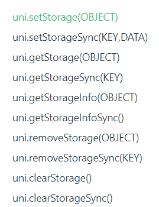

# 基础语法
## 项目文件分析
### main.js
**`main.js`**: uni-app 的入口文件 , 主要作用是
* 初始化 Vue 实例
* 定义全局组件
* 定义全局属性
* 安装插件 如: Pinia, VueX 等

### App.vue
[App.vue 官方文档](https://uniapp.dcloud.net.cn/collocation/App.html#applifecycle)

**`App.vue`**:  入口组件

* 是 uni-app 的入口文件, 所有页面都是在 App.vue 下进行切换
* **App.vue 本身不是页面**, 这里不能编写视图元素, 也就是**没有** `<template> 元素`

App.vue 的**作用** : 
* 应用的生命周期
* 编写全局样式 
* 定义全局数据 `globalData`

```vue
<script>
	export default {
		onLaunch: function() {
			console.warn('当前组件仅支持 uni_modules 目录结构 ，请升级 HBuilderX 到 3.1.0 版本以上！')
			console.log('App Launch')
		},
		onShow: function() {
			console.log('App Show')
		},
		onHide: function() {
			console.log('App Hide')
		},
      globalData:{
          name:'frank',
          age:18
      }
	}
</script>

<style lang="scss">
	/*每个页面公共css */
	@import '@/uni_modules/uni-scss/index.scss';
	/* #ifndef APP-NVUE */
	@import '@/static/customicons.css';
	// 设置整个项目的背景色
	page {
		background-color: #f5f5f5;
	}

	/* #endif */
	.example-info {
		font-size: 14px;
		color: #333;
		padding: 10px;
	}
</style>
```
注意: 应用生命周期 **只能在 App.vue 中监听**, 在页面监听是无效的

页面
```vue
<script>
	export default {
		data() {
			return {
			}
		},
    // 页面的声明周期
    onLoad(){
      // 1. 拿到全局数据 globalData
      const app = getApp()
      console.log(app.globalData)  // {name: 'eren', age: 18}
      
      // 2. 拿到当前页面的路由
      const pages = getCurrentPages()
      console.log(pages[pages.length - 1].route) // pages/index/index
     
    },
		methods: {
		}
	}
</script>
```
### 全局和局部样式
**全局样式**:
1. App.vue 中的 style 样式为全局样式, 作用于每一个页面(style 标签**不支持 scoped**, 写了导致样式无效)
* App.vue 中通过 `@import` 可以导入 **外联样式**, 一样作用于每一个页面  
2. `uni.scss` 文件也是用来编写全局的公共样式, 通常用来定义**全局变量**
* `uni.scss` 中通过 `@import` 可以导入 **外联样式**, 一样作用于每一个页面  

**局部样式**:
1. 在 pages 目录下的 vue 文件的 style 样式为**局部样式**, 只作用于对应的页面, 并会覆盖 App.vue 中的相同的选择器
2. vue 文件的 style标签也支持 `scss`等预处理器, 比如: 安装了 `dart-sass`插件之后, style 标签也可以用 scss 来编写样式
3. style 标签支持 `scoped`吗 ? **不支持, 无需要写**

#### uni.scss 
为 **全局样式文件**
1. 为了方便整体控制应用的风格, 默认定义了uni-app 框架内置全局变量, 当然也可以存放自定义的全局变量
2. **在 uni.scss 中定义的变量, 无需 @import 就可以在任意的组件中直接使用**
3. 使用 uni.scss 中的变量, 需要在 HBuilder X 中里面安装 scss 插件 (dart-scss 插件)
4. 然后**需要在该组件的 style 标签加上 `lang="scss"`, 重启即可生效**


注意事项: 
* 这里的 **uni-app 框架**内置变量和后面 **uni-ui 组件库**内置的变量是不一样的
* uni.scss 定义的变量可以在全局直接使用, 但在 App.vue 定义的变量, 只能在当前组件中使用


### 页面调用接口
`getApp()` 函数
* 用于获取当前应用的实例, 可用于获取 `globalData` 


`getCurrentPages()` 函数
* 用于获取当前页面栈的实例, 以数组的形式按栈的顺序给出
   * **第一个元素为首页, 最后一个元素为当前页面** 
* 仅用于展示页面栈, 勿修改页面栈, 以免造成页面状态错误
* 常用方法: 

如: 
```js
const pages = getCurrentPages()
const page = pages[pages.length - 1]
console.log(page.route)
```
### pages.json
[官方文档](https://uniapp.dcloud.net.cn/collocation/pages.html)

全局页面配置
* `pages.json` 文件用来对 uni-app 进行全局配置, 类似微信小程序中的 app.json
* 决定**页面路径, 窗口样式, 原生的导航栏, 底部的 `tabbar`** 等等

```json
{
	"pages": [
    {
      "path": "pages/index/index",
      "style": {
        "navigationBarTitleText": "uni-app"
		}
	}],
	"globalStyle": {
		"navigationBarTextStyle": "black",
		"navigationBarTitleText": "uni-app",
		"navigationBarBackgroundColor": "#F8F8F8",
		"backgroundColor": "#F8F8F8",
		"app-plus": {
			"background": "#efeff4"
		}
	}
}
```
## 内置组件
1. `view` : 视图容器, 类似于传统 html 中的 div 标签, 用于包裹各种元素内容 (那可以使用 div 吗? 可以但**不跨平台**)
2. `text`:  文本组件, 用于包裹文本内容
3. `button`: 在小程序端的主题 和 其他端的**主题是不一样的** (可以通过条件编译来统一风格)
4. `image`: 图片, **默认宽度`320px` , 高度`240px`**
   * 仅支持 相对路径, 绝对路径, 支持导入, 支持 base64码
5. `scrollview`: 可**滚动**视图区域, 用于**区域滚动**
  * 使用竖向滚动时, 需要给`scrollview`一个**固定的高度**, **通过 css 设置 `height`**
 
 h5端隐藏滚动条: 
 ```scss
  // 全局样式
  // 或者也可以使用 样式穿透 :deep()
 :global(.xxx  .uni-scroll-view::webkit-scrollbar) {
    display:none;
 } 
 ```
6. `swiper` : 滑块视图容器。
```html
<swiper class="swiper" circular :indicator-dots="indicatorDots" :autoplay="autoplay" :interval="interval"
			:duration="duration">
    <swiper-item>
      <view class="swiper-item uni-bg-red">A</view>
    </swiper-item>
    <swiper-item>
      <view class="swiper-item uni-bg-green">B</view>
    </swiper-item>
    <swiper-item>
      <view class="swiper-item uni-bg-blue">C</view>
    </swiper-item>
</swiper>
```

## 扩展组件 uni-ui
`uni-ui` : 一套基于 Vue组件, flex布局的 **跨全端ui框架**

[uni-ui 官方文档](https://uniapp.dcloud.net.cn/component/uniui/uni-ui.html)

`uni.scss`
```scss
@import '@/uni_modules/uni-scss/variables.scss';
```
可以修改变量

### uni-forms 组件
[uni-forms 官方文档](https://uniapp.dcloud.net.cn/component/uniui/uni-forms.html#%E5%9F%BA%E6%9C%AC%E7%94%A8%E6%B3%95)

试着用一下, 实现**自定义校验规则**

**注意**: 需要注意，如果需要使用 `validateFunction` **自定义校验规则**,则不能采用 `uni-forms` 的 `rules` 属性来配置校验规则，这时候需要通过 `ref`，在`onReady` 生命周期调用组件的 **`setRules`** 方法绑定验证规则


```vue
<template>
	<view class="container">
			<view class="">
				<uni-forms ref="formRef" :modelValue="formData" :model="formData" label-position="left">
					<uni-forms-item label="用户名" name="username">
						<uni-easyinput type="text" v-model="formData.username" placeholder="请输入用户名" />
					</uni-forms-item>
					<uni-forms-item label="密码" name="password">
						<uni-easyinput type="password" v-model="formData.password" placeholder="请输入密码" />
					</uni-forms-item>
				</uni-forms>
				<button @click="submit">Submit</button>
			</view>
	</view>
</template>

<script>
	export default {
		data() {
			return {
        // 表单数据
				formData:{ 
          username:'',
          password:''
        },
        rules:{
          username: {
            rules: [
              {
                required: true,
                errorMessage: '用户名必须要输入',
              },{
                validateFunction:function(rule,value,data,callback){
                  if (value.length < 6) {
                    callback('用户名不少于 6 位')
                  }
                  return true
                }
            }]
          }
        }
			}
		},
    onReady(){
      // 有自定义的校验时, 需要调用 setRules()
      this.$refs.formRef.setRules(this.rules)
    },
		methods: {
        submit(){
        	this.$refs.formRef.validate()
            .then(res => console.log(res))
            .catch(err => console.log(err))
        }
		}
	}
</script>
```
### 重写 uni-ui 组件的样式
1. 小程序 , App **直接重写**, 需要添加 `!important`
2. H5,App,小程序 使用: **`:global( selector )`**, 需要添加 `!important`
3. H5,App,小程序 使用: **`:deep( selector )`**, 需要添加 `!important`

具体有三种方案
```scss
  // 1. 方案一: 小程序 , App
  .uni-forms-item__label {
    color: blue !important;
  }
  // 方案二: :deep()  生效在 h5, 小程序, App
  :deep(.uni-forms-item__label) {
    color: blue !important;
  }
  // 方案三: :global() 生效在 h5,小程序, App
  :global(.uni-forms-item__label) {
    color: blue !important;
  }
```
## 条件编译
[条件编译官方文档](https://uniapp.dcloud.net.cn/tutorial/platform.html#preprocessor)

以 `#ifdef 或 #ifndef` 加 `%PLATFORM%`开头，以 `#endif` 结尾

* `#ifdef`: if defined 浸在某个平台存在
* `#ifndef`: if not defined 除了某个平台均存在
* `%PLATFORM%`: 平台名称
* 然后使用 `#endif` 结尾 

支持的文件
* .vue
* .js
* .css
* pages.json
* 各预编译语言文件，如：.scss、.less、.stylus、.ts、.pug

注意：
* 条件编译是利用注释实现的，在不同语法里注释写法不一样，`js使用 // 注释`、`css 使用 /* 注释 */`、`vue/nvue 模板里使用 <!-- 注释 -->；`
* 条件编译APP-PLUS包含APP-NVUE和APP-VUE，APP-PLUS-NVUE和APP-NVUE没什么区别，为了简写后面出了APP-NVUE ；
* 使用条件编译请保证编译前和编译后文件的正确性，比如json文件中不能有多余的逗号；
* VUE3 需要在项目的 `manifest.json` 文件根节点配置 `"vueVersion" : "3"`

`%PLATFORM%` 的取值: 


[条件编译 具体实例](https://uniapp.dcloud.net.cn/tutorial/platform.html#api-%E7%9A%84%E6%9D%A1%E4%BB%B6%E7%BC%96%E8%AF%91)
1. **API 的条件编译**

仅在 `App` 平台上出现
```js
// #ifdef APP-PLUS
  平台特有的API实现
// #endif
```
不会再 `H5` 平台上出现
```js
// #ifndef H5
  代码
// #endif
```
2. 组件的条件编译
```html
<!-- #ifdef %PLATFORM% -->
  平台特有的组件
<!-- #endif -->
```
3. 样式的条件编译

注意： 样式的条件编译，无论是 css 还是 sass/scss/less/stylus 等预编译语言中，必须使用 `/*注释*/` 的写法

```css
/*  #ifdef  %PLATFORM%  */
平台特有样式
/*  #endif  */
```

[其他情况下的条件编译](https://uniapp.dcloud.net.cn/tutorial/platform.html#pages-json-%E7%9A%84%E6%9D%A1%E4%BB%B6%E7%BC%96%E8%AF%91)
## 新建 pages 页面
`uni-app`中的页面，通常编写在根目录下的 **`pages` 目录**下

可直接在 `pages` 目录下点击右键 **"新建页面"**, HBuilderX会自动地在 `pages.json`中完成页面注册

每次新建页面，均需在 `pages.json` 中配置 `pages` 列表；未在 pages.json -> pages 中配置的页面，uni-app 会在编译阶段进行忽略。pages.json 的完整配置参考：[全局文件](https://uniapp.dcloud.net.cn/collocation/pages.html#)


删除页面: 删除 `.vue` 文件和 `pages.json` 中对应的配置


配置 `tabBar`: 
* `color` : tab 上的文字默认颜色
* `selectedColor`: tab 上的文字选中时的颜色
* `list` -> `pagePath , text, iconPath, selectedIconPath`
```json
{
  ...
  ...
  "tabBar": {
    "color": "black",
    "selectedColor": "red",
    "list": [
      {
        "pagePath": "pages/index/index",
        "text": "首页",
        "iconPath": "",
        "selectedIconPath": ""
      },
      {
        "pagePath": "pages/category/category",
        "text": "分类",
        "iconPath": "",
        "selectedIconPath": ""
      },
      {
        "pagePath": "pages/my/my",
        "text": "我的",
        "iconPath": "",
        "selectedIconPath": ""
      }
    ]
  }
}
```

## 路由跳转
`uni-app`有两种页面路由跳转方式：使用 [navigator](https://uniapp.dcloud.net.cn/component/navigator.html#) 组件跳转、调用[API](https://uniapp.dcloud.net.cn/api/router.html#) 跳转
* 组件: `<navigator>`
* API: `uni.navigateTo`, `uni.redirectTo`, `uni.switchTab` ,`uni.navigateBack`


## 页面间通讯(传递参数)
在 `uni-app` 中, 常见页面通讯方式有: 
1. `url`查询字符串 和  `EventChannel`
2. 事件总线
3. 全局数据 `globalData`
4. 本地数据存储
5. `Vuex 和 Pinia` 状态管理库

#### `url`查询字符串 和  `EventChannel`
**方式一** :  `url`查询字符串和 `EventChannel`(兼容 h5, weapp, app)
* 直接在 `url` 的后面通过查询字符串的形式拼接在后面
* 然后可以在 `onLoad()` 生命周期里面获取 url 传递的参数

**`EventChannel`**对象的获取方式
* Options 写法 : `this.getOpenerEventChannel()`
* Composition 写法: `getCurrentInstance().proxy().getOpenerEventChannel()`

**从首页传递到详情页面(正向传递)**

* `url`查询字符串
```html
<navigator url="/pages/detail/detail?name=frank&age=18" open-type="navigate">
  <button>跳转到 detail 页面(非 tabBar 页面)</button>
</navigator>
```
```js
	  <button type="default" @click="goToDetail">跳转到 detail 页面</button>	
    
    methods: {
      goToDetail(){
        uni.navigateTo({ 
          url:"/pages/detail/detail?name=frank&age=18"  // url上传递参数
        })
      }
    }
```

然后在页面中接受
```js
  onLoad(options){
    console.log(options) // {name: 'frank', age: '18'}
  }
```
* 或者使用  `EventChannel`
```js
     goToDetail(){
        uni.navigateTo({
          url:"/pages/detail/detail?name=frank&age=18",
          success(res){
            res.eventChannel.emit('shijianming', {  
              name:'eren',
              age:22
            })
          }
        })
      }
```

页面内部: 
```js
  onLoad(options){
      console.log(options) // {name: 'frank', age: '18'}
     
     // eventChannel 通讯
      const eventChannel = this.getOpenerEventChannel()
      eventChannel.on('shijianming', (res) =>{
        console.log(res) // {name: 'eren', age: 22}
      })
  }
```

**详情页面中吧数据传递给首页(你想传递)**

页面中: 
```js
  <button @click="goBackToHome">回到首页</button>

  methods:{
      goBackToHome(){
        uni.navigateBack({
          delta:  1
        })
        const eventChannel  = this.getOpenerEventChannel()
        eventChannel.emit('shijianming', {
          myData: 'detail 详情页面中传递给首页的数据'
        })
      }
    }
```
首页
```js
	methods: {
      goToDetail(){
        uni.navigateTo({
          url:"/pages/detail/detail?name=frank&age=18",
          events:{
            shijianming(data){
              console.log(data)
            }
        }  
    }
```
#### 事件总线
**方式二 : 事件总线** 

* `uni.$emit(eventName, object)`
* `uni.$on(eventName, callback)`
* `uni.$off(eventName, callback)`
* `uni.$once(eventName, callback)`

只能逆向传递, 比如在详情页面传递一些数据给首页

页面
```js
 methods:{
      goBackToHome(){
        uni.navigateBack({
          delta:  1
        })
        uni.$emit('shijianming', {   // uni.$emit('eventName', object) 触发事件
          myData:'传递数据给首页'
        })
      }
    }
```

首页
```js
    onLoad(){
      // uni.$on('eventName', callback) 监听触发的事件 
      uni.$on('shijianming', this.getDataFromDetail)
    },
    onUnload(){
      uni.$off('shijianming', this.getDataFromDetail)  // 移除监听器
    },
    methods: {
      getDataFromDetail(res){
        console.log(res)
      },
  }
```

## 页面的声明周期
[页面生命周期](https://uniapp.dcloud.net.cn/tutorial/page.html#lifecycle)

页面的声明周期有 `onLoad(options), onShow, onReady, onHide, onUnload, onReachBottom, onPullDownRefresh` 等等...

* tanBar 页面第一次渲染调用 `onLoad, onShow, onReady`, 跳转到另一个页面会调用当前页面的 `onHide`, 然后再次回来会只调用 `onShow`

* 滚动到底部会触发 `onReachBottom`

注意: 页面滚动才会触发 `onReachBottom`, 如果自行通过 overflow 实现滚动不会触发 `onReachBottom` 回调 

* 下拉刷新需要在 pages.json 中开启功能 `"enablePullDownRefresh": true`, 下拉舒心触发 `onPullDownRefresh`

关闭下拉刷新
```js
onPullDownRefresh(){
  setTimeout(()=>{
    uni.stopPullDownRefresh() // 关闭下拉刷新
  },1000)
}
```


页面也支持 **`Vue` 的生命周期**, 它们的执行顺序: 


## 页面的生命周期 Composition API
`import { xxx } from '@dcloudio/uni-app'` 引入页面的生命周期钩子函数

比如: 
```vue
<script setup>
  import { 
    onLoad,
    onShow,
    onReady

  } from '@dcloudio/uni-app'

onLoad(() =>{
  console.log('onLoad')
})
</script>
```

## 网络的封装

baseURL: `http://152.136.185.210:7878/api/hy66`

1. 获取首页 `Banner` 等数据
* 请求方法: GET
* 接口地址: `/home/multidata`
* 调用例子 : `baseURL + /home/multidata`

封装请求 : 新建目录 `service` 并创建 index.js 文件
```
service
  |-- index.js
  |-- home.js
```

`index.js ` 使用了 `class类 和 promise` 封装网络请求
```js
const baseURL = 'http://152.136.185.210:7878/api/hy66'
const TIME_OUT = 60000
class HYRequest {
  request(url, method, data){
    return new Promise((resolve, reject) => {
      uni.request({
        url:baseURL + url,
        method: method || 'GET',
        data,
        timeout: TIME_OUT,
        success(res){
          resolve(res.data)
        },
        fail(err){
          reject(err)
        }
      })
    })
  }
  get(url,params){
    return this.request(url, "GET", params)
  }
  post(url, data){
    return this.request(url, "POST", data)
  }
}

export default new HYRequest()
```

`home.js`
```js
import request from './index.js'

export const getHomeMultiData = () => {
  return request.get('/home/multidata')
} 
```

页面中点击按钮发起了请求
```vue
<template>
	<view class="container">  
    <button type="primary" @click="getHomeData">获取 home 的数据</button>
	</view>
</template>

<script setup>
import { getHomeMultiData } from '@/service/home.js'
const getHomeData = async () =>{
  const res = await getHomeMultiData()
  console.log(res)
} 
</script>
```
一些注意点

## 数据缓存
[数据缓存官方文档](https://uniapp.dcloud.net.cn/api/storage/storage.html#)


```js
  methods:{
    setStorage(){
      // 本地数据存储
      uni.setStorage({
        key:'userInfo',
        data:{
          name:'frank',
          age:18
        },
        success(){
          console.log('success')
        },
        fail(err){
          console.log(err)
        },
        complete(){
          console.log('complete')
        }
      })
    },
     getStorage(){
        // 读取本地缓存的数据
        uni.getStorage({
          key:'userInfo',
          success(res) {
            console.log(res.data) // ，res = {data: key对应的内容}
          }
        })
    }
  }
  }
```
## 组件
uni-app 的组件跟 Vue 的标准组件基本相同, 但也有一些区别, 比如: 
* 传统的 Vue 组件 需要创建, 引用, 注册 三个步骤才能使用组件, `easycom 组件模式`可以将其精简为一步
* [easycom 组件模式](https://uniapp.dcloud.net.cn/collocation/pages.html#easycom)
   * 组件需要符合 `components/组件名称/组件名称.vue` 的目录结构
   * 符合以上目录结构的组件就可以不用引用, 注册, 直接在页面中使用该组件 
```
components
  |-- my-button
      |-- my-button.vue
```

### 组件生命周期
[组件的生命周期 官方文档](https://uniapp.dcloud.net.cn/tutorial/page.html#componentlifecycle)

`uni-app` 组件支持的声明周期, 与 `Vue` 组件的生命周期相同

那组件中可以使用页面的声明周期吗? 
* 在 `Options API` 中: 组件中**不支持**使用页面的声明周期
* 在 `Composition API` 中: 组件中**支持**页面的声明周期, 但不同端支持的情况有差异
   * 比如在 App, H5 中 `onReady` 不会触发, 但在 weapp 中 `onReady` 可以触发


## Composition API 的页面通讯
### 正向传递
**正向传递**数据方法: 
* `url` 拼接字符串
* `eventChannel`

1. `url` 字符串拼接
在首页
```vue
<script setup>
function goToDetail(){
  uni.navigateTo({
    url:'/pages/detail/detail?name=frank&age=18' // url 拼接字符串
  })
} 
</script>
```
在详情页 -  方案一 :  使用`onLoad(options)` 接收值
```vue
<script setup>
  import { onLoad } from '@dcloudio/uni-app'
  // 方案一: onLoad(options) 接受值
  onLoad((options)=>{
    console.log(options)  // {name: 'frank', age: '18'}
  }) 
</script>
```
或者在详情页可以直接声明 **`props`** 来接受 `url` 传递的值
```vue
<script setup>
  const props = defineProps({
    name:{
      type:String
    },
    age:{
      type:String
    }
  })
  console.log('在首页通过 url 传递的数据', props.name , props.age)
</script>
```
2. 或者 方案二: 使用 `eventChannel`

在首页
```vue
<script setup>
function goToDetail(){
  uni.navigateTo({
    url:'/pages/detail/detail?name=frank&age=18',
    success(res) {
      res.eventChannel.emit('emitEventToDetail', {
        myData: '在首页传递给详情页面的数据'
      })
    }
  })
}
</script>
```

在详情页: 
```vue
<script setup>
  import { onLoad } from '@dcloudio/uni-app';
  import { ref, getCurrentInstance } from 'vue' 
  
  // 方案二 : 使用 EventChannel 
  // $instance -> this 也就是当前 vue 的实例
  const $instance = ref(getCurrentInstance().proxy)
  onLoad((options)=>{
    const eventChannel = $instance.value.getOpenerEventChannel()
    eventChannel.on('emitEventToDetail', (res) =>{
      console.log(res) // {myData: '在首页传递给详情页面的数据'}
    })
  })
</script>
```

### 逆向传递
在详情页点击某一个后退按钮时, 从详情页逆向传递数据给首页

详情页: 
```vue
<script setup>
  import { getCurrentInstance, ref } from  'vue'
  // 获取实例 this
  const $instance = ref(getCurrentInstance().proxy)
  function goBackToHome(){
      uni.navigateBack({
        delta:1
      })
      const eventChannel = $instance.value.getOpenerEventChannel()
      eventChannel.emit('emitEventToHome', {
        myData: '在详情页中传递数据给首页'
      })
  }
</script>
```

在首页: 
```vue
<script setup>
function goToDetail(){
  uni.navigateTo({
    url:'/pages/detail/detail?name=frank&age=18',
    events:{
      emitEventToHome(res) {
        console.log(res) // {myData: '在详情页中传递数据给首页'}
      }
    }
  })
} 
</script>
```

### 事件总线逆向传递数据

逆向传递数据 : 这次使用全局事件总线

在详情页: 
```vue
<script setup>
  function goBackToHome(){
      uni.navigateBack({
        delta:1
      })
      uni.$emit('emitEventToHome', {
        myData: '数据'
      })
  }
</script>
```

在首页
```vue
<script setup>
  import { onLoad, onUnload } from '@dcloudio/uni-app'
  
function goToDetail(){
  uni.navigateTo({
    url:'/pages/detail/detail?name=frank&age=18',
  })
} 

onLoad(() =>{
  uni.$on('emitEventToHome', acceptDataFromDetail)
})
onUnload(() =>{
  uni.$off('emitEventToHome', acceptDataFromDetail)
})
function acceptDataFromDetail(res){
  console.log(res) // {myData: '数据'}
}
</script>
```

## 使用 Pinia  
uni-app 内置了 `Pinia`, 使用 H Builder X 不需要手去安装, 直接使用即可

步骤如下: 
1. 在 main.js 中安装 Pinia 插件
* `app.use(Pinia.createPinia())`

2. 接着创建一个 `store`
```
store
  |-- counter.js
```
counter.js
```js
import { defineStore} from 'pinia'
export const useCounter = defineStore('counter', {
  state:()=>{
    return {
      count: 1
    }
  },
  actions:{
    increment(){
      this.count++
    },
    decrement(){
      this.count--
    }
  }
})
```

3. 然后在组件中就可以直接去使用了

```vue
<template>
	<view>  
    <text>{{count}}</text>
    <button type="primary" @click="increment">+1</button>
	</view>
</template>

<script setup>
  import {storeToRefs} from 'pinia'
  import {useCounter} from '@/store/counter.js'
  
  const counterStore = useCounter()
  
  const { count } = storeToRefs(counterStore)
  const increment = () =>{
    counterStore.increment()
  }
</script>
```
