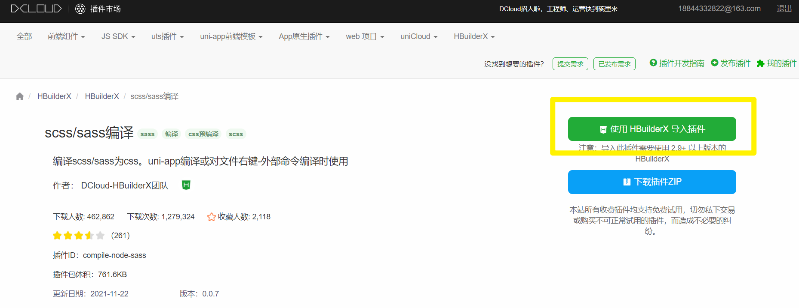
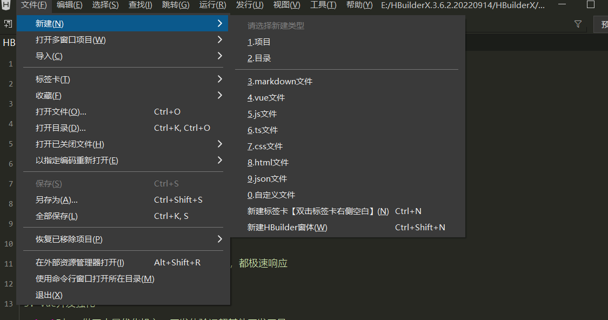
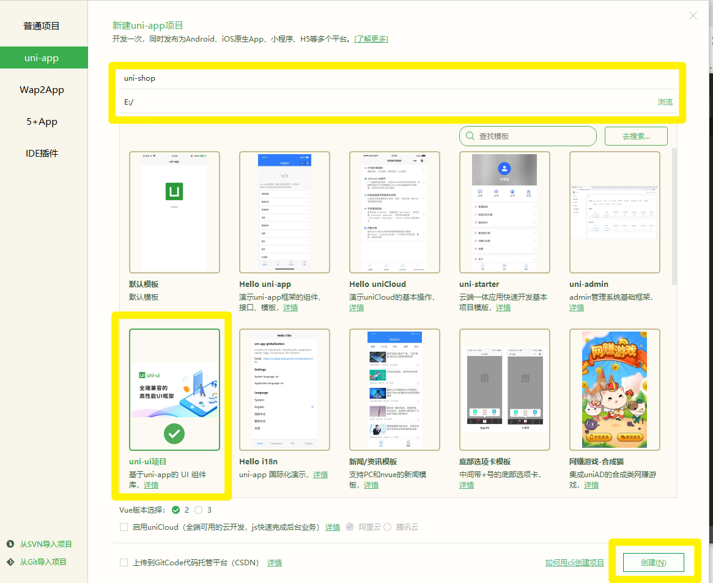
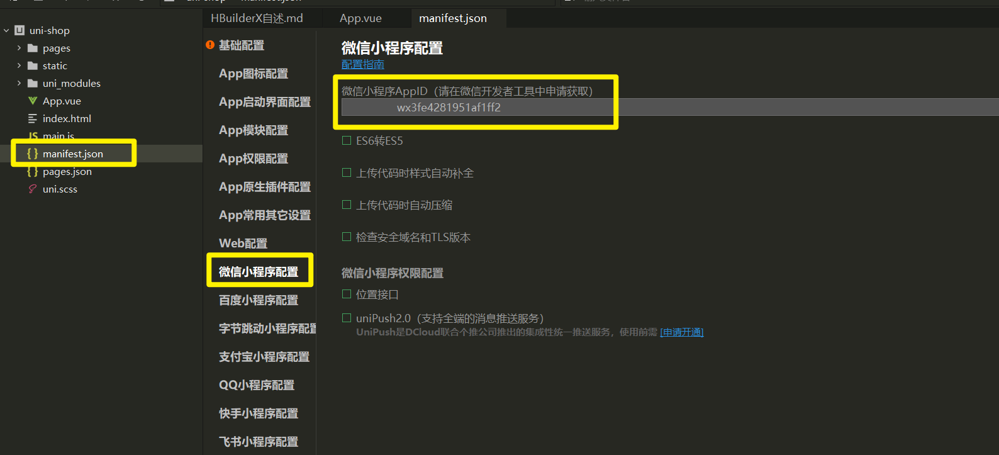
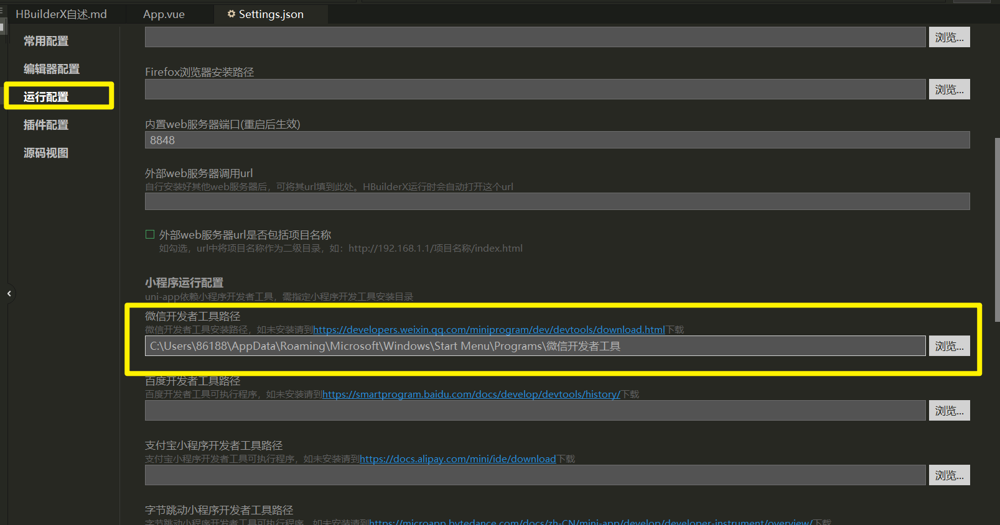
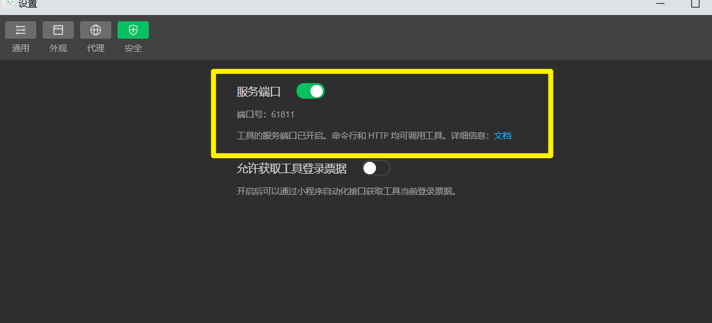
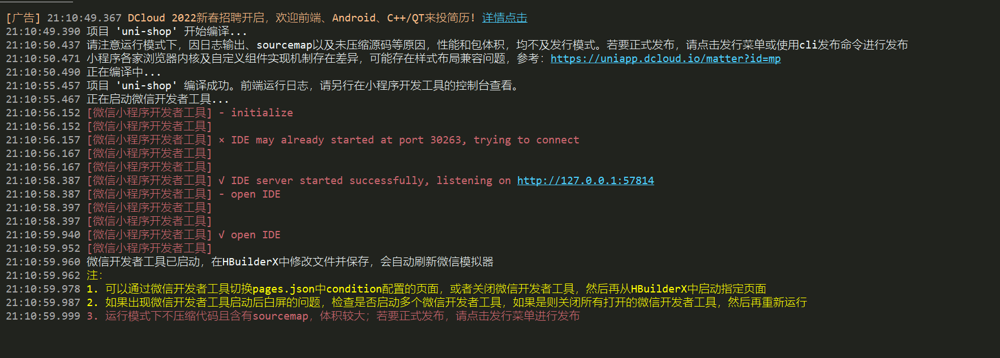
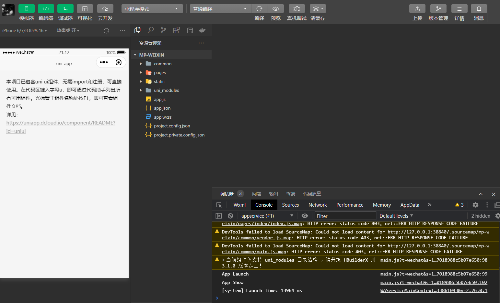
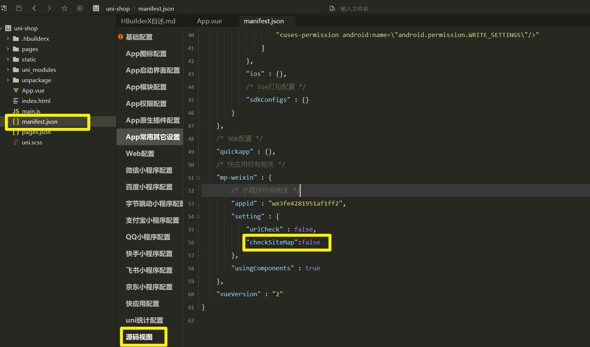

# 起步
[uni-app 官方文档](https://uniapp.dcloud.net.cn/)
## 开发工具
uni-app 官方推荐使用 **HBuilderX** 来开发 uni-app 类型的项目。主要好处：

* 模板丰富
* 完善的智能提示
* 一键运行

### 下载 HBuilderX
[https://www.dcloud.io/hbuilderx.html](https://www.dcloud.io/hbuilderx.html)
### 安装 scss/sass 编译
为了方便编写样式（例如：`<style lang="scss"></style>`），需要安装 scss/sass 编译 插件。插件下载地址：

> [https://ext.dcloud.net.cn/plugin?name=compile-node-sass](https://ext.dcloud.net.cn/plugin?name=compile-node-sass)

进入插件下载页面之后，点击右上角的 **使用 HBuilderX 导入插件** 按钮进行自动安装


### 快捷键方案切换
操作步骤：工具 -> 预设快捷键方案切换 -> VS Code
### 修改编辑器的基本设置
操作步骤：工具 -> 设置 -> 打开 Settings.json 按需进行配置


源码视图下可用的参考配置：
```
{
  "editor.colorScheme": "Default",
  "editor.fontSize": 12,
  "editor.fontFamily": "Consolas",
  "editor.fontFmyCHS": "微软雅黑 Light",
  "editor.insertSpaces": true,
  "editor.lineHeight": "1.5",
  "editor.minimap.enabled": false,
  "editor.mouseWheelZoom": true,
  "editor.onlyHighlightWord": false,
  "editor.tabSize": 2,
  "editor.wordWrap": true,
  "explorer.iconTheme": "vs-seti",
  "editor.codeassist.px2rem.enabel": false,
  "editor.codeassist.px2upx.enabel": false
}
```
> 可以使用 Ctrl + 鼠标滚轮 缩放编辑器

## 新建 uni-app 项目
1. 文件 -> 新建 -> 项目


2. 填写项目基本信息

3. 项目创建成功
## 目录结构
```
┌─components            uni-app组件目录
│  └─comp-a.vue         可复用的a组件
├─pages                 业务页面文件存放的目录
│  ├─index
│  │  └─index.vue       index页面
│  └─list
│     └─list.vue        list页面
├─static                存放应用引用静态资源（如图片、视频等）的目录，注意：静态资源只能存放于此
├─main.js               Vue初始化入口文件
├─App.vue               应用配置，用来配置小程序的全局样式、生命周期函数等
├─manifest.json         配置应用名称、appid、logo、版本等打包信息
└─pages.json            配置页面路径、页面窗口样式、tabBar、navigationBar 等页面类信息
```
## 把项目运行到微信开发者工具
1. 填写自己的微信小程序的 AppID：

2. 在 HBuilderX 中，配置“微信开发者工具”的安装路径：

3. 在微信开发者工具中，通过 设置 -> 安全设置 面板，开启“微信开发者工具”的服务端口：

4. 在 HBuilderX 中，点击菜单栏中的 运行 -> 运行到小程序模拟器 -> 微信开发者工具，将当前 uni-app 项目编译之后，自动运行到微信开发者工具中，从而方便查看项目效果与调试：

5. 初次运行成功之后的项目效果：


6. 取消 siteMap 烦人的警告, 不能在微信开发者而工具里修改, 必须要在 uni-app 项目中修改, 如下: 

## git 管理项目
1. 在项目根目录中新建 .gitignore 忽略文件，并配置如下：
```
# 忽略 node_modules 目录
/node_modules
/unpackage/dist
```
> 注意：由于我们忽略了 unpackage 目录中仅有的 dist 目录，因此默认情况下， unpackage 目录不会被 Git 追踪

> 此时，为了让 Git 能够正常追踪 unpackage 目录，按照惯例，我们可以在 unpackage 目录下创建一个叫做 `.gitkeep` 的文件进行占位


2. 打开终端，切换到项目根目录中，运行如下的命令，初始化本地 Git 仓库：
```
git init
```
3. 将所有文件都加入到暂存区：
```
git add .
```
4. 本地提交更新：
```
git commit -m "init project"
```