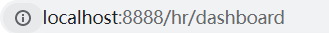

# tabBar
## 创建 tabBar 页面
在 `pages` 目录中，创建首页(home)、分类(cate)、购物车(cart)、我的(my) 这 4 个 tabBar 页面。在 HBuilderX 中，可以通过如下的两个步骤，快速新建页面：

在 `pages` 目录上鼠标右键，选择**新建页面**

在弹出的窗口中，填写**页面的名称、勾选 scss 模板**之后，点击创建按钮。如下：  

## 配置 tabBar 效果
