# 搭建
## 使用 vue-cli 创建项目
```
vue create vue3-admin
```
## 了解一下 ESLint
在创建项目时，就进行过这样的选择：
```
? Pick a linter / formatter config: 
  ESLint with error prevention only // 仅包含错误的 ESLint
  ESLint + Airbnb config // Airbnb 的 ESLint 延伸规则
  ESLint + Standard config // 标准的 ESLint 规则
```
当前选择了 **标准的 ESLint 规则** ，就在该规则之下，看一看 `ESLint` 它的一些配置都有什么？

打开项目中的 `.eslintrc.js` 文件

```js
// ESLint 配置文件遵循 commonJS 的导出规则，所导出的对象就是 ESLint 的配置对象
// 文档：https://eslint.bootcss.com/docs/user-guide/configuring
module.exports = {
  // 表示当前目录即为根目录，ESLint 规则将被限制到该目录下
  root: true,
  // env 表示启用 ESLint 检测的环境
  env: {
    // 在 node 环境下启动 ESLint 检测
    node: true
  },
  // ESLint 中基础配置需要继承的配置
  extends: ["plugin:vue/vue3-essential", "@vue/standard"],
  // 解析器
  parserOptions: {
    parser: "babel-eslint"
  },
  // 需要修改的启用规则及其各自的错误级别
  /**
   * 错误级别分为三种：
   * "off" 或 0 - 关闭规则
   * "warn" 或 1 - 开启规则，使用警告级别的错误：warn (不会导致程序退出)
   * "error" 或 2 - 开启规则，使用错误级别的错误：error (当被触发的时候，程序会退出)
   */
  rules: {
    "no-console": process.env.NODE_ENV === "production" ? "warn" : "off",
    "no-debugger": process.env.NODE_ENV === "production" ? "warn" : "off"
  }
};

```

想要解决 ESLint 错误，通常情况下有两种方式：

1. 按照 `ESLint` 的要求修改代码
2. 修改 `ESLint` 的验证规则

**修改 `ESLint` 的验证规则：**
* 在 `.eslintrc.js` 文件中，新增一条验证规则
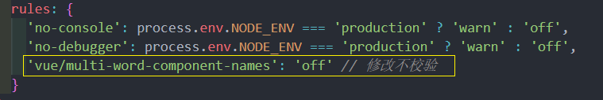

## 代码格式化 Prettier
有没有办法既可以保证 `ESLint` 规则校验，又可以让开发者无需关注格式问题来进行顺畅的开发呢？使用 prettier

1. 一个代码格式化工具
2. 开箱即用
3. 可以直接集成到 `VSCode` 之中
4. 在保存时，让代码直接符合 `ESLint` 标准（需要通过一些简单配置）
## ESLint 与 Prettier 配合解决代码格式问题

1. 在 `VSCode` 中安装 `prettier` 插件（搜索 `prettier`），这个插件可以帮助我们在配置 `prettier` 的时候获得提示

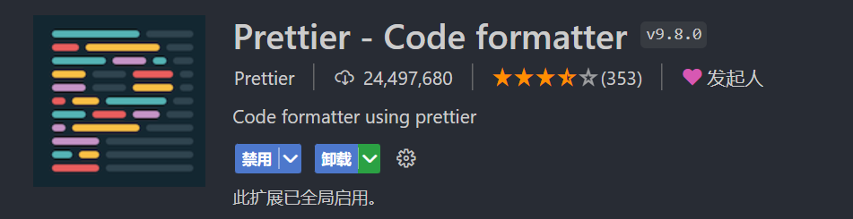
2. 在项目中新建 `.prettierrc` 文件，该文件为 `perttier` 默认配置文件
3. 在该文件中写入如下配置：
```json
{
  // 不尾随分号
  "semi": false,
  // 使用单引号
  "singleQuote": true,
  // 多行逗号分割的语法中，最后一行不加逗号
  "trailingComma": "none"
}
```

4. 打开 `VSCode` 《设置面板》, 在设置中，搜索 `save` ，勾选 `Format On Save`

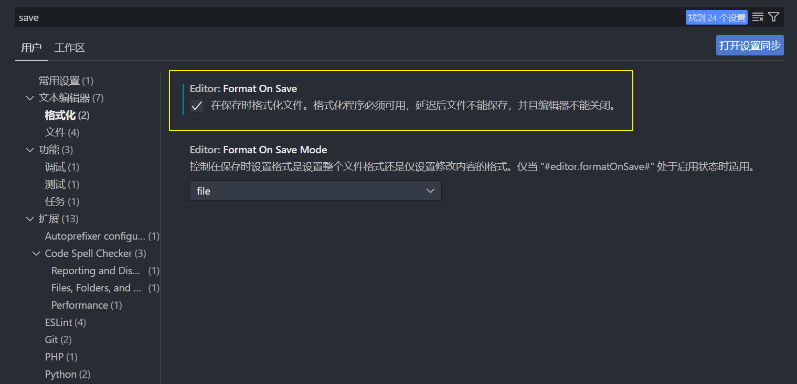

至此，即可在 **`VSCode` 保存(ctrl+s)时，自动格式化代码！**

**但是！** 你只做到这样还不够！

> 1. VSCode 而言，默认一个 tab 等于 4 个空格，而 ESLint 希望一个 tab 为两个空格
> 2. 如果我们的 VSCode 安装了多个代码格式化工具的化
> 3. ESLint 和 prettier 之间的冲突问题

尝试在 `Home.vue` 中写入一个 `created` 方法，写入完成之后，打开我们的控制台我们会发现，此时代码抛出了一个 `ESLint` 的错误

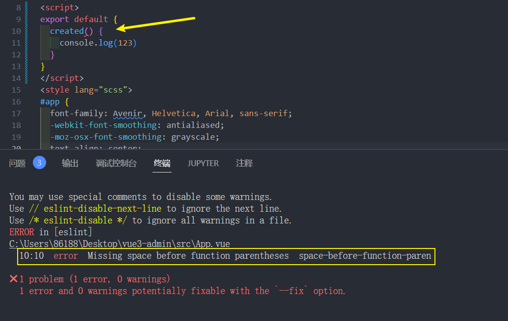

这个错误的意思是说：**`created` 这个方法名和后面的小括号之间，应该有一个空格！**

但是当加入了这个空格之后，只要一保存代码，就会发现 `prettier` 会自动帮助我们去除掉这个空格

那么此时的这个问题就是 `prettier` 和 `ESLint` 的冲突问题

针对于这个问题我们想要解决也非常简单：

1. 打开 `.eslintrc.js` 配置文件
2. 在 `rules` 规则下，新增一条规则

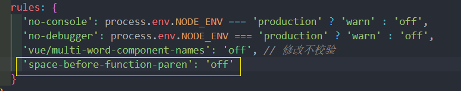
3. 该规则表示关闭《方法名后增加空格》的规则
4. 重启项目

至此整个的 `perttier` 和 `ESLint` 的配合使用就算是全部完成

在之后写代码的过程中，只需要保存代码，那么 `perttier` 就会帮助我们自动格式化代码，使其符合 `ESLint` 的校验规则。而无需手动进行更改了\

## 约定式 git 提交规范
对于 **`git` 提交规范** 来说，不同的团队可能会有不同的标准，这次就以目前使用较多的 [Angular团队规范](https://github.com/angular/angular.js/blob/master/DEVELOPERS.md#-git-commit-guidelines) 延伸出的 [Conventional Commits specification（约定式提交）](https://www.conventionalcommits.org/zh-hans/v1.0.0/) 为例，看一下  **`git` 提交规范**

约定式提交规范要求如下：
```
<type>[optional scope]: <description>

[optional body]

[optional footer(s)]

--------  翻译 -------------
    
<类型>[可选 范围]: <描述>

[可选 正文]

[可选 脚注]
```
其中 `<type>` 类型，必须是一个可选的值，比如：

1. 新功能：`feat`
2. 修复：`fix`
3. 文档变更：`docs`
4. ....

## Commitizen 规范化提交代码
如果严格安装 **约定式提交规范**， 来手动进行代码提交的话，那么是一件非常痛苦的事情，但是 **git 提交规范的处理** 又势在必行，那么怎么办

经过了很多人的冥思苦想，就出现了一种叫做 **git 提交规范化工具** 的东西

`commitizen` 仓库名为 [cz-cli](https://github.com/commitizen/cz-cli) ，它提供了一个 `git cz` 的指令用于代替 `git commit`，简单一句话介绍它：

> 当你使用 `commitizen` 进行代码提交（git commit）时，`commitizen` 会提交你在提交时填写所有必需的提交字段！

1. 全局安装 `Commitizen`
```
npm install -g commitizen@4.2.4
```
2. 安装并配置 `cz-customizable` 插件
* 使用 `npm` 下载 `cz-customizable`
  ```
  npm i cz-customizable@6.3.0 --save-dev
  ```
* 添加以下配置到 `package.json ` 中
  ```
  ...
  "config": {
    "commitizen": {
      "path": "node_modules/cz-customizable"
    }
  }
  ```
3. 项目根目录下创建 `.cz-config.js` 自定义提示文件
```js
module.exports = {
  // 可选类型
  types: [
    { value: 'feat', name: 'feat:     新功能' },
    { value: 'fix', name: 'fix:      修复' },
    { value: 'docs', name: 'docs:     文档变更' },
    { value: 'style', name: 'style:    代码格式(不影响代码运行的变动)' },
    {
      value: 'refactor',
      name: 'refactor: 重构(既不是增加feature，也不是修复bug)'
    },
    { value: 'perf', name: 'perf:     性能优化' },
    { value: 'test', name: 'test:     增加测试' },
    { value: 'chore', name: 'chore:    构建过程或辅助工具的变动' },
    { value: 'revert', name: 'revert:   回退' },
    { value: 'build', name: 'build:    打包' }
  ],
  // 消息步骤
  messages: {
    type: '请选择提交类型:',
    customScope: '请输入修改范围(可选):',
    subject: '请简要描述提交(必填):',
    body: '请输入详细描述(可选):',
    footer: '请输入要关闭的issue(可选):',
    confirmCommit: '确认使用以上信息提交？(y/n/e/h)'
  },
  // 跳过问题
  skipQuestions: ['body', 'footer'],
  // subject文字长度默认是72
  subjectLimit: 72
}
```
4. 使用 `git cz` 代替 `git commit`
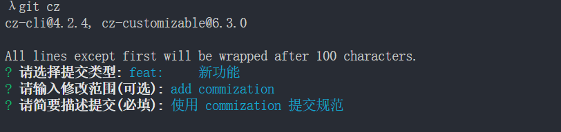

那么如果有马虎的同事，它们忘记了使用 `git cz` 指令，直接就提交了怎么办呢？

那么有没有方式来限制这种错误的出现呢？

答案是有的, 看下一节
## 什么是 Git Hooks
上一节中使用了 `git cz` 来代替了 `git commit` 实现了规范化的提交诉求，但是依然存在着有人会忘记使用的问题

> 我们希望：
当《提交描述信息》不符合 [约定式提交规范](https://www.conventionalcommits.org/zh-hans/v1.0.0/) 的时候，阻止当前的提交，并抛出对应的错误提示

而要实现这个目的，就需要先来了解一个概念，叫做 `Git hooks（git 钩子 || git 回调方法）` 

也就是：**`git` 在执行某个事件之前或之后进行一些其他额外的操作**

而我们所期望的 **阻止不合规的提交消息**，那么就需要使用到 `hooks` 的钩子函数

下面是整理出来的所有的 `hooks` ，可以进行一下参考，其中加粗的是常用到的 `hooks`：

| Git Hook              | 调用时机                                                     | 说明                                                         |
| :-------------------- | ------------------------------------------------------------ | ------------------------------------------------------------ |
| pre-applypatch        | `git am`执行前                                               |                                                              |
| applypatch-msg        | `git am`执行前                                               |                                                              |
| post-applypatch       | `git am`执行后                                               | 不影响`git am`的结果                                         |
| **pre-commit**        | `git commit`执行前                                           | 可以用`git commit --no-verify`绕过                           |
| **commit-msg**        | `git commit`执行前                                           | 可以用`git commit --no-verify`绕过                           |
| post-commit           | `git commit`执行后                                           | 不影响`git commit`的结果                                     |
| pre-merge-commit      | `git merge`执行前                                            | 可以用`git merge --no-verify`绕过。                          |
| prepare-commit-msg    | `git commit`执行后，编辑器打开之前                           |                                                              |
| pre-rebase            | `git rebase`执行前                                           |                                                              |
| post-checkout         | `git checkout`或`git switch`执行后                           | 如果不使用`--no-checkout`参数，则在`git clone`之后也会执行。 |
| post-merge            | `git commit`执行后                                           | 在执行`git pull`时也会被调用                                 |
| pre-push              | `git push`执行前                                             |                                                              |
| pre-receive           | `git-receive-pack`执行前                                     |                                                              |
| update                |                                                              |                                                              |
| post-receive          | `git-receive-pack`执行后                                     | 不影响`git-receive-pack`的结果                               |
| post-update           | 当 `git-receive-pack`对 `git push` 作出反应并更新仓库中的引用时 |                                                              |
| push-to-checkout      | 当``git-receive-pack`对`git push`做出反应并更新仓库中的引用时，以及当推送试图更新当前被签出的分支且`receive.denyCurrentBranch`配置被设置为`updateInstead`时 |                                                              |
| pre-auto-gc           | `git gc --auto`执行前                                        |                                                              |
| post-rewrite          | 执行`git commit --amend`或`git rebase`时                     |                                                              |
| sendemail-validate    | `git send-email`执行前                                       |                                                              |
| fsmonitor-watchman    | 配置`core.fsmonitor`被设置为`.git/hooks/fsmonitor-watchman`或`.git/hooks/fsmonitor-watchmanv2`时 |                                                              |
| p4-pre-submit         | `git-p4 submit`执行前                                        | 可以用`git-p4 submit --no-verify`绕过                        |
| p4-prepare-changelist | `git-p4 submit`执行后，编辑器启动前                          | 可以用`git-p4 submit --no-verify`绕过                        |
| p4-changelist         | `git-p4 submit`执行并编辑完`changelist message`后            | 可以用`git-p4 submit --no-verify`绕过                        |
| p4-post-changelist    | `git-p4 submit`执行后                                        |                                                              |
| post-index-change     | 索引被写入到`read-cache.c do_write_locked_index`后           |                                                              |

PS：详细的 `HOOKS介绍` 可点击[这里](https://git-scm.com/docs/githooks)查看

整体的 `hooks` 非常多，但是其中用的比较多的其实只有两个：

| Git Hook       | 调用时机                                                     | 说明                               |
| :------------- | ------------------------------------------------------------ | ---------------------------------- |
| **pre-commit** | `git commit`执行前<br />它不接受任何参数，并且在获取提交日志消息并进行提交之前被调用。脚本`git commit`以非零状态退出会导致命令在创建提交之前中止。 | 可以用`git commit --no-verify`绕过 |
| **commit-msg** | `git commit`执行前<br />可用于将消息规范化为某种项目标准格式。<br />还可用于在检查消息文件后拒绝提交。 | 可以用`git commit --no-verify`绕过 |

简单来说这两个钩子：

1. `commit-msg`：可以用来规范化标准格式，并且可以按需指定是否要拒绝本次提交
2. `pre-commit`：会在提交前被调用，并且可以按需指定是否要拒绝本次提交

而我们接下来要做的关键，就在这两个钩子上面。

## 使用 husky + commitlint 检查提交描述是否符合规范要求
需要使用两个工具：

1. [commitlint](https://github.com/conventional-changelog/commitlint)：用于检查提交信息
2. [husky](https://github.com/typicode/husky)：是`git hooks`工具

注意：**`npm` 需要在 7.x 以上版本！！！！！**

### commitlint
1. 安装依赖：

   ```
   npm install --save-dev @commitlint/config-conventional@12.1.4 @commitlint/cli@12.1.4
   ```

2. 创建 `commitlint.config.js` 文件

   ```
   echo "module.exports = {extends: ['@commitlint/config-conventional']}" > commitlint.config.js
   ```

3. 打开 `commitlint.config.js` ， 增加配置项（ [config-conventional 默认配置点击可查看](https://github.com/conventional-changelog/commitlint/blob/master/@commitlint/config-conventional/index.js) ）：

   ```js
   module.exports = {
     // 继承的规则
     extends: ['@commitlint/config-conventional'],
     // 定义规则类型
     rules: {
       // type 类型定义，表示 git 提交的 type 必须在以下类型范围内
       'type-enum': [
         2,
         'always',
         [
           'feat', // 新功能 feature
           'fix', // 修复 bug
           'docs', // 文档注释
           'style', // 代码格式(不影响代码运行的变动)
           'refactor', // 重构(既不增加新功能，也不是修复bug)
           'perf', // 性能优化
           'test', // 增加测试
           'chore', // 构建过程或辅助工具的变动
           'revert', // 回退
           'build' // 打包
         ]
       ],
       // subject 大小写不做校验
       'subject-case': [0]
     }
   }
   
   ```

**注意：确保保存为 `UTF-8` 的编码格式**
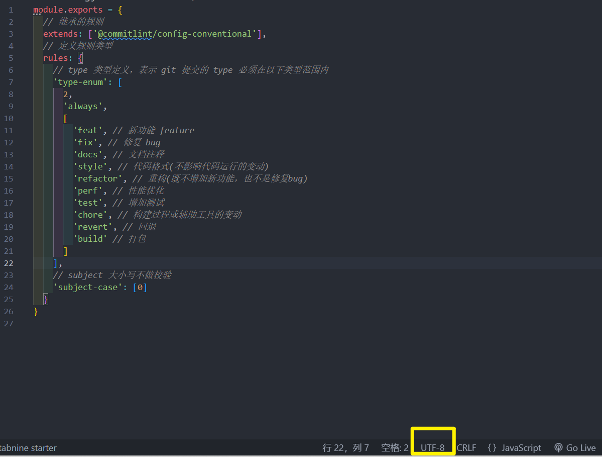
否则可能会出现错误

### husky
1. 安装依赖：
   ```
   npm install husky@7.0.1 --save-dev
   ```
2. 启动 `hooks` ， 生成 `.husky` 文件夹
   ```
   npx husky install
   ```
  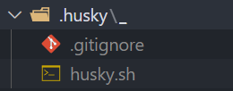

3. 在 `package.json` 中生成 `prepare` 指令（**需要 npm > 7.0 版本**)
  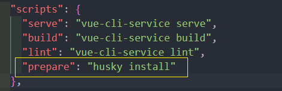
4. 执行 `prepare` 指令
```
npm run prepare
```

5. 执行成功，提示
  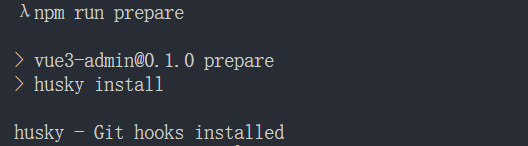
6. 添加 `commitlint` 的 `hook` 到 `husky`中，并指令在 `commit-msg` 的 `hooks` 下执行 `npx --no-install commitlint --edit "$1"` 指令

```
npx husky add .husky/commit-msg 'npx --no-install commitlint --edit "$1"'
```
7. 此时的 `.husky` 的文件结构
  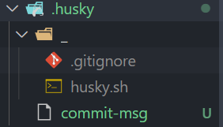

至此， 不符合规范的 commit 将不再可提交：
  
  
现在还缺少一个 **规范化的处理** ，那就是 **代码格式提交规范处理！**

## 通过 pre-commit 检测提交时代码规范
在 **`ESLint` 与 `Prettier` 配合解决代码格式问题** 的小节中，总结了如何处理 **本地！代码格式问题。**

但是这样的一个格式处理问题，他只能够在本地进行处理，并且我们还需要 **手动在  `VSCode` 中配置自动保存** 才可以。那么这样就会存在一个问题，要是有人忘记配置这个东西了怎么办呢？他把代码写的乱七八糟的直接就提交了怎么办呢？

所以我们就需要有一种方式来规避这种风险。

那么想要完成这么一个操作就需要使用 `husky` 配合 `eslint` 才可以实现。

我们期望通过 **`husky` 监测 `pre-commit` 钩子，在该钩子下执行 `npx eslint --ext .js,.vue src`** 指令来去进行相关检测：

1. 执行 `npx husky add .husky/pre-commit "npx eslint --ext .js,.vue src"` 添加 `commit` 时的 `hook` （`npx eslint --ext .js,.vue src` 会在执行到该 hook 时运行）
2. 该操作会生成对应文件 `pre-commit`：
  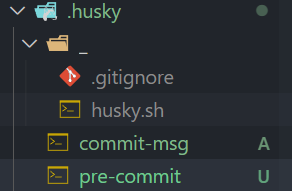


想要提交代码，必须处理完成所有的 eslint 错误信息

那么有没有办法，让程序猿在 0 配置的前提下，哪怕代码格式再乱，也可以 **”自动“** 帮助他修复对应的问题，并且完成提交呢？

## lint-staged 自动修复格式错误
在上一节中通过 `pre-commit` 处理了 **检测代码的提交规范问题，当我们进行代码提交时，会检测所有的代码格式规范** 

但是这样会存在两个问题：

1. 我们只修改了个别的文件，没有必要检测所有的文件代码格式
2. 它只能给我们提示出对应的错误，我们还需要手动的进行代码修改

这一小节，就需要处理这两个问题

那么想要处理这两个问题，就需要使用另外一个插件 [lint-staged](https://github.com/okonet/lint-staged) ！

[lint-staged](https://github.com/okonet/lint-staged) 可以让你当前的代码检查 **只检查本次修改更新的代码，并在出现错误的时候，自动修复并且推送**

[lint-staged](https://github.com/okonet/lint-staged) 无需单独安装，我们生成项目时，`vue-cli` 已经帮助我们安装过了，所以我们直接使用就可以了

如果没有则安装
```
npm install --save-dev lint-staged
```
1. 修改 `package.json` 配置

   ```js
   "lint-staged": {
       "src/**/*.{js,vue}": [
         "eslint --fix",
         "git add"
       ]
     }
   ```

2. 如上配置，每次它只会在你本地 `commit` 之前，校验你提交的内容是否符合你本地配置的 `eslint`规则(这个见文档 [ESLint](https://panjiachen.github.io/vue-element-admin-site/zh/guide/advanced/eslint.html) )，校验会出现两种结果：

   1. 如果符合规则：则会提交成功。
   2. 如果不符合规则：它会自动执行 `eslint --fix` 尝试帮你自动修复，如果修复成功则会帮你把修复好的代码提交，如果失败，则会提示你错误，让你修好这个错误之后才能允许你提交代码。

3. 修改 `.husky/pre-commit` 文件

   ```js
   #!/bin/sh
   . "$(dirname "$0")/_/husky.sh"
   
   npx lint-staged
   
   ```

4. 再次执行提交代码

5. 发现 **暂存区中** 不符合 `ESlint` 的内容，被自动修复

## 关于 `vetur` 检测 `template` 的单一根元素的问题
在 vue2 中， template 只允许存在一个根元素，但是这种情况在 vue3 里发生了一些变化。

在 Vue3 中开始支持 template 存在**多个根元素**了。但是因为 VSCode 中的一些插件没有及时更新，所以当在 template 中写入多个根元素
有可能会出现错误

出现这个问题的原因主要是： vetur 这个 vsCode 插件依然按照 vue2 的单一根元素逻辑进行检测，所以会出现提示错误的问题

但是要注意，虽然这样不太好看，但是 该问题**并不影响代码运行**！

如果实在觉得这样太丑的话，那么可以通过以下方案来 **取消 vetur 对 template 的检测：**

1. 在 VSCode 的设置中，搜索 vetur ，找到如下设置，取消勾选
  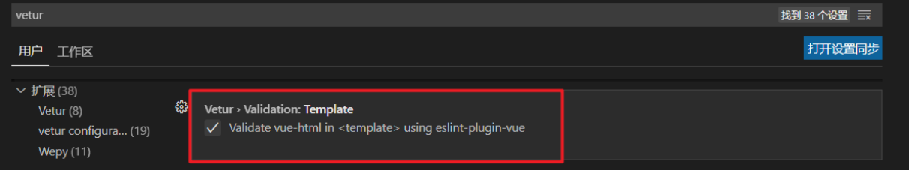
2. 重启 vscode


按以上两种方式执行之后，多根元素就不会出现不好看的错误


## 总结
处理了 **编程格式规范的问题**，整个规范大体可以分为两大类：

1. 代码格式规范
2. `git` 提交规范

**代码格式规范：**

对于 **代码格式规范** 而言，通过 `ESLint` + `Prettier` + `VSCode 配置` 配合进行了处理。

最终达到了在保存代码时，自动规范化代码格式的目的。

**`git` 提交规范：**

对于 **`git` 提交规范** 而言我们使用了 `husky` 来监测 `Git hooks` 钩子，并且通过以下插件完成了对应的配置：

1. [约定式提交规范](https://www.conventionalcommits.org/zh-hans/v1.0.0/)
2. [commitizen](https://github.com/commitizen/cz-cli)：git 提交规范化工具
3. [commitlint](https://github.com/conventional-changelog/commitlint)：用于检查提交信息
4. `pre-commit`： `git hooks` 钩子
5. [lint-staged](https://github.com/okonet/lint-staged)：只检查本次修改更新的代码，并在出现错误的时候，自动修复并且推送
