# 登录
## 导入 element-plus
需要先去导入 element-ui 的 vue3 支持版本，也就是 [element-plus](https://element-plus.gitee.io/zh-CN/guide/quickstart.html)

这里完整导入 
```
npm install element-plus --save
```
main.js
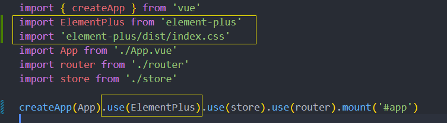


## 构建登录页面 UI 结构
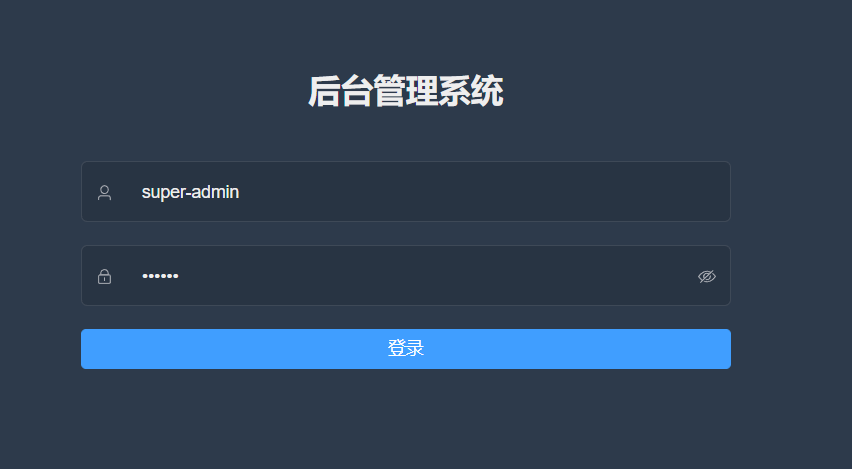

1. 在 `views` 中 `login` 文件夹，创建 `index.vue` 文件

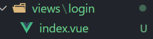

2. 在 `router/index.js` 中增加以下路由配置

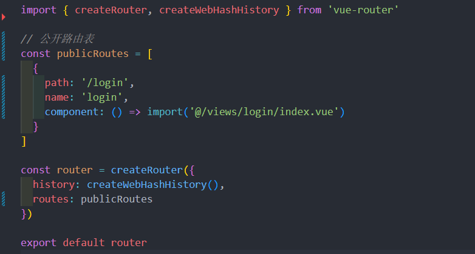

3. 创建登录页面基本 UI 结构
```vue
<template>
  <div class="login-container">
    <!--表单-->
    <el-form class="login-form" ref="loginFormRef">
      <div class="title-container">
        <h1 class="title">后台管理系统</h1>
      </div>
      <!--username-->
      <el-form-item prop="username">
        <el-input prefix-icon="user" placeholder="username"></el-input>
      </el-form-item>
      <!--password-->
      <el-form-item prop="password">
        <el-input
          prefix-icon="lock"
          placeholder="password"
          type="password"
          show-password
        ></el-input>
      </el-form-item>
      <el-button style="width: 100%" type="primary">登录</el-button>
    </el-form>
  </div>
</template>
<script></script>
<style lang="scss" scoped></style>
```
## 美化登录页面样式
1. 创建全局的 `style` 

* 在 `src` 下创建 `styles/index.scss` 文件，并写入以下内容：
```css
html,
body {
  height: 100%;
  margin: 0;
  padding: 0;
  -moz-osx-font-smoothing: grayscale;
  -webkit-font-smoothing: antialiased;
  text-rendering: optimizeLegibility;
  font-family: Helvetica Neue, Helvetica, PingFang SC, Hiragino Sans GB,
    Microsoft YaHei, Arial, sans-serif;
}

#app {
  height: 100%;
}

*,
*:before,
*:after {
  box-sizing: inherit;
  margin: 0;
  padding: 0;
}

a:focus,
a:active {
  outline: none;
}

a,
a:focus,
a:hover {
  cursor: pointer;
  color: inherit;
  text-decoration: none;
}

div:focus {
  outline: none;
}

.clearfix {
  &:after {
    visibility: hidden;
    display: block;
    font-size: 0;
    content: ' ';
    clear: both;
    height: 0;
  }
}
```
* 在 `main.js` 中导入全局样式
```js
...
// 导入全局样式
import './styles/index.scss'
...
```

* 在 `views/login/index.vue` 中写入以下样式
```vue
<style lang="scss" scoped>
$bg: #2d3a4b;
$dark_gray: #889aa4;
$light_gray: #eee;
$cursor: #fff;
.login-container {
  min-height: 100%;
  width: 100%;
  background-color: $bg;
  overflow: hidden;

  .login-form {
    position: relative;
    width: 520px;
    max-width: 100%;
    padding: 160px 35px 0;
    margin: 0 auto;
    overflow: hidden;

    ::v-deep .el-form-item {
      border: 1px solid rgba(255, 255, 255, 0.1);
      background: rgba(0, 0, 0, 0.1);
      border-radius: 5px;
      color: #454545;
    }

    ::v-deep .el-input {
      display: inline-block;
      height: 47px;
      width:100%;
      .el-input__wrapper{
        background-color: transparent;
        border:0;
        box-shadow: none;
        width:100%
      }
      input {
        background: transparent;
        border: 0px;
        -webkit-appearance: none;
        border-radius: 0px;
        padding: 12px 5px 12px 15px;
        color: $light_gray;
        height: 47px;
        caret-color: $cursor;
      }
    }
  }
  .title-container {
    position: relative;

    .title {
      font-size: 26px;
      color: $light_gray;
      margin: 0px auto 40px auto;
      text-align: center;
      font-weight: bold;
    }
  }
}
</style>
```
## Icon 图标处理方案：SvgIcon
* `element-plus` 的图标
* 项目中自定义的 `svg` 图标

对于 `element-plus` 的图标我们可以直接通过 `el-icon` 来进行显示，但是自定义图标的话，暂时还缺少显示的方式，所以说需要一个自定义的组件，来显示咱们项目内的自定义的 `svg` 图标

那么对于这个组件的话，它就需要拥有两种能力：

1. 显示外部资源的 `svg` 图标
* 比如 `https://res.lgdsunday.club/user.svg` , 这样的地址
2. 显示项目内部的 `svg` 图标

创建 `components/SvgIcon/index.vue`
```vue
<template>
  <!--外部的 svg 资源-->
  <div
    v-if="isExternal"
    :class="className"
    :style="styleExternalIcon"
    class="svg-external-icon svg-icon"

  />  
  <!--项目内部的 svg 资源-->
  <svg :aria-hidden="true" v-else>
    <use :xlink:href="iconName" :class="className" class="svg-icon"></use>
  </svg>
</template>
<script setup>
import { defineProps, computed } from 'vue';
import { isExternal as external } from '@/utils/validate';
const props = defineProps({
  icon: {  // icon 图标
    type: String,
    required: true
  },
  className: { // 图标类名
    type: String,
    
  }
})
// 判断是否是外部的 svg 资源
const isExternal = computed(() => {
  return external(props.icon)
})
// 外部图标样式: 使用了 mask 属性
const styleExternalIcon = computed(() => ({
  mask: `url(${props.icon}) no-repeat 50% 50%`,
  '-webkit-mask': `url(${props.icon}) no-repeat 50% 50%`
}))
// 项目内部的 svg 资源名称
const iconName = computed(() => {
  return `#icon-${props.icon}`
})
</script>
<style lang="scss" scoped>
  .svg-icon {
  width: 1em;
  height: 1em;
  vertical-align: -0.15em;
  fill: currentColor;
  overflow: hidden;
}
.svg-external-icon {
  background-color: currentColor;
  mask-size: cover !important;
  display: inline-block;
}
</style>
```

创建 `utils/validate.js`
```js
/**
 * 判断是否为外部资源 ,  比如 `https://res.lgdsunday.club/user.svg` 这样的外部的 svg 资源
 */
export function isExternal(path) {
  return /^(https?:|mailto:|tel:)/.test(path)
}
```

在外部试着使用一下
```html
<span class="svg-container">
	<svg-icon icon="https://res.lgdsunday.club/user.svg"></svg-icon>
</span>
```
外部图标可正常展示

这里创建了 `SvgIcon` 组件，用来处理了 **外部资源图标** 的展示，但是对于内部图标而言，此时依然无法进行展示。所以需要看一下，如何处理内部的 `svg` 图标

### 处理内部 svg 图标显示
上面封装的 `SvgIcon` 组件目前只能显示外部资源的 `svg` 图标, 内部的图标还无法展示

首先导入项目中被使用到的所有的 `svg` 图标, icons 目录下的 `svg` 文件夹里存放所有的 `xxx.svg` 图标

在 `icons` 目录下创建 `index.js` 文件，该文件中需要完成两件事情：

1. 导入所有的 `svg` 图标
2. 完成 `SvgIcon` 的全局注册

```js
import SvgIcon from '@/components/SvgIcon'

// https://webpack.docschina.org/guides/dependency-management/#requirecontext
// 通过 require.context() 函数来创建自己的 context
const svgRequire = require.context('./svg', false, /\.svg$/)
// 此时返回一个 require 的函数，可以接受一个 request 的参数，用于 require 的导入。
// 该函数提供了三个属性，可以通过 require.keys() 获取到所有的 svg 图标
// 遍历图标，把图标作为 request 传入到 require 导入函数中，完成本地 svg 图标的导入
svgRequire.keys().forEach(svgIcon => svgRequire(svgIcon))

export default app => {
  app.component('svg-icon', SvgIcon)
}
```

然后在 `main.js` 中引入该文件
```js
...
// 导入 svgIcon
import installIcons from '@/icons'
...
installIcons(app)
...
```

然后用组件在试一下, 图标依然无法展示
### 使用 svg-sprite-loader 处理 svg 图标
[svg-sprite-loader](https://www.npmjs.com/package/svg-sprite-loader) 是 `webpack` 中专门用来处理 `svg` 图标的一个 `loader` ，在上面图标之所有没有展示，就是因为缺少该 `loader`

1. 安装 loader : `npm i --save-dev svg-sprite-loader@6.0.9`

2. 创建 `vue.config.js` 文件，新增如下配置：
```js{6-9,21-38}
const { defineConfig } = require("@vue/cli-service");
// Element Plus 按需引入使用的插件
const AutoImport = require('unplugin-auto-import/webpack')
const Components = require('unplugin-vue-components/webpack')
const { ElementPlusResolver } = require('unplugin-vue-components/resolvers')
const path = require('path')
function resolve(dir) {
  return path.join(__dirname, dir)
}
module.exports = defineConfig({
  transpileDependencies: true,
  configureWebpack: {
    plugins: [
      AutoImport({
        resolvers: [ElementPlusResolver()],
      }),
      Components({
        resolvers: [ElementPlusResolver()],
      }),
    ]
  },
  chainWebpack(config) {
    // 设置 svg-sprite-loader
    config.module
      .rule('svg')
      .exclude.add(resolve('src/icons'))
      .end()
    config.module
      .rule('icons')
      .test(/\.svg$/)
      .include.add(resolve('src/icons'))
      .end()
      .use('svg-sprite-loader')
      .loader('svg-sprite-loader')
      .options({
        symbolId: 'icon-[name]'
      })
      .end()
  }
});
```
修改完 `vue.config.js` 配置文件完以上配置之后，重新启动项目, 最终图标终于可以显示了
## 完善登录表单校验
为表单进行表单校验那么我们需要关注以下三点：

1. 为 `el-form` 绑定 `model` 属性
2. 为 `el-form` 绑定 `rules` 属性
3. 为 `el-form-item` 绑定 `prop` 属性

保证以上三点即可为 `el-from` 添加表单校验功能

以下为对应的代码实现：

**views/login**
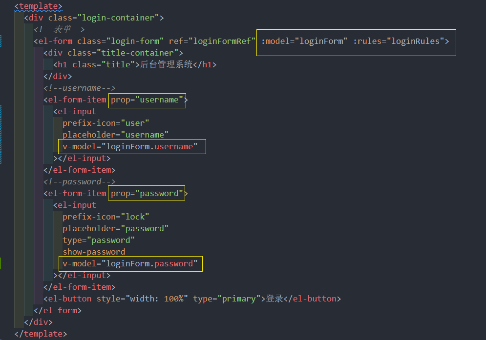
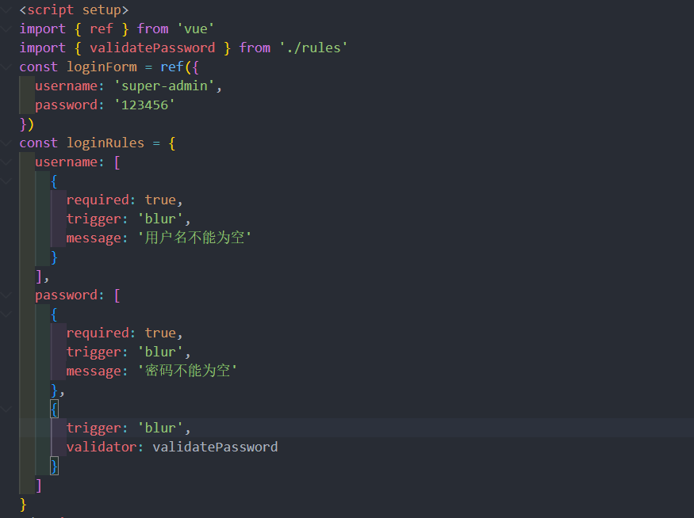

**views/login/rules.js**  把函数式校验规则单独抽出来, 因为真实项目校验规则有可能非常多, 避免主文件变得臃肿

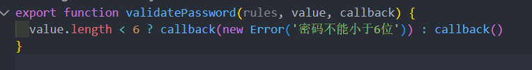
## 通用后台登录方案解析
处理完了表单的基本操作之后，接下来就是登录操作的实现了。

对于登录操作在后台项目中是一个通用的解决方案，具体可以分为以下几点：

1. 封装 `axios` 模块
2. 封装 接口请求 模块
3. 封装登录请求动作
4. 保存服务端返回的 `token`
5. 登录鉴权

这些内容就共同的组成了一套 **后台登录解决方案** 。
### 配置环境变量封装 axios 模块
在当前这个场景下，我们希望封装出来的 `axios` 模块，至少需要具备一种能力，那就是：**根据当前模式的不同，设定不同的 `BaseUrl`** ，因为通常情况下企业级项目在 **开发状态** 和 **生产状态** 下它的 `baseUrl` 是不同的。

对于 `@vue/cli` 来说，它具备三种不同的模式：

1. `development`
2. `test`
3. `production`

具体可以点击 [这里](https://cli.vuejs.org/zh/guide/mode-and-env.html#%E6%A8%A1%E5%BC%8F) 进行参考

`axios` 必须要满足：**在 开发 || 生产 状态下，可以设定不同 `BaseUrl` 的能力**

想要解决这个问题，就必须要使用到 `@vue/cli` 所提供的 [环境变量](https://cli.vuejs.org/zh/guide/mode-and-env.html#%E6%A8%A1%E5%BC%8F) 来去进行实现

可以在项目中创建两个文件：

1. `.env.development`
2. `.env.production`

它们分别对应 **开发状态** 和 **生产状态**

分别写入以下代码：

.env.development
```
# 标志
ENV='development'

# base api
VUE_APP_BASE_API='/api'
```

.env.production
```
# 标志
ENV='production'

# base api
VUE_APP_BASE_API='/prod-api'
```

有了这两个文件之后，就可以创建对应的 `axios` 模块
```
npm install axios 
```

创建 `utils/request.js` ，写入如下代码

```js
import axios from 'axios'

const service = axios.create({
  baseURL: process.env.VUE_APP_BASE_API,
  timeout: 5000
})

export default service
```
### 封装请求动作
有了 `axios` 模块之后，接下来我们就可以

1. 封装接口请求模块
2. 封装登录请求动作

创建 `api` 文件夹，创建 `sys.js`：
```js
import request from '@/utils/request'

// 登录接口
export function login(data) {
  return request({
    url: '/sys/login',
    method: 'POST',
    data
  })
}
```

**封装登录请求动作：**\

该动作期望把它封装到 `Vuex` 的 `action` 中

在 `store` 下创建 `modules` 文件夹，创建 `user.js` 模块，用于处理所有和 **用户相关** 的内容（此处需要使用第三方包 `md5` ）

```js 
import { login } from '@/api/sys'
import md5 from 'md5'
export default {
  namespaced: true,
  state() {
    return {}
  },
  mutations: {},
  actions: {
    loginAction(context, userInfo) {
      const { username, password } = userInfo
      return new Promise((resolve, reject) => {
        login({
          username,
          password: md5(password)
        })
          .then((res) => {
            resolve(res)
          })
          .catch((err) => {
            reject(err)
          })
      })
    }
  }
}
```

然后在 `store/index` 中完成注册：

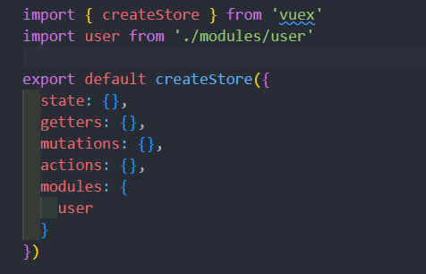


### 登录触发动作
1. 进行表单校验
2. 触发登陆操作
3. 进行登录后操作

在 `login` 中，触发定义的登录 `action`

```vue
<template>
  <el-button
        style="width: 100%"
        type="primary"
        :loading="loading"
        @click="handleLogin"
        >登录
  </el-button>
</template>
<script setup>
import { ref } from 'vue'
import { validatePassword } from './rules'
import { useStore } from 'vuex'

const loginForm = ref({
  username: 'super-admin',
  password: '123456'
})

...

// 处理登录
const loading = ref(false)
const store = useStore()
const loginFormRef = ref(null)
const handleLogin = () => {
  loginFormRef.value.validate((isOK) => {
    if (!isOK) return
    loading.value = true // 开启 loading 动画

    store.dispatch('user/loginAction', loginForm.value).then(() => {
      // TODO : 登录后操作
      loading.value = false
    }).catch((err)=>{
      console.log(err)
      loading.value = false
    }
  })
}
</script>
```
触发之后会得到以下错误：

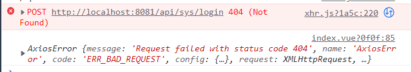

该错误表示，我们当前请求的接口不存在。

出现这个问题的原因，是因为我们在前面配置环境变量时指定了 **开发环境下**，请求的 `BaseUrl` 为 `/api` ，所以我们真实发出的请求为：`/api/sys/login` 。

这样的一个请求会被自动键入到当前前端所在的服务中，所以最终就得到了 `http://localhost:8081/api/sys/login` 这样的一个请求路径

而想要处理这个问题，那么可以通过指定 [webpack DevServer 代理](https://webpack.docschina.org/configuration/dev-server/) 的形式，代理当前的 `url` 请求。

而指定这个代理非常简单，是一种近乎固定的配置方案。
```js
module.exports = {
  devServer: {
    // 配置反向代理
    proxy: {
      // 当地址中有/api的时候会触发代理机制
      '/api': {
        // 要代理的服务器地址  这里不用写 api
        target: 'https://api.imooc-admin.lgdsunday.club/',
        changeOrigin: true // 是否跨域
      }
    }
  },
  ...
}
```

重新启动服务，再次进行请求，即可得到返回数据

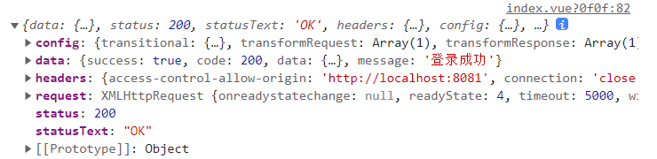

### 本地缓存处理方案(数据持久化)
通常情况下，在获取到 `token` 之后，会把 `token` 进行缓存，而缓存的方式将会分为两种：

1. 本地缓存：`LocalStorage` 
2. 全局状态管理：`Vuex`

保存在 `LocalStorage` 是为了方便实现 **自动登录功能**,  **数据持久化**

保存在 `vuex` 中是为了后面在其他位置进行使用

下面就分别来实现对应的缓存方案：

**LocalStorage：**

1. 创建 `utils/storage.js` 文件，封装三个对应方法：
```js
class Storage {
  setItem(key, value) {
    if (value) {
      window.localStorage.setItem(key, JSON.stringify(value))
    }
  }

  getItem(key) {
    let item = window.localStorage.getItem(key)
    if (item) {
      item = JSON.parse(item)
    }
    return item
  }

  removeItem(key) {
    window.localStorage.removeItem(key)
  }

  clear() {
    window.localStorage.clear()
  }
}

const storage = new Storage()
export default storage
```

2. 在 `vuex` 的 `user` 模块下，处理 `token` 的保存

登录成功之后拿到 token , 提交 mutation 存储在 **state 里**和 **localStorage 里**

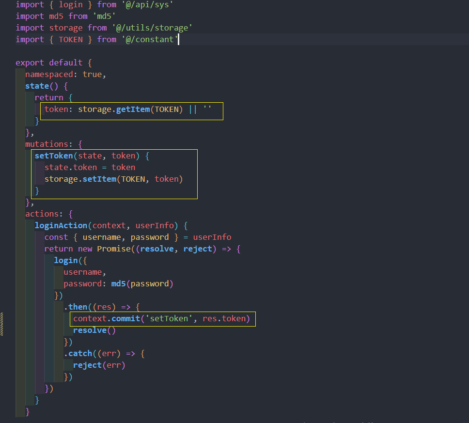

3. 处理保存的过程中，需要创建 `constant` 常量目录 `constant/index.js`

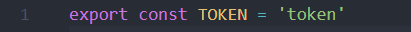

此时，当点击登陆时，即可把 `token` 保存至 `Vuex` 与  `localStorage` 中

### 请求响应数据的统一处理
在上面中，保存了服务端返回的 `token` 。但是有一个地方比较难受，那就是在 `vuex 的 user 模块` 中，我们获取数据端的 `token` 数据，通过 `res.data.data.token` 的形式进行获取

一路的 `data.` 确实让人比较难受，可以通过 [axios 响应拦截器](http://axios-js.com/zh-cn/docs/index.html#%E6%8B%A6%E6%88%AA%E5%99%A8) 进行处理。

登录成功服务器会返回这种格式数据


在 `utils/request.js` 中实现以下代码：

```js
import axios from 'axios'
import { ElMessage } from 'element-plus'
const service = axios.create({
  baseURL: process.env.VUE_APP_BASE_API,
  timeout: 5000
})

...

// 响应拦截器
service.interceptors.response.use(
  (res) => {
    const { success, data, message } = res.data
    if (success) {
      // 成功返回解析后的数据
      return data
    } else {
      // 失败(请求成功, 业务失败) , 消息提示
      ElMessage.error(message)
      return Promise.reject(new Error(message))
    }
  },
  (err) => {
    // TODO: 将来处理 token 超时问题
    ElMessage.error(err.message) // 提示消息
    return Promise.reject(err)
  }
)

export default service
```

此时，对于 `vuex 中的 user 模块` 就可以进行以下修改了：

```js
context.commit('setToken', data.token)
```

### 登录后操作
那么截止到此时，我们距离登录操作还差最后一个功能就是 **登录鉴权** 。

只不过在进行 **登录鉴权** 之前得先去创建一个登录后要跳转到的页面，也就是所说的登录后操作

1. 创建 `layout/index.vue` ，写入以下代码：
```
<template>
  <div>layout 页面 </div>
</template>
<script setup>

</script>
<style lang="scss" scoped>
</style>
```
2. 在 `router/index` 中，指定对应路由表
```
const publicRoutes = [
  ...
  {
    path: '/',
    name: 'layout',
    component: () => import('@/layout/index.vue')
  }
]
```
3. action 里面, 在登录成功后，完成跳转

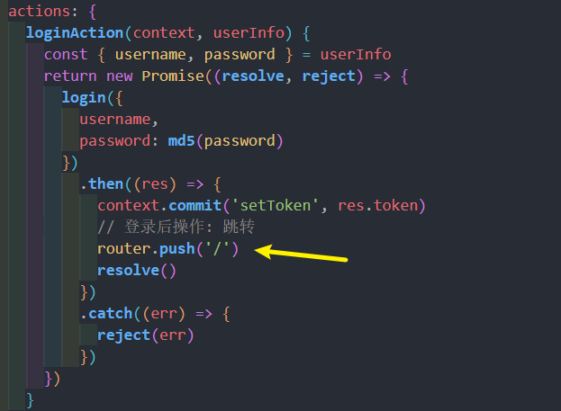

### 登录鉴权解决方案
在处理了登陆后操作之后，接下来我们就来看一下最后的一个功能，也就是 **登录鉴权**

首先我们先去对 **登录鉴权** 进行一个定义，什么是  **登录鉴权** 呢？

> 当用户未登陆时，不允许进入除 `login` 之外的其他页面。
>
> 用户登录后，`token` 未过期之前，不允许进入 `login` 页面

而想要实现这个功能，那么最好的方式就是通过 [路由守卫](https://router.vuejs.org/zh/guide/advanced/navigation-guards.html#%E5%85%A8%E5%B1%80%E5%89%8D%E7%BD%AE%E5%AE%88%E5%8D%AB) 来进行实现。

明确好了 **登录鉴权** 的概念之后，接下来就去实现一下

1. 在 `main.js` 平级，创建 `permission` 文件，并在 `main.js` 中进行导入

```js
import router from './router'
import store from './store'

// 白名单
const whiteList = ['/login']

// 1. 如果已登录, 则不允许进入 login 页面
// 2. 如果未登录, 只允许进入 login 页面及白名单
/**
 * 路由前置守卫
 */
router.beforeEach((to, from, next) => {
  if (store.getters.token) {
    // 有 token, 说明已登录
    if (to.path === '/login') {
      next('/')
    } else {
      next()
    }
  } else {
    // 未登录
    if (whiteList.indexOf(to.path) > -1) {
      next()
    } else {
      next('/login')
    }
  }
})
```
在此处我们使用到了 `vuex 中的 getters` ，此时的 `getters` 被当作 **快捷访问** 的形式进行访问

所以需要声明对应的模块，创建 `store/getters.js`
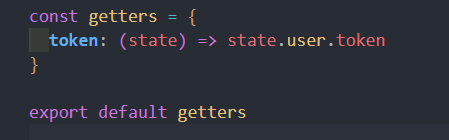

在 `store/index` 中进行导入：
```js
import getters from './getters'

export default createStore({
  getters,
  ...
})
```

并且在 main.js, 引入 `permission.js` 登录鉴权
```js 
import './permission'
```


