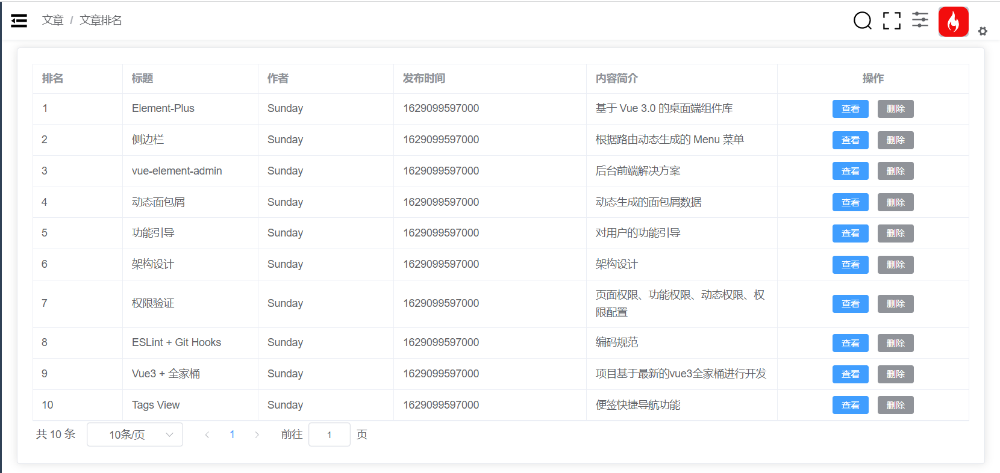
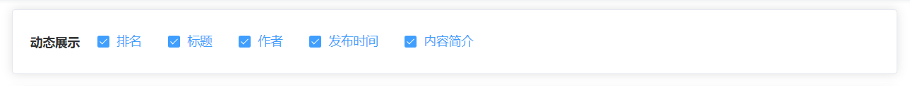

# 动态表格渲染方案 - 文章排名业务实现
对于 **文章排名** 而言，核心的内容是围绕着表格处理来进行的。对应的核心业务主要有两个：

1. 文章排名切换
2. 动态表格渲染

这两个核心业务配合着其他的一些辅助功能：

1. 文章排名页面展示
2. 文章详情页面展示

## 文章排名页面渲染

整个 **文章排名** 的页面渲染分成三个部分：

1. 顶部的动态展示区域
2. 中间的 `table` 列表展示区域
3. 底部的分页展示区域

先去渲染第 2、3 两部分：

1. 创建 `api/article` 文件定义数据获取接口
```js
import request from '@/utils/request'

/**
 * 获取列表数据
 */
export const getArticleList = data => {
  return request({
    url: '/article/list',
    params: data
  })
}
```
2. 在 `article-ranking` 中获取对应数据
```vue
<template>
  <div class="article-ranking-container">
    <el-card>
      <el-table
        :data="tableData"
        border
        style="width: 100%"
        v-loading="loading"
      >
        <el-table-column
          prop="ranking"
          :label="$t('msg.article.ranking')"
          width="120"
        />
        <el-table-column
          prop="title"
          :label="$t('msg.article.title')"
          width="180"
        />
        <el-table-column
          prop="author"
          :label="$t('msg.article.author')"
          width="180"
        />
        <el-table-column
          prop="publicDate"
          :label="$t('msg.article.publicDate')"
        />
        <el-table-column prop="desc" :label="$t('msg.article.desc')" />
        <el-table-column :label="$t('msg.article.action')" align="center">
          <template #default="scope">
            <el-button
              size="small"
              type="primary"
              @click="onShowClick(scope.row)"
              >{{ $t('msg.article.show') }}</el-button
            >
            <el-button
              size="small"
              type="info"
              @click="onRemoveClick(scope.row)"
              >{{ $t('msg.article.remove') }}</el-button
            >
          </template>
        </el-table-column>
      </el-table>
      <el-pagination
        class="pagination"
        v-model:currentPage="page"
        v-model:page-size="size"
        :page-sizes="[5, 10, 20, 30]"
        layout="total, sizes, prev, pager, next, jumper"
        :total="total"
        @size-change="handleSizeChange"
        @current-change="handleCurrentChange"
      />
    </el-card>
  </div>
</template>

<script setup>
import { ref } from 'vue'
import { getArticleList } from '@/api/article'
import { watchSwitchLang } from '@/utils/i18n'
// 数据相关
const tableData = ref([]) // 文章列表
const page = ref(1) // 当前页码
const size = ref(10) // 每页条数
const total = ref(0) // 总数
const loading = ref(false) // loading 动画

// 获取文章列表
const getListData = async () => {
  loading.value = true
  const res = await getArticleList({
    page: page.value,
    size: size.value
  })
  tableData.value = res.list
  total.value = res.total
  loading.value = false
}

getListData()
// 接口国际化处理
watchSwitchLang(getListData)

// 查看按钮
const onShowClick = (row) => {
  // console.log(row._id)
}
// 删除按钮
const onRemoveClick = (row) => {
  // console.log(row._id)
}
// 每页条数改变
const handleSizeChange = (pageSize) => {
  size.value = pageSize
  getListData()
}
// 页码改变
const handleCurrentChange = (currentPage) => {
  page.value = currentPage
  getListData()
}
</script>

<style lang="scss" scoped>
.article-ranking-container {
  .header {
    margin-bottom: 20px;
    .dynamic-box {
      display: flex;
      align-items: center;
      .title {
        margin-right: 20px;
        font-size: 14px;
        font-weight: bold;
      }
    }
  }

  ::v-deep .el-table__row {
    cursor: pointer;
  }

  .pagination {
    margin-top: 20px;
    text-align: center;
  }
}
</style>
```
## 相对时间与相对时间的国际化处理
在 **发布时间** 列中，我们希望展示相对时间，并且希望相对时间**具备国际化**的能力。那么就去需要到 `filters` 中对 `dayjs` 进行处理

1. 定义相对时间的处理方法

   ```js
   ...
   import rt from 'dayjs/plugin/relativeTime'
   
   ...
   
   // 加载相对时间插件
   dayjs.extend(rt)
   function relativeTime(val) {
     if (!isNaN(val)) {
       val = parseInt(val)
     }
     return dayjs().to(dayjs(val))
   }
   
   export default app => {
     app.config.globalProperties.$filters = {
       ...
       relativeTime
     }
   }
   
   ```

2. 在 `article-ranking` 中使用相对时间

   ```html
   <el-table-column :label="$t('msg.article.publicDate')">
             <template #default="scope">
               {{ $filters.relativeTime(scope.row.publicDate) }}
             </template>
    </el-table-column>
   ```

3. 接下来来处理国际化内容

   ```js
   ...
   // 语言包
   import 'dayjs/locale/zh-cn'
   import store from '@/store'
   
   ...
   function relativeTime(val) {
    ...
     return dayjs()
       .locale(store.getters.language === 'zh' ? 'zh-cn' : 'en')
       .to(dayjs(val))
   }
   ```

## 动态表格原理与实现分析
所谓动态表格指的是：**根据列的勾选，动态展示表格中的列**

那么同样把这一句话拆开来去看：

1. 展示可勾选的列
2. 动态展示表格的列

那么我们先来看第一部分 **展示可勾选的列：**

可勾选的列通过 `el-checkbox` 来进行渲染。

所以只要我们有对应的数据，那么渲染自然也没有对应的难度。

然后看 **动态展示表格的列：**

所谓 **动态展示表格的列** 指的就是 **动态的渲染 `el-table-column`** ，那么怎么进行动态渲染`el-table-column`呢？

我们来看现在的 `el-table-column` 的渲染，在页面中我们写入了大量的 `el-table-column` 组件，那么对于这样的组件，我们想一下可不可以通过 `v-for` 进行渲染？

依赖于数据，通过 `v-for` 渲染  `el-table-column` ，当数据改变时 `el-table-column` 的渲染自然也就发生了变化，这样我们是不是就完成了 **动态的渲染 `el-table-column`** 功能了？

所以以上两个功能，最核心的部分就是 **列数据的指定**，只要有了对应的数据，那么对应的渲染也就非常简单了

总结一下对应的实现步骤：
1. 构建列数据（核心）
2. 根据数据，通过 `el-checkbox` 渲染可勾选的列
3. 根据数据，通过 `v-for` 动态渲染  `el-table-column` 
### 动态列数据构建
因为我们要在 `article-ranking` 中处理多个业务，如果我们把所有的业务处理都写到 `article-ranking` 中，那么对应的组件就过于复杂了，所以说我们把所有的 **动态列表** 相关的业务放入到 `article-ranking/dynamic` 文件夹中

1. 创建 `article-ranking/dynamic/DynamicData` 文件，用来指定初始的 **列数据**
```js
import i18n from '@/i18n'

const t = i18n.global.t // 简化函数

// 动态列的数据源
export default () => [
  // 必须导出一个函数, 不能直接return 数组
  {
    prop: 'ranking',
    label: t('msg.article.ranking')
  },
  {
    prop: 'title',
    label: t('msg.article.title')
  },
  {
    prop: 'author',
    label: t('msg.article.author')
  },
  {
    prop: 'publicDate',
    label: t('msg.article.publicDate')
  },
  {
    prop: 'desc',
    label: t('msg.article.desc')
  }
]
```
2. 创建 `article-ranking/dynamic/index` 文件，对外暴露出

1. 动态列数据
2. 被勾选的动态列数据
3. table 的列数据
```js
/**
 * 1. 动态的列数据 : 被 v-for 循环的列数据
 * 2. 被勾选的动态列数据
 * 3. table 的列数据
 */
import { ref, watch } from 'vue'
import DynamicData from './DynamicData'
import { watchSwitchLang } from '@/utils/i18n'

// 暴露出动态的列数据
export const dynamicData = ref(DynamicData())

watchSwitchLang(() => {
  dynamicData.value = DynamicData()
  initSelectDynamicLabel()
})

// 被勾选的动态列数据
// checkbox 而言它的 label值 就是值
export const selectDynamicLabel = ref([])

// 默认全部勾选
const initSelectDynamicLabel = () => {
  selectDynamicLabel.value = dynamicData.value.map((item) => item.label)
}
initSelectDynamicLabel()

// table 的列数据
export const tableColumns = ref([])
watch(
  // 监听勾选label数组的变化, 筛选出被选中中的对象
  selectDynamicLabel,
  (labels) => {
    tableColumns.value = [] // 先置空
    const selectData = []
    dynamicData.value.forEach((obj) => {
      if (labels.includes(obj.label)) {
        selectData.push(obj)
      }
    })
    tableColumns.value = selectData
  },
  {
    immediate: true
  }
)
// 注意: watch 可以直接接受一个 ref , 并且 newValue 和 oldValue 是.value 本身, 不需要解构
```
### 实现动态表格能力
那么现在有了数据之后，就可以实现对应的动态表格功能了

1. 在 `article-ranking` 中渲染 **动态表格的 `check`**

2. 导入动态表格的 `check` 数据

   ```js
   import { dynamicData, selectDynamicLabel } from './dynamic'
   ```

3. 完成动态表格的 `check` 渲染


```html
<el-card class="header">
      <div class="dynamic-box">
        <span class="title">{{ $t('msg.article.dynamicTitle') }}</span>
        <el-checkbox-group v-model="selectDynamicLabel">
          <el-checkbox
            v-for="(item, index) in dynamicData"
            :label="item.label"
            :key="index"
          ></el-checkbox>
        </el-checkbox-group>
      </div>
    </el-card>
```
勾选的时候 v-model 绑定的 selectDynamicLabel 会自动变化 , 然后会执行之前封装的 watch, 会自动过滤, 然后下面 v-for 渲染

4. 导入动态列数据

   ```js
   import { ...,  tableColumns } from './dynamic'
   ```

5. 完成动态列渲染
```html{7-16}
      <el-table
        :data="tableData"
        border
        style="width: 100%"
        v-loading="loading"
      >
        <el-table-column
          v-for="(item, index) in tableColumns"
          :prop="item.prop"
          :label="item.label"
          :key="index"
        >
          <template v-if="item.prop === 'publicDate'" #default="scope">
            {{$filters.relativeTime(scope.row.publicDate)}}
          </template>
        </el-table-column>
        <el-table-column :label="$t('msg.article.action')" align="center">
          <template #default="scope">
            <el-button
              size="small"
              type="primary"
              @click="onShowClick(scope.row)"
              >{{ $t('msg.article.show') }}</el-button
            >
            <el-button
              size="small"
              type="info"
              @click="onRemoveClick(scope.row)"
              >{{ $t('msg.article.remove') }}</el-button
            >
          </template>
        </el-table-column>
      </el-table>
```
### 总结
对于动态表格而言，没有涉及到新的技术点，主要是对现有技术的一个灵活使用

把动态表格拆开来去看，主要就是分成了两部分：

1. 展示可勾选的列
2. 动态展示表格的列

对于这两部分而言，核心的就是 **数据**。只要可以实现对应的数据，那么想要实现这两个功能就非常简单


## 拖拽排序原理与实现分析
接下来实现 **表格拖动排序** 的功能

对于这个功能，需要先来分析一下它的具体业务：

1. 鼠标在某一行中按下
2. 移动鼠标位置
3. 产生对应的替换样式
4. 鼠标抬起，表格行顺序发生变化

依据以上的业务，那么实现该功能的核心就在于：**监听鼠标事件，完成对应的 UI 视图处理**

具体来说：

1. 监听鼠标的按下事件
2. 监听鼠标的移动事件
3. 生成对应的 `UI` 样式
4. 监听鼠标的抬起事件

那么对于以上的原理而言，想要落实到具体的代码中，其实还是比较复杂的。

但是在现在的前端开发中，只要有对应的需求，那么在大多数的情况下都会存在对应的轮子（并且不止一个）。所以这里依然会借助对应的轮子来去实现

这个轮子就是 [sortablejs](https://www.npmjs.com/package/sortablejs)：用于在列表中实现拖动排序

整个 **拖动排序** 的核心实现，就是围绕着 [sortablejs](https://www.npmjs.com/package/sortablejs) 来进行的

1. 利用 [sortablejs](https://www.npmjs.com/package/sortablejs) 实现表格拖拽功能
2. 在拖拽完成后，调用接口完成排序


### 实现表格拖拽功能
1. 下载 **sortablejs**

   ```shell
   npm i sortablejs@1.14.0
   ```

2. 创建 `article-ranking/sortable/index` 文件，完成 `sortable` 初始化

 ```js
import { ref } from 'vue'
import Sortable from 'sortablejs'

// 排序相关
export const tableRef = ref(null)

/**
 * 初始化排序
 */
export const initSortable = (tableData, cb) => {
  // 设置拖拽效果
  const el = tableRef.value.$el.querySelectorAll(
    '.el-table__inner-wrapper > .el-table__body-wrapper > .el-scrollbar > .el-scrollbar__wrap > .el-scrollbar__view > table > tbody'
  )[0]
  // 1. 要拖拽的元素
  // 2. 配置对象
  Sortable.create(el, {
    // 拖拽时类名
    ghostClass: 'sortable-ghost',
    // 拖拽结束的回调方法
    onEnd(event) {}
  })
}
```

3. 在 `article-ranking` 中导入 `tableRef, initSortable`，并完成初始化

   ```js
   import { tableRef, initSortable } from './sortable'
   
     <el-table
        ...
        ref="tableRef"
      >
   // 表格拖拽相关
   onMounted(() => {
     initSortable(tableData, getListData)
   })
   ```

4. 指定拖拽时的样式

   ```css
   ::v-deep .sortable-ghost {
     opacity: 0.6;
     color: #fff !important;
     background: #304156 !important;
   }
   ```

### 完成拖拽后的排序
完成拖拽后的排序主要是在 **拖拽结束的回调方法** 中进行。

需要在 拖拽结束的回调方法 中调用对应的服务端接口完成持久化的排序
1. 在 `api/article` 中定义排序接口

   ```js
   /**
    * 修改排序
    */
   export const articleSort = data => {
     return request({
       url: '/article/sort',
       method: 'POST',
       data
     })
   }
   ```

2. 在拖拽结束的回调方法中调用接口

```js{23-39}
import { ref } from 'vue'
import Sortable from 'sortablejs'
import i18n from '@/i18n'
import { ElMessage } from 'element-plus'
import { articleSort } from '@/api/article'
// 排序相关
export const tableRef = ref(null)

/**
 * 初始化排序
 */
export const initSortable = (tableData, cb) => {
  // 设置拖拽效果
  const el = tableRef.value.$el.querySelectorAll(
    '.el-table__inner-wrapper > .el-table__body-wrapper > .el-scrollbar > .el-scrollbar__wrap > .el-scrollbar__view > table > tbody'
  )[0]
  // 1. 要拖拽的元素
  // 2. 配置对象
  Sortable.create(el, {
    // 拖拽时类名
    ghostClass: 'sortable-ghost',
    // 拖拽结束的回调方法
    async onEnd(event) {
      const { newIndex, oldIndex } = event
      // 修改数据
      await articleSort({
        initRanking: tableData.value[oldIndex].ranking,
        finalRanking: tableData.value[newIndex].ranking
      })
      ElMessage.success({
        message: i18n.global.t('msg.article.sortSuccess'),
        type: 'success'
      })
      // 直接重新获取数据无法刷新 table！！所以先置空
      tableData.value = []
      // 再重新获取数据
      cb && cb()
    }
  })
}
```
### 总结 
整个拖拽排序的功能我们围绕着 [sortablejs](https://www.npmjs.com/package/sortablejs) 来去进行实现\

[sortablejs](https://www.npmjs.com/package/sortablejs) 提供了对于 `table` 的一个排序能力，只需要利用这个能力，并且在拖拽完成之后，对数据的排序进行一个持久化的存储即可

## 文章删除
定义删除接口
```js
// 删除文章
export function deleteArticle(id) {
  return request({
    url: `/article/delete/${id}`
  })
}
```
为删除按钮添加点击事件
```html
 <el-button
              size="small"
              type="info"
              @click="onRemoveClick(scope.row)"
              >{{ $t('msg.article.remove') }}</el-button
>
```
处理删除操作
```js
...
import { ElMessageBox, ElMessage } from 'element-plus'
import { useI18n } from 'vue-i18n'

// 删除按钮
const i18n = useI18n()
const onRemoveClick = (row) => {
  ElMessageBox.confirm(
    i18n.t('msg.article.dialogTitle1') +
      row.title +
      i18n.t('msg.article.dialogTitle2')
  )
    .then(async() => {
      await deleteArticle(row._id)
      ElMessage.success(i18n.t('msg.article.removeSuccess'))
      // 重新获取数据
      getListData()
    })
    .catch(() => {})
}
```

## 文章详情展示
对于文章详情的展示而言，主要是为了配合 **创建文章** 的功能而产生的。

文章详情中包含一个 **编辑** 按钮，用于对文章的编辑功能。与 **创建文章** 配合，达到相辅相成的目的

但是现在 **创建文章** 尚未实现，所以 **编辑文章** 也就暂时无从谈起，所以此时仅先实现 **文章详情展示** 的功能，后续在完成了 **创建文章** 之后，再去实现 **文章编辑**

1. 在 `api/article` 中定义获取文章详情接口

   ```js
   /**
    * 获取文章详情
    */
   export const articleDetail = (articleId) => {
     return request({
       url: `/article/${articleId}`
     })
   }
   ```

2. 在 `article-detail` 中获取文章详情数据

   ```vue
   <script setup>
   import { ref } from 'vue'
   import { useRoute } from 'vue-router'
   import { articleDetail } from '@/api/article'
   
   // 获取数据
   const route = useRoute()
   const articleId = route.params.id
   const detail = ref({})
   const getArticleDetail = async () => {
     detail.value = await articleDetail(articleId)
   }
   getArticleDetail()
   </script>
   ```

3. 根据数据渲染视图

   ```vue
   <template>
     <div class="article-detail-container">
       <h2 class="title">{{ detail.title }}</h2>
       <div class="header">
         <span class="author"
           >{{ $t('msg.article.author') }}：{{ detail.author }}</span
         >
         <span class="time"
           >{{ $t('msg.article.publicDate') }}：{{
             $filters.relativeTime(detail.publicDate)
           }}</span
         >
         <el-button type="text" class="edit" @click="onEditClick">{{
           $t('msg.article.edit')
         }}</el-button>
       </div>
       <div class="content" v-html="detail.content"></div>
     </div>
   </template>
   
   ...
   
   <style lang="scss" scoped>
   .article-detail-container {
     .title {
       font-size: 22px;
       text-align: center;
       padding: 12px 0;
     }
     .header {
       padding: 26px 0;
       .author {
         font-size: 14px;
         color: #555666;
         margin-right: 20px;
       }
       .time {
         font-size: 14px;
         color: #999aaa;
         margin-right: 20px;
       }
       .edit {
         float: right;
       }
     }
     .content {
       font-size: 14px;
       padding: 20px 0;
       border-top: 1px solid #d4d4d4;
     }
   }
   </style>
   
   ```

4. 点击进入详情页面

   ```js
   /**
    * 查看按钮点击事件
    */
   const router = useRouter()
   const onShowClick = row => {
     router.push(`/article/${row._id}`)
   }
   ```

   


