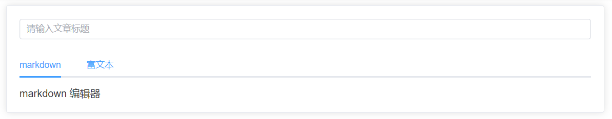

# 富文本和 markdown 之 创建文章

## 创建文章基本结构实现

完成 **创建文章** 的基本结构，主要分成三部分：

1. `article-create` 页面：基本结构
2. `Editor` 组件：富文本编辑器
3. `Markdown` 组件：`markdown` 编辑器

那么明确好了之后，我们就去进行对应的实现：

1. 创建 `views/article-create/components/Editor`
2. 创建 `views/article-create/components/Markdown`
3. 在 `views/article-create` 完成基本结构
   

```vue
<template>
  <div class="article-create">
    <el-card>
      <el-input
        class="title-input"
        :placeholder="$t('msg.article.titlePlaceholder')"
        v-model="title"
        maxlength="20"
        clearable
      >
      </el-input>

      <el-tabs v-model="activeName">
        <el-tab-pane :label="$t('msg.article.markdown')" name="markdown">
          <markdown></markdown>
        </el-tab-pane>
        <el-tab-pane :label="$t('msg.article.richText')" name="editor">
          <editor></editor>
        </el-tab-pane>
      </el-tabs>
    </el-card>
  </div>
</template>

<script setup>
import { ref } from "vue";
import markdown from "./components/markdown.vue";
import editor from "./components/editor.vue";

const title = ref(""); // 标题
const activeName = ref("markdown");
</script>

<style lang="scss" scoped>
.title-input {
  margin-bottom: 20px;
}
</style>
```

## 新建文章

选择了以下的编辑器库：

1. `markdown` 编辑器：[tui.editor](https://github.com/nhn/tui.editor)
2. 富文本编辑器：[wangEditor](https://github.com/wangeditor-team/wangEditor)

### markdown 基本实现

我们通过 [tui.editor](https://github.com/nhn/tui.editor) 实现 `markdown` 的编辑功能：

1. 下载 [tui.editor](https://github.com/nhn/tui.editor)

   ```
   npm i @toast-ui/editor@3.0.2
   ```

2. 渲染基本结构

```vue
<template>
  <div class="markdown-container">
    <!-- 渲染区 -->
    <div id="markdown-box"></div>

    <div class="bottom">
      <el-button type="primary" @click="onSubmitClick">{{
        $t("msg.article.commit")
      }}</el-button>
    </div>
  </div>
</template>

<script setup>
import {} from "vue";
</script>

<style lang="scss" scoped>
.markdown-container {
  .bottom {
    margin-top: 20px;
    text-align: right;
  }
}
</style>
```

3. 初始化 `editor` ，处理国际化内容

```vue
<script setup>
import MkEditor from "@toast-ui/editor";
import "@toast-ui/editor/dist/toastui-editor.css";
import "@toast-ui/editor/dist/i18n/zh-cn";
import { onMounted } from "vue";
import { useStore } from "vuex";

// Editor实例
let mkEditor;
// 处理离开页面切换语言导致 dom 无法被获取
let el;

// 要在 dom 挂载够获取 el 元素 , 并且把编辑器挂载到 指定dom 中 
onMounted(() => {
  el = document.querySelector("#markdown-box");
  initEditor();
});

const store = useStore();
const initEditor = () => { // 初始化编辑器实例的函数
  mkEditor = new MkEditor({  
    // el
    el: el,
    // 高度
    height: "500px",
    // 样式
    previewStyle: "vertical",
    // 国际化
    language: store.getters.language === "zh" ? "zh-CN" : "en",
  });
  mkEditor.getMarkdown();
};
</script>
```

4. 在语言改变时，重置 `editor`

解决办法 : 监听语言的变化, 用变量保存当前编辑器里面的内容, 销毁再重建编辑器, 把原来保存的变量赋值给新创建出的编辑器实例中
```js
...
import { watchSwitchLang } from "@/utils/i18n";
...
// 编辑器的国际化处理
// 问题: 问题在于, 切换语言功能无法同步, 刷新页面才生效
// 解决办法 : 监听语言的变化, 用变量保存当前编辑器里面的内容, 销毁再重建编辑器, 把原来保存的变量赋值给新创建出的编辑器实例中
watchSwitchLang(() => {
  if (!el) return
  const htmlStr = mkEditor.getHTML()
  mkEditor.destroy()
  initEditor()
  mkEditor.setHTML(htmlStr)
})
```
### markdown 文章提交
1. 在 `api/article.js` 中，定义创建文章接口

   ```js
   /**
    * 创建文章
    */
   export const createArticle = (data) => {
     return request({
       url: '/article/create',
       method: 'POST',
       data
     })
   }
   ```

2. 因为 `markdown` 或者是 `富文本` 最终都会处理提交文章事件，所以可以把这两件事情合并到一个模块中封装

3. 创建 `article-create/components/commit.js` 
```js
// 封装创建文章函数
// 因为在markdown 编辑器和 富文本编辑器中 都会 有创建文章 环节
import { ElMessage } from 'element-plus'
import { createArticle } from '@/api/article'
import i18n from '@/i18n'

const t = i18n.global.t

export const commitArticle = async (data) => {
  const res = await createArticle(data)
  ElMessage.success(t('msg.article.createSuccess'))
  return res
}
```
4. 在 `markdown.vue` 中导入该方法
```js
import { commitArticle } from './commit'
```
5. 触发按钮提交文章事件
```js
...
import { commitArticle } from './commit'
...
const props = defineProps({
  title: {
    type: String,
    required: true
  }
})
const emits = defineEmits(['onSuccess'])

...
// 点击提交文章
const onSubmitClick = async () => {
  await commitArticle({
    title: props.title,
    content: mkEditor.getHTML()
  })
  mkEditor.reset()  // 重置 编辑器
  emits('onSuccess') // 通知父亲把 title 置空
}
```
6. 通知父亲, 即 `article-create` 中传递 `title`的 title 置空，监听处理 `onSuccess` 事件
```js
<markdown :title="title" @onSuccess="onSuccess"></markdown>

// markdown 编辑器出来的事件 onSuccess
const onSuccess = () => {
  title.value = '' // 把 title 置空
}
```
### markdown 文章编辑
1. 在 `article-detail` 中点击编辑按钮，进入创建文章页面
```js
const router = useRouter()
const onEditClick = () => {
  router.push(`/article/editor/${articleId}`)
}
```
2. 在 `article-create` 中，处理 **编辑** 相关操作 (文章创建 和 文章编辑 使用的是同一个页面组件, 只是路径不同)
3. 获取当前文章数据
```js
...
import { useRoute } from 'vue-router'
import { articleDetail } from '@/api/article'

...
// 文章编辑相关
const route = useRoute()
const articleId = route.params.id
const detail = ref({}) // 当前文章详情
const getArticleDetail = async () => {
  const res = await articleDetail(articleId)
  detail.value = res
  title.value = res.title
}
if (articleId) {
  getArticleDetail()
}
```

4. 把获取到的数据传递给 `markdown` 组件
```html
 <markdown :title="title" @onSuccess="onSuccess" :detail="detail"></markdown>
```
5. 在 `markdown` 中接收该 detail 数据
```js
const props = defineProps({
  ...
  detail: {
    type: Object
  }
})
```
6. 并且**检测数据变化**，存在 `detail` 时，把 `detail` 赋值给 `mkEditor`, mkEditor.setHTML()
```js
watch(
  () => props.detail,
  (value) => {
    if (value && value.content) {
      mkEditor.setHTML(value.content) // 设置编辑器的内容
    }
  },
  { immediate: true }
)
```
7. 创建 **编辑文章** 接口
```js
/**
 * 编辑文章详情
 */
export const articleEdit = (data) => {
  return request({
    url: '/article/edit',
    method: 'POST',
    data
  })
}
```
8. 在 `commit.js` 中生成 **编辑文章** 方法
```js
import { ElMessage } from 'element-plus'
import { createArticle, articleEdit } from '@/api/article'
import i18n from '@/i18n'

const t = i18n.global.t

....

export const editArticle = async (data) => {
  const res = await articleEdit(data)
  ElMessage.success(t('msg.article.editorSuccess'))
  return res
}

```
9. 在 `markdown` 中处理提交按钮事件, 是否 创建文章/编辑文章 判断依据是什么 ? 是**存不存在** props.detail._i
```js
...
import { commitArticle, editArticle } from './commit'
...
...
// 点击提交文章
const onSubmitClick = async () => {
  if (props.detail && props.detail._id) {
    // 编辑文章
    await editArticle({
      id: props.detail._id,
      title: props.title,
      content: mkEditor.getHTML()
    })
  } else {
    // 创建文章
    await commitArticle({
      title: props.title,
      content: mkEditor.getHTML()
    })
    mkEditor.reset()
    emits('onSuccess') // 通知父亲把 title 置空
  }
}
```
###  富文本的实现
这节跟markdown做法思路一样

富文本要使用 [wangEditor](https://github.com/wangeditor-team/wangEditor)，所以先去下载 [wangEditor](https://github.com/wangeditor-team/wangEditor)

```shell
npm i wangeditor@4.7.6
```

安装完成之后，我们就去实现对应的代码逻辑：

1. 创建基本组件结构
```vue
<template>
  <div class="editor-container">
    <!--富文本-->
    <div id="editor-box"></div>

    <div class="bottom">
      <el-button type="primary" @click="onSubmitClick">{{
        $t('msg.article.commit')
      }}</el-button>
    </div>
  </div>
</template>
<style lang="scss" scoped>
.editor-container {
  .bottom {
    margin-top: 20px;
    text-align: right;
  }
}
</style>
```
2. 初始化 `wangEditor`
```vue
<script setup>
import E from 'wangeditor'
import { onMounted } from 'vue'

// Editor实例
let editor
// 处理离开页面切换语言导致 dom 无法被获取
let el
onMounted(() => {
  el = document.querySelector('#editor-box')
  initEditor()
})

const initEditor = () => {
  editor = new E(el)
  editor.config.zIndex = 1
  // 菜单栏提示
  editor.config.showMenuTooltips = true
  editor.config.menuTooltipPosition = 'down'
  editor.create()
}
</script>
```
3. wangEditor`  的 [国际化处理](https://www.wangeditor.com/doc/pages/12-%E5%A4%9A%E8%AF%AD%E8%A8%80/)，官网支持 [i18next](https://www.i18next.com/)，所以想要处理 `wangEditor` 的国际化，那么需要安装 [i18next](https://www.i18next.com/)

   ```shell
   npm i --save i18next@20.4.0
   ```

4. 对 `wangEditor` 进行国际化处理
```js{11-13}
...
import { useStore } from 'vuex'
import i18next from 'i18next'
...
const initEditor = () => {
  editor = new E(el)
  editor.config.zIndex = 1
  // 菜单栏提示
  editor.config.showMenuTooltips = true
  editor.config.menuTooltipPosition = 'down'
  
  // 国际化相关处理
  editor.config.lang = store.getters.language === 'zh' ? 'zh-CN' : 'en'
  editor.i18next = i18next

  editor.create()
}
```
2. 处理提交事件
```js
...
import { onMounted, defineProps, defineEmits } from 'vue'
import { commitArticle } from './commit'

const props = defineProps({
  title: {
    required: true,
    type: String
  }
})

const emits = defineEmits(['onSuccess'])
...
const onSubmitClick = async () => {
  // 创建文章
  await commitArticle({
    title: props.title,
    content: editor.txt.html()
  })

  editor.txt.html('')
  emits('onSuccess')
}
```
6. 不要忘记在 `article-create` 中处理对应事件
```html
<editor
    :title="title"
    :detail="detail"
    @onSuccess="onSuccess"
></editor>
```

7. 最后处理编辑路基 
```vue{50-66,12-14,17-27}
<script setup>
import E from 'wangeditor'
import { onMounted, defineProps, defineEmits, watch } from 'vue'
import { useStore } from 'vuex'
import i18next from 'i18next'
import { commitArticle, editArticle } from './commit'
const props = defineProps({
  title: {
    type: String,
    required: true
  },
  detail: {
    type: Object
  }
})
const emits = defineEmits(['onSuccess'])
watch(
  () => props.detail,
  (value) => {
    if (value && value.content) {
      editor.txt.html(value.content)
    }
  },
  {
    immediate: true
  }
)
const store = useStore()
// Editor实例
let editor
// 处理离开页面切换语言导致 dom 无法被获取
let el
onMounted(() => {
  el = document.querySelector('#editor-box')
  initEditor()
})

const initEditor = () => {
  editor = new E(el)
  editor.config.zIndex = 1
  // 菜单栏提示
  editor.config.showMenuTooltips = true
  editor.config.menuTooltipPosition = 'down'
  // 国际化相关处理
  editor.config.lang = store.getters.language === 'zh' ? 'zh-CN' : 'en'
  editor.i18next = i18next
  editor.create()
}

const onSubmitClick = async () => {
  if (props.detail && props.detail._id) {
    // 编辑文章
    await editArticle({
      id: props.detail_id,
      title: props.title,
      content: editor.txt.html() // 当前内容从编辑器直接获取
    })
  } else {
    // 创建文章
    await commitArticle({
      title: props.title,
      content: editor.txt.html()
    })
    editor.txt.html('')
    emits('onSuccess')
  }
}
</script>
```