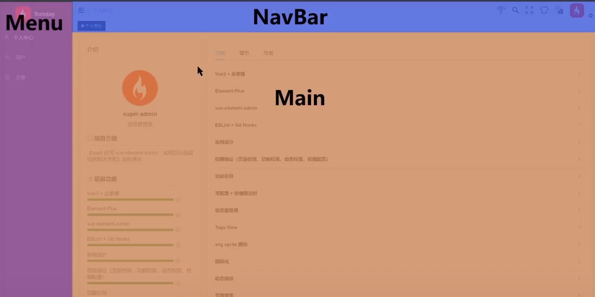
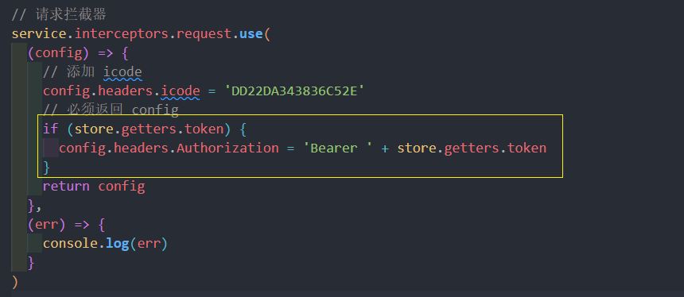
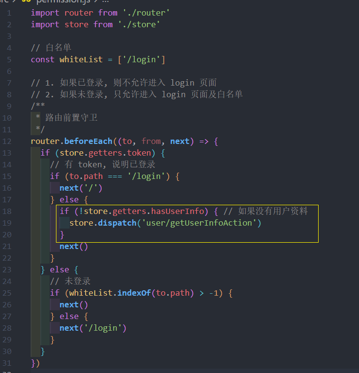
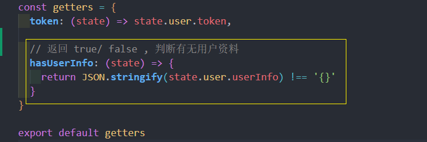
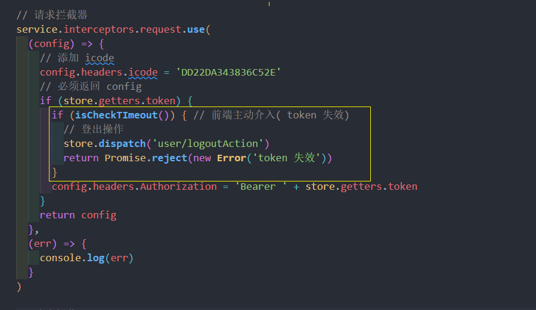
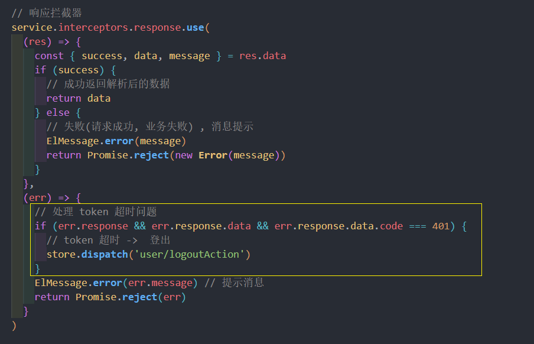
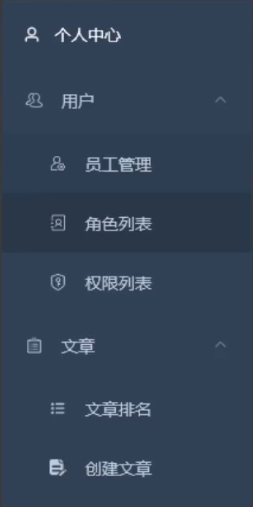

# 项目架构之搭建 Layout架构 解决方案与实现
## 前言
layout 页面分为了三个部分，分别是：

1. 左侧的 `Menu` 菜单
2. 顶部的 `NavBar`
3. 中间的内容区 `Main`

将会实现以下的核心解决方案：

1. 用户退出方案
2. 动态侧边栏方案
3. 动态面包屑方案

除了这些核心内容之外，还有一些其他的小功能，比如：

1. 退出的通用逻辑封装
2. 伸缩侧边栏动画
3. `vue3` 动画
4. 组件状态驱动的动态 `CSS` 值等等

等等

## 创建基于 Layout 的基础架构

我们知道，当登录完成之后，那么我们会进入到 `Layout` 页面，这个 `Layout` 页面组件位于 `Layout/index.vue` 中，所以说想要实现这样的结构，那么我们就需要到对应的 `layout` 组件中进行。

1. 整个页面分为三部分，所以我们需要先去创建对应的三个组件：

   1. `layout/components/Sidebar/index.vue`
   2. `layout/components/Navbar.vue`
   3. `layout/components/AppMain.vue`

2. 然后在 `layout/index.vue` 中引入这三个组件

   ```vue
   <script setup>
       import Navbar from './components/Navbar'
       import Sidebar from './components/Sidebar'
       import AppMain from './components/AppMain'
   </script>
   ```

3. 完成对应的布局结构

   ```vue
   <template>
     <div class="app-wrapper">
       <!-- 左侧 menu -->
       <sidebar
         id="guide-sidebar"
         class="sidebar-container"
       />
       <div class="main-container">
         <div class="fixed-header">
           <!-- 顶部的 navbar -->
           <navbar />
         </div>
         <!-- 内容区 -->
         <app-main />
       </div>
     </div>
   </template>
   ```

4. 在 `styles` 中创建如下 `css` 文件：

   1. `variables.module.scss` ： 定义常量
   2. `mixin.scss` ：定义通用的 `css`
   3. `sidebar.scss`：处理 `menu` 菜单的样式

5. 为 `variables.module.scss` ，定义如下常量并进行导出（ `:export` 可见 [scss 与 js 共享变量](https://www.bluematador.com/blog/how-to-share-variables-between-js-and-sass)）：

   ```scss
   // sidebar
   $menuText: #bfcbd9;
   $menuActiveText: #ffffff;
   $subMenuActiveText: #f4f4f5;
   
   $menuBg: #304156;
   $menuHover: #263445;
   
   $subMenuBg: #1f2d3d;
   $subMenuHover: #001528;
   
   $sideBarWidth: 210px;
   
   // https://www.bluematador.com/blog/how-to-share-variables-between-js-and-sass
   // JS 与 scss 共享变量，在 scss 中通过 :export 进行导出，在 js 中可通过 ESM 进行导入
   :export {
     menuText: $menuText;
     menuActiveText: $menuActiveText;
     subMenuActiveText: $subMenuActiveText;
     menuBg: $menuBg;
     menuHover: $menuHover;
     subMenuBg: $subMenuBg;
     subMenuHover: $subMenuHover;
     sideBarWidth: $sideBarWidth;
   }
   
   ```

6. 为 `mixin.scss` 定义如下样式：

   ```scss
   @mixin clearfix {
     &:after {
       content: '';
       display: table;
       clear: both;
     }
   }
   
   @mixin scrollBar {
     &::-webkit-scrollbar-track-piece {
       background: #d3dce6;
     }
   
     &::-webkit-scrollbar {
       width: 6px;
     }
   
     &::-webkit-scrollbar-thumb {
       background: #99a9bf;
       border-radius: 20px;
     }
   }
   
   @mixin relative {
     position: relative;
     width: 100%;
     height: 100%;
   }
   
   ```

7. 为 `sidebar.scss` 定义如下样式：

   ```scss
   #app {
     .main-container {
       min-height: 100%;
       transition: margin-left 0.28s;
       margin-left: $sideBarWidth;
       position: relative;
     }
   
     .sidebar-container {
       transition: width 0.28s;
       width: $sideBarWidth !important;
       height: 100%;
       position: fixed;
       top: 0;
       bottom: 0;
       left: 0;
       z-index: 1001;
       overflow: hidden;
   
       // 重置 element-plus 的css
       .horizontal-collapse-transition {
         transition: 0s width ease-in-out, 0s padding-left ease-in-out,
           0s padding-right ease-in-out;
       }
   
       .scrollbar-wrapper {
         overflow-x: hidden !important;
       }
   
       .el-scrollbar__bar.is-vertical {
         right: 0px;
       }
   
       .el-scrollbar {
         height: 100%;
       }
   
       &.has-logo {
         .el-scrollbar {
           height: calc(100% - 50px);
         }
       }
   
       .is-horizontal {
         display: none;
       }
   
       a {
         display: inline-block;
         width: 100%;
         overflow: hidden;
       }
   
       .svg-icon {
         margin-right: 16px;
       }
   
       .sub-el-icon {
         margin-right: 12px;
         margin-left: -2px;
       }
   
       .el-menu {
         border: none;
         height: 100%;
         width: 100% !important;
       }
   
       .is-active > .el-submenu__title {
         color: $subMenuActiveText !important;
       }
   
       & .nest-menu .el-submenu > .el-submenu__title,
       & .el-submenu .el-menu-item {
         min-width: $sideBarWidth !important;
       }
     }
   
     .hideSidebar {
       .sidebar-container {
         width: 54px !important;
       }
   
       .main-container {
         margin-left: 54px;
       }
   
       .submenu-title-noDropdown {
         padding: 0 !important;
         position: relative;
   
         .el-tooltip {
           padding: 0 !important;
   
           .svg-icon {
             margin-left: 20px;
           }
   
           .sub-el-icon {
             margin-left: 19px;
           }
         }
       }
   
       .el-submenu {
         overflow: hidden;
   
         & > .el-submenu__title {
           padding: 0 !important;
   
           .svg-icon {
             margin-left: 20px;
           }
   
           .sub-el-icon {
             margin-left: 19px;
           }
   
           .el-submenu__icon-arrow {
             display: none;
           }
         }
       }
   
       .el-menu--collapse {
         .el-submenu {
           & > .el-submenu__title {
             & > span {
               height: 0;
               width: 0;
               overflow: hidden;
               visibility: hidden;
               display: inline-block;
             }
           }
         }
       }
     }
   
     .el-menu--collapse .el-menu .el-submenu {
       min-width: $sideBarWidth !important;
     }
   
     .withoutAnimation {
       .main-container,
       .sidebar-container {
         transition: none;
       }
     }
   }
   
   .el-menu--vertical {
     & > .el-menu {
       .svg-icon {
         margin-right: 16px;
       }
       .sub-el-icon {
         margin-right: 12px;
         margin-left: -2px;
       }
     }
   
     // 菜单项过长时
     > .el-menu--popup {
       max-height: 100vh;
       overflow-y: auto;
   
       &::-webkit-scrollbar-track-piece {
         background: #d3dce6;
       }
   
       &::-webkit-scrollbar {
         width: 6px;
       }
   
       &::-webkit-scrollbar-thumb {
         background: #99a9bf;
         border-radius: 20px;
       }
     }
   }
   
   ```

8. 在 `index.scss` 中按照顺序导入以上样式文件

   ```scss
   @import './variables.module.scss';
   @import './mixin.scss';
   @import './sidebar.scss';
   ```

9. 在 `layout/index.vue` 中写入如下样式

   ```vue
   <style lang="scss" scoped>
   @import '~@/styles/mixin.scss';
   @import '~@/styles/variables.module.scss';
   
   .app-wrapper {
     @include clearfix;
     position: relative;
     height: 100%;
     width: 100%;
   }
   
   .fixed-header {
     position: fixed;
     top: 0;
     right: 0;
     z-index: 9;
     width: calc(100% - #{$sideBarWidth});
   }
   </style>
   ```

10. 因为将来要实现 **主题更换**，所以为 `sidebar` 赋值动态的背景颜色
```vue
<template>
...
    <!-- 左侧 menu -->
    <sidebar
      class="sidebar-container"
      :style="{ backgroundColor: variables.menuBg }"
    />
...
</template>

<script setup>
import variables from '@/styles/variables.module.scss'
</script>
```
11. 为 `Navbar`、`Sidebar`、`AppMain` 组件进行初始化代码
```vue
<template>
  <div>Navbar</div>
</template>
<script setup></script>
<style lang="scss" scoped></style>
```

12. 至此查看效果为

13. 可见 `Navbar` 与 `AppMain` 重叠
14. 为 `AppMain` 进行样式处理
```vue 
<template>
  <div class="组件名"></div>
</template>

<script setup>
import {} from 'vue'
</script>

<style lang="scss" scoped>
.app-main {
  /*浏览器可是区域 100vh*/
  min-height: calc(100vh - 50px);
  width: 100%;
  position: relative;
  overflow: hidden;
  padding: 61px 20px 20px 20px;
  box-sizing: border-box;
}
</style>
```

15. 查看效果


下一步去实现一下 `navbar` 中的功能操作

## 获取用户信息

接下来我们实现一下 `navbar` 中的 **头像菜单** 功能


这样的一个功能主要分为三个部分：

1. 获取并展示用户信息
2. `element-plus` 中的 `dropdown` 组件使用
3. 退出登录的方案实现

现在就实现第一部分的功能 **获取并展示用户信息**

**获取并展示用户信息** 我们把它分为三部分进行实现：

1. 定义接口请求方法
2. 定义调用接口的动作
3. 在**权限拦截时**触发动作

那么接下来我们就根据这三个步骤，分别来进行实现：

**定义接口请求方法：**

在 `api/sys.js` 中定义如下方法：
```js
// 获取用户信息
export function getUserInfo() {
  return request({
    method: 'GET',
    url: '/sys/profile'
  })
}
```
因为获取用户信息需要对应的 `token` ，所以我们可以利用 `axios` 的 **请求拦截器** 对 `token` 进行统一注入，在 `utils/request.js` 中写入如下代码：


**定义调用接口的动作：**

在 `store/modules/user` 中写入以下代码：
```js
import { login, getUserInfo } from '@/api/sys'
...
export default {
  namespaced: true,
  state() {
    return {
      ...
      userInfo: {}
    }
  },
  mutations: {
    ...
    setUserInfo(state, userInfo) {
      state.userInfo = userInfo
    }
  },
  actions: {
   ...
    async getUserInfoAction(context) {
      const res = await getUserInfo()
      console.log(res)
      context.commit('setUserInfo', res)
      return res
    }
  }
}
```

**在权限拦截时触发动作：**


但先在 `store/getters.js` 中写入判断是否有用户信息代码：



## 渲染用户头像菜单
到现在已经拿到了 **用户数据，并且在 `getters` 中做了对应的快捷访问** ，那么接下来我们就可以根据数据渲染出 **用户头像内容**

渲染用户头像，我们将使用到 `element-plus` 的两个组件：

1. `avatar`
2. `Dropdown`

在 `layout/components/navbar.js` 中实现以下代码
```vue
<template>
  <div class="navbar">
    <div class="right-menu">
      <!-- 头像 -->
      <el-dropdown class="avatar-container" trigger="click">
        <div class="avatar-wrapper">
          <el-avatar
            shape="square"
            :size="40"
            :src="$store.getters.userInfo.avatar"
          ></el-avatar>
          <el-icon><Tools /></el-icon>
        </div>
        <template #dropdown>
          <el-dropdown-menu class="user-dropdown">
            <router-link to="/">
              <el-dropdown-item> 首页 </el-dropdown-item>
            </router-link>
            <el-dropdown-item divided> 退出登录 </el-dropdown-item>
          </el-dropdown-menu>
        </template>
      </el-dropdown>
    </div>
  </div>
</template>
<script setup></script>
<style lang="scss" scoped>
.navbar {
  height: 50px;
  overflow: hidden;
  position: relative;
  background: #fff;
  box-shadow: 0 1px 4px rgba(0, 21, 41, 0.08);

  .right-menu {
    display: flex;
    align-items: center;
    float: right;
    padding-right: 16px;

    ::v-deep .avatar-container {
      cursor: pointer;
      .avatar-wrapper {
        margin-top: 5px;
        position: relative;
        .el-avatar {
          --el-avatar-background-color: none;
          margin-right: 12px;
        }
      }
    }
  }
}
</style>
```

## 退出登录方案实现
**退出登录** 一直是一个通用的前端实现方案，对于退出登录而言，它的触发时机一般有两种：

1. 用户**主动**退出
2. 用户**被动**退出

其中：

1. 主动退出指：用户点击登录按钮之后退出
2. 被动退出指：`token` 过期或 单用户登录(被其他人”顶下来“) 时退出

那么无论是什么退出方式，在用户退出时，所需要执行的操作都是固定的：

1. 清理掉当前用户缓存数据
2. 清理掉权限相关配置
3. 返回到登录页

那么明确好了对应的方案之后，接下来咱们就先来实现 **用户主动退出的对应策略**

### 用户主动退出解决方案
在 `store/modules/user.js` 中，添加对应 `action`

```js
 actions: {
    ...
    logoutAction(context) {
      context.commit('setToken', '')
      context.commit('setUserInfo', {})
      storage.clear()
      // TODO : 清理掉权限相关配置
      router.push('/login')
    }
  }
```

为退出登录按钮添加点击事件，触发 `logout` 的 `action`


完成了 **用户主动退出** 对应的实现

### 用户被动退出方案解析

在上面实现了 **用户主动退出** 场景，同时也提到 **用户被动退出** 的场景主要有两个：

1. `token` 失效
2. 单用户登录：其他人登录该账号被 “顶下来”

那么这两种场景下，在前端对应的处理方案一共也分为两种，共分为 **主动处理** 、**被动处理** 两种 ：

1. 主动处理：主要应对 `token` 失效
2. 被动处理：同时应对 `token` 失效 与 **单用户登录**

这两种方案基本上就覆盖了用户被动推出时的主要业务场景了

主要分析了 **用户被动退出** 的场景，那么从下面开始，分别来实现这两种处理方案
### 用户被动退出解决方案之 - 主动处理

有时效的，这个大家都知道。但是通常情况下，这个时效都是在服务端进行处理。而此时我们要在 **服务端处理 `token` 时效的同时，在前端主动介入 `token` 时效的处理**。 从而保证用户信息的更加安全性。

那么对应到我们代码中的实现方案为：

1. 在用户登陆时，记录当前 **登录时间**
2. 制定一个 **失效时长**
3. 在接口调用时，根据 **当前时间** 对比 **登录时间** ，看是否超过了 **时效时长**
   1. 如果未超过，则正常进行后续操作
   2. 如果超过，则进行 **退出登录** 操作

那么明确好了对应的方案之后，接下来就去实现对应代码

1. 创建 `utils/auth.js` 文件，并写入以下代码：
```js
import storage from './storage'
import { TIME_STAMP, TOKEN_TIMEOUT_VALUE } from '@/constant'

// 获取 时间戳
export function getTimeStamp() {
  return storage.getItem(TIME_STAMP)
}

// 设置时间戳
export function setTimeStamp() {
  storage.setItem(TIME_STAMP, Date.now())
}

// 判断是否超时 true / false
export function isCheckTImeout() {
  // 当前时间
  const currentTime = Date.now()
  // 之前存的 时间戳
  const timeStamp = storage.getItem(TIME_STAMP)

  return currentTime - timeStamp > TOKEN_TIMEOUT_VALUE
}
```
事先在 `constant` 中声明对应常量：


2. 在用户登录成功之后去**设置时间**，到 `store/user.js` 的 `login` 中：

```js
import { setTimeStamp } from '@/utils/auth'
...{16,17}
  actions: {
    loginAction(context, userInfo) {
      const { username, password } = userInfo
      return new Promise((resolve, reject) => {
        login({
          username,
          password: md5(password)
        })
          .then((res) => {
            context.commit('setToken', res.token)
            ElMessage.success('登录成功')
            // 登录后操作: 跳转
            router.push('/')
            // 设置登录时时间戳
            setTimeStamp()
            resolve()
          })
          .catch((err) => {
            reject(err)
          })
      })
    },
    ...
  }
```
3.  在 `utils/request` 对应的 **请求拦截器** 中进行 **主动介入**





至此就完成了 **主动处理**  token 失效的 业务逻辑

### 用户被动退出解决方案之 - 被动处理
在上面处理了 **用户被动退出时的 - 主动处理** ，那么在现去处理 **用户被动退出时的被动处理** 。

还是和上一小节一样，我们还是先明确背景，然后再来明确业务逻辑。

**背景：**

首先我们需要先明确 **被动处理** 需要应对两种业务场景：

1. `token` 过期
2. 单用户登录

然后我们一个一个来去看，首先是 `token` 过期

> 我们知道对于 `token` 而言，本身就是具备时效的，这个是在服务端生成 `token` 时就已经确定的。
>
> 而此时我们所谓的 `token` 过期指的就是：
>
> **服务端生成的 `token` 超过 服务端指定时效** 的过程

而对于 单用户登录 而言，指的是： 

> 当用户 A 登录之后，`token` 过期之前。
>
> 用户 A 的账号在其他的设备中进行了二次登录，导致第一次登录的 A 账号被 “顶下来” 的过程。
>
> 即：**同一账户仅可以在一个设备中保持在线状态**

那么明确好了对应的背景之后，接下来我们来看对应的业务处理场景：

从背景中我们知道，以上的两种情况，都是在 **服务端进行判断的**，而对于前端而言其实是 **服务端通知前端的一个过程。**

所以说对于其业务处理，将遵循以下逻辑：

1. 服务端返回数据时，会通过特定的状态码通知前端
2. 当前端接收到特定状态码时，表示遇到了特定状态：**`token` 时效** 或 **单用户登录**
3. 此时进行 **退出登录** 处理

但是这里需要注意，因为这次项目，**同一个账号需要在多个设备中使用**，所以这个项目没有指定 **单用户登录** 的状态码，仅有 **`token` 失效** 状态码。之后当需要到 **单用户登录** 时，只需要增加一个状态码判断即可

明确好了业务逻辑之后，接下来来实现对应代码：

在 `utils/request` 的 **响应拦截器** 中，增加以下逻辑：



那么至此，就已经完成了 **整个用户退出** 方案

## 创建页面组件，使用临时 menu 菜单
处理完了 **退出登录** 之后，接下来处理 **动态`menu`菜单**

这里先生成一个临时的 `menu` 菜单


1. 创建 `layout/Sidebar/SidebarMenu.vue` 文件
```vue
<template>
  <el-menu
    :uniqueOpened="true"
    default-active="2"
    background-color="#545c64"
    text-color="#fff"
    active-text-color="#ffd04b"
  >
    <el-menu-item index="1">
      <el-icon><setting /></el-icon>
      <span>导航 1</span>
    </el-menu-item>
    <el-menu-item index="2">
      <el-icon><document /></el-icon>
      <span>导航 2</span>
    </el-menu-item>
    <el-menu-item index="3">
      <el-icon><setting /></el-icon>
      <span>导航 3</span>
    </el-menu-item>
    <el-sub-menu index="4">
      <template #title>
        <el-icon><location /></el-icon>
        <span>导航4</span>
      </template>
      <el-menu-item index="4-1">导航 4 - 1</el-menu-item>
      <el-menu-item index="4-2">导航 4 - 2</el-menu-item>
    </el-sub-menu>
  </el-menu>
</template>
<script setup></script>
<style></style>
```
2. 在 `layout/Sidebar/index` 中导入该组件
```vue
<template>
  <div class="">
    <h1>占位</h1>
    <el-scrollbar>
      <sidebar-menu></sidebar-menu>
    </el-scrollbar>
  </div>
</template>
<script setup>
import SidebarMenu from './SidebarMenu.vue'
</script>
<style lang="scss" scoped></style>
```

至此生成了一个临时的 `menu` 菜单，从这个临时的 `menu` 菜单出可以看到，`el-menu` 其实分成了三个部分：

1. `el-menu`：整个 `menu` 菜单
2. `el-submenu`：子集 `menu` 菜单
3. `el-menu-item`：具体菜单项

那么明确好了这些内容之后，接下来就可以来去分析一下 **动态 `menu` 菜单如何生成**

## 动态 menu 菜单处理方案解析
上面处理了 **静态 `menu`**，那么接下来去处理 **动态 `menu` 菜单**

其实 **动态`menu`菜单** 其实主要是和 **动态路由表**  配合来去实现 **用户权限** 的

但是 **用户权限处理** 需要等到后面的章节中才可以接触到，因为咱们想要处理 **用户权限** 还需要先去处理很多的业务场景，所以在这里就先只处理 **动态`menu`菜单** 这一个概念

那么 **动态`menu`菜单** 指的到底是什么意思呢？

所谓 **动态`menu`菜单** 指的是：

> 根据路由表的配置，自动生成对应的 `menu` 菜单。
>
> 当路由表发生变化时，`menu` 菜单自动发生变化

那么明确了 **动态`menu`菜单** 的含义之后，接下来就需要来明确以下 **动态`menu`菜单** 的实现方案：

1. 定义 **路由表** 对应 **`menu` 菜单规则**
2. 根据规则制定 **路由表**
3. 根据规则，依据 **路由表** ，生成 **`menu` 菜单**

那么根据实现方案可以发现，实现 **动态`menu`菜单** 最核心的关键点其实就在步骤一，也就是 

> 定义 **路由表** 对应 **`menu` 菜单规则**

那么看一下，这个规则如何制定：

1. 对于单个路由规则而言（循环）：
   1. 如果`meta && meta.title && meta.icon` ：则显示在 `menu` 菜单中，其中 `title` 为显示的内容，`icon` 为显示的图标
      1. 如果存在 `children` ：则以 `el-sub-menu（子菜单）` 展示
      2. 否则：则以 `el-menu-item（菜单项）` 展示
   2. 否则：不显示在 `menu` 菜单中

那么明确好了对应的规则之后，接下来看一下如何进行实现

### 生成项目页面组件
想要完成动态的 `menu`，那么我们需要按照以下的步骤来去实现：

1. 创建页面组件
2. 生成路由表
3. 解析路由表
4. 生成 `menu` 菜单

那么明确好了步骤之后，就先来实现第一步

**创建页面组件**

在 `views` 文件夹下，创建如下页面：

1. 创建文章：`article-create`
2. 文章详情：`article-detail`
3. 文章排名：`article-ranking`
4. 错误页面：`error-page`
   1. `404`
   2. `401`
5. 导入：`import`
6. 权限列表：`permission-list`
7. 个人中心：`profile`
8. 角色列表：`role-list`
9. 用户信息：`user-info`
10. 用户管理：`user-manage`

### 创建结构路由表
想要实现结构路由表，那么我们需要先知道最终我们要实现的结构是什么样子的



这是最终要实现的 `menu` 截图

根据此截图，可以知道两点内容：

1. 之前创建的页面**并没有全部**进行展示
   1. 根据该方案
  
   2. 即不显示页面 **不满足** 该条件 `meta && meta.title && meta.icon`
2. menu` 菜单将具备父子级的结构
   1. 按照此结构规划数据，则数据应为
```js
  [
    {
        "title": "个人中心",
        "path": ""
    },
    {
        "title": "用户",
        "children": [
            {
                "title": "员工管理",
                "path": ""
            },
            {
                "title": "角色列表",
                "path": ""
            },
            {
                "title": "权限列表",
                "path": ""
            }
        ]
    },
    {
        "title": "文章",
        "children": [
            {
                "title": "文章排名",
                "path": ""
            },
            {
                "title": "创建文章",
                "path": ""
            }
        ]
    }
]
```

又因为将来我们需要进行 **用户权限处理** ，所以此时我们需要先对路由表进行一个划分：

1. **私有路由表 `privateRoutes`** ：权限路由
2. **公有路由表 `publicRoutes`**：无权限路由

根据以上理论，生成以下路由表结构：

```js
import { createRouter, createWebHashHistory } from 'vue-router'
import Layout from '@/layout'

// 私有路由表
const privateRoutes = [
  {
    path: '/user',
    component: Layout,
    redirect: '/user/manage',
    meta: {
      title: 'user',
      icon: 'user'
    },
    children: [
      {
        path: '/user/manege',
        name: 'userManage',
        component: () => import('@/views/user-manage/index.vue'),
        meta: {
          title: 'userManage',
          icon: 'memo'
        }
      },
      {
        path: '/user/role',
        name: 'userRole',
        component: () => import('@/views/role-list/index.vue'),
        meta: {
          title: 'roleList',
          icon: 'user'
        }
      },
      {
        path: '/user/permission',
        name: 'userPermission',
        component: () => import('@/views/permission-list/index.vue'),
        meta: {
          title: 'userPermission',
          icon: 'finished'
        }
      },
      {
        path: '/user/info/:id',
        component: () => import('@/views/user-info/index.vue'),
        meta: {
          title: 'userInfo'
        }
      },
      {
        path: '/user/import',
        name: 'userImport',
        component: () => import('@/views/import/index.vue'),
        meta: {
          title: 'excelImport'
        }
      }
    ]
  },
  {
    path: '/article',
    component: Layout,
    meta: {
      title: 'article',
      icon: 'document'
    },
    children: [
      {
        path: '/article/ranking',
        name: 'articleRanking',
        component: () => import('@/views/article-ranking/index.vue'),
        meta: {
          title: 'article-ranking',
          icon: 'document'
        }
      },
      {
        path: '/article/create',
        name: 'articleCreate',
        component: () => import('@/views/article-create/index.vue'),
        meta: {
          title: 'articleCreate',
          icon: 'documentAdd'
        }
      },
      {
        path: '/article/editor/:id',
        component: () => import('@/views/article-create/index.vue'),
        meta: {
          title: 'articleEditor'
        }
      },
      {
        path: '/article/:id',
        component: () => import('@/views/article-detail/index.vue'),
        meta: {
          title: 'articleDetail'
        }
      }
    ]
  }
]

// 公开路由表
const publicRoutes = [
  {
    path: '/login',
    name: 'login',
    component: () => import('@/views/login/index.vue')
  },
  {
    path: '/',
    name: 'layout',
    component: Layout,
    children: [
      {
        path: '/profile',
        name: 'profile',
        component: () => import('@/views/profile/index.vue'),
        meta: {
          title: 'profile',
          icon: 'user'
        }
      }
    ]
  },
  {
    path: '/404',
    name: '404',
    component: () => import('@/views/error-page/404.vue')
  },
  {
    path: '/401',
    name: '401',
    component: () => import('@/views/error-page/401.vue')
  }
]

const router = createRouter({
  history: createWebHashHistory(),
  routes: [...publicRoutes, ...privateRoutes]
})

export default router
```

最后不要忘记在 `layout/appMain` 下设置路由出口

```vue
<template>
  <div class="app-main">
    <router-view></router-view>
  </div>
</template>
```
### 解析路由表, 获取结构化数据

获取到之前明确的结构化数据：

想要获取路由表数据，那么有两种方式：

1. [router.options.routes](https://next.router.vuejs.org/zh/api/#routes)：初始路由列表（[新增的路由](https://next.router.vuejs.org/zh/api/#addroute) 无法获取到）
2. [router.getRoutes()](https://next.router.vuejs.org/zh/api/#getroutes)：获取所有 [路由记录](https://next.router.vuejs.org/zh/api/#routerecord) 的完整列表

所以，我们此时使用 [router.getRoutes()](https://next.router.vuejs.org/zh/api/#getroutes) 

在 `layout/components/Sidebar/SidebarMenu` 下写入以下代码：

```vue
<script setup>
import { useRouter } from 'vue-router'

const router = useRouter()
console.log(router.getRoutes())
</script>
```

得到返回的数据：


从返回的数据来看，它与我们想要的数据结构相去甚远。

出现这个问题的原因，是因为它返回的是一个 **完整的路由表**

这个路由表距离我们想要的存在两个问题：

1. 存在重复的路由数据
2. 不满足该条件 `meta && meta.title && meta.icon` 的数据不应该存在

那么接下来我们就应该来处理这两个问题

创建 `utils/route` 文件，创建两个方法分别处理对应的两个问题：

1. `filterRouters`
2. `generateMenus`

写入以下代码：

```js
import path from 'path'

/**
 * 返回所有子路由
 */
const getChildrenRoutes = routes => {
  const result = []
  routes.forEach(route => {
    if (route.children && route.children.length > 0) {
      result.push(...route.children)
    }
  })
  return result
}
/**
 * 处理脱离层级的路由：某个一级路由为其他子路由，则剔除该一级路由，保留路由层级
 * @param {*} routes router.getRoutes()
 */
export const filterRouters = routes => {
  const childrenRoutes = getChildrenRoutes(routes)
  return routes.filter(route => {
    return !childrenRoutes.find(childrenRoute => {
      return childrenRoute.path === route.path
    })
  })
}

/**
 * 判断数据是否为空值
 */
function isNull(data) {
  if (!data) return true
  if (JSON.stringify(data) === '{}') return true
  if (JSON.stringify(data) === '[]') return true
  return false
}
/**
 * 根据 routes 数据，返回对应 menu 规则数组
 */
export function generateMenus(routes, basePath = '') {
  const result = []
  // 遍历路由表
  routes.forEach(item => {
    // 不存在 children && 不存在 meta 直接 return
    if (isNull(item.meta) && isNull(item.children)) return
    // 存在 children 不存在 meta，进入迭代
    if (isNull(item.meta) && !isNull(item.children)) {
      result.push(...generateMenus(item.children))
      return
    }
    // 合并 path 作为跳转路径
    const routePath = path.resolve(basePath, item.path)
    // 路由分离之后，存在同名父路由的情况，需要单独处理
    let route = result.find(item => item.path === routePath)
    if (!route) {
      route = {
        ...item,
        path: routePath,
        children: []
      }

      // icon 与 title 必须全部存在
      if (route.meta.icon && route.meta.title) {
        // meta 存在生成 route 对象，放入 arr
        result.push(route)
      }
    }

    // 存在 children 进入迭代到children
    if (item.children) {
      route.children.push(...generateMenus(item.children, route.path))
    }
  })
  return result
}
```
在 `SidebarMenu` 中调用该方法

```vue
<script setup>
import { computed } from 'vue'
import { useRouter } from 'vue-router'
import { filterRouters, generateMenus } from '@/utils/route'

const router = useRouter()
    const routes = computed(() => {
      const filterRoutes = filterRouters(router.getRoutes())
      return generateMenus(filterRoutes)
    })
    console.log(JSON.stringify(routes.value))
</script>
```

会得到该数据结构
```js
[
    {
        "path":"/profile",
        "name":"profile",
        "meta":{
            "title":"profile",
            "icon":"el-icon-user"
        },
    },
    {
        "path":"/user",
        "redirect":"/user/manage",
        "meta":{
            "title":"user",
            "icon":"personnel"
        },
        "props":{
            "default":false
        },
        "children":[
            {
                "path":"/user/manage",
                "name":"userManage",
                "meta":{
                    "title":"userManage",
                    "icon":"personnel-manage"
                },
                "children":[

                ]
            },
            {
                "path":"/user/role",
                "name":"userRole",
                "meta":{
                    "title":"roleList",
                    "icon":"role"
                },
                "children":[

                ]
            },
            {
                "path":"/user/permission",
                "name":"userPermission",
                "meta":{
                    "title":"permissionList",
                    "icon":"permission"
                },
                "children":[

                ]
            }
        ],
    },
    {
        "path":"/article",
        "redirect":"/article/ranking",
        "meta":{
            "title":"article",
            "icon":"article"
        },
        "props":{
            "default":false
        },
        "children":[
            {
                "path":"/article/ranking",
                "name":"articleRanking",
                "meta":{
                    "title":"articleRanking",
                    "icon":"article-ranking"
                },
                "children":[

                ]
            },
            {
                "path":"/article/create",
                "name":"articleCreate",
                "meta":{
                    "title":"articleCreate",
                    "icon":"article-create"
                },
                "children":[

                ]
            }
        ],
    }
]
```

### 生成动态 menu 菜单
computed 计算属性分一下对应的菜单 : 有 children 的菜单, 没有 children 的菜单
```vue
<script setup>
import { useRouter } from 'vue-router'
import { computed } from 'vue'
import { filterRouters, generateMenus } from '@/utils/route'

const router = useRouter()
const routes = computed(() => {
  const fRoutes = filterRouters(router.getRoutes())
  return generateMenus(fRoutes)
})

// 没有子菜单的路由
const noChildrenRoutes = computed(() => {
  return routes.value.filter((route) => JSON.stringify(route.children) === '[]')
})
// 有子菜单的路由
const hasChildrenRoutes = computed(() => {
  return routes.value.filter((route) => JSON.stringify(route.children) !== '[]')
})
</script>
```

模板遍历对应类型的菜单

```vue
<template>
  <el-menu
    :uniqueOpened="true"
    default-active="2"
    background-color="#545c64"
    text-color="#fff"
    active-text-color="#ffd04b"
  >
    <!--没有子菜单的路由-->
    <template v-for="item in noChildrenRoutes" :key="item.path">
      <el-menu-item :index="item.path">
        <el-icon>
          <component :is="item.meta.icon" />
        </el-icon>
        <span>{{ item.meta.title }}</span>
      </el-menu-item>
    </template>
    <!--有子菜单的路由-->
    <template v-for="item in hasChildrenRoutes" :key="item.path">
      <el-sub-menu :index="item.path">
        <template #title>
          <el-icon>
            <component :is="item.meta.icon" />
          </el-icon>
          <span>{{ item.meta.title }}</span>
        </template>
        <el-menu-item
          v-for="child in item.children"
          :key="child.path"
          :index="child.path"
        >
          <el-icon>
            <component :is="child.meta.icon" />
          </el-icon>
          <span>{{ child.meta.title }}</span>
        </el-menu-item>
      </el-sub-menu>
    </template>
  </el-menu>
</template>
```
### 修复最后残余问题
目前 `menu` 菜单存在三个问题

1. 样式问题
2. 路由跳转问题
3. 默认激活项

**样式问题：**

首先处理样式，因为后面我们需要处理 **主题替换** ，所以此处我们不能把样式写死

在 `store/getters` 中创建一个新的 **快捷访问**
```js
import variables from '@/styles/variables.module.scss'
const getters = {
  ...
  cssVar: state => variables
}

export default getters
```
在 `SidebarMenu` 中写入如下样式


**路由跳转问题：**


**默认激活项：**

根据当前 `url` 进行判断即可
```vue{4}
<template>
  <el-menu
    :uniqueOpened="true"
    :default-active="activeMenu"
    :background-color="$store.getters.cssVar.menuBg"
    :text-color="$store.getters.cssVar.menuText"
    :active-text-color="$store.getters.cssVar.menuActiveText"
    router
  >
  ...
</template>

<script setup>
import { useRouter, useRoute } from 'vue-router'
import { computed } from 'vue'
....

// 当前路由激活项
const route = useRoute()
const activeMenu = computed(() => {
  return route.path
})
</script>
```

至此整个 **动态`menu`完成**
## 动画逻辑，左侧菜单伸缩功能实现
样式的改变总是由数据进行驱动，所以首先去创建对应的数据

创建 `store/app` 模块，写入如下代码

```js
export default {
  namespaced: true,
  state: () => ({
    sidebarOpened: true
  }),
  mutations: {
    triggerSidebarOpened(state) {
      state.sidebarOpened = !state.sidebarOpened
    }
  },
  actions: {}
}

```

在 `store/index` 中进行导入

```js
...
import app from './modules/app'
export default createStore({
  getters,
  modules: {
    ...
    app
  }
})
```

在 `store/getters` 中创建快捷访问

```js
sidebarOpened: state => state.app.sidebarOpened
```

创建 `components/hamburger` 组件，用来控制数据

```vue
<template>
  <div class="hamburger-container" @click="toggleClick">
    <svg-icon class="hamburger" :icon="icon"></svg-icon>
  </div>
</template>

<script setup>
import { computed } from 'vue'
import { useStore } from 'vuex'

const store = useStore()
const toggleClick = () => {
  store.commit('app/triggerSidebarOpened')
}

const icon = computed(() =>
  store.getters.sidebarOpened ? 'hamburger-opened' : 'hamburger-closed'
)
</script>

<style lang="scss" scoped>
.hamburger-container {
  padding: 0 16px;
  .hamburger {
    display: inline-block;
    vertical-align: middle;
    width: 20px;
    height: 20px;
  }
}
</style>
```

在 `navbar` 中使用该组件

```vue
<template>
  <div class="navbar">
    <hamburger class="hamburger-container" />
    ...
  </div>
</template>

<script setup>
import Hamburger from '@/components/Hamburger'
...
</script>

<style lang="scss" scoped>
.navbar {
  ...

  .hamburger-container {
    line-height: 46px;
    height: 100%;
    float: left;
    cursor: pointer;
    // hover 动画
    transition: background 0.5s;

    &:hover {
      background: rgba(0, 0, 0, 0.1);
    }
  }

 ...
}
</style>

```

在 `SidebarMenu` 中，控制 `el-menu` 的 [collapse](https://element-plus.org/#/zh-CN/component/menu) 属性

```vue
<el-menu
    :collapse="!$store.getters.sidebarOpened"
    ...
```

在 `layout/index` 中指定 **整个侧边栏的宽度和缩放动画**

```vue
<div
    class="app-wrapper"
    :class="[$store.getters.sidebarOpened ? 'openSidebar' : 'hideSidebar']"
  >
  ...
```

在 `layout/index` 中 处理 `navbar` 的宽度

```vue
<style lang="scss" scoped>
...

.fixed-header {
  position: fixed;
  top: 0;
  right: 0;
  z-index: 9;
  width: calc(100% - #{$sideBarWidth});
  transition: width 0.28s;
}

.hideSidebar .fixed-header {
  width: calc(100% - #{$hideSideBarWidth});
}
</style>
```

在 `styles/variables.scss` 中指定 `hideSideBarWidth`

```scss
$hideSideBarWidth: 54px;
```

## SidebarHeader 处理
layout/components/Sidebar/index.vue
```
<template>
  <div class="">
    <div class="title">
      <router-link to="/profile">
        <h3>Vue3-admin</h3>
      </router-link>
    </div>
    <el-scrollbar>
      <sidebar-menu></sidebar-menu>
    </el-scrollbar>
  </div>
</template>
<script setup>
import SidebarMenu from './SidebarMenu.vue'
</script>
<style lang="scss" scoped>
.title{
  padding:20px;
  text-align:center;
  color:white;
  cursor:pointer;
}
</style>
```
## 全新 vue 能力：组件状态驱动的动态 CSS 值
在 [vue 3.2](https://blog.vuejs.org/posts/vue-3.2.html) 最新更新中，除了之前的 **响应式变化** 之外，还有另外一个很重要的更新，那就是 **组件状态驱动的动态 `CSS` 值** ，对应的文档也已经公布，大家可以 [点击这里](https://v3.vuejs.org/api/sfc-style.html#state-driven-dynamic-css) 查看

那么下面就使用下最新的特性，来为 `logo-container` 指定下高度：
```vue
<template>
 ...
<div class="logo-container"></div>
 ...

</template>

<script setup>
...
const logoHeight = 44
</script>

<style lang="scss" scoped>
.logo-container {
  height: v-bind(logoHeight) + 'px';
...
}
</style>
```

## 动态面包屑方案分析
到目前位置，最后一个功能就是 **面包屑导航**，分为：

1. 静态面包屑
2. 动态面包屑

**静态面包屑：**

指的是：**在每个页面中写死对应的面包屑菜单**，缺点也很明显：

1. 每个页面都得写一遍
2. 页面路径结构变化了，得手动更改

简单来说就是 **不好维护，不好扩展** 。

**动态面包屑：**

**根据当前的 `url` 自动生成面包屑导航菜单**

无论之后路径发生了什么变化，**动态面包屑** 都会正确的进行计算

那么在后面的实现过程中，将会分成三大步来实现

1. 创建、渲染基本的面包屑组件
2. 计算面包屑结构数据
3. 根据数据渲染动态面包屑内容
### 渲染基本的面包屑组件
完成第一步，先去创建并渲染出基本的 [面包屑](https://element-plus.org/#/zh-CN/component/breadcrumb) 组件

创建 `components/Breadcrumb/index`，并写入如下代码：

```vue
<template>
  <el-breadcrumb class="breadcrumb" separator="/">
    <el-breadcrumb-item :to="{ path: '/' }">首页</el-breadcrumb-item>
    <el-breadcrumb-item><a href="/">活动管理</a></el-breadcrumb-item>
    <el-breadcrumb-item>活动列表</el-breadcrumb-item>
    <!-- 面包屑的最后一项 -->
    <el-breadcrumb-item>
      <span class="no-redirect">活动详情</span>
    </el-breadcrumb-item>
  </el-breadcrumb>
</template>

<script setup>
import {} from 'vue'
</script>

<style lang="scss" scoped>
.breadcrumb {
  display: inline-block;
  font-size: 14px;
  line-height: 50px;
  margin-left: 8px;

  ::v-deep .no-redirect {
    color: #97a8be;
    cursor: text;
  }
}
</style>

```

在 `layout/components/Navbar` 组件下导入

```vue
<template>
  <div class="navbar">
    <hamburger class="hamburger-container" />
    <breadcrumb class="breadcrumb-container" />
	...
  </div>
</template>
...

<style lang="scss" scoped>
.navbar {
 ...

  .breadcrumb-container {
    float: left;
  }
   ...
}
</style>
```
### 动态计算面包屑结构数据
现在我们是完成了一个静态的 面包屑，接下来咱们就需要依托这个静态的菜单来完成动态的。

对于现在的静态面包屑来说，他分成了两个组件：

1. `el-breadcrumb`：包裹性质的容器
2. `el-breadcrumb-item`：每个单独项

如果我们想要完成动态的，那么就需要 **依据动态数据，渲染 `el-breadcrumb-item` **

所以说接下来我们需要做的事情就很简单了

1. 动态数据
2. 渲染 `el-breadcrumb-item`

那么这一小节咱们先来看 **动态数据如何制作**

我们希望可以制作出一个 **数组**，数组中每个 `item` 都表示一个 **路由信息**：

创建一个方法，用来生成数组数据，在这里我们要使用到 [route.match](https://next.router.vuejs.org/zh/api/#matched) 属性来：**获取与给定路由地址匹配的[标准化的路由记录](https://next.router.vuejs.org/zh/api/#routerecord)数组**


###  vue3 动画处理
vue3对 [动画](https://v3.cn.vuejs.org/guide/transitions-overview.html#%E5%9F%BA%E4%BA%8E-class-%E7%9A%84%E5%8A%A8%E7%94%BB%E5%92%8C%E8%BF%87%E6%B8%A1) 进行了一些修改（[vue 动画迁移文档](https://v3.cn.vuejs.org/guide/migration/transition.html#%E6%A6%82%E8%A7%88)）

主要的修改其实只有两个：

1. 过渡类名 `v-enter` 修改为 `v-enter-from`
2. 过渡类名 `v-leave` 修改为 `v-leave-from`

那么依据修改之后的动画，我们来为面包屑增加一些动画样式：

1. 在 `Breadcrumb/index` 中增加 `transition-group`

```vue
   <template>
     <el-breadcrumb class="breadcrumb" separator="/">
       <transition-group name="breadcrumb">
         ...
       </transition-group>
     </el-breadcrumb>
   </template>
```

2. 新建 `styles/transition` 样式文件
```scss
.breadcrumb-enter-active,
.breadcrumb-leave-active{
  transition: all 0.3s ease;
}

.breadcrumb-enter-from {
  transform: translateX(20px);
  opacity:0;
}
.breadcrumb-leave-to {
  transform: translateX(-20px);
  opacity:0;
}
.breadcrumb-leave-active {
  position: absolute;
}
```

3. 在 `styles/index` 中导入

```scss
@import './transition.scss';
```

## 总结
围绕着`layout` 为核心，主要实现了三个大的业务方案：

1. 用户退出方案
2. 动态侧边栏方案
3. 动态面包屑方案

除了这三块大的方案之后，还有一些小的功能，比如：

1. 退出的通用逻辑封装
2. 伸缩侧边栏动画
3. `vue3` 动画
4. 组件状态驱动的动态 `CSS` 值等等
   


