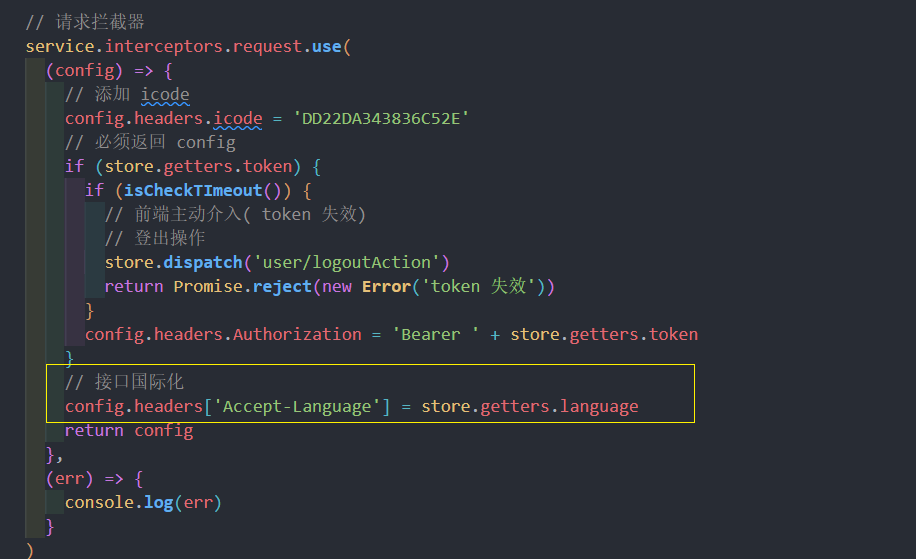

# vue3+ElementPlus 基础模块实现
## 个人中心模块基本布局
整个 **个人中心** 被分为左右两大块：

1. 项目介绍
2. `tabs`
   1. 功能
   2. 章节
   3. 作者

根据功能划分，整个项目应该包含 4 个组件，分别对应着 4 个功能。

所以，我们想要完成 **个人中心模块基本布局** 那么就需要先创建出这四个组件

1. 在 `views/profile/components` 下创建 **项目介绍** 组件 `ProjectCard`
2. 在 `views/profile/components` 下创建 **功能** 组件 `feature`
3. 在 `views/profile/components` 下创建 **章节** 组件 `chapter`
4. 在 `views/profile/components` 下创建 **作者** 组件 `author`
5. 进入到 `views/profile/index` 页面，绘制基本布局结构

```vue
<template>
  <div class="profile">
    <el-row>
      <el-col :span="8">
        <project-card class="project-card" />
      </el-col>
      <el-col :span="16">
        <el-tabs v-model="activeName" class="demo-tabs">
          <el-tab-pane :label="$t('msg.profile.feature')" name="feature"
            ><feature
          /></el-tab-pane>
          <el-tab-pane :label="$t('msg.profile.chapter')" name="chapter"
            ><Chapter
          /></el-tab-pane>
          <el-tab-pane :label="$t('msg.profile.author')" name="author"
            ><author
          /></el-tab-pane>
        </el-tabs>
      </el-col>
    </el-row>
  </div>
</template>

<script setup>
import { ref } from 'vue'
import Author from './components/Author.vue'
import ProjectCard from './components/ProjectCard.vue'
import Feature from './components/Feature.vue'
import Chapter from './components/Chapter.vue'

const activeName = ref('feature')
</script>

<style lang="scss" scoped>
.project-card {
  margin-right: 30px;
}
</style>
```

## 创建 PanThumb 头像组件
在 **项目介绍** 模块中，存在一个头像：**鼠标移入之后，头像会移开，显示出后面的文本*
1.创建 `components/PanThumb/index`
```vue
<template>
  <div
    :style="{ zIndex: zIndex, height: height, width: width }"
    class="pan-item"
  >
    <div class="pan-info">
      <div class="pan-info-roles-container">
        <slot />
      </div>
    </div>
    <div :style="{ backgroundImage: `url(${image})` }" class="pan-thumb"></div>
  </div>
</template>

<script setup>
import { defineProps } from 'vue'
defineProps({
  image: {
    type: String
  },
  zIndex: {
    type: Number,
    default: 1
  },
  width: {
    type: String,
    default: '150px'
  },
  height: {
    type: String,
    default: '150px'
  }
})
</script>

<style scoped>
.pan-item {
  width: 200px;
  height: 200px;
  border-radius: 50%;
  display: inline-block;
  position: relative;
  cursor: pointer;
  box-shadow: 0 1px 3px rgba(0, 0, 0, 0.2);

  .pan-info {
    position: absolute;
    width: inherit;
    height: inherit;
    border-radius: 50%;
    overflow: hidden;
    box-shadow: inset 0 0 0 5px rgba(0, 0, 0, 0.05);

    h3 {
      color: #fff;
      text-transform: uppercase;
      position: relative;
      letter-spacing: 2px;
      font-size: 14px;
      margin: 0 60px;
      padding: 22px 0 0 0;
      height: 85px;
      font-family: 'Open Sans', Arial, sans-serif;
      text-shadow: 0 0 1px #fff, 0 1px 2px rgba(0, 0, 0, 0.3);
    }

    p {
      color: #fff;
      padding: 10px 5px;
      font-style: italic;
      margin: 0 30px;
      font-size: 12px;
      border-top: 1px solid rgba(255, 255, 255, 0.5);

      a {
        display: block;
        color: #333;
        width: 80px;
        height: 80px;
        background: rgba(255, 255, 255, 0.3);
        border-radius: 50%;
        color: #fff;
        font-style: normal;
        font-weight: 700;
        text-transform: uppercase;
        font-size: 9px;
        letter-spacing: 1px;
        padding-top: 24px;
        margin: 7px auto 0;
        font-family: 'Open Sans', Arial, sans-serif;
        opacity: 0;
        transition: transform 0.3s ease-in-out 0.2s,
          opacity 0.3s ease-in-out 0.2s, background 0.2s linear 0s;
        transform: translateX(60px) rotate(90deg);
      }

      a:hover {
        background: rgba(255, 255, 255, 0.5);
      }
    }

    .pan-info-roles-container {
      padding: 20px;
      text-align: center;
    }
  }

  .pan-thumb {
    width: 100%;
    height: 100%;
    background-position: center center;
    background-size: cover;
    border-radius: 50%;
    overflow: hidden;
    position: absolute;
    transform-origin: 95% 40%;
    transition: all 0.3s ease-in-out;
  }

  .pan-item:hover .pan-thumb {
    transform: rotate(-110deg);
  }

  .pan-item:hover .pan-info p a {
    opacity: 1;
    transform: translateX(0px) rotate(0deg);
  }
}
</style>
```
## 项目介绍模块开发
项目介绍从上到下可以分为三部分：

1. 头像区域
2. 项目介绍
3. 项目功能

对于这三块的数据而言，前面两个是直接在前端写死的，**项目功能** 是从服务端获取到的。

对于前端写死部分，已经在之前定义到了 `i18n/lang` 之下

而对于从服务端获取部分，就需要单独定义上接口了：

1. 创建 `api/user` 模块

   ```js
   import request from '@/utils/request'
   
   export const feature = () => {
     return request({
       url: '/user/feature'
     })
   }
   
   
   ```

2. 因为该数据会同时在 `ProjectCard` 和 `Feature` 组件中使用，所以我们可以在 `profile` 中调用该接口获取数据，然后再把数据分别传入到两个子级组件中

   ```js
   import { feature } from '@/api/user'
   
   const featureData = ref([])
   const getFeatureData = async () => {
     featureData.value = await feature()
   }
   getFeatureData()
   ```

3. 传递数据到 `ProjectCard`

   ```html
   <project-card class="user-card" :features="featureData"></project-card>
   
   ```

有了数据之后，接下来完成 **项目介绍** 模块
```vue
<template>
  <el-card class="user-container">
    <template #header>
      <div class="header">
        <span>{{ $t('msg.profile.introduce') }}</span>
      </div>
    </template>

    <div class="user-profile">
      <!-- 头像 -->
      <div class="box-center">
        <pan-thumb
          :image="$store.getters.userInfo.avatar"
          :height="'100px'"
          :width="'100px'"
          :hoverable="false"
        >
          <div>Hello</div>
          {{ $store.getters.userInfo.title }}
        </pan-thumb>
      </div>
      <!-- 姓名 && 角色 -->
      <div class="box-center">
        <div class="user-name text-center">
          {{ $store.getters.userInfo.username }}
        </div>
        <div class="user-role text-center text-muted">
          {{ $store.getters.userInfo.title }}
        </div>
      </div>
    </div>
    <!-- 简介 -->
    <div class="project-bio">
      <div class="project-bio-section">
        <div class="project-bio-section-header">
          <el-icon><Document /></el-icon>
          <span>{{ $t('msg.profile.projectIntroduction') }}</span>
        </div>
        <div class="project-bio-section-body">
          <div class="text-muted">
            {{ $t('msg.profile.muted') }}
          </div>
        </div>
      </div>
      <!--功能-->
      <div class="project-bio-section">
        <div class="project-bio-section-header">
          <el-icon><Menu /></el-icon>
          {{ $t('msg.profile.projectFunction') }}
        </div>
        <div class="project-bio-section-body">
          <div class="progress-item" v-for="item in features" :key="item.id">
            <div>{{ item.title }}</div>
            <el-progress :percentage="item.percentage" status="success" />
          </div>
        </div>
      </div>
    </div>
  </el-card>
</template>

<script setup>
import PanThumb from '@/components/PanThumb/index.vue'
import { defineProps } from 'vue'
defineProps({
  features: {
    type: Array
  }
})
</script>

<style lang="scss" scoped>
.user-container {
  .text-muted {
    font-size: 14px;
    color: #777;
  }

  .user-profile {
    text-align: center;
    .user-name {
      font-weight: bold;
    }

    .box-center {
      padding-top: 10px;
    }

    .user-role {
      padding-top: 10px;
      font-weight: 400;
    }
  }
  .project-bio {
    margin-top: 20px;
    color: #606266;
    span {
      padding-left: 4px;
    }

    .project-bio-section {
      margin-bottom: 36px;
      .project-bio-section-header {
        border-bottom: 1px solid #dfe6ec;
        padding-bottom: 10px;
        margin-bottom: 10px;
        font-weight: bold;
      }
      .project-bio-section-body {
        .progress-item {
          margin-top: 10px;
          div {
            font-size: 14px;
            margin-bottom: 2px;
          }
        }
      }
    }
  }
}
</style>
```
## 接口国际化：处理接口国际化问题
在现在去切换语言，发现在 **项目功能** 部分，数据并没有进行国际化展示，所以接下来需要处理的就是这部分数据的国际化内容

在前面我们知道整个 **项目介绍** 中，数据存在两种：

1. 本地写死的国际化数据
2. 接口获取到的数据

那么针对于第一种数据是可以直接完成国际化展示的。

但是第二种数据因为是从服务端获取到的，所以说，服务端返回什么内容，那么前端就会展示什么内容。

所以说如果想要完成接口的国际化，那么就需要让服务端返回对应国际化的数据。

如果想要达到这个目的，那么我们需要：**在接口请求的 `headers` 中增加 `Accept-Language` 表明当前我们所需要的语言类型**，在 **支持国际化** 的接口服务中，可以直接获取到国际化数据

1. 在 `utils/request.js` 的请求拦截器中增加 `headers` 配置



其实发现，在切换了语言之后，**刷新** 页面即可获取到 **国际化返回数据**

但是每次都刷新页面的操作未免不太友好，那么有没有什么办法可以跳过刷新这个步骤呢？

只需要：**监听语言变化，重新计算数据源初始化(重新发请求)**,  监听 语言的变化, 重新执行传入的回调(重新获取数据), 如网络请求

1. 在 `utils/i18n.js` 下，新建方法 `watchSwitchLang`
```js
  import { watch } from 'vue'
    import store from '@/store'

    /**
     *
     * @param  {...any} cbs 所有的回调
     */
    export function watchSwitchLang(...cbs) {
      watch(
        () => store.getters.language,
        () => {
          cbs.forEach(cb => cb(store.getters.language))
        }
      )
    }
```

定义过的 `watchSwitchLang` 方法，该方法可以 **监听到语言的变化，然后指定操作**。依赖这个方法得出以下代码：

2. 在 `views/profile/index` 中

   ```js
   import { watchSwitchLang } from '@/utils/i18n'
   // 监听语言切换, 重新发请求
   watchSwitchLang(getFeatureData)
   ```

那么现在 **项目介绍** 的数据已经可以实现国际化了

## 功能模块开发
处理完成接口的国际化之后，接下来完成功能模块开发

功能模块中会使用到 `element-plus` 的 [el-collapse](https://element-plus.org/zh-CN/component/collapse.html) 组件


1. 在 `profile` 中传递数据到 `Feature`
2. 渲染 UI结构 

**profile/components/Feature.vue**
```vue 
<template>
  <div class="feature">
    <el-collapse accordion>
      <el-collapse-item
        :title="item.title"
        :name="item.title"
        v-for="item in features"
        :key="item.index"
      >
        <div>
          <span class="content" v-html="item.content"></span>
        </div>
      </el-collapse-item>
    </el-collapse>
  </div>
</template>
<script setup>
import { defineProps } from 'vue'

const props = defineProps({
  features: {
    type: Array,
    required: true
  }
})
console.log(props.features)
</script>
<style lang="scss" scoped>
::v-deep .content {
  a {
    color: red;
    margin:0 4px;
  }
}
</style>
```
## 作者模块开发
这里比较简单, 直接干
```vue
<template>
  <div class="author-container">
    <div class="header">
      <pan-thumb
        image="https://img4.sycdn.imooc.com/61110c2b0001152907400741-140-140.jpg"
        height="60px"
        width="60px"
        :hoverable="false"
      >
        {{ $t('msg.profile.name') }}
      </pan-thumb>
      <div class="header-desc">
        <h3>{{ $t('msg.profile.name') }}</h3>
        <span>{{ $t('msg.profile.job') }}</span>
      </div>
    </div>
    <div class="info">
      {{ $t('msg.profile.Introduction') }}
    </div>
  </div>
</template>

<script setup>
import PanThumb from '@/components/PanThumb/index.vue'
import {} from 'vue'
</script>

<style lang="scss" scoped>
.author-container {
  .header {
    display: flex;
    .header-desc {
      margin-left: 12px;
      display: flex;
      flex-direction: column;
      justify-content: space-around;

      span {
        font-size: 14px;
      }
    }
  }
  .info {
    margin-top: 16px;
    line-height: 22px;
    font-size: 14px;
    text-indent: 26px;
  }
}
</style>
```