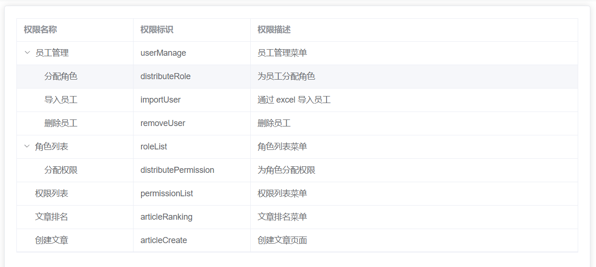
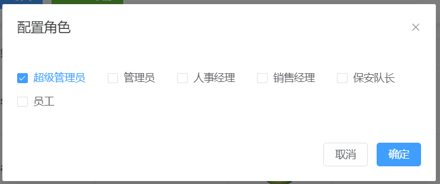
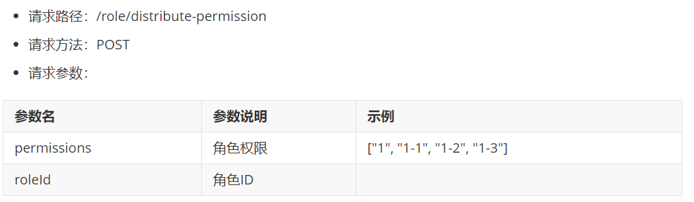
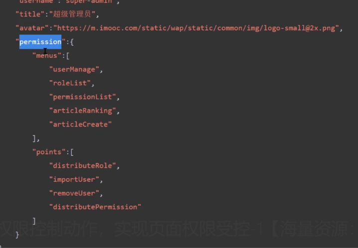
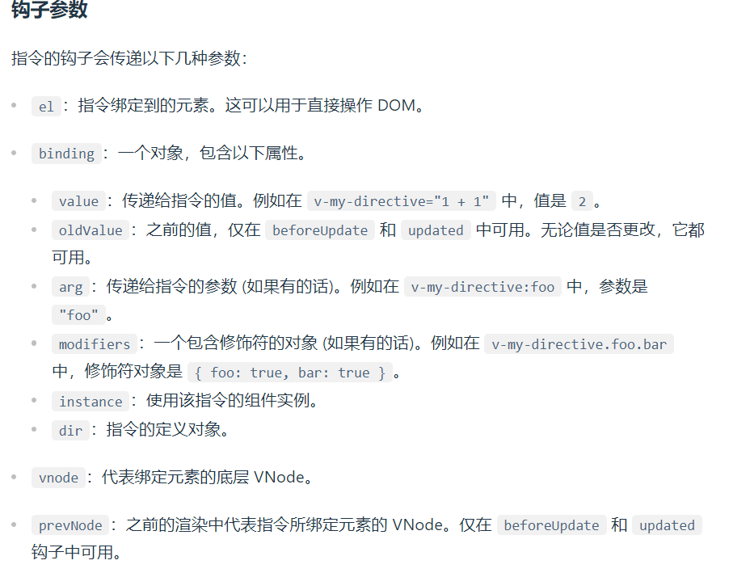

# 权限受控解决方案

以权限控制为主，这里分成三部分来去总结：

1. 权限理论：明确什么是 `RBAC` 权限控制体现
2. 辅助业务：完善 用户、角色、权限 三个页面功能
3. 核心功能：实现 `RBAC` 权限控制系统

## RBAC 权限控制体系

当前的项目中，可以通过：

1. 员工管理为用户指定角色
2. 通过角色列表为角色指定权限
3. 通过权限列表查看当前项目所有权限

那么换句话而言，以上三条就制定了一个用户由：**用户 -> 角色 -> 权限** 的一个分配关系

当通过角色为某一个用户指定到不同的权限之后，那么该用户就会在 **项目中体会到不同权限的功能**

那么这样的一套关系就 **RBAC 权限控制体系**，也就是 **基于 角色的权限 控制 用户的访问**

## 角色列表展示


1. 创建 `api/role` 接口文件：

   ```js
   import request from "@/utils/request";

   /**
    * 获取所有角色
    */
   export const roleList = () => {
     return request({
       url: "/role/list",
     });
   };
   ```

2. 在 `views/role-list` 中获取数据, 并展示

```vue
<template>
  <div class="">
    <el-card>
      <el-table :data="allRoles" border style="width: 100%">
        <el-table-column
          type="index"
          :label="$t('msg.role.index')"
          width="120"
        ></el-table-column>
        <el-table-column
          prop="title"
          :label="$t('msg.role.name')"
          width="300"
        ></el-table-column>
        <el-table-column
          prop="describe"
          :label="$t('msg.role.desc')"
          width="300"
        ></el-table-column>
        <el-table-column :label="$t('msg.role.action')">
          <el-button type="primary" size="small">
            {{ $t("msg.role.assignPermissions") }}</el-button
          >
        </el-table-column>
      </el-table>
    </el-card>
  </div>
</template>

<script setup>
import { ref } from "vue";
import { roleList } from "@/api/role";
import { watchSwitchLang } from "@/utils/i18n";
const allRoles = ref([]); // 角色列表
const getRoleList = async () => {
  const res = await roleList();
  allRoles.value = res;
};
getRoleList();

// 接口国际化处理
watchSwitchLang(getRoleList);
</script>

<style lang="scss" scoped></style>
```

## 权限列表展示



1. 创建 `api/permission` 文件

   ```js
   import request from "@/utils/request";

   /**
    * 获取所有权限
    */
   export const permissionList = () => {
     return request({
       url: "/permission/list",
     });
   };
   ```

2. 在 `views/permission-list` 获取数据

```vue
<script setup>
import { permissionList } from "@/api/permission";
import { watchSwitchLang } from "@/utils/i18n";
import { ref } from "vue";
/**
 * 权限分级：
 * 1. 一级权限为页面权限
 *  permissionMark 对应 路由名称
 * 
 * 2. 二级权限为功能权限
 *  permissionMark 对应 功能权限表
 */
// 所有权限
const allPermission = ref([]);
const getPermissionList = async () => {
  allPermission.value = await permissionList();
};
getPermissionList();
watchSwitchLang(getPermissionList);
</script>
```

3. 通过 [el-table](https://element-plus.org/zh-CN/component/table.html) 进行数据展示

```vue{8-10}
<template>
  <div class="">
    <el-card>
      <el-table
        border
        style="width: 100%; margin-bottom: 20px"
        :data="allPermission"
        default-expand-all
        row-key="id"
        :tree-props="{ hasChildren: 'hasChildren', children: 'children' }"
      >
        <el-table-column
          :label="$t('msg.permission.name')"
          prop="permissionName"
          width="200"
        ></el-table-column>
        <el-table-column
          :label="$t('msg.permission.mark')"
          prop="permissionMark"
          width="200"
        ></el-table-column>
        <el-table-column
          :label="$t('msg.permission.desc')"
          prop="permissionDesc"
        ></el-table-column>
      </el-table>
    </el-card>
  </div>
</template>
```
## 为用户分配角色


1. 创建为用户分配角色弹出层 `views/user-manage/components/roles
```vue
<template>
  <el-dialog
    :model-value="modelValue"
    :title="$t('msg.excel.roleDialogTitle')"
    @close="closed"
  >
    <!--内容 多选框显示 -->

    <!--footer 插槽-->
    <template #footer>
      <el-button @click="closed">{{ $t('msg.universal.cancel') }}</el-button>
      <el-button type="primary" @click="onConfirm">{{
        $t('msg.universal.confirm')
      }}</el-button>
    </template>
  </el-dialog>
</template>
<script setup>
import { defineProps, defineEmits } from 'vue'
defineProps({
  modelValue: {
    type: Boolean,
    default: false,
    required: true
  }
})
const emits = defineEmits(['update:modelValue'])
// 确定按钮
const onConfirm = () => {
  // 确定按钮逻辑
  closed()
}
// 关闭
const closed = () => {
  emits('update:modelValue', false)
}
</script>
<style lang="scss" scoped></style>
```
2. 在 `user-manage/index.vue` 中点击查看，展示弹出层
```vue
  <!--分配角色弹层-->
  <roles-dialog v-model="roleDialogVisible"></roles-dialog>

  <el-button size="small" type="info" @click="onShowRoleClick">
      {{ $t('msg.excel.show') }}
  </el-button>

  import RolesDialog from './components/roles.vue'
  
  // 分配角色弹出层
  const roleDialogVisible = ref(false)
  const onShowRoleClick = () => {
    roleDialogVisible.value = true
  }
```
3. 在弹出层中需要利用 [el-checkbox](https://element-plus.org/zh-CN/component/checkbox.html) 进行数据展示，此时数据分为两种：
   1. 所有角色（已存在）
   2. 用户当前角色
4. 所以需要先获取对应数据
5. 在 `api/user-manage` 中定义获取用户当前角色接口
```js
// 获取指定用户的角色
export function userRoles(id) {
  return request({
    url: `/user-manage/role/${id}`
  })
}
```
6. 在 `roles` 组件中获取所有角色数据
```vue
<script setup>
import { defineProps, defineEmits, ref } from 'vue'
import { roleList } from '@/api/role'
import { watchSwitchLang } from '@/utils/i18n'
...

// 所有角色
const allRoleList = ref([])
// 获取所有角色数据的方法
const getListData = async () => {
  allRoleList.value = await roleList()
}

getListData()
// 接口国际化处理
watchSwitchLang(getListData)
// 当前用户角色
const userRoleTitleList = ref([])
</script>
```
7. 利用 [el-checkbox 多选框组](https://element-plus.gitee.io/zh-CN/component/checkbox.html#%E5%A4%9A%E9%80%89%E6%A1%86%E7%BB%84) 渲染所有角色
```vue
    <!--内容 多选框显示 -->
    <el-checkbox-group v-model="userRoleTitleList">
      <el-checkbox
        v-for="item in allRoleList"
        :key="item.id"
        :label="item.title"
      >
      </el-checkbox>
    </el-checkbox-group>
```
label 与数组中的元素值相对应。 如果指定的值存在于数组中，就处于选择状态，反之亦然
8. 接下来渲染选中项，即：用户当前角色
9. 调用 `userRoles` 接口需要 **当前用户 ID**，所以需要定义对应的 `props`
```js
const props = defineProps({
  ...

  userId: {
    type: String,
    required: true
  }
})
```

10. 接下来我们可以根据 `userId` 获取数据，但是这里大家要注意：**因为该 `userId` 需要在 `user-manage` 用户点击之后获取当前点击行的 `id`。所以在 `roles` 组件的初始状态下，获取到的 `userId` 为 `null` 。** 因此我们想要根据 `userId` 获取用户当前角色数据，我们需要 `watch userId` 在 `userId` 有值的前提下，获取数据
```vue
<script setup>
...
...
const loading = ref(false)

// 当前用户角色
const userRoleTitleList = ref([])
// 获取当前用户角色
const getUserRoles = async (userId) => {
  loading.value = true
  const res = await userRoles(userId)
  userRoleTitleList.value = res.role.map((item) => item.title)
  loading.value = false
}
watch(
  () => props.userId,
  (value) => {
    if (value) {
      getUserRoles(value)
    }
  }
)
</script>
```
11. 在 `user-manage/index.vue` 中传递数据
```js{6,9}
  <!--分配角色弹层-->
  <roles-dialog v-model="roleDialogVisible" :userId="selectUserId"></roles-dialog>

  // 分配角色弹出层
  const roleDialogVisible = ref(false)
  const selectUserId = ref('')
  const onShowRoleClick = (row) => {
    roleDialogVisible.value = true
    selectUserId.value = row._id
  }
```
12. 在 `dialog` 关闭时重置 `selectUserId`
```js
// 保证每次打开重新获取用户角色数据
watch(roleDialogVisible, val => {
  if (!val) selectUserId.value = ''
})
```
13. 在 `api/user-manage` 中定义分配角色接口
```js
// 给用户分配角色
export const updateRole = (id, roles) => {
  return request({
    url: `/user-manage/update-role/${id}`,
    method: 'POST',
    data: {
      roles
    }
  })
}
```
14. 点击 确定 分配新的角色
```js
const i18n = useI18n()
const emits = defineEmits(['update:modelValue', 'updateRoles'])
// 确定按钮
const onConfirm = async () => {
  // 确定按钮逻辑
  // 处理数据的结构
  console.log(userRoleTitleList.value)
  const roles = userRoleTitleList.value.map((title) => {
    return allRoleList.value.find((item) => (item.title === title))
  })
  await updateRole(props.userId, roles)
  ElMessage.success(i18n.t('msg.role.updateRoleSuccess')) // 提示成功
  // 角色更新成功
  emits('updateRoles')
  closed()
}
```
15. 在 `user-manage` 中监听角色更新成功事件，重新获取数据
```html{5}
  <!--分配角色弹层-->
  <roles-dialog 
    v-model="roleDialogVisible" 
    :userId="selectUserId" 
    @updateRoles="getUserManageListData">
  </roles-dialog>
```
## 为角色分配权限
1. 创建 为角色指定权限弹出层 views/role-list/components/DistributePermission.vue
```vue
<template>
  <el-dialog
    :model-value="modelValue"
    :title="$t('msg.role.assignPermissions')"
    @close="closed"
  >
    <!--内容-->

    <!--footer 插槽-->
    <template #footer>
      <el-button @click="closed">{{ $t('msg.universal.cancel') }}</el-button>
      <el-button type="primary" @click="onConfirm">{{
        $t('msg.universal.confirm')
      }}</el-button>
    </template>
  </el-dialog>
</template>
<script setup>
import { defineProps, defineEmits } from 'vue'
defineProps({
  modelValue: {
    type: Boolean,
    required: true,
    default: false
  }
})
const emits = defineEmits(['update:modelValue'])

const onConfirm = () => {
  // 确定 逻辑
  closed()
}
// 关闭
const closed = () => {
  emits('update:modelValue', false)
}
</script>
<style lang="scss" scoped></style>
```
2. 在 `roles-list/index.vue` 中点击查看，展示弹出层
```vue
<template>
  <div class="">
    <el-card>
      <el-table :data="allRoles" border style="width: 100%">
        ...
        <el-table-column
          ...
          #default="{ row }"
        >
          <el-button
            type="primary"
            size="mini"
            @click="onDistributePermissionClick(row)"
          >
            {{ $t('msg.role.assignPermissions') }}
          </el-button>
        </el-table-column>
      </el-table>
    </el-card>

    <distribute-permission
      v-model="distributePermissionVisible"
    ></distribute-permission>
  </div>
</template>

<script setup>
...
import DistributePermission from './components/DistributePermission.vue'

...

/**
 * 分配权限
 */
const distributePermissionVisible = ref(false)
const onDistributePermissionClick = row => {
  distributePermissionVisible.value = true
}
</script>
```
3. 在弹出层中我们需要利用 [el-tree](https://element-plus.org/zh-CN/component/tree.html) 进行数据展示，此时数据分为两种：
   1. 所有权限（已存在）
   2. 角色对应的权限
4. 所以我们需要先获取对应数据
5. 在 `api/role` 中定义获取角色当前权限
```js
/**
 * 获取指定角色的权限
 */
export const rolePermission = (roleId) => {
  return request({
    url: `/role/permission/${roleId}`
  })
}
```
6. 在 `DistributePermission.vue` 组件中获取所有权限数据
```vue
<script setup>
import { defineProps, defineEmits, ref } from 'vue'
import { permissionList } from '@/api/permission'
import { watchSwitchLang } from '@/utils/i18n'
...

// 首先获取所有权限
const allPermission = ref([]) // 所有权限列表
const getPermissionList = async () => {
  const res = await permissionList()
  allPermission.value = res
}
getPermissionList()
// 接口国际化处理
watchSwitchLang(getPermissionList)
...
</script>
```
7. 使用  [el-tree](https://element-plus.org/zh-CN/component/tree.html) 渲染权限数据
```vue{5-7}
<template>
  ...
    <el-tree
      ref="treeRef"
      :data="allPermission"
      show-checkbox
      check-strictly
      node-key="id"
      default-expand-all
      :props="defaultProps"
    >
    </el-tree>
...
</template>
```
8. 接下来渲染选中项，即：角色当前权限
9. 调用 `rolePermission` 接口需要 **当前角色 ID**，所以需要定义对应的 `props`
```js
const props = defineProps({
  modelValue: {
    type: Boolean,
    required: true
  },
  roleId: {
    type: String,
    required: true
  }
})
```
10. 在 `role-list.vue` 中传递角色ID
```vue
    <distribute-permission
      v-model="distributePermissionVisible"
      :roleId="selectRoleId"
    ></distribute-permission>

     <el-table-column :label="$t('msg.role.action')">
          <template #default="scope">
            <el-button
              type="primary"
              size="small"
              @click="onDistributePermissionClick(scope.row)"
            >
              {{ $t('msg.role.assignPermissions') }}</el-button
            >
          </template>
        </el-table-column>
    
/**
 * 分配权限
 */
const selectRoleId = ref('')
const onDistributePermissionClick = row => {
  selectRoleId.value = row.id
}
```
11. 组件内调用 `rolePermission` 接口获取数据
```js
import { rolePermission } from '@/api/role'


// 获取当前用户角色的权限
const getRolePermission = async () => {
  const checkedKeys = await rolePermission(props.roleId)
  console.log(checkedKeys)
}

watch(
  () => props.roleId,
  val => {
    if (val) getRolePermission()
  }
)

```
12. 根据获取到的数据渲染选中的 `tree` , **ref 获取到 el-tree 实例 调用方法 setCheckedKeys()**
```js{5}
// 获取当前用户的权限
const treeRef = ref(null)
const getRolePermission = async (roleId) => {
  const checkedKeys = await rolePermission(roleId)
  treeRef.value.setCheckedKeys(checkedKeys)
}
watch(() => props.roleId, (value) => {
  if (value) {
    getRolePermission(value)
  }
})
```
13. 在 `api/role,js` 中定义分配权限接口
```js
// 分配权限
export const distributePermission = (data) => {
  return request({
    url: '/role/distribute-permission',
    method: 'POST',
    data
  })
}
```

14. 点击确定调用接口  使用 getCheckedKeys() 拿到 tree 上选中的 keys, 调接口
```js{12}
import { rolePermission, distributePermission } from '@/api/role'
import { useI18n } from 'vue-i18n'
import { ElMessage } from 'element-plus'
...

const i18n = useI18n()
const onConfirm = async () => {
  // 确定 逻辑
  // 拿到 tree 上选中的 keys, 调接口
  await distributePermission({
    roleId: props.roleId,
    permissions: treeRef.value.getCheckedKeys()
  })
  ElMessage.success(i18n.t('msg.role.updateRoleSuccess'))
  closed()
}
```


## 权限
整个权限系统其实分成了两部分：

1. 页面权限：比如 员工管理
2. 功能权限：比如 分配角色

其中 **页面权限** 表示：当前用户可以访问的页面

**功能权限** 表示：当前用户可以访问的权限功能


所谓页面权限包含两部分内容：

1. 用户可看到的：左侧 `menu` 菜单的 `item` 展示
2. 用户看不到的：路由表配置

 **左侧 `menu` 菜单是根据路由表自动生成的。** 所以以上第一部分的内容其实就是由第二部分引起的

看一下 **路由表配置**

1. 私有路由表 `privateRoutes`：依据权限进行动态配置的
2. 公开路由表 `publicRoutes`：无权限要求的

想要实现  **页面权限** 核心的点就是在 **私有路由表 `privateRoutes`**


期望的是：**不同的权限进入系统可以看到不同的路由** 。那么换句话而言是不是就是：**根据不同的权限数据，生成不同的私有路由表？**

对于 `vue-router 4` 而言，提供了 [addRoute API](https://next.router.vuejs.org/zh/api/#addroute) ，可以 **动态添加路由到路由表中**，那么就可以利用这个 `API` 生成不同的路由表数据

总结一下：

1. 页面权限实现的核心在于 **路由表配置**
2. 路由表配置的核心在于 **私有路由表 `privateRoutes`**
3. 私有路由表 `privateRoutes` 的核心在于 **[addRoute API](https://next.router.vuejs.org/zh/api/#addroute)**

那么简单一句话总结，只需要：**根据不同的权限数据，利用  [addRoute API](https://next.router.vuejs.org/zh/api/#addroute) 生成不同的私有路由表 ** 即可实现 **页面权限** 功能

接下来明确  **功能权限：**

 **功能权限** 的难度低于页面权限，所谓功能权限指的只有一点：

1. 根据不同的 **权限数据**，展示不同的 **功能按钮**


对于 **功能权限** 而言，只需要：**根据权限数据，隐藏功能按钮** 即可


整个 **页面权限** 实现分为以下几步：
1. 获取 **权限数据**
2. **私有路由表** 不再被直接加入到 `routes` 中
3. 利用 [addRoute API](https://next.router.vuejs.org/zh/api/#addroute) 动态添加路由到 **路由表** 中

接下来是 **功能权限：**, 整个 **功能权限** 实现分为以下几步：
1. 获取 **权限数据**
2. 定义 **隐藏按钮方式**（通过指令）
3. 依据数据隐藏按钮

### 定义页面权限控制动作，实现页面权限受控
首先先来明确前两步的内容：

1. 页面权限数据在 用户信息 **`userInfo -> permission -> menus` 之中**
  
2. **私有路由表** 不再被直接加入到 `routes` 中
```js
export const privateRoutes = [...]  //私有路由表

export const publicRoutes = [...]  // 公开路由表

const router = createRouter({
  history: createWebHashHistory(),
  routes: publicRoutes
})
```


最后实现第三步：利用 [addRoute API](https://next.router.vuejs.org/zh/api/#addroute) 动态添加路由到 **路由表** 中

1. 定义添加的动作，该动作我们通过一个新的 `vuex` 模块进行
2. 创建 `store/modules/permission.js` 模块
```js
import { publicRoutes } from '@/router'

// 专门处理权限路由的模块
export default {
  namespaced: true,
  state() {
    return {
      // 路由表：初始拥有静态路由权限
      routes: publicRoutes
    }
  },
  mutations: {
    /**
     * 增加路由
     */
    setRoutes(state, newRoutes) {
      // 永远在静态路由的基础上增加新路由
      state.routes = [...publicRoutes, ...newRoutes]
    }
  },
  actions: {
    /**
     * 根据权限筛选路由
     */
    filterRoutes(context, menus) {

    }
  }
}
```
3. 那么 `filterRoutes` 这个动作我们怎么制作呢？
4. 我们可以为每个权限路由指定一个 `name`，每个 `name` 对应一个 **页面权限**
5. 通过 `name` 与 **页面权限** 匹配的方式筛选出对应的权限路由
6. 所以我们需要对现有的私有路由表进行重制
7. 创建 `router/modules` 文件夹
8. 写入 5 个页面权限路由
9. UserManage.js`

```js
import layout from '@/layout'

export default {
  path: '/user',
  component: layout,
  redirect: '/user/manage',
  name: 'userManage',
  meta: {
    title: 'user',
    icon: 'user'
  },
  children: [
    {
      path: '/user/manage',
      component: () => import('@/views/user-manage/index'),
      meta: {
        title: 'userManage',
        icon: 'memo'
      }
    },
    {
      path: '/user/info/:id',
      name: 'userInfo',
      component: () => import('@/views/user-info/index'),
      props: true,
      meta: {
        title: 'userInfo'
      }
    },
    {
      path: '/user/import',
      name: 'import',
      component: () => import('@/views/import/index'),
      meta: {
        title: 'excelImport'
      }
    }
  ]
}
```

10. `RoleList.js`

```js
import layout from '@/layout'

export default {
  path: '/user',
  component: layout,
  redirect: '/user/manage',
  name: 'roleList',
  meta: {
    title: 'user',
    icon: 'user'
  },
  children: [
    {
      path: '/user/role',
      component: () => import('@/views/role-list/index'),
      meta: {
        title: 'roleList',
        icon: 'user'
      }
    }
  ]
}

```

11. `PermissionList.js`

```js
import layout from '@/layout'

export default {
  path: '/user',
  component: layout,
  redirect: '/user/manage',
  name: 'permissionList',
  meta: {
    title: 'user',
    icon: 'user'
  },
  children: [
    {
      path: '/user/permission',
      component: () => import('@/views/permission-list/index'),
      meta: {
        title: 'permissionList',
        icon: 'finished'
      }
    }
  ]
}
```

12. `Article.js`

```js
import layout from '@/layout'

export default {
  path: '/article',
  component: layout,
  redirect: '/article/ranking',
  name: 'articleRanking',
  meta: { title: 'article', icon: 'document' },
  children: [
    {
      path: '/article/ranking',
      component: () => import('@/views/article-ranking/index'),
      meta: {
        title: 'articleRanking',
        icon: 'rank'
      }
    },
    {
      path: '/article/:id',
      component: () => import('@/views/article-detail/index'),
      meta: {
        title: 'articleDetail'
      }
    }
  ]
}

```

13. `ArticleCreate.js`

```js
import layout from '@/layout'

export default {
  path: '/article',
  component: layout,
  redirect: '/article/ranking',
  name: 'articleCreate',
  meta: { title: 'article', icon: 'document' },
  children: [
    {
      path: '/article/create',
      component: () => import('@/views/article-create/index'),
      meta: {
        title: 'articleCreate',
        icon: 'documentAdd'
      }
    },
    {
      path: '/article/editor/:id',
      component: () => import('@/views/article-create/index'),
      meta: {
        title: 'articleEditor'
      }
    }
  ]
}
```

14. 在 `router/index.js` 中合并这些路由到 `privateRoutes` 中

   ```js
   import ArticleCreaterRouter from './modules/ArticleCreate'
   import ArticleRouter from './modules/Article'
   import PermissionListRouter from './modules/PermissionList'
   import RoleListRouter from './modules/RoleList'
   import UserManageRouter from './modules/UserManage'
   
   export const asyncRoutes = [  // 私有路由表
     RoleListRouter,
     UserManageRouter,
     PermissionListRouter,
     ArticleCreaterRouter,
     ArticleRouter
   ]
   ```

15. 此时所有的 **权限页面** 都拥有一个名字，这个名字与 **权限数据** 匹配

16. 所以就可以据此生成 **权限路由表数据**
```js{25-39}
import { publicRoutes, privateRoutes } from '@/router'

// 专门处理权限路由的模块
export default {
  namespaced: true,
  state() {
    return {
      // 路由表：初始拥有静态路由权限
      routes: []
    }
  },
  mutations: {
    /**
     * 增加路由
     */
    setRoutes(state, newRoutes) {
      // 永远在静态路由的基础上增加新路由
      state.routes = [...publicRoutes, ...newRoutes]
    }
  },
  actions: {
    /**
     * 根据权限筛选路由
     */
    filterRoutes(context, menus) {
      // 第二个参数 menus 是后端返回的权限数据数组
      const routes = []
      menus.forEach((menu) => {
        routes.push(...privateRoutes.filter((route) => route.name === menu))
      })
      // 最后!! 添加 不匹配路由进入 404
      routes.push({
        path: '/:catchAll(.*)',
        redirect: '/404'
      })
      context.commit('setRoutes', routes)
      return routes // 这里要 return
    }
  }
}
```
17. 在 `store/index` 中设置该 `modules`
```js
...
export default createStore({
  getters,
  modules: {
    ...
    permission
  }
})
```
18. 在 `src/permission` 路由守卫中，**获取用户数据之后** 调用该动作
```js{19-30}
import router from './router'
import store from './store'

// 白名单
const whiteList = ['/login']

// 1. 如果已登录, 则不允许进入 login 页面
// 2. 如果未登录, 只允许进入 login 页面及白名单
/**
 * 路由前置守卫
 */
router.beforeEach(async (to, from, next) => {
  if (store.getters.token) {
    // 有 token, 说明已登录
    if (to.path === '/login') {
      next('/')
    } else {
      if (!store.getters.hasUserInfo) { // 如果没有用户资料
        const { permission } = await store.dispatch('user/getUserInfoAction')
        // 处理用户权限，筛选出需要添加的权限
        const filterRoutes = await store.dispatch(
          'permission/filterRoutes',
          permission.menus
        )
        // 利用 addRoute 循环添加
        filterRoutes.forEach(route => {
          router.addRoute(route)
        })
        // 添加完动态路由之后，需要在进行一次主动跳转
        return next(to.path)
      }
      next()
    }
  } else {
    // 未登录
    if (whiteList.indexOf(to.path) > -1) {
      next()
    } else {
      next('/login')
    }
  }
})
```

19. 因为主动获取了 `getUserInfo` 动作的返回值，所以不要忘记在Vuex登录模块 `getUserInfoAction` 中返回用户信息 `return res`

那么到这里，当更换用户之后，刷新页面，路由表即可动态生成

但是此时应该可以发现，如果不刷新页面得话，左侧菜单是不会自动改变的？这是怎么回事呢？
### 重置路由表数据
遇到了一个问题：重新登录权限账户，不刷新页面，左侧菜单不会自动改变

那么出现这个问题的原因其实非常简单：**退出登录时，添加的路由表并未被删除**

所以想要解决这个问题，只需要在退出登录时，删除动态添加的路由表即可

那么删除动态添加的路由可以使用 [removeRoute](https://next.router.vuejs.org/zh/api/#removeroute) 方法进行
1. 在 `router/index` 中定义 `resetRouter()` 方法

   ```js
   /**
    * 初始化路由表
    */
   export function resetRouter() {
     if (
       store.getters.userInfo &&
       store.getters.userInfo.permission &&
       store.getters.userInfo.permission.menus
     ) {
       const menus = store.getters.userInfo.permission.menus
       menus.forEach((menu) => {
         router.removeRoute(menu)
       })
     }
   ```

2. 在 Vuex 中 退出登录的动作下，触发该方法

   ```js
   import router, { resetRouter } from '@/router'
   
   logout(context) {
         resetRouter()
         ...
         ...
       }
   ```

### 创建功能受控指令(按钮权限)
在前面分析 **功能权限** 时，我们说过，实现功能权限的核心在于 **根据数据隐藏功能按钮**，那么隐藏的方式我们可以通过指令进行。

所以首先我们先去创建这样一个指令（[vue3 自定义指令](https://v3.cn.vuejs.org/guide/custom-directive.html#%E7%AE%80%E4%BB%8B)）


1. 期望最终可以通过这样格式的指令进行功能受控 `v-permission="['importUser']"`
2. 以此创建对应的自定义指令 `directives/permission`
```js
import store from '@/store'
function checkPermission(el, bindings) {
  // 获取绑定的值，此处为权限
  const arr = bindings.value // v-permission="['editor',''....]" 传入的必须是数组
  // 获取所有的功能指令
  const points = store.getters.userInfo.permission.points

  if (arr && arr instanceof Array) {
    // 如果是数组
    // 匹配对应的指令
    const hasPermission = points.some((item) => {
      return arr.includes(item)
    })
    // 如果无法匹配，则表示当前用户无该指令，那么删除对应的功能按钮
    if (!hasPermission) {
      el.parentNode && el.parentNode.removeChild(el)
    }
  } else {
    // eslint-disabled-next-line
    throw new Error('v-permission value is ["admin","editor"]')
  }
}
export default {
  mounted(el, bindings) {
    checkPermission(el, bindings)
  },
  updated(el, bindings) {
    checkPermission(el, bindings)
  }
}
```

3. 在 `directives/index` 中绑定该指令

   ```js
   ...
   import permission from './permission'
   
   export default (app) => {
     ...
     app.directive('permission', permission)
   }
   
   ```

5. 在所有功能中，添加该指令

6. `views/role-list/index`

   ```html
   <el-button
       ...
       v-permission="['distributePermission']"
   >
   {{ $t('msg.role.assignPermissions') }}
   </el-button>
   ```

7. `views/user-manage/index`

   ```html
   <el-button
       ...
       v-permission="['importUser']"
   >
   {{ $t('msg.excel.importExcel') }}</el-button
           >
   ```

   ```html
   <el-button
       ...
       v-permission="['distributeRole']"
   >{{ $t('msg.excel.showRole') }}</el-button
   >
   ```

   ```html
   <el-button
       ...
       v-permission="['removeUser']"
   >{{ $t('msg.excel.remove') }}</el-button
   >
   ```
   