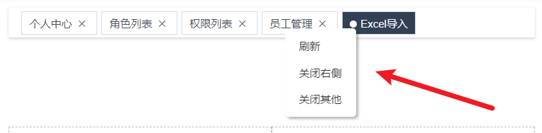

# 通用功能开发
在本次会实现常见的一些通用功能，具体如下：

1. 国际化
2. 动态换肤
3. `screenfull`
4. `headerSearch`
5. `tagView`
6. `guide`

## 国际化实现
### 国际化实现原理
先来看一个需求：

> 有一个变量 `msg` ，但是这个 `msg` 有且只能有两个值：
>
> 1. hello world
> 2. 你好世界
>
> 要求：根据需要切换 `msg` 的值

这样的一个需求就是 国际化 的需求，那么我们可以通过以下代码来实现这个需求

```js
<script>
  // 1. 定义 msg 值的数据源
  const messages = {
    en: {
      msg: 'hello world'
    },
    zh: {
      msg: '你好世界'
    }
  }
  // 2. 定义切换变量
  let locale = 'en'
  // 3. 定义赋值函数
  function t(key) {
    return messages[locale][key]
  }
  // 4. 为 msg 赋值 
  let msg = t('msg')
  console.log(msg);
  // 修改 locale， 重新执行 t 方法，获取不同语言环境下的值

</script>
```

总结：

1. 通过一个变量来 **控制** 语言环境
2. 所有语言环境下的数据源要 **预先** 定义好
3. 通过一个方法来获取 **当前语言** 下 **指定属性** 的值
4. 该值即为国际化下展示值

### 基于 vue-i18n V9  的国际化实现方案分析
在 `vue` 的项目中，不需要手写这么复杂的一些基础代码，可以直接使用 [vue-i18n](https://vue-i18n.intlify.dev/) 进行实现（注意：**`vue3` 下需要使用 `V 9.x` 的 `i18n`**）

[vue-i18n](https://vue-i18n.intlify.dev/guide/) 的使用可以分为四个部分：

1. 创建 `messages` 数据源
2. 创建 `locale` 语言变量
3. 初始化 `i18n` 实例
4. 注册 `i18n` 实例

接下来就去实现以下：

1. 安装 `vue-i18n`

```
npm install vue-i18n@9.1.7
```
2. 创建 `i18n/index.js` 文件
3. 创建 `messages` 数据源
```js
const messages = {
  en: {
    msg: {
      test: 'hello world'
    }
  },
  zh: {
    msg: {
      test: '你好世界'
    }
  }
}\
```
4. 创建 `locale` 语言变量
```js
const locale = 'en'
```
5. 初始化 `i18n` 实例
```js
import { createI18n } from 'vue-i18n'
const messages = {
  en: {
    msg: {
      test: 'hello world'
    }
  },
  zh: {
    msg: {
      test: '你好世界'
    }
  }
}

const locale = 'en'

const i18n = createI18n({
  // 使用 Composition API 模式，则需要将其设置为false
  legacy: false,
  // 全局注入 $t 函数,
  globalInjection: true,
  locale,
  messages
})

export default i18n
```
6. 在 `main.js` 中导入 , 把 `i18n` 注册到 `vue` 实例
```js
// i18n （PS：导入放到 APP.vue 导入之前，因为后面会在 app.vue 中使用国际化内容）
import i18n from '@/i18n'
...
app.use(i18n)
```
7. 组件中使用 `i18n`
```vue
<h1 class="logo-title" v-if="$store.getters.sidebarOpened">
        {{ $t('msg.test') }}
</h1>
```

8. 修改 `locale` 的值，即可改变展示的内容

截止到现在已经实现了 `i18n` 的最基础用法，就可以在项目中使用 `i18n` 完成国际化

项目中完成国际化分成以下几步进行:

1. 封装 `langSelect` 组件用于修改 `locale`
2. 导入 `el-locale` 语言包
3. 创建自定义语言包

### 1) 封装  langSelect  组件


1. 定义 `store/app.js`
```js
import storage from '@/utils/storage'
import { LANG } from '@/constant'
export default {
  namespaced: true,
  state() {
    return {
      ...
      lang: storage.getItem(LANG) || 'zh' // 语言 en / zh
    }
  },
  mutations: {
    ...
    setLang(state, lang) {
      state.lang = lang
      storage.setItem(LANG, lang)
    }
  }
}
```

2. 在 `constant` 中定义常量
```js
// 国际化
export const LANG = 'language'
```
3. 创建 `components/LangSelect/index` 
```vue 
<template>
  <div class="langSelect">
    <el-tooltip content="切换语言" :effect="effect" trigger="hover">
      <el-dropdown
        :hide-on-click="false"
        @command="handleClickItem"
        trigger="click"
      >
        <span class="el-dropdown-link">
          <el-icon :size="28"><Operation /></el-icon>
        </span>
        <template #dropdown>
          <el-dropdown-menu>
            <el-dropdown-item command="zh" :disabled="currentLang === 'zh'">中文</el-dropdown-item>
            <el-dropdown-item command="en" :disabled="currentLang === 'en'">English</el-dropdown-item>
          </el-dropdown-menu>
        </template>
      </el-dropdown>
    </el-tooltip>
  </div>
</template>

<script setup>
import { defineProps, computed } from 'vue'
import { useI18n } from 'vue-i18n'
import { useStore } from 'vuex'
import { ElMessage } from 'element-plus'
defineProps({
  effect: {
    // tooltip 的样式, dark/light
    type: String,
    default: 'dark',
    validator: (value) => {
      return ['light', 'dark'].indexOf(value) > -1
    }
  }
})
// 切换语言的方法
const store = useStore()
const i18n = useI18n()
const handleClickItem = (lang) => {
  i18n.locale.value = lang
  store.commit('app/setLang', lang)
  ElMessage.success('语言切换成功')
}

const currentLang = computed(() => { // 当前语言
  return store.state.app.lang
})
</script>

<style lang="scss" scoped>
.langSelect {
  height: 50px;
  display: flex;
  justify-content: center;
  align-items: center;
  margin-right: 10px;
}
</style>
```
4. 在 `navbar` 中导入 `LangSelect`
### 2)element-plus 国际化处理
1. 在 `plugins/index` 中导入 `element` 的中文、英文语言包：

```js
import zhCn from 'element-plus/es/locale/lang/zh-cn'
import en from 'element-plus/lib/locale/lang/en'	
```

2. 注册 `element` 时，根据当前语言选择使用哪种语言包

   ```js
   import store from '@/store'
   
   export default app => {
     app.use(ElementPlus, {
       locale: store.getters.language === 'en' ? en : zhCn
     })
   }
   ```
### 3) 自定义语言包国际化处理
自定义语言包使用了 `commonJS` 导出了一个对象，这个对象就是所有的 **自定义语言对象** 

1. 在 `lang/index` 中，导入自定义的语言包

   ```js
   import mZhLocale from './lang/zh'
   import mEnLocale from './lang/en'
   ```

2. 在 `messages` 中注册到语言包

   ```js
   const messages = {
     en: {
       msg: {
         ...mEnLocale
       }
     },
     zh: {
       msg: {
         ...mZhLocale
       }
     }
   }
   ```
### 4) 处理项目国际化内容
在处理好了国际化的语言包之后，接下来就可以应用国际化功能到我们的项目中

对于目前的项目而言，需要进行国际化处理的地方主要分为：

1. 登录页面
2. `navbar` 区域
3. `sidebar` 区域
4. 面包屑区域


**登录页面：**

`login/index`
```vue
<template>
  <div class="login-container">
    ...
      <div class="title-container">
        <h3 class="title">{{ $t('msg.login.title') }}</h3>
          <lang-select class="lang-select" effect="light"></lang-select>
      </div>

      ...

      <el-button
        type="primary"
        style="width: 100%; margin-bottom: 30px"
        :loading="loading"
        @click="handleLogin"
        >{{ $t('msg.login.loginBtn') }}</el-button
      >
      
      <div class="tips" v-html="$t('msg.login.desc')"></div>
    </el-form>
  </div>
</template>

<script setup>
import { useI18n } from 'vue-i18n'
...
// 验证规则
const i18n = useI18n()
const loginRules = ref({
  username: [
    {
      ...
      message: i18n.t('msg.login.usernameRule')
    }
  ],
  ...
})
...
</script>
```

login/rules  组件内和 不是组件内 i18n 的获取属性方式有所不同, 细品
```js
import i18n from '@/i18n'

export const validatePassword = () => {
  return (rule, value, callback) => {
    if (value.length < 6) {
      callback(new Error( i18n.global.t('msg.login.passwordRule') ))
    } else {
      callback()
    }
  }
}
```

**`navbar`区域**


**components/LangSelect/index**
```vue
<el-tooltip :content="$t('msg.navBar.lang')" :effect="effect">
       ...
    
    
const handleSetLanguage = lang => {
  ...
  ElMessage.success(i18n.t('msg.toast.switchLangSuccess'))
}
```

### 5) sidebar 与 面包屑 区域的国际化处理
**sidebar 区域**

目前对于 `sidebar` 而言，显示的文本是在定义路由表时的 meta 里的`title`


可以 **把 `title` 作为语言包内容的 `key` 进行处理** , 分这个样一个工具函数

创建 `utils/i18n` 工具模块，用于 **将 `title` 转化为国际化内容**
```js
import i18n from '@/i18n'
export function generateTitle(title) {
  return i18n.global.t('msg.route.' + title)
}
```

在 `layout/components/Sidebar/MenuItem.vue` 中导入该方法：


**面包屑区域：**

在 `components/Breadcrumb/index`


### 6) 国际化缓存处理
们希望在 **刷新页面后，当前的国际化选择可以被保留**，所以想要实现这个功能，那么就需要进行 **国际化的缓存处理**

此处的缓存，我们依然通过两个方面进行：

1. `vuex` 缓存
2. `LocalStorage` 缓存

只不过这里的缓存，我们已经在处理 **`langSelect` 组件时** 处理完成了，所以此时我们只需要使用缓存下来的数据即可。

在 `i18n/index` 中，创建 `getLanguage` 方法：

```js
import store from '@/store'
/**
 * 返回当前 lang
 */
function getLanguage() {
  return store && store.getters && store.getters.language
}
```

修改 `createI18n` 的 `locale` 为 `getLanguage()` 

```js
const i18n = createI18n({
  ...
  locale: getLanguage()
})
```

或者:  初始时直接从缓存读取


### 关于登录页面表单校验提示无法自动国际化的问题

表单校验提示信息的内容取决于 `loginRules` 中具体选项的 `message` 属性，我们对该 `message` 属性进行了初始赋值：

初始赋值时， `i18n` 会根据当前语言环境获取到对应的国际化内容。

但是当语言环境改变时，`message` 属性的 `value` 未重新获取。（即：依然为 **初始赋值** 内容）。

因此会出现以上 `bug`

**解决方案：**

那么想要解决这个问题，就需要从问题的原因入手

方案具体分为两步：

1. `message` 属性的 `value` 应该是动态获取的：
   1. 针对 `username`，它应该为一个计算属性：
    
   2. 针对 `password`，因为它的验证为 `validator`，本身就会重新计算，所以无需改动
2. 监听语言的变化，主动触发校验，以便 `message` 属性的 `value` 进行重新获取   
```js
import { watchSwitchLang } from '@/utils/i18n'

watchSwitchLang(() => {
  loginFromRef.value.validate()
})
```
至此，该问题得到处理

### 国际化方案总结
前端项目中实现国际化主要依靠的就是 `vue-i18n` 这个第三方的包

而  `i18n` 的使用，整体来说就分为这么四步：

1. 创建 `messages` 数据源
2. 创建 `locale` 语言变量
3. 初始化 `i18n` 实例
4. 注册 `i18n` 实例

核心的内容其实就是 数据源的部分，但是要注意，如果项目中使用了 **第三方组件库** ,注意 **第三方组件库的数据源** 需要 **单独** 进行处理！

## screenfull 原理及方案分析
接下来我们来看 `screenfull （全屏）` 功能实现

对于 `screenfull ` 和之前一样 ，我们还是先分析它的原理，然后在制定对应的方案实现

**原理：**

对于 `screenfull ` 而言，浏览器本身已经提供了对用的 `API`，[点击这里即可查看](https://developer.mozilla.org/zh-CN/docs/Web/API/Fullscreen_API)，这个 `API` 中，主要提供了两个方法：

1. [`Document.exitFullscreen()`](https://developer.mozilla.org/zh-CN/docs/Web/API/Document/exitFullscreen)：该方法用于请求从全屏模式切换到窗口模式
2. [`Element.requestFullscreen()`](https://developer.mozilla.org/zh-CN/docs/Web/API/Element/requestFullScreen)：该方法用于请求浏览器（user agent）将特定元素（甚至延伸到它的后代元素）置为全屏模式
   1. 比如我们可以通过 `document.getElementById('app').requestFullscreen()` 在获取 `id=app` 的 `DOM` 之后，把该区域置为全屏

但是该方法存在一定的小问题，比如：

1. `appmain` 区域背景颜色为黑色

所以通常情况下我们不会直接使用该 `API` 来去实现全屏效果，而是会使用它的包装库 [screenfull](https://www.npmjs.com/package/screenfull)

**方案：**

那么明确好了原理之后，接下来实现方案就比较容易了。

整体的方案实现分为两步：

1. 封装 `screenfull` 组件
   1. 展示切换按钮
   2. 基于 [screenfull](https://www.npmjs.com/package/screenfull) 实现切换功能
2. 在 `navbar` 中引入该组件

### 封装 screenfull 组件  
**封装 `screenfull` 组件：

1. 下来依赖包  [screenfull](https://www.npmjs.com/package/screenfull) 

   ```
   npm i screenfull@5.1.0
   ```

2. 创建 `components/Screenfull/index`
```vue
<template>
  <div class="screenfull" @click="toggleClick">
    <el-tooltip
      :content="isFullscreen ? '关闭全屏模式' : '开启全屏模式'"
      trigger="hover"
    >
      <el-icon v-if="!isFullscreen" :size="28"><FullScreen /></el-icon>
      <el-icon v-if="isFullscreen" :size="28"><Hide /></el-icon>
    </el-tooltip>
  </div>
</template>
<script setup>
import { onMounted, onUnmounted, ref } from 'vue'
import screenfull from 'screenfull'
// 是否全屏
const isFullscreen = ref(false)

// 全屏切换
const toggleClick = () => {
  screenfull.toggle()
}

// 监听变化
const change = () => {
  isFullscreen.value = screenfull.isFullscreen
}
// 设置监听器
onMounted(() => {
  screenfull.on('change', change)
})
// 删除监听器
onUnmounted(() => {
  screenfull.off('change', change)
})
</script>
<style lang="scss" scoped>
.screenfull {
  .el-icon {
  }
}
</style>
```

**在 `navbar` 中引入该组件：**

```vue
<screenfull class="screenfull" />

import Screenfull from '@/components/Screenfull'
```

## headerSearch 原理及方案分析

> 所谓 `headerSearch` 指 **页面搜索**

**原理：**

`headerSearch` 是复杂后台系统中非常常见的一个功能，它可以：**在指定搜索框中对当前应用中所有页面进行检索，以 `select` 的形式展示出被检索的页面，以达到快速进入的目的**

那么明确好了 `headerSearch`  的作用之后，接下来我们来看一下对应的实现原理

根据前面的目的可以发现，整个 `headerSearch` 其实可以分为三个核心的功能点：

1. 根据指定内容对所有页面进行检索
2. 以 `select` 形式展示检索出的页面
3. 通过检索页面可快速进入对应页面

那么围绕着这三个核心的功能点，我们想要分析它的原理就非常简单了：**根据指定内容检索所有页面，把检索出的页面以 `select` 展示，点击对应 `option` 可进入**

**方案：**

对照着三个核心功能点和原理，想要指定对应的实现方案是非常简单的一件事情了

1. 创建 `headerSearch` 组件，用作样式展示和用户输入内容获取
2. 获取所有的页面数据，用作被检索的数据源
3. 根据用户输入内容在数据源中进行 [模糊搜索](https://fusejs.io/) 
4. 把搜索到的内容以 `select` 进行展示
5. 监听 `select` 的 `change` 事件，完成对应跳转

### 创建 headerSearch 组件
[Select 选择器](https://element-plus.gitee.io/zh-CN/component/select.html)

多看一下属性, 比如:  default-first-option , filterable , remote , :remote-method , @change

**创建 `components/headerSearch/index` 组件：**
```vue
<template>
  <div class="header-search"  :class="{ show: isShow }">
    <el-tooltip content="搜索" trigger="hover">
      <el-icon :size="28" class="search-icon" @click.stop="onShowClick"><Search /></el-icon>
    </el-tooltip>
    <el-select
      v-model="search"
      class="header-search-select"
      ref="headerSearchSelectRef"
      placeholder="select"
      default-first-option
      filterable
      remote
      :remote-method="querySearch"
      @change="onSelectChange"
    >
      <el-option
        v-for="item in 4"
        :key="item"
        :label="item"
        :value="item"
      />
    </el-select>
  </div>
</template>

<script setup>
import { ref } from 'vue'
// 控制 search 显示/隐藏
const isShow = ref(false)
// el-select 实例
const headerSearchSelectRef = ref(null)
const onShowClick = () => {
  isShow.value = !isShow.value
  headerSearchSelectRef.value.focus()
}
// search 搜索值
const search = ref('')
// 搜索方法
const querySearch = () => {
  console.log('querySearch')
}
// 选中回调
const onSelectChange = () => {
  console.log('onSelectChange')
}
</script>

<style lang="scss" scoped>
  .header-search {
  font-size: 0 !important;
  .search-icon {
    cursor: pointer;
  }
  .header-search-select {
    font-size: 18px;
    transition: width 0.2s;
    width: 0;
    overflow: hidden;
    background: transparent;
    border-radius: 0;
    display: inline-block;
    vertical-align: middle;
    ::v-deep .el-input__inner {
      border-radius: 0;
      border: 0;
      padding-left: 0;
      padding-right: 0;
      box-shadow: none !important;
      border-bottom: 1px solid #d9d9d9;
      vertical-align: middle;
    }
  }
  &.show {
    .header-search-select {
      width: 210px;
      margin-left: 10px;
    }
  }
}
</style>
```
在 `navbar` 中导入该组件

```
<header-search class="right-menu-item hover-effect"></header-search>
import HeaderSearch from '@/components/HeaderSearch'
```

### 检索数据源, 对路由表进行处理
在有了 `headerSearch` 之后，接下来就可以来处理对应的 **检索数据源**

**检索数据源** 表示：**有哪些页面希望检索**

那么对于当前的业务而言，希望被检索的页面其实就是左侧菜单中的页面，检索数据源即为：**左侧菜单对应的数据源**

根据以上原理，可以得出以下代码：

```vue
<script setup>
import { ref, computed } from 'vue'
import { filterRouters, generateMenus } from '@/utils/route'
import { useRouter } from 'vue-router'
...
// 检索数据源
const router = useRouter()
const searchPool = computed(() => {
  const filterRoutes = filterRouters(router.getRoutes())
  console.log(generateMenus(filterRoutes))
  return generateMenus(filterRoutes)
})
console.log(searchPool)
</script>
```
### 对检索数据源进行模糊搜索
如果想要进行  [模糊搜索](https://fusejs.io/)  的话，那么需要依赖一个第三方的库  [fuse.js](https://fusejs.io/) 

1. 安装 [fuse.js](https://fusejs.io/)

   ```
   npm install --save fuse.js@6.4.6
   
   ```

2. 初始化 `Fuse`，更多初始化配置项 [可点击这里](https://fusejs.io/api/options.html)

   ```js
   import Fuse from 'fuse.js'
   
   /**
    * 搜索库相关
    */
   const fuse = new Fuse(list, {
       // 是否按优先级进行排序
       shouldSort: true,
       // 匹配长度超过这个值的才会被认为是匹配的
       minMatchCharLength: 1,
       // 将被搜索的键列表。 这支持嵌套路径、加权搜索、在字符串和对象数组中搜索。
       // name：搜索的键
       // weight：对应的权重
       keys: [
         {
           name: 'title',
           weight: 0.7
         },
         {
           name: 'path',
           weight: 0.3
         }
       ]
     })
   
   
   ```

3. 参考 [Fuse Demo](https://fusejs.io/demo.html) 与 最终效果，可以得出，最终需要得到如下的检索数据源结构

   ```json
   [
       {
           "path":"/my",
           "title":[
               "个人中心"
           ]
       },
       {
           "path":"/user",
           "title":[
               "用户"
           ]
       },
       {
           "path":"/user/manage",
           "title":[
               "用户",
               "用户管理"
           ]
       },
       {
           "path":"/user/info",
           "title":[
               "用户",
               "用户信息"
           ]
       },
       {
           "path":"/article",
           "title":[
               "文章"
           ]
       },
       {
           "path":"/article/ranking",
           "title":[
               "文章",
               "文章排名"
           ]
       },
       {
           "path":"/article/create",
           "title":[
               "文章",
               "创建文章"
           ]
       }
   ]
   
   ```

4. 所以我们之前处理了的数据源并不符合我们的需要，所以我们需要对数据源进行重新处理

### 数据源重处理，生成 searchPool
在上面明确了最终期望得到数据源结构，那么接下来就对重新计算数据源，生成对应的 `searchPoll`

创建 `compositions/HeaderSearch/FuseData.js`

```js
import path from 'path'
import i18n from '@/i18n'
/**
 * 筛选出可供搜索的路由对象
 * @param routes 路由表
 * @param basePath 基础路径，默认为 /
 * @param prefixTitle
 */
export const generateRoutes = (routes, basePath = '/', prefixTitle = []) => {
  // 创建 result 数据
  let res = []
  // 循环 routes 路由
  for (const route of routes) {
    // 创建包含 path 和 title 的 item
    const data = {
      path: path.resolve(basePath, route.path),
      title: [...prefixTitle]	
    }
    // 当前存在 meta 时，使用 i18n 解析国际化数据，组合成新的 title 内容
    // 动态路由不允许被搜索
    // 匹配动态路由的正则
    const re = /.*\/:.*/
    if (route.meta && route.meta.title && !re.exec(route.path)) {
      const i18ntitle = i18n.global.t(`msg.route.${route.meta.title}`)
      data.title = [...data.title, i18ntitle]
      res.push(data)
    }

    // 存在 children 时，迭代调用
    if (route.children) {
      const tempRoutes = generateRoutes(route.children, data.path, data.title)
      if (tempRoutes.length >= 1) {
        res = [...res, ...tempRoutes]
      }
    }
  }
  return res
}
```
在 `headerSearch` 中导入 `generateRoutes` 
```vue
<script setup>
import { computed, ref } from 'vue'
import { generateRoutes } from './FuseData'
import Fuse from 'fuse.js'
import { filterRouters } from '@/utils/route'
import { useRouter } from 'vue-router'

...

// 检索数据源
const router = useRouter()
const searchPool = computed(() => {
  const filterRoutes = filterRouters(router.getRoutes())
  return generateRoutes(filterRoutes)
})

/**
 * 搜索库相关
 */
const fuse = new Fuse(searchPool.value, {
  // 是否按优先级进行排序
  shouldSort: true,
  // 匹配长度超过这个值的才会被认为是匹配的
  minMatchCharLength: 1,
  // 将被搜索的键列表。 这支持嵌套路径、加权搜索、在字符串和对象数组中搜索。
  // name：搜索的键
  // weight：对应的权重
  keys: [
    {
      name: 'title',
      weight: 0.7
    },
    {
      name: 'path',
      weight: 0.3
    }
  ]
})
</script>
```

通过 `querySearch` 测试搜索结果
```js
// 搜索方法
const querySearch = query => {
  console.log(fuse.search(query))
}
```

### 渲染检索数据 并 点击跳转
数据源处理完成之后，最后我们就只需要完成:

1. 渲染检索出的数据
2. 完成对应跳转

那么下面我们按照步骤进行实现：

1. 渲染检索出的数据

   ```vue
   <template>
      ...
     <el-option
         v-for="option in searchOptions"
         :key="option.item.path"
         :label="option.item.title.join(' - ')"
         :value="option.item.path"
     ></el-option>
   </template>
   
   <script setup>
   ...
   // 搜索结果
   const searchOptions = ref([])
   // 搜索方法
   const querySearch = query => {
     if (query !== '') {
       searchOptions.value = fuse.search(query)
     } else {
       searchOptions.value = []
     }
   }
   ...
   </script>
   
   ```

   

2. 完成对应跳转

```js
   // 选中回调
 const onSelectChange = (path) => {
  router.push(path)
}
```

### 剩余问题处理
到这里 `headerSearch` 功能基本上就已经处理完成了，但是还存在一些小 `bug` ，那么最后这一小节就处理下这些剩余的 `bug`

1. 在 `search` 打开时，点击 `body` 关闭 `search`
2. 在 `search` 关闭时，清理 `searchOptions`
3. `headerSearch` 应该具备国际化能力

明确好问题之后，接下来进行处理

首先先处理前前面两个问题：

```js
// close 函数 :关闭 搜索, 输入框失去焦点, searchOptions 设为[]
const onClose = () => {
  headerSearchSelectRef.value.blur()
  isShow.value = false
  searchOptions.value = []
}
// 监听 search 打开 , 处理 close 事件
watch(isShow, () => {
  if (isShow.value) {
    document.addEventListener('click', onClose)
  } else {
    document.removeEventListener('click', onClose)
  }
})
```
   

### 总结 
整个 `headerSearch` 只需要把握住三个核心的关键点

1. 根据指定内容对所有页面进行检索
2. 以 `select` 形式展示检索出的页面
3. 通过检索页面可快速进入对应页面

保证大方向没有错误，那么具体的细节处理我们具体分析就可以了。

关于细节的处理，可能比较复杂的地方有两个：

1. 模糊搜索
2. 检索数据源

对于这两块，我们依赖于 `fuse.js` 进行了实现，大大简化了我们的业务处理流程。

## tagsView 多页签导航 原理方案分析
看 **实现方案**：

1. 创建 `tagsView` 组件：用来处理 `tags` 的展示
2. 处理基于路由的动态过渡，在 `AppMain` 中进行：用于处理 `view` 的部分

整个的方案就是这么两大部，但是其中我们还需要处理一些细节相关的，完整的方案为：

1. 监听路由变化，组成用于渲染 `tags` 的数据源
2. 创建 `tags` 组件，根据数据源渲染 `tag`，渲染出来的 `tags` 需要同时具备
   * 国际化 `title`
   * 路由跳转
3. 处理鼠标右键效果，根据右键处理对应数据源
4. 处理基于路由的动态过渡

### 创建 tags 数据源
tags 的数据源分为两部分：

* 保存数据：`appmain` 组件中进行
* 展示数据：`tags` 组件中进行

所以 tags 的数据我们最好把它保存到 **`vuex`** 中。

先在 constant 中新建常量 (做持久化处理) 
```js
export const TAGS_VIEW = 'tagsView' // tags 多页标签
```

在 `store/app` 中创建 `tagsViewList`
```js
import storage from '@/utils/storage'
import { LANG, TAGS_VIEW } from '@/constant'
export default {
  namespaced: true,
  state() {
    return {
      ...
      tagsViewList: storage.getItem(TAGS_VIEW) || [] // tags 数据源
    }
  },
  mutations: {
    ...
    // 添加 tags 数据源, 第二个参数 tag 是一个路由对象(包含一个 title 属性)
    addTagsViewList(state, tag) {
      // 需要判断一下, 如果tag重复就不添加
      const isFind = state.tagsViewList.find((item) => {
        return item.path === tag.path
      })
      // 如果不重复, 就添加, 并持久化
      if (!isFind) {
        state.tagsViewList.push(tag)
        storage.setItem(TAGS_VIEW, state.tagsViewList)
      }
    }
  }
}
```

在 appmain 中监听路由的变化
```vue
<template>
  <div class="app-main">
    <router-view></router-view>
  </div>
</template>
<script setup>
import { useRoute } from 'vue-router'
import { watch } from 'vue'
import { useStore } from 'vuex'
import { generateTitle } from '@/utils/i18n'
import { isTags } from '@/utils/tags'
// 目标: 监听路由的变化 , 把路由对象添加到 vuex 的 tagsView 数据源中

const getTitle = (route) => {
  if (!route.meta) { // 处理无meta 的路由
    const pathArr = route.path.split('/')
    return pathArr[pathArr.length - 1]
  } else { // 有 meta 的路由
    return generateTitle(route.meta.title)
  }
}

const route = useRoute() // route 是响应式数据
const store = useStore()
watch(route, (to, from) => {
  if (!isTags(to.path)) return // 判断不需要添加tags的路由

  const { fullPath, name, path, meta, params, query } = to
  store.commit('app/addTagsViewList', {
    fullPath,
    name,
    path,
    meta,
    params,
    query,
    title: getTitle(to)
  })
}, {
  immediate: true // 立即执行
})
</script>
```
需要 创建 utils/tags 的工具函数
```js
// 不需要使用 tagsView 的 path
const whiteList = ['/login', '/404', '/401/']
export const isTags = (path) => {
  return !whiteList.includes(path)
}
```

### 生成 tagsView 组件
components/TagsView/index.vue 创建 tagsView 组件
```vue
<template>
  <div class="tags-view-container">
    <template v-for="item in $store.getters.tagsViewList" :key="item.fullPath">
      <router-link :to="{ path:item.fullPath }" class="tags-view-item" :class="isActive(item.path) ? 'active' : ''">
        {{item.title}}
        <el-icon v-if="!isActive(item.path)" @click.stop.prevent="closeClick(item)"><Close /></el-icon>
      </router-link>
    </template>
  </div>
</template>
<script setup>
import { useRoute } from 'vue-router'
const route = useRoute()
const isActive = (path) => {
  return route.path === path
}

const closeClick = (item) => {
  console.log('close')
  console.log(item)
}
</script>
<style lang="scss" scoped>
.tags-view-container {
  height: 34px;
  width: 100%;
  margin-bottom: 8px;
  background: #fff;
  border-bottom: 1px solid #d8dce5;
  box-shadow: 0 1px 3px 0 rgba(0, 0, 0, 0.12), 0 0 3px 0 rgba(0, 0, 0, 0.04);
    .tags-view-item {
      display: inline-block;
      position: relative;
      cursor: pointer;
      height: 26px;
      line-height: 26px;
      border: 1px solid #d8dce5;
      color: #495060;
      background: #fff;
      padding: 0 8px;
      font-size: 12px;
      margin-left: 5px;
      margin-top: 4px;
      &:first-of-type {
        margin-left: 15px;
      }
      &:last-of-type {
        margin-right: 15px;
      }
      &.active {
        color: #fff;
        background-color: #304156;
        &::before {
          content: '';
          background: #fff;
          display: inline-block;
          width: 8px;
          height: 8px;
          border-radius: 50%;
          position: relative;
          margin-right: 4px;
        }
      }
      // close 按钮
      .el-icon {
        width: 16px;
        height: 16px;
        line-height: 10px;
        vertical-align: -2px;
        border-radius: 50%;
        text-align: center;
        transition: all 0.3s cubic-bezier(0.645, 0.045, 0.355, 1);
        transform-origin: 100% 50%;
        &:before {
          transform: scale(0.6);
          display: inline-block;
          vertical-align: -3px;
        }
        &:hover {
          background-color: #b4bccc;
          color: #fff;
        }
      }
  }
}
</style>
```

### tagsView 国际化处理
tagsView 的国际化处理可以理解为修改现有 tags 的 title。

所以我们只需要：

* 监听到语言变化
* 国际化对应的 title 即可
根据方案，可生成如下代码：

1. 在 store/app 中，创建修改 title 的 mutations
```js
  // 国际化处理, 需要接受里面的title已经转变的 tagsViewList
    changeTagsViewLIst(state, tags) {
      state.tagsViewList = tags
      storage.setItem(TAGS_VIEW, state.tagsViewList)
    }
  }
```

2. 在 appmain 中监听语言变化
```js
import { generateTitle, watchSwitchLang } from '@/utils/i18n'
....
....
// 监听语言的变化, 重新生成新的 tagsViewList
watchSwitchLang(() => {
  const tags = store.getters.tagsViewList.map(item => {
    return {
      ...item,
      title: getTitle(item)
    }
  })
  store.commit('app/changeTagsViewLIst', tags)
})
```
### contextMenu 展示处理


`contextMenu` 为 鼠标右键事件

contextMenu 事件的处理分为两部分：

* contextMenu 的展示
* 右键项对应逻辑处理

那么先处理第一部分：**contextMenu 的展示**

1. 创建 components/TagsView/ContextMenu 组件，作为右键展示部分
```vue
<template>
  <ul class="context-menu-container">
    <li @click="onRefreshClick">
      {{ $t('msg.tagsView.refresh') }}
    </li>
    <li @click="onCloseRightClick">
      {{ $t('msg.tagsView.closeRight') }}
    </li>
    <li @click="onCloseOtherClick">
      {{ $t('msg.tagsView.closeOther') }}
    </li>
  </ul>
</template>
<script setup>
import { defineProps } from 'vue'
defineProps({
  index: {
    type: Number,
    required: true
  }
})
// 点击刷新
const onRefreshClick = () => {}
// 点击关闭右侧
const onCloseRightClick = () => {}
// 点击关闭其他
const onCloseOtherClick = () => {}
</script>
<style lang="scss" scoped>
.context-menu-container {
  position: fixed;
  background: #fff;
  z-index: 3000;
  list-style-type: none;
  padding: 5px 0;
  border-radius: 4px;
  font-size: 12px;
  font-weight: 400;
  color: #333;
  box-shadow: 2px 2px 3px 0 rgba(0, 0, 0, 0.3);
  li {
    margin: 0;
    padding: 7px 16px;
    cursor: pointer;
    &:hover {
      background: #eee;
    }
  }
}
</style>

```

2. 在 tagsView 中控制 contextMenu 的展示
```vue{14,32-43}
<template>
  <div class="tags-view-container">
    <template v-for="item,index in $store.getters.tagsViewList" :key="item.fullPath">
      <router-link
        :to="{ path:item.fullPath }"
        class="tags-view-item"
        :class="isActive(item.path) ? 'active' : ''"
        @contextmenu.prevent="clickContextMenu($event, index)"
        >
        {{item.title}}
        <el-icon v-if="!isActive(item.path)" @click.stop.prevent="closeClick(item,index)"><Close /></el-icon>
      </router-link>
    </template>
    <context-menu v-if="visible" :index="selectedIndex" :style="contextMenuStyle"></context-menu>
  </div>
</template>
<script setup>
import { useRoute } from 'vue-router'
import ContextMenu from '@/components/TagsView/ContextMenu.vue'
import { ref } from 'vue'
const route = useRoute()
// 判断是否当前激活
const isActive = (path) => {
  return route.path === path
}
// 关闭 标签页
const closeClick = (item) => {
  console.log('close')
  console.log(item)
}

const visible = ref(false) // contextMenu 显示/隐藏
const contextMenuStyle = ref({ // contextMenu  :style 样式
  left: 0,
  top: 0
})
const selectedIndex = ref(0) // contextMenu 点击的索引
const clickContextMenu = (event, index) => {
  contextMenuStyle.value.left = event.x + 'px'
  contextMenuStyle.value.top = event.y + 'px'
  visible.value = true
  selectedIndex.value = index
}
</script>
<style lang="scss" scoped>
.tags-view-container {
  ...
}
</style>
```
### contextMenu 事件处理

对于 contextMenu 的事件一共分为三个：

* 刷新
* 关闭右侧
* 关闭所有

但是不能忘记，之前 **关闭单个 tags 的事件**还没有进行处理，所以要一共需要处理 4 个对应的事件

1. 刷新事件
```js
const router = useRouter()
const onRefreshClick = () => {
  router.go(0)
}
```

2. 在 store/app 中，创建删除 tags 的 mutations，该 mutations 需要同时具备以下三个能力：

* 删除 “右侧”
* 删除 “其他”
* 删除 “当前”

```js
    // tagsViewList 的删除相关操作
    // 注意 :  payload 接受一个对象
    // {
    //   type: 'index' || 'right' || 'other',
    //   index: 索引
    // }
    removeTagsViewList(state, { type, index }) {
      if (type === 'index') {
        state.tagsViewList.splice(index, 1)
      } else if (type === 'other') {
        state.tagsViewList.splice(
          index + 1,
          state.tagsViewList.length - index + 1
        )
        state.tagsViewList.splice(0, index)
      } else if (type === 'right') {
        state.tagsViewList.splice(
          index + 1,
          state.tagsViewList.length - index + 1
        )
      }
      storage.setItem(TAGS_VIEW, state.tagsViewList)
    }
```

3. 关闭右侧事件
```js
// 关闭右侧
const onCloseRightClick = () => {
  store.commit('app/removeTagsViewList', {
    type: 'right',
    index: props.index
  })
}
```
4. 关闭其他
```js
// 关闭其他
const onCloseOtherClick = () => {
  store.commit('app/removeTagsViewList', {
    type: 'other',
    index: props.index
  })
}
```
5. 关闭当前
```js
const selectedIndex = ref(0) // contextMenu 点击的索引
...
// 关闭 标签页
const closeClick = () => {
  store.commit('app/removeTagsViewList', {
    type: 'index',
    index: selectedIndex.value
  })
}
```

### contextMenu 的关闭行为
```js
const visible = ref(false) // contextMenu 显示/隐藏
...
// 监听页面 关闭contextMenu组件
const closeMenu = () => {
  visible.value = false
}
// watch 监听变化
watch(visible, (value) => {
  if (value) {
    document.documentElement.addEventListener('click', closeMenu)
  } else {
    document.documentElement.removeEventListener('click', closeMenu)
  }
})
```
### 处理基于路由的动态过渡
[处理基于路由的动态过渡](https://next.router.vuejs.org/zh/guide/advanced/transitions.html#%E5%9F%BA%E4%BA%8E%E8%B7%AF%E7%94%B1%E7%9A%84%E5%8A%A8%E6%80%81%E8%BF%87%E6%B8%A1) 官方已经给出了示例代码，结合 router-view 和 transition 我们可以非常方便的实现这个功能

1. 在 appmain 中处理对应代码逻辑
```
<template>
  <div class="app-main">
    <router-view v-slot="{ Component, route }">
      <transition name="fade-transform" mode="out-in">
        <keep-alive>
          <component :is="Component" :key="route.path" />
        </keep-alive>
      </transition>
    </router-view>
  </div>
</template>
```

2. 在 styles/transition 中增加动画渲染
```css
/* fade-transform */
.fade-transform-leave-active,
.fade-transform-enter-active {
  transition: all 0.5s;
}

.fade-transform-enter-from {
  opacity: 0;
  transform: translateX(-30px);
}

.fade-transform-leave-to {
  opacity: 0;
  transform: translateX(30px);
}
```