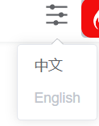
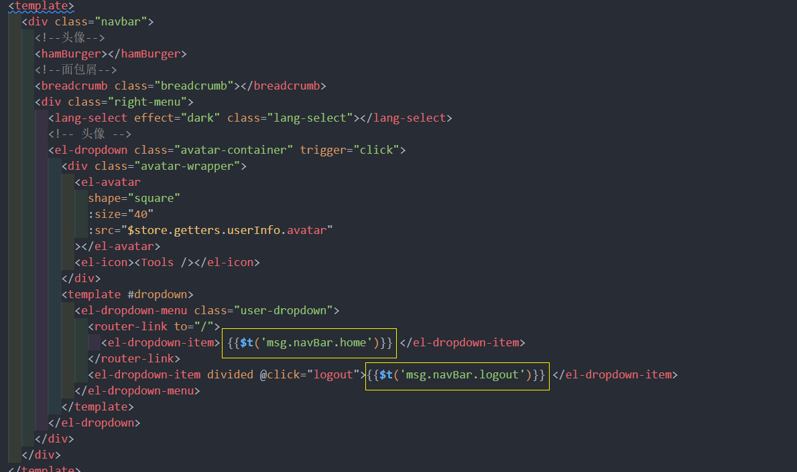
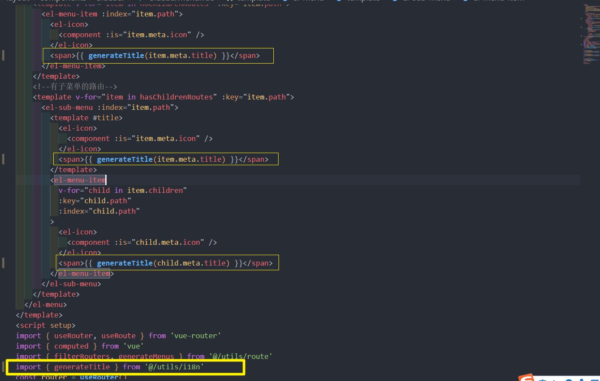
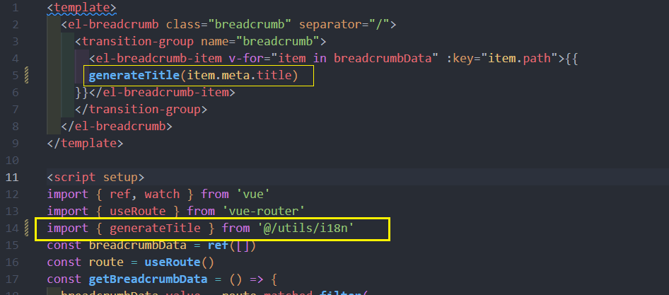
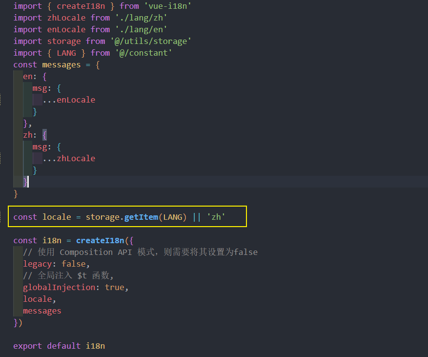
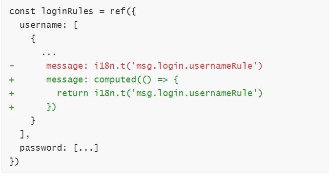

# 通用功能开发
在本次会实现常见的一些通用功能，具体如下：

1. 国际化
2. 动态换肤
3. `screenfull`
4. `headerSearch`
5. `tagView`
6. `guide`

## 国际化实现
### 国际化实现原理
先来看一个需求：

> 有一个变量 `msg` ，但是这个 `msg` 有且只能有两个值：
>
> 1. hello world
> 2. 你好世界
>
> 要求：根据需要切换 `msg` 的值

这样的一个需求就是 国际化 的需求，那么我们可以通过以下代码来实现这个需求

```js
<script>
  // 1. 定义 msg 值的数据源
  const messages = {
    en: {
      msg: 'hello world'
    },
    zh: {
      msg: '你好世界'
    }
  }
  // 2. 定义切换变量
  let locale = 'en'
  // 3. 定义赋值函数
  function t(key) {
    return messages[locale][key]
  }
  // 4. 为 msg 赋值 
  let msg = t('msg')
  console.log(msg);
  // 修改 locale， 重新执行 t 方法，获取不同语言环境下的值

</script>
```

总结：

1. 通过一个变量来 **控制** 语言环境
2. 所有语言环境下的数据源要 **预先** 定义好
3. 通过一个方法来获取 **当前语言** 下 **指定属性** 的值
4. 该值即为国际化下展示值

### 基于 vue-i18n V9  的国际化实现方案分析
在 `vue` 的项目中，不需要手写这么复杂的一些基础代码，可以直接使用 [vue-i18n](https://vue-i18n.intlify.dev/) 进行实现（注意：**`vue3` 下需要使用 `V 9.x` 的 `i18n`**）

[vue-i18n](https://vue-i18n.intlify.dev/guide/) 的使用可以分为四个部分：

1. 创建 `messages` 数据源
2. 创建 `locale` 语言变量
3. 初始化 `i18n` 实例
4. 注册 `i18n` 实例

接下来就去实现以下：

1. 安装 `vue-i18n`

```
npm install vue-i18n@9.1.7
```
2. 创建 `i18n/index.js` 文件
3. 创建 `messages` 数据源
```js
const messages = {
  en: {
    msg: {
      test: 'hello world'
    }
  },
  zh: {
    msg: {
      test: '你好世界'
    }
  }
}\
```
4. 创建 `locale` 语言变量
```js
const locale = 'en'
```
5. 初始化 `i18n` 实例
```js
import { createI18n } from 'vue-i18n'
const messages = {
  en: {
    msg: {
      test: 'hello world'
    }
  },
  zh: {
    msg: {
      test: '你好世界'
    }
  }
}

const locale = 'en'

const i18n = createI18n({
  // 使用 Composition API 模式，则需要将其设置为false
  legacy: false,
  // 全局注入 $t 函数,
  globalInjection: true,
  locale,
  messages
})

export default i18n
```
6. 在 `main.js` 中导入 , 把 `i18n` 注册到 `vue` 实例
```js
// i18n （PS：导入放到 APP.vue 导入之前，因为后面会在 app.vue 中使用国际化内容）
import i18n from '@/i18n'
...
app.use(i18n)
```
7. 组件中使用 `i18n`
```vue
<h1 class="logo-title" v-if="$store.getters.sidebarOpened">
        {{ $t('msg.test') }}
</h1>
```

8. 修改 `locale` 的值，即可改变展示的内容

截止到现在已经实现了 `i18n` 的最基础用法，就可以在项目中使用 `i18n` 完成国际化

项目中完成国际化分成以下几步进行:

1. 封装 `langSelect` 组件用于修改 `locale`
2. 导入 `el-locale` 语言包
3. 创建自定义语言包

### 1) 封装  langSelect  组件


1. 定义 `store/app.js`
```js
import storage from '@/utils/storage'
import { LANG } from '@/constant'
export default {
  namespaced: true,
  state() {
    return {
      ...
      lang: storage.getItem(LANG) || 'zh' // 语言 en / zh
    }
  },
  mutations: {
    ...
    setLang(state, lang) {
      state.lang = lang
      storage.setItem(LANG, lang)
    }
  }
}
```

2. 在 `constant` 中定义常量
```js
// 国际化
export const LANG = 'language'
```
3. 创建 `components/LangSelect/index` 
```vue 
<template>
  <div class="langSelect">
    <el-tooltip content="切换语言" :effect="effect" trigger="hover">
      <el-dropdown
        :hide-on-click="false"
        @command="handleClickItem"
        trigger="click"
      >
        <span class="el-dropdown-link">
          <el-icon :size="28"><Operation /></el-icon>
        </span>
        <template #dropdown>
          <el-dropdown-menu>
            <el-dropdown-item command="zh" :disabled="currentLang === 'zh'">中文</el-dropdown-item>
            <el-dropdown-item command="en" :disabled="currentLang === 'en'">English</el-dropdown-item>
          </el-dropdown-menu>
        </template>
      </el-dropdown>
    </el-tooltip>
  </div>
</template>

<script setup>
import { defineProps, computed } from 'vue'
import { useI18n } from 'vue-i18n'
import { useStore } from 'vuex'
import { ElMessage } from 'element-plus'
defineProps({
  effect: {
    // tooltip 的样式, dark/light
    type: String,
    default: 'dark',
    validator: (value) => {
      return ['light', 'dark'].indexOf(value) > -1
    }
  }
})
// 切换语言的方法
const store = useStore()
const i18n = useI18n()
const handleClickItem = (lang) => {
  i18n.locale.value = lang
  store.commit('app/setLang', lang)
  ElMessage.success('语言切换成功')
}

const currentLang = computed(() => { // 当前语言
  return store.state.app.lang
})
</script>

<style lang="scss" scoped>
.langSelect {
  height: 50px;
  display: flex;
  justify-content: center;
  align-items: center;
  margin-right: 10px;
}
</style>
```
4. 在 `navbar` 中导入 `LangSelect`
### 2)element-plus 国际化处理
1. 在 `plugins/index` 中导入 `element` 的中文、英文语言包：

```js
import zhCn from 'element-plus/es/locale/lang/zh-cn'
import en from 'element-plus/lib/locale/lang/en'	
```

2. 注册 `element` 时，根据当前语言选择使用哪种语言包

   ```js
   import store from '@/store'
   
   export default app => {
     app.use(ElementPlus, {
       locale: store.getters.language === 'en' ? en : zhCn
     })
   }
   ```
### 3) 自定义语言包国际化处理
自定义语言包使用了 `commonJS` 导出了一个对象，这个对象就是所有的 **自定义语言对象** 

1. 在 `lang/index` 中，导入自定义的语言包

   ```js
   import mZhLocale from './lang/zh'
   import mEnLocale from './lang/en'
   ```

2. 在 `messages` 中注册到语言包

   ```js
   const messages = {
     en: {
       msg: {
         ...mEnLocale
       }
     },
     zh: {
       msg: {
         ...mZhLocale
       }
     }
   }
   ```
### 4) 处理项目国际化内容
在处理好了国际化的语言包之后，接下来就可以应用国际化功能到我们的项目中

对于目前的项目而言，需要进行国际化处理的地方主要分为：

1. 登录页面
2. `navbar` 区域
3. `sidebar` 区域
4. 面包屑区域


**登录页面：**

`login/index`
```vue
<template>
  <div class="login-container">
    ...
      <div class="title-container">
        <h3 class="title">{{ $t('msg.login.title') }}</h3>
          <lang-select class="lang-select" effect="light"></lang-select>
      </div>

      ...

      <el-button
        type="primary"
        style="width: 100%; margin-bottom: 30px"
        :loading="loading"
        @click="handleLogin"
        >{{ $t('msg.login.loginBtn') }}</el-button
      >
      
      <div class="tips" v-html="$t('msg.login.desc')"></div>
    </el-form>
  </div>
</template>

<script setup>
import { useI18n } from 'vue-i18n'
...
// 验证规则
const i18n = useI18n()
const loginRules = ref({
  username: [
    {
      ...
      message: i18n.t('msg.login.usernameRule')
    }
  ],
  ...
})
...
</script>
```

login/rules  组件内和 不是组件内 i18n 的获取属性方式有所不同, 细品
```js
import i18n from '@/i18n'

export const validatePassword = () => {
  return (rule, value, callback) => {
    if (value.length < 6) {
      callback(new Error( i18n.global.t('msg.login.passwordRule') ))
    } else {
      callback()
    }
  }
}
```

**`navbar`区域**



**components/LangSelect/index**
```vue
<el-tooltip :content="$t('msg.navBar.lang')" :effect="effect">
       ...
    
    
const handleSetLanguage = lang => {
  ...
  ElMessage.success(i18n.t('msg.toast.switchLangSuccess'))
}
```

### 5) sidebar 与 面包屑 区域的国际化处理
**sidebar 区域**

目前对于 `sidebar` 而言，显示的文本是在定义路由表时的 meta 里的`title`


可以 **把 `title` 作为语言包内容的 `key` 进行处理** , 分这个样一个工具函数

创建 `utils/i18n` 工具模块，用于 **将 `title` 转化为国际化内容**
```js
import i18n from '@/i18n'
export function generateTitle(title) {
  return i18n.global.t('msg.route.' + title)
}
```

在 `layout/components/Sidebar/MenuItem.vue` 中导入该方法：


**面包屑区域：**

在 `components/Breadcrumb/index`



### 6) 国际化缓存处理
们希望在 **刷新页面后，当前的国际化选择可以被保留**，所以想要实现这个功能，那么就需要进行 **国际化的缓存处理**

此处的缓存，我们依然通过两个方面进行：

1. `vuex` 缓存
2. `LocalStorage` 缓存

只不过这里的缓存，我们已经在处理 **`langSelect` 组件时** 处理完成了，所以此时我们只需要使用缓存下来的数据即可。

在 `i18n/index` 中，创建 `getLanguage` 方法：

```js
import store from '@/store'
/**
 * 返回当前 lang
 */
function getLanguage() {
  return store && store.getters && store.getters.language
}
```

修改 `createI18n` 的 `locale` 为 `getLanguage()` 

```js
const i18n = createI18n({
  ...
  locale: getLanguage()
})
```

或者:  初始时直接从缓存读取



### 关于登录页面表单校验提示无法自动国际化的问题

表单校验提示信息的内容取决于 `loginRules` 中具体选项的 `message` 属性，我们对该 `message` 属性进行了初始赋值：

初始赋值时， `i18n` 会根据当前语言环境获取到对应的国际化内容。

但是当语言环境改变时，`message` 属性的 `value` 未重新获取。（即：依然为 **初始赋值** 内容）。

因此会出现以上 `bug`

**解决方案：**

那么想要解决这个问题，就需要从问题的原因入手

方案具体分为两步：

1. `message` 属性的 `value` 应该是动态获取的：
   1. 针对 `username`，它应该为一个计算属性：
    
   2. 针对 `password`，因为它的验证为 `validator`，本身就会重新计算，所以无需改动
2. 监听语言的变化，主动触发校验，以便 `message` 属性的 `value` 进行重新获取   
```js
import { watchSwitchLang } from '@/utils/i18n'

watchSwitchLang(() => {
  loginFromRef.value.validate()
})
```
至此，该问题得到处理

### 国际化方案总结
前端项目中实现国际化主要依靠的就是 `vue-i18n` 这个第三方的包

而  `i18n` 的使用，整体来说就分为这么四步：

1. 创建 `messages` 数据源
2. 创建 `locale` 语言变量
3. 初始化 `i18n` 实例
4. 注册 `i18n` 实例

核心的内容其实就是 数据源的部分，但是要注意，如果项目中使用了 **第三方组件库** ,注意 **第三方组件库的数据源** 需要 **单独** 进行处理！

## screenfull 原理及方案分析
接下来我们来看 `screenfull （全屏）` 功能实现

对于 `screenfull ` 和之前一样 ，我们还是先分析它的原理，然后在制定对应的方案实现

**原理：**

对于 `screenfull ` 而言，浏览器本身已经提供了对用的 `API`，[点击这里即可查看](https://developer.mozilla.org/zh-CN/docs/Web/API/Fullscreen_API)，这个 `API` 中，主要提供了两个方法：

1. [`Document.exitFullscreen()`](https://developer.mozilla.org/zh-CN/docs/Web/API/Document/exitFullscreen)：该方法用于请求从全屏模式切换到窗口模式
2. [`Element.requestFullscreen()`](https://developer.mozilla.org/zh-CN/docs/Web/API/Element/requestFullScreen)：该方法用于请求浏览器（user agent）将特定元素（甚至延伸到它的后代元素）置为全屏模式
   1. 比如我们可以通过 `document.getElementById('app').requestFullscreen()` 在获取 `id=app` 的 `DOM` 之后，把该区域置为全屏

但是该方法存在一定的小问题，比如：

1. `appmain` 区域背景颜色为黑色

所以通常情况下我们不会直接使用该 `API` 来去实现全屏效果，而是会使用它的包装库 [screenfull](https://www.npmjs.com/package/screenfull)

**方案：**

那么明确好了原理之后，接下来实现方案就比较容易了。

整体的方案实现分为两步：

1. 封装 `screenfull` 组件
   1. 展示切换按钮
   2. 基于 [screenfull](https://www.npmjs.com/package/screenfull) 实现切换功能
2. 在 `navbar` 中引入该组件

### 封装 screenfull 组件  
**封装 `screenfull` 组件：

1. 下来依赖包  [screenfull](https://www.npmjs.com/package/screenfull) 

   ```
   npm i screenfull@5.1.0
   ```

2. 创建 `components/Screenfull/index`
```vue
<template>
  <div class="screenfull" @click="toggleClick">
    <el-tooltip
      :content="isFullscreen ? '关闭全屏模式' : '开启全屏模式'"
      trigger="hover"
    >
      <el-icon v-if="!isFullscreen" :size="28"><FullScreen /></el-icon>
      <el-icon v-if="isFullscreen" :size="28"><Hide /></el-icon>
    </el-tooltip>
  </div>
</template>
<script setup>
import { onMounted, onUnmounted, ref } from 'vue'
import screenfull from 'screenfull'
// 是否全屏
const isFullscreen = ref(false)

// 全屏切换
const toggleClick = () => {
  screenfull.toggle()
}

// 监听变化
const change = () => {
  isFullscreen.value = screenfull.isFullscreen
}
// 设置监听器
onMounted(() => {
  screenfull.on('change', change)
})
// 删除监听器
onUnmounted(() => {
  screenfull.off('change', change)
})
</script>
<style lang="scss" scoped>
.screenfull {
  .el-icon {
  }
}
</style>
```

**在 `navbar` 中引入该组件：**

```vue
<screenfull class="screenfull" />

import Screenfull from '@/components/Screenfull'
```

