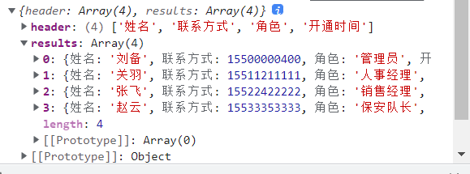

# excel 、zip 与前端结合解决方案 - 用户管理页面实现
整个用户相关的模块分为三部分：

1. 员工管理
2. 角色列表
3. 权限列表

现在要来处理的就是 **员工管理** 模块的内容，整个 **员工管理** 模块可以分为以下功能：

1. 用户列表分页展示
2. `excel` 导入用户
3. 用户列表导出为 `excel`
4. 用户详情的表格展示
5. 用户详情表格打印
6. 用户删除
7. 用户角色分配（需要在完成角色列表之后处理）

## 用户列表分页展示
首先我们先来处理最基础的 **用户列表分页展示** 功能，整个功能大体可以分为两步：

1. 获取分页数据
2. 利用 [el-table](https://element-plus.org/zh-CN/component/table.html) 和 [el-pagination](https://element-plus.org/zh-CN/component/pagination.html) 渲染数据

1. 创建 `api/user-manage` 文件，用于定义接口
```js
import request from '@/utils/request'

/**
 * 获取用户列表数据
 */
export const getUserManageList = data => {
  return request({
    url: '/user-manage/list',
    params: data
  })
}
```

2. 在 `user-manage` 中获取对应数据, 渲染 UI 机构 
```vue
<template>
  <div class="user-manage">
    <el-table :data="userManageList" style="width: 100%" border>
      <el-table-column type="index" prop="id" label="#"></el-table-column>
      <el-table-column
        prop="username"
        :label="$t('msg.userInfo.name')"
        width="140"
      >
      </el-table-column>
      <el-table-column
        prop="mobile"
        :label="$t('msg.excel.mobile')"
        width="180"
      >
      </el-table-column>
      <el-table-column
        prop="avatar"
        :label="$t('msg.excel.avatar')"
        width="140"
        align="center"
      >
        <template #default="scope">
          <el-avatar :src="scope.row.avatar" size="large"></el-avatar>
        </template>
      </el-table-column>
      <el-table-column prop="role" :label="$t('msg.excel.role')" width="180">
        <template #default="scope">
          <el-tag size="small" v-for="item in scope.row.role" :key="item.id">{{
            item.title
          }}</el-tag>
        </template>
      </el-table-column>
      <el-table-column
        prop="openTIme"
        :label="$t('msg.excel.openTime')"
        width="140"
      >
        <template #default="scope">
          {{ scope.row.openTime }}
        </template>
      </el-table-column>
      <el-table-column :label="$t('msg.excel.action')" align="center">
        <template #default="scope">
          <el-button size="small" type="primary">查看</el-button>
          <el-button size="small" type="info">角色</el-button>
          <el-button size="small" type="danger" @click="delete scope.row.id"
            >删除</el-button
          >
        </template>
      </el-table-column>
    </el-table>
    <el-pagination
      style="margin-top: 20px"
      v-model:currentPage="page"
      v-model:page-size="size"
      :page-sizes="[2, 5, 10, 20]"
      layout="total, sizes, prev, pager, next, jumper"
      :total="total"
      @size-change="handleSizeChange"
      @current-change="handleCurrentChange"
    />
  </div>
</template>

<script setup>
import { ref } from 'vue'
import { getUserManageList } from '@/api/user-manage'
import { watchSwitchLang } from '@/utils/i18n'
const page = ref(1) // 页码
const size = ref(2) // 每页条数
const total = ref(0) // 总数
const userManageList = ref([]) // 员工列表
const getUserManageListData = async () => {
  const res = await getUserManageList({
    page: page.value,
    size: size.value
  })
  console.log(res)
  total.value = res.total
  userManageList.value = res.list
}
getUserManageListData()

// 监听语言变化
watchSwitchLang(getUserManageListData)

// size 改变触发
const handleSizeChange = (pageSize) => {
  size.value = pageSize
  getUserManageListData()
}
// 页码 改变触发
const handleCurrentChange = (currentPage) => {
  page.value = currentPage
  getUserManageListData()
}
</script>

<style lang="scss" scoped></style>
```

## 全局属性处理 - 时间展示问题
在 `Vue3`中取消了 [过滤器的概念](https://v3.cn.vuejs.org/guide/migration/filters.html)，其中：

1. 局部过滤器被完全删除
2. 全局过滤器虽然被移除，但是可以使用 app.config.globalProperties [全局属性](https://cn.vuejs.org/api/application.html#app-config-globalproperties) 进行替代


1. 时间处理部分我们通过 [Day.js](https://day.js.org/) 进行处理

2. 下载 [Day.js](https://day.js.org/) 

   ```
   npm i dayjs@1.10.6
   ```

   1. 创建 `src/filter` 文件夹，用于定义 [全局属性](https://v3.cn.vuejs.org/api/application-config.html#globalproperties) 

   ```js
   import dayjs from 'dayjs'
   
   const dateFilter = (val, format = 'YYYY-MM-DD') => {
     if (!isNaN(val)) {
       val = parseInt(val)
     }
     return dayjs(val).format(format)
   }
   
   export default app => {
     app.config.globalProperties.$filters = {
       dateFilter
     }
   }
   ```

3. 在 `main.js` 中导入

   ```js
   // filter
   import installFilter from '@/filters'
   
   installFilter(app)
   ```

4. 在 `user-manage` 中使用全局属性处理时间解析

   ```html
   <el-table-column :label="$t('msg.excel.openTime')">
             <template #default="{ row }">
               {{ $filters.dateFilter(row.openTime) }}
             </template>
           </el-table-column>
   ```
## excel 导入 / 导出
### 1) excel 导入原理与实现分析
对于 **excel 导入** 首先我们先来明确一下它的业务流程：

1. 点击  **excel 导入** 按钮进入  **excel 导入页面**
2. 页面提供了两种导入形式
   1. 点击按钮上传 `excel` 
   2. 把 `excel` 拖入指定区域
3. 选中文件，进行两步操作
   1. 解析 `excel` 数据
   2. 上传解析之后的数据
4. 上传成功之后，返回 **员工管理（用户列表）** 页面，进行数据展示

所以根据这个业务可以看出，整个 `excel` 导入核心的原理部分在于 **选中文件之后，上传成功之前** 的操作，即：

1. 解析 `excel` 数据（**最重要**）
2. 上传解析之后的数据


根据上面所说，整个的实现流程也可以很轻松得出：

1. 创建 `excel` 导入页面
2. 点击 `excel` 导入按钮，进入该页面
3. 该页面提供两种文件导入形式
4. 选中文件之后，解析 `excel` 数据（核心）
5. 上传解析之后的数据
6. 返回 员工管理（用户列表） 页面
   
### 2) 提供两种文件导入形式
 `excel` 页面在之前已经创建过了，就是 `views/import/index` 

所以此处，只需要在按钮处完成页面跳转即可，在 `user-manage` 中

```js
<el-button type="primary" @click="onImportExcelClick">
          {{ $t('msg.excel.importExcel') }}</el-button
        >

const router = useRouter()
/**
 * excel 导入点击事件
 */
const onImportExcelClick = () => {
  router.push('/user/import')
}
```

这样就已经完成了前面两步，接下来实现 **提供两种文件导入形式**

1. 创建 `components/UploadExcel` **组件**，用于处理上传 `excel` 相关的问题
2. 在 `user/import.js` 中导入该组件
```vue
<template>
  <div class="">
    <upload></upload>
  </div>
</template>

<script setup>
import { } from 'vue'
import Upload from '@/components/Upload/index.vue'
</script>

<style lang="scss" scoped></style>
```
3. 整个 `UploadExcel` 组件的内容可以分成两部分：
   1. 样式
   2. 逻辑
4. 那么首先先处理样式内容
```vue
<template>
  <div class="upload-excel">
    <div class="btn-upload">
      <el-button :loading="loading" type="primary" @click="handleUpload">
        {{ $t('msg.uploadExcel.upload') }}
      </el-button>
    </div>
    <input
      ref="excelUploadInput"
      class="excel-upload-input"
      type="file"
      accept=".xlsx, .xls"
      @change="handleChange"
    />
    <!-- https://developer.mozilla.org/zh-CN/docs/Web/API/HTML_Drag_and_Drop_API -->
    <div
      class="drop"
      @drop.stop.prevent="handleDrop"
      @dragover.stop.prevent="handleDragover"
      @dragenter.stop.prevent="handleDragover"
    >
      <el-icon><Upload /></el-icon>
      <span>{{ $t('msg.uploadExcel.drop') }}</span>
    </div>
  </div>
</template>

<script setup>
import { ref } from 'vue'
const loading = ref(false)
const excelUploadInput = ref(null)
const handleUpload = () => {}
const handleChange = () => {}
</script>

<style lang="scss" scoped>
.upload-excel {
  display: flex;
  justify-content: center;
  margin-top: 100px;
  .excel-upload-input {
    display: none;
    z-index: -9999;
  }
  .btn-upload,
  .drop {
    border: 1px dashed #bbb;
    width: 350px;
    height: 160px;
    text-align: center;
    line-height: 160px;
  }
  .drop {
    line-height: 60px;
    display: flex;
    flex-direction: column;
    justify-content: center;
    align-items: center;
    color: #bbb;
    ::v-deep .el-icon {
      font-size: 60px;
      display: block;
    }
  }
}
</style>
```

### 3) 文件选择之后的数据解析处理
接下来处理整个业务中最核心的一块内容 **选中文件之后，解析 `excel` 数据** 

解析的方式根据 *导入形式的不同* 也可以分为两种：

1. 文件选择（选择隐藏域）导入
2. 文件拖拽导入

那么现在，先来处理第一种。

处理之前需要先来做一件事情：

1. 解析 `excel` 数据需要使用 [xlsx](https://www.npmjs.com/package/xlsx) ，所以需要先安装它

   ```
   npm i xlsx@0.17.0
   ```

 [xlsx](https://www.npmjs.com/package/xlsx) 安装完成之后，接下来就可以来去实现对应代码了：
```vue 
<script setup>
import { ref, defineProps } from 'vue'
import XLSX from 'xlsx'
import { getHeaderRow } from './utils'
const loading = ref(false)
const props = defineProps({
  // 上传前回调
  beforeUpload: Function,
  // 成功是回调
  onSuccess: Function
})
const excelUploadInput = ref(null)
const handleUpload = () => {
  excelUploadInput.value.click() // 点击按钮, 打开 input 选择文件入口
}
const handleChange = (e) => {
  // 选择了文件, 出发了 input 的 change 事件
  const files = e.target.files
  const rawFile = files[0] // only use files[0]
  if (!rawFile) return
  upload(rawFile) // 上传
}
const upload = (rawFile) => {
  excelUploadInput.value.value = null
  // 如果没有指定上传前回调
  if (!props.beforeUpload) {
    readerData(rawFile)
    return
  }
  // 如果指定了上传前回调，那么只有返回 true 才会执行后续操作
  const before = props.beforeUpload(rawFile)
  if (before) {
    readerData(rawFile)
  }
}
/**
 * 读取数据（异步）
 */
const readerData = (rawFile) => {
  loading.value = true
  return new Promise((resolve, reject) => {
    // https://developer.mozilla.org/zh-CN/docs/Web/API/FileReader
    const reader = new FileReader()
    // 该事件在读取操作完成时触发
    // https://developer.mozilla.org/zh-CN/docs/Web/API/FileReader/onload
    reader.onload = (e) => {
      // 1. 获取解析到的数据
      const data = e.target.result
      // 2. 利用 XLSX 对数据进行解析
      const workbook = XLSX.read(data, { type: 'array' })
      // 3. 获取第一张表格(工作簿)名称
      const firstSheetName = workbook.SheetNames[0]
      // 4. 只读取 Sheet1（第一张表格）的数据
      const worksheet = workbook.Sheets[firstSheetName]
      // 5. 解析数据表头
      const header = getHeaderRow(worksheet)
      // 6. 解析数据体
      const results = XLSX.utils.sheet_to_json(worksheet)
      // 7. 传入解析之后的数据
      generateData({ header, results })
      // 8. loading 处理
      loading.value = false
      // 9. 异步完成
      resolve()
    }
    // 启动读取指定的 Blob 或 File 内容
    reader.readAsArrayBuffer(rawFile)
  })
}
/**
 * 根据导入内容，生成数据
 */
const generateData = (excelData) => {
  props.onSuccess && props.onSuccess(excelData)
}
</script>
```

getHeaderRow` 为 `xlsx` 解析表头数据的**通用方法**，直接使用即可

Uplaod/utils.js 
```js
import XLSX from 'xlsx'
/**
 * 获取表头（通用方式）
 */
export const getHeaderRow = sheet => {
  const headers = []
  const range = XLSX.utils.decode_range(sheet['!ref'])
  let C
  const R = range.s.r
  /* start in the first row */
  for (C = range.s.c; C <= range.e.c; ++C) {
    /* walk every column in the range */
    const cell = sheet[XLSX.utils.encode_cell({ c: C, r: R })]
    /* find the cell in the first row */
    let hdr = 'UNKNOWN ' + C // <-- replace with your desired default
    if (cell && cell.t) hdr = XLSX.utils.format_cell(cell)
    headers.push(hdr)
  }
  return headers
}
```

在 `import` 组件中传入 `onSuccess` 事件，获取解析成功之后的 `excel` 数据
```vue 
<template>
  <upload-excel :onSuccess="onSuccess"></upload-excel>
</template>

<script setup>
import UploadExcel from '@/components/UploadExcel'

/**
 * 数据解析成功之后的回调
 */
const onSuccess = excelData => {
  console.log(excelData)
}
</script>、
```

### 4) 文件拖入之后的数据解析处理
想要了解 **文件拖入**，就必须要先能够了解 [HTML_Drag_and_Drop（HTML 拖放 API）](https://developer.mozilla.org/zh-CN/docs/Web/API/HTML_Drag_and_Drop_API) 事件，这里主要使用到其中三个事件：

1. [drop (en-US)](https://developer.mozilla.org/en-US/docs/Web/API/Document/drop_event)：当元素或选中的文本在可释放目标上被释放时触发
2. [dragover (en-US)](https://developer.mozilla.org/en-US/docs/Web/API/Document/dragover_event)：当元素或选中的文本被拖到一个可释放目标上时触发
3. [dragenter (en-US)](https://developer.mozilla.org/en-US/docs/Web/API/Document/dragenter_event)：当拖拽元素或选中的文本到一个可释放目标时触发

那么明确好了这三个事件之后，就可以实现对应的拖入代码逻辑

```vue
<script setup>
...
import { getHeaderRow, isExcel } from './utils'
import { ElMessage } from 'element-plus'

...
/**
 * 拖拽文本释放时触发
 */
const handleDrop = e => {
  // 上传中跳过
  if (loading.value) return
  const files = e.dataTransfer.files
  if (files.length !== 1) {
    ElMessage.error('必须要有一个文件')
    return
  }
  const rawFile = files[0]
  if (!isExcel(rawFile)) {
    ElMessage.error('文件必须是 .xlsx, .xls, .csv 格式')
    return false
  }
  // 触发上传事件
  upload(rawFile)
}

/**
 * 拖拽悬停时触发
 */
const handleDragover = e => {
  // https://developer.mozilla.org/zh-CN/docs/Web/API/DataTransfer/dropEffect
  // 在新位置生成源项的副本
  e.dataTransfer.dropEffect = 'copy'
}

...
</script>
```
在 `utils` 中生成 `isExcel` 方法
```js 
export const isExcel = file => {
  return /\.(xlsx|xls|csv)$/.test(file.name)
}
```
### 5) 文件拖入之后的数据解析处理
那么到现在已经处理好了 `excel` 的数据解析操作。

接下来可以实现对应的数据上传，完成 `excel` 导入功能

1. 定义 `api/user-manage` 上传接口

   ```js
   /**
    * 批量导入
    */
   export const userBatchImport = (data) => {
     return request({
       url: '/user-manage/batch/import',
       method: 'POST',
       data
     })
   }
   ```

2. 在 `onSuccess` 中调用接口上传数据，但是此处大家要注意两点内容：

   1. `header` 头不需要上传
   2. `results` 中 `key` 为中文，我们必须要按照接口要求进行上传

3. 所以我们需要处理 `results` 中的数据结构

4. 创建 `import/utils` 文件

   ```js
   /**
    * 导入数据对应表
    */
   export const USER_RELATIONS = {
     姓名: 'username',
     联系方式: 'mobile',
     角色: 'role',
     开通时间: 'openTime'
   }
   
   ```

5. 创建数据解析方法，生成新数组 views/import/index.vue
```vue
<script setup>
import { userBatchImport } from '@/api/user-manage'
import Upload from '@/components/Upload/index.vue'
import { USER_RELATIONS } from './utils'
import { ElMessage } from 'element-plus'
import router from '@/router'
import { useI18n } from 'vue-i18n'
...

// 筛选数据
const generateData = (results) => {
  const arr = []
  results.forEach((item) => {
    const obj = {}
    Object.keys(item).forEach((key) => {
      obj[USER_RELATIONS[key]] = item[key]
    })
    arr.push(obj)
  })
  return arr
}
  </script>
```
6. 完成数据上传即可

```vue
   <script setup>
    import { userBatchImport } from '@/api/user-manage'
    import Upload from '@/components/Upload/index.vue'
    import { USER_RELATIONS } from './utils'
    import { ElMessage } from 'element-plus'
    import router from '@/router'
    import { useI18n } from 'vue-i18n'
   /**
    * 数据解析成功之后的回调
    */
   const i18n = useI18n()
   const onSuccess = async ({ header, results }) => {
     const updateData = generateData(results)
     await userBatchImport(updateData)
     ElMessage.success({
       message: results.length + i18n.t('msg.excel.importSuccess'),
       type: 'success'
     })
     router.push('/user/manage')
   }

    const generateData = () => {} ...
  </script>
```
### 6) 处理剩余 bug
截止到目前整个 `excel` 上传就已经处理完成了，只不过目前还存在两个小 bug 需要处理：

1. 上传之后的时间解析错误
2. 返回用户列表之后，数据不会自动刷新

**上传之后的时间解析错误：**

导致该问题出现的原因是因为 **excel 导入解析时间会出现错误，** 处理的方案也很简单，是一个固定方案，只需要进行固定的时间解析处理即可：

1. 在 `import/utils` 中新增事件处理方法（固定方式直接使用即可）

   ```js
   /**
    * 解析 excel 导入的时间格式
    */
   export const formatDate = (numb) => {
     const time = new Date((numb - 1) * 24 * 3600000 + 1)
     time.setYear(time.getFullYear() - 70)
     const year = time.getFullYear() + ''
     const month = time.getMonth() + 1 + ''
     const date = time.getDate() - 1 + ''
     return (
       year +
       '-' +
       (month < 10 ? '0' + month : month) +
       '-' +
       (date < 10 ? '0' + date : date)
     )
   }
   ```

2. 在 `generateData` 中针对 `openTime` 进行单独处理

```js
// 筛选数据
const generateData = (results) => {
  const arr = []
  results.forEach((item) => {
    const obj = {}
    Object.keys(item).forEach((key) => {
      obj[USER_RELATIONS[key]] = item[key]
      // 处理 excel 的事件显示格斯
      if (USER_RELATIONS[key] === 'openTime') {
        obj[USER_RELATIONS[key]] = formatDate(item[key])
      }
    })
    console.log(obj)
    arr.push(obj)
  })
  return arr
}
```
**返回用户列表之后，数据不会自动刷新：**

出现该问题的原因是因为：**`appmain` 中使用 `keepAlive` 进行了组件缓存**。

解决的方案也很简单，只需要：**监听 [onActivated](https://v3.cn.vuejs.org/api/options-lifecycle-hooks.html#activated) 事件，重新获取数据即可** 

在 `user-manage` 中：

```js
import { ref, onActivated } from 'vue'

// 处理导入用户后数据不重新加载的问题
onActivated(getListData)
```

### 7) excel 导入功能总结
到这里 `excel` 导入功能就已经实现完成，回顾一下整体的流程：

1. 创建 `excel` 导入页面
2. 点击 `excel` 导入按钮，进入该页面
3. 该页面提供两种文件导入形式
4. 选中文件之后，解析 `excel` 数据（核心）
5. 上传解析之后的数据
6. 返回 员工管理（用户列表） 页面

游离于这些流程之外的，还包括额外的两个小 bug 的处理，特别是 **`excel` 的时间格式问题，** 要格外注意，因为这是一个必然会出现的错误，当然处理方案也是固定的

## 辅助业务之用户删除
完成了 `excel` 的用户导入之后，那么我们肯定会产生很多的无用数据，所以说接下来我们来完成一个辅助功能：**删除用户（希望大家都可以在完成 `excel` 导入功能之后，删除掉无用数据，以方便其他的同学进行功能测试）**

删除用户的功能比较简单，我们只需要 **调用对应的接口即可**

1. 在 `api/user-manage` 中指定删除接口

   ```js
   /**
    * 删除指定数据
    */
   export const deleteUser = (id) => {
     return request({
       url: `/user-manage/detele/${id}`
     })
   }
   ```

2. 在 `views/user-manage` 中调用删除接口接口

   ```html
   <el-button type="danger" size="mini" @click="onRemoveClick(row)">{{
                 $t('msg.excel.remove')
               }}</el-button>
   ```

   ```js
    import { ElMessageBox, ElMessage } from 'element-plus'
    import { useI18n } from 'vue-i18n'
    ...

   /**
    * 删除按钮点击事件
    */
   const i18n = useI18n()
   const onRemoveClick = row => {
     ElMessageBox.confirm(
       i18n.t('msg.excel.dialogTitle1') +
         row.username +
         i18n.t('msg.excel.dialogTitle2'),
       {
         type: 'warning'
       }
     ).then(async () => {
       await deleteUser(row._id)
       ElMessage.success(i18n.t('msg.excel.removeSuccess'))
       // 重新渲染数据
       getListData()
     })
   }
   ```

## excel 导出
### 1) excel 导出原理与实现分析

对于 `excel` 导出而言还是先来分析一下它的业务逻辑：

1. 点击 `excel` 导出按钮
2. 展示 `dialog` 弹出层
3. 确定导出的 `excel` 文件名称
4. 点击导出按钮
5. 获取 **所有用户列表数据**
6. 将 `json` 结构数据转化为 `excel` 数据，并下载

有了 `excel` 导入的经验之后，再来看这样的一套业务逻辑，相信大家应该可以直接根据这样的一套业务逻辑得出 `excel` 导出的核心原理了：**将 `json` 结构数据转化为 `excel` 数据，并下载**

那么对应的实现方案也可以直接得出了：

1. 创建 `excel` 导出弹出层
2. 处理弹出层相关的业务
3. 点击导出按钮，将 `json` 结构数据转化为 `excel` 数据，并下载（核心）

### 2) Export2Excel 组件
首先先去创建 `excel` 弹出层组件 `Export2Excel `  [el-dialog 弹出框](https://element-plus.gitee.io/zh-CN/component/dialog.html)

1. 创建 `views/user-manage/components/Export2Excel `
```vue
<template>
  <el-dialog
    :title="$t('msg.excel.title')"
    :model-value="modelValue"
    @close="closed"
    width="30%"
  >
    <el-input :placeholder="$t('msg.excel.placeholder')" v-model="excelName"></el-input>
    <template #footer>
      <span class="dialog-footer">
        <el-button @click="closed">{{ $t('msg.excel.close') }}</el-button>
        <el-button type="primary" @click="onConfirm">{{
          $t('msg.excel.confirm')
        }}</el-button>
      </span>
    </template>
  </el-dialog>
</template>
<script setup>
import { defineProps, defineEmits, ref } from 'vue'
import { useI18n } from 'vue-i18n'
defineProps({
  modelValue: {
    type: Boolean,
    default: false,
    required: true
  }
})
const emits = defineEmits(['update:modelValue'])

const i18n = useI18n()
const excelName = ref(i18n.t('msg.excel.defaultName'))

const onConfirm = () => {
  // TODO: 业务
}

// 关闭
const closed = () => {
  emits('update:modelValue', false)
}
</script>
<style>
.dialog-footer {
  display: flex;
  justify-content: center;
}
</style>
```
在 `user-manage` 中进行导入 `dialog` 组件

1. 指定 `excel`按钮 点击事件

```html
<el-button type="success" size="small" @click="onToExcelClick">
  {{$t('msg.excel.exportExcel')}}
</el-button>
```

2. 导入 `ExportToExcel` 组件

   ```vue
   <export-to-excel v-model="export2ExcelVisible" />

   import ExportToExcel from './components/Export2Excel.vue'
   ```

3. 点击事件处理函数

   ```js
   /**
    * excel 导出点击事件
    */
   const export2ExcelVisible = ref(false)
   const onToExcelClick = () => {
     export2ExcelVisible.value = true
   }
   ```

### 3) 导出前置业务处理
现在来处理一些实现 `excel` 导出时的前置任务，具体有：

1. 指定 `input` 输入框 默认导出文件名称
2. 定义 **获取全部用户** 列表接口，并调用

先处理第一步：**指定 `input` 默认导出文件名称**

1. 指定 `input` 的双向绑定
```html
<el-input
      v-model="excelName"
      :placeholder="$t('msg.excel.placeholder')"
></el-input>
```
2. 指定默认文件名 (需要监听语言的变化)
```vue 
<script setup>
...
import { useI18n } from 'vue-i18n'
import { watchSwitchLang } from '@/utils/i18n'
...

const i18n = useI18n()
let exportDefaultName = i18n.t('msg.excel.defaultName')
const excelName = ref(exportDefaultName)
watchSwitchLang(() => {
  exportDefaultName = i18n.t('msg.excel.defaultName')
  excelName.value = i18n.t('msg.excel.defaultName')
})
</script>
```

**定义获取全部用户列表接口，并调用：**

1. 在 `user-manage` 中定义获取全部数据接口

   ```js
   /**
    * 获取所有用户列表数据
    */
   export const getUserManageAllList = () => {
     return request({
       url: '/user-manage/all-list'
     })
   }
   ```

2. 调用接口数据，并指定 `loading`

   ```html
   <el-button type="primary" @click="onConfirm" :loading="loading">{{
   	$t('msg.excel.confirm')
   }}</el-button>
   ```

```vue
<script setup>
...
import { getUserManageAllList } from '@/api/user-manage'

... 
const loading = ref(false)
const onConfirm = async () => {  // 确定按钮
  loading.value = true
  const res = await getUserManageAllList()
  console.log(res)

  // TODO: 业务

  loading.value = true
  closed()
}

// 关闭
const closed = () => {
  emits('update:modelValue', false)
}
</script>
```

### 4) 实现 excel 导出逻辑
那么万事俱备，到此时就可以来实现整个业务逻辑的最后步骤：

1. 将 `json` 结构数据转化为 `excel` 数据 
2. 下载对应的 `excel` 数据

对于这两步的逻辑而言，最复杂的莫过于 **将 `json` 结构数据转化为 `excel` 数据** 这一步的功能，不过万幸的是对于该操作的逻辑是 **通用处理逻辑**，搜索 **Export2Excel** 可以得到巨多的解决方案，所以此处 **没有必要** 手写对应的转换逻辑

直接把该代码复制到 `src/utils` 文件夹下 Export2Excel.js
```js
/* eslint-disable */
import { saveAs } from 'file-saver'
import XLSX from 'xlsx'

function datenum(v, date1904) {
  if (date1904) v += 1462
  var epoch = Date.parse(v)
  return (epoch - new Date(Date.UTC(1899, 11, 30))) / (24 * 60 * 60 * 1000)
}

function sheet_from_array_of_arrays(data, opts) {
  var ws = {}
  var range = {
    s: {
      c: 10000000,
      r: 10000000
    },
    e: {
      c: 0,
      r: 0
    }
  }
  for (var R = 0; R != data.length; ++R) {
    for (var C = 0; C != data[R].length; ++C) {
      if (range.s.r > R) range.s.r = R
      if (range.s.c > C) range.s.c = C
      if (range.e.r < R) range.e.r = R
      if (range.e.c < C) range.e.c = C
      var cell = {
        v: data[R][C]
      }
      if (cell.v == null) continue
      var cell_ref = XLSX.utils.encode_cell({
        c: C,
        r: R
      })

      if (typeof cell.v === 'number') cell.t = 'n'
      else if (typeof cell.v === 'boolean') cell.t = 'b'
      else if (cell.v instanceof Date) {
        cell.t = 'n'
        cell.z = XLSX.SSF._table[14]
        cell.v = datenum(cell.v)
      } else cell.t = 's'

      ws[cell_ref] = cell
    }
  }
  if (range.s.c < 10000000) ws['!ref'] = XLSX.utils.encode_range(range)
  return ws
}

function Workbook() {
  if (!(this instanceof Workbook)) return new Workbook()
  this.SheetNames = []
  this.Sheets = {}
}

function s2ab(s) {
  var buf = new ArrayBuffer(s.length)
  var view = new Uint8Array(buf)
  for (var i = 0; i != s.length; ++i) view[i] = s.charCodeAt(i) & 0xff
  return buf
}

export const export_json_to_excel = ({
  multiHeader = [],
  header,
  data,
  filename,
  merges = [],
  autoWidth = true,
  bookType = 'xlsx'
} = {}) => {
  // 1. 设置文件名称
  filename = filename || 'excel-list'
  // 2. 把数据解析为数组，并把表头添加到数组的头部
  data = [...data]
  data.unshift(header)
  // 3. 解析多表头，把多表头的数据添加到数组头部（二维数组）
  for (let i = multiHeader.length - 1; i > -1; i--) {
    data.unshift(multiHeader[i])
  }
  // 4. 设置 Excel 表工作簿（第一张表格）名称
  var ws_name = 'SheetJS'
  // 5. 生成工作簿对象
  var wb = new Workbook()
  // 6. 将 data 数组（json格式）转化为 Excel 数据格式
  var ws = sheet_from_array_of_arrays(data)
  // 7. 合并单元格相关（['A1:A2', 'B1:D1', 'E1:E2']）
  if (merges.length > 0) {
    if (!ws['!merges']) ws['!merges'] = []
    merges.forEach((item) => {
      ws['!merges'].push(XLSX.utils.decode_range(item))
    })
  }
  // 8. 单元格宽度相关
  if (autoWidth) {
    /*设置 worksheet 每列的最大宽度*/
    const colWidth = data.map((row) =>
      row.map((val) => {
        /*先判断是否为null/undefined*/
        if (val == null) {
          return {
            wch: 10
          }
        } else if (val.toString().charCodeAt(0) > 255) {
          /*再判断是否为中文*/
          return {
            wch: val.toString().length * 2
          }
        } else {
          return {
            wch: val.toString().length
          }
        }
      })
    )
    /*以第一行为初始值*/
    let result = colWidth[0]
    for (let i = 1; i < colWidth.length; i++) {
      for (let j = 0; j < colWidth[i].length; j++) {
        if (result[j]['wch'] < colWidth[i][j]['wch']) {
          result[j]['wch'] = colWidth[i][j]['wch']
        }
      }
    }
    ws['!cols'] = result
  }

  // 9. 添加工作表（解析后的 excel 数据）到工作簿
  wb.SheetNames.push(ws_name)
  wb.Sheets[ws_name] = ws
  // 10. 写入数据
  var wbout = XLSX.write(wb, {
    bookType: bookType,
    bookSST: false,
    type: 'binary'
  })
  // 11. 下载数据
  saveAs(
    new Blob([s2ab(wbout)], {
      type: 'application/octet-stream'
    }),
    `${filename}.${bookType}`
  )
}
```

那么有了 `Export2Excel.js` 的代码之后 ，接下来还需要导入两个依赖库：

1. [xlsx](https://www.npmjs.com/package/xlsx) （已下载）：`excel` 解析器和编译器
2. [file-saver](https://www.npmjs.com/package/file-saver)：文件下载工具，通过 `npm i file-saver@2.0.5` 下载

那么一切准备就绪，实现 `excel` 导出功能：

   
1. 动态导入 `Export2Excel.js` 

```js
// 导入工具包
const excel = await import('@/utils/Export2Excel')
```

2. 因为从服务端获取到的为 `json 数组对象` 结构，但是导出时的数据需要为 **二维数组**，所以需要有一个方法来把 **`json` 结构转化为 二维数组**

3. 创建转化方法

   1.创建 `views/user-manage/components/Export2ExcelConstants.js` 中英文对照表
   ```js
   /**
    * 导入数据对应表
    */
    export const USER_RELATIONS = {
      姓名: 'username',
      联系方式: 'mobile',
      角色: 'role',
      开通时间: 'openTime'
    }
   ```
   2. 创建数据解析方法 
   ```js
   // 该方法负责将数组转化成二维数组, `json` 结构转化为 二维数组
   // [{ username: '张三', mobile:1234567489...},{},{}]  =>  [[’张三'],[],[]]
    const formatJson = (headers, rows) => {
    const arr = []
    rows.forEach((item) => {
    const arrItem = Object.keys(headers).map((key) => {
      // role 角色特使处理
      if (headers[key] === 'role') {
        return JSON.stringify(item[headers[key]].map((obj) => obj.title))
      }
      return item[headers[key]]
      })
      arr.push(arrItem)
     })
     console.log(arr)
     return arr
    }
   ```
4. 调用该方法，获取导出的二维数组数据
```vue{10-12}
<script setup>
...
import { USER_RELATIONS } from './Export2ExcelConstants'
...

const loading = ref(false)
const onConfirm = async () => {
  loading.value = true
  const res = await getUserManageAllList()
  const allUser = res.list
  formatJson(USER_RELATIONS, allUser)
  // TODO: 业务
  loading.value = true
  closed()
}

...

// 该方法负责将数组转化成二维数组, `json` 结构转化为 二维数组
// [{ username: '张三', mobile:1234567489...},{},{}]  =>  [[’张三'],[],[]]
const formatJson = (headers, rows) => {
  const arr = []
  rows.forEach((item) => {
    const arrItem = Object.keys(headers).map((key) => {
      // role 角色特使处理
      if (headers[key] === 'role') {
        return JSON.stringify(item[headers[key]].map((obj) => obj.title))
      }
      return item[headers[key]]
    })
    arr.push(arrItem)
  })
  console.log(arr)
  return arr
}
</script>
```
5. 调用 `export_json_to_excel` 方法，完成 `excel` 导出
```vue{27-42}
<script setup>
import { defineProps, defineEmits, ref } from 'vue'
import { useI18n } from 'vue-i18n'
import { watchSwitchLang } from '@/utils/i18n'
import { getUserManageAllList } from '@/api/user-manage'
import { USER_RELATIONS } from './Export2ExcelConstants'
defineProps({
  modelValue: {
    type: Boolean,
    default: false,
    required: true
  }
})
const emits = defineEmits(['update:modelValue'])

const i18n = useI18n()
let exportDefaultName = i18n.t('msg.excel.defaultName')
const excelName = ref(exportDefaultName)
watchSwitchLang(() => {
  exportDefaultName = i18n.t('msg.excel.defaultName')
  excelName.value = i18n.t('msg.excel.defaultName')
})

const loading = ref(false)
const onConfirm = async () => {
  loading.value = true
  const res = await getUserManageAllList()
  const allUser = res.list
  const data = formatJson(USER_RELATIONS, allUser)
  const excel = await import('@/utils/Export2Excel')
  excel.export_json_to_excel({
    // excel 表头
    header: Object.keys(USER_RELATIONS),
    // excel 数据（二维数组结构）
    data,
    // 文件名称
    filename: excelName.value || exportDefaultName,
    // 是否自动列宽
    autoWidth: true,
    // 文件类型
    bookType: 'xlsx'
  })
  loading.value = true
  closed()
}

// 关闭
const closed = () => {
  emits('update:modelValue', false)
}

// 该方法负责将数组转化成二维数组, `json` 结构转化为 二维数组
// [{ username: '张三', mobile:1234567489...},{},{}]  =>  [[’张三'],[],[]]
const formatJson = (headers, rows) => {
  const arr = []
  rows.forEach((item) => {
    const arrItem = Object.keys(headers).map((key) => {
      // role 角色特使处理
      if (headers[key] === 'role') {
        return JSON.stringify(item[headers[key]].map((obj) => obj.title))
      }
      return item[headers[key]]
    })
    arr.push(arrItem)
  })
  console.log(arr)
  return arr
}
</script>
```
### 5) excel 导出时的时间逻辑处理
因为服务端返回的 `openTime` 格式问题，所以我们需要在 `excel` 导出时对时间格式进行单独处理

2. 导入时间格式处理工具

   ```js
   import { dateFilter } from '@/filters'
   ```

3. 对时间格式进行单独处理

```js{11-13}
// 该方法负责将数组转化成二维数组, `json` 结构转化为 二维数组
// [{ username: '张三', mobile:1234567489...},{},{}]  =>  [[’张三'],[],[]]
const formatJson = (headers, rows) => {
  const arr = []
  rows.forEach((item) => {
    const arrItem = Object.keys(headers).map((key) => {
      // role 角色特使处理
      if (headers[key] === 'role') {
        return JSON.stringify(item[headers[key]].map((obj) => obj.title))
      }
      if (headers[key] === 'openTime') {
        return dateFilter(item[headers[key]])
      }
      return item[headers[key]]
    })
    arr.push(arrItem)
  })
  return arr
}
```
### 6) 总结
那么到这里我们的整个 `excel` 导出就算是实现完成了。

整个 `excel` 导出遵循以下业务逻辑：

1. 创建 `excel` 导出弹出层
2. 处理弹出层相关的业务
3. 点击导出按钮，将 `json` 结构数据转化为 `excel` 数据
   1. `json` 数据转化为 **二维数组**
   2. 时间处理
   3. 角色数组处理
4. 下载 `excel` 数据

其中 **将 `json` 结构数据转化为 `excel` 数据** 部分因为有通用的实现方式，所以没有必要进行手动的代码书写，毕竟 **程序猿是最懒的群体嘛**
## 局部打印
### 1) 局部打印详情原理与实现分析
 


