# 搭建
## 脚手架搭建项目 
```
vue create vue-manage
```
## ElementUI 按需引入 
安装 Element UI
```
npm i element-ui -S
```

全局引入 element-ui 组件库, 打包后包的体积最终会很大 

所以可以只**按需引入**需要的组件，以达到**减小项目体积的目的**

创建文件 src/global/register-element.js
```js
import { Button, Select } from "element-ui";
import 'element-ui/lib/theme-chalk/index.css';

const components = [Button, Select];

export default function registerElement(Vue) {
  for (let component of components) {
    Vue.component(component.name, component);
  }
}
```

main.js: 调用 registerElement(Vue) 函数注册 ElementUI
```js{3,5}
import Vue from 'vue'
import App from './App.vue'
import registerElement from './global/register-element';

registerElement(Vue) // 注册element-ui
Vue.config.productionTip = false

new Vue({
  render: h => h(App),
}).$mount('#app')
```

## vue rotuer
```
npm install vue-router@3.5.3
```

router/index.js 
```js
import Vue from 'vue'
import VueRouter from 'vue-router'

Vue.use(VueRouter)


const routes = [
  {
    path: '/',
    name: 'home',
    component:() => import('@/views/Home.vue')
  },
  {
    path: '/user',
    name: 'user',
    component:()=> import('@/views/User.vue')
  }
]

const router = new VueRouter({
  mode: 'hash',
  routes
})

export default router
```
## 安装 less
```
npm install less@4.1.2
npm install less-loader
```
## 首页搭建 
[Container 布局容器](https://element.eleme.io/#/zh-CN/component/container#footer-attributes)

## 侧边栏
把侧边栏封装成一个组件, 同样也使用组件库 [NavMenu 导航菜单](https://element.eleme.io/#/zh-CN/component/menu)

```
[
        {
          path: '/',
          name: 'home',
          label: '首页',
          icon: 's-home',
          url: 'Home/Home'
        },
        {
          path: '/mall',
          name: 'mall',
          label: '商品管理',
          icon: 'video-play',
          url: 'MallManage/MallManage'
        },
        {
          path: '/user',
          name: 'user',
          label: '用户管理',
          icon: 'user',
          url: 'UserManage/UserManage'
        },
        {
          label: '其他',
          icon: 'location',
          children: [
            {
              path: '/page1',
              name: 'page1',
              label: '页面1',
              icon: 'setting',
              url: 'Other/PageOne'
            },
            {
              path: '/page2',
              name: 'page2',
              label: '页面2',
              icon: 'setting',
              url: 'Other/PageTwo'
            }
          ]
    }
]
```
### 一级菜单展示
需要区分**只有一级菜单的菜单**和**有二级菜单的菜单**并分别展示, 那怎么区分? 有二级菜单的菜单它们有自己的 **children**

所以使用 computed 计算属性分别过滤一下 **无children/有children**菜单

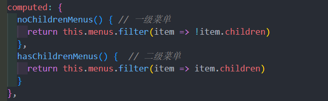

先用 v-for 循环遍历展示 nocChildrenMenus 菜单
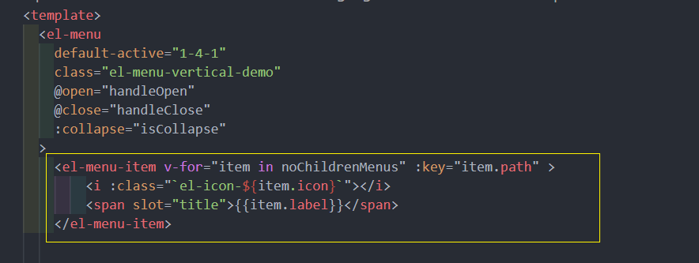

### 二级菜单展示
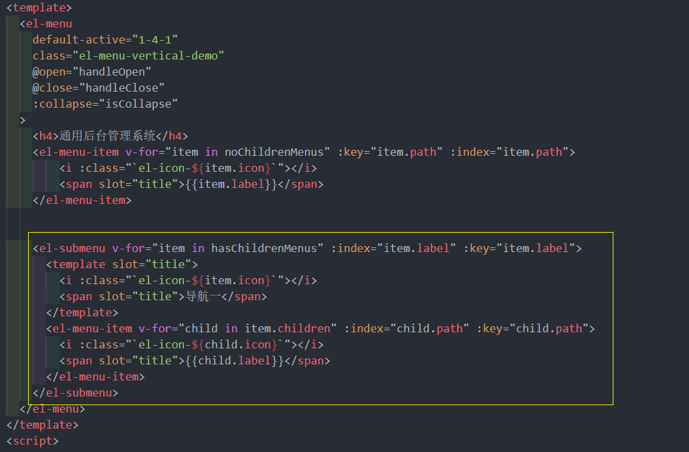
## 侧边栏的样式和路由的跳转
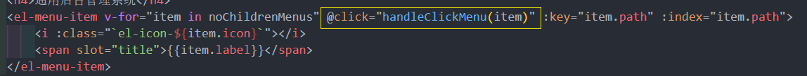
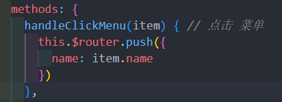

改一改路由表的结构, main 路由中用了嵌套路由
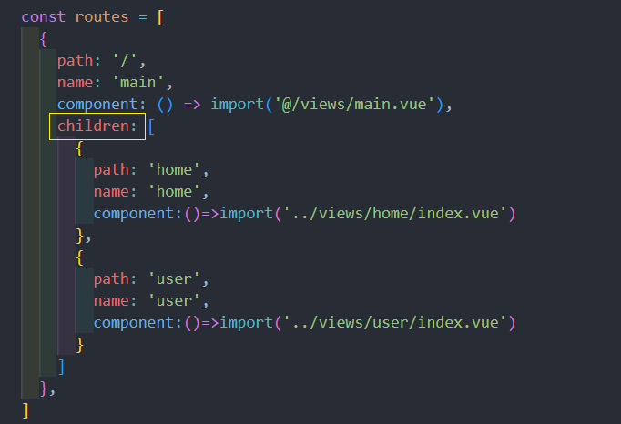

并且在 main.vue 加上 `<router-view>` , 展示自己的嵌套路由 
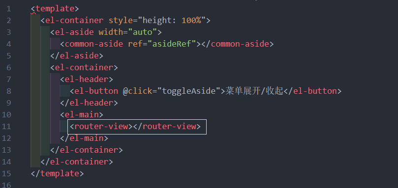

## header 组件
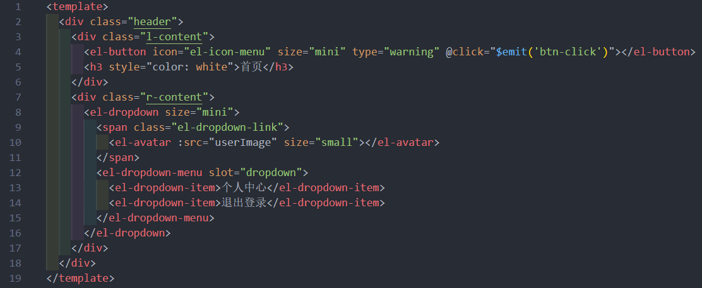
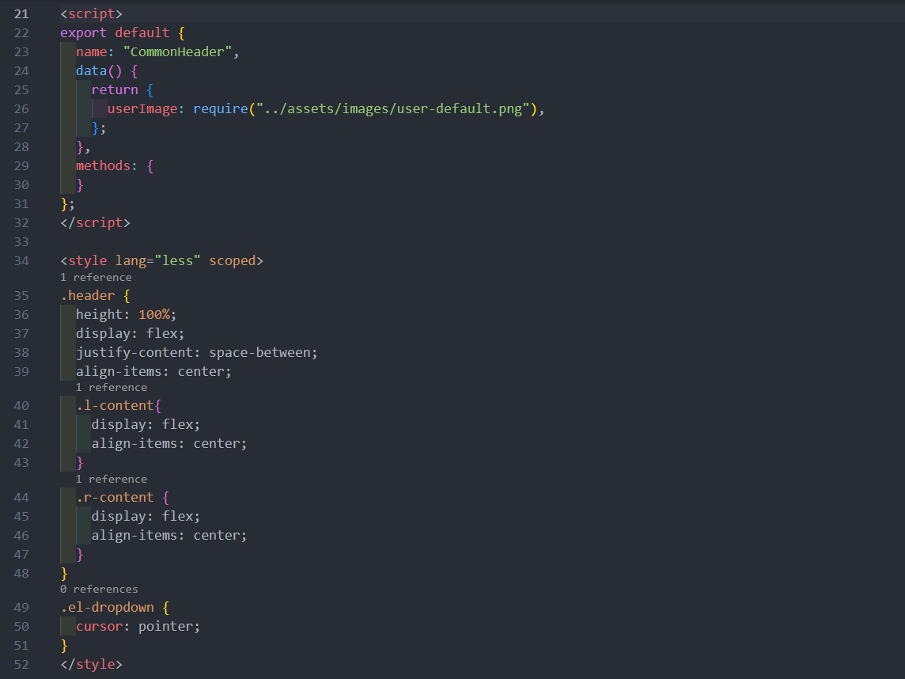

其中折叠侧边栏功能呢 ,可以直接用**组件通信**来实现, 很简单

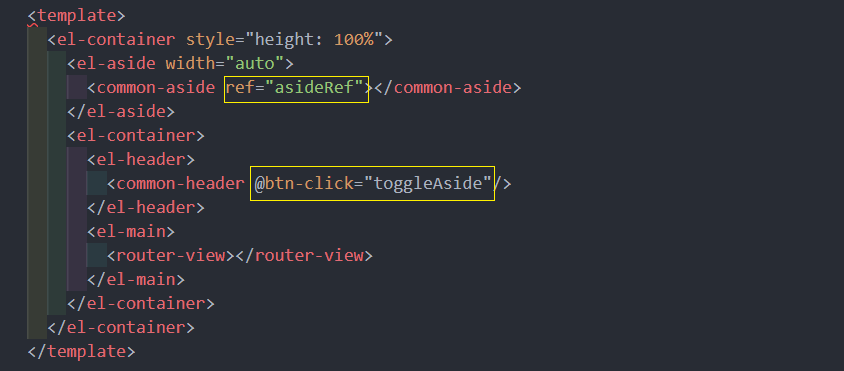
折叠功能时 el-menu组件的 collapse 属性控制 , 所以直接用 ref 获取到 侧边栏组件控制 iscollapse 变量的值 
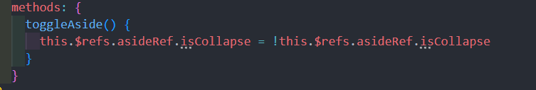

### 使用 Vuex 实现折叠侧边栏
这里还有一种方法可以用 Vuex 来实现, 逼格更高

Vue2的项目需要安装 Vuex 3.x版本的 Vuex
```
npm install vuex@3 --save
```
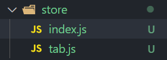
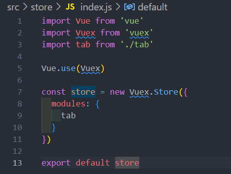
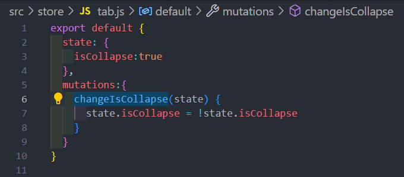

然后只需要在对应的组件上**绑定和调用**就 ok

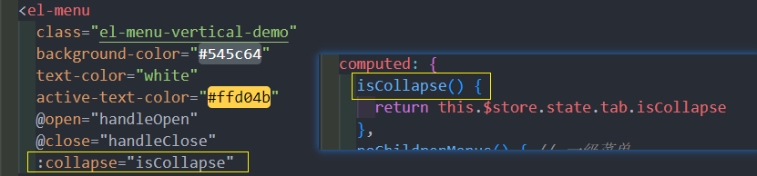
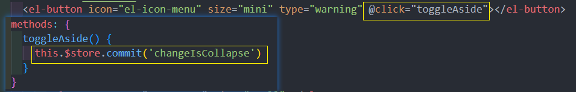
## main 组件


