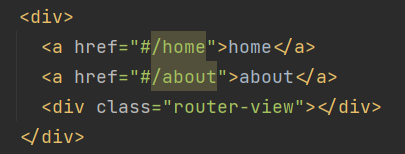
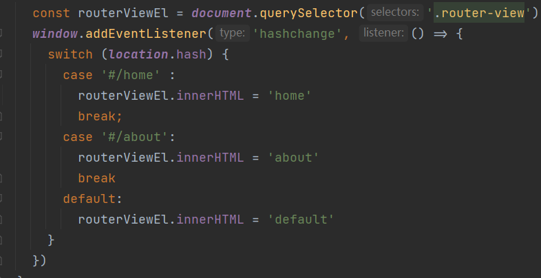
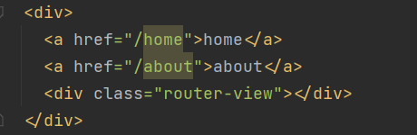
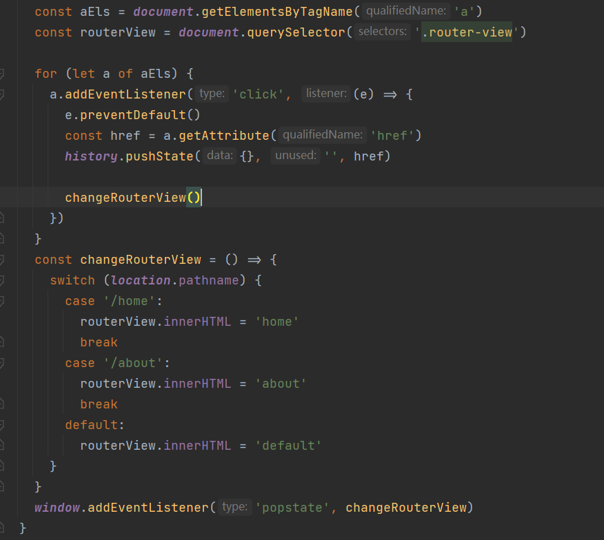

# 路由的原理
## URL的 hash
* URL的hash也就是锚点(#), 本质上是改变 window.location 的 href 属性
* 可以通过直接赋值 location.hash 来改变 href, 但是页面不发生刷新
  
  
* hash的优势就是兼容性更好, 在老板的IE中都可以运行 , 但缺点是有个 # , 显得不像是一个真是的路径
## HTML5的 history
history 接口是HTML5新增的, 他有六种模式改变URL而不刷新页面
* replaceState : 替换原来的路径
* pushState : 使用新的路径
* popState : 路径的回退
* go : 向前或向后改变路径
* forward : 向前改变路径
* back : 向后改变路径

