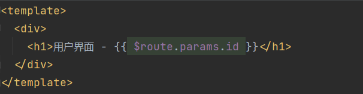

# vue-router的基本使用
[官网](https://router.vuejs.org/zh/introduction.html) 

Vue Router 是 Vue.js官方的路由管理器 , 适用于构建单页面应用  (单页应用路由管理器)

vue router 是基于路由组件的
* 路由用于设定访问路径, 将路径和组件映射起来
* 在 vue-router 的单页面应用中, 页面的路径的改变是组件的切换

## 安装
```sh{2}
yarn create vite vue --template vue
yarn add vue-router@4
yarn add -D sass@1.26.10  #安装sass 
```
## 路由的使用步骤
使用vue-router的步骤: 
* 第一步 : 创建路由组件的组件
* 第二步 : 配置路由映射: 组件和路径映射关系的 routes 数组 
* 第三步 : 通过createRouter 创建路由对象,  并且传入 routes 和 history 模式 
* 第四步 : 使用路由 , 通过 `<router-link>`和`<router-view>`
## 基本使用流程


<!-- #### createRouter
创建一个可以被 `Vue` 应用程序使用的路由实例。查看 [`RouterOptions`](https://router.vuejs.org/zh/api/#history) 中的所有可以传递的属性列表
```ts
export declare function createRouter(options: RouterOptions): Router
```
参数 `options`用来初始化 `router`
#### RouterOptions
[官网参考](https://router.vuejs.org/zh/api/#history)
#### RouteRecordRaw
[官网参考](https://router.vuejs.org/zh/api/#routerecordraw)
main.js
```js
import { createApp } from 'vue'
import App from './App.vue'
import './index.css'
import router from "./router";
createApp(App).use(router).mount('#app')    //app.use(router)
```
### hash模式 与 history模式
一个用`hash` , 一个用的`History API`
* `hash`模式 :
1. 地址永远带`#` , 不美观
2. 兼容性较好
3. `SEO` 差
* `history`模式:
1. 地址干净 , 美观
2. 兼容性比`hash`模式略差
3. 应用部署时需要后端人员配合 ,  解决刷新页面404的问题 , 否则页⾯刷新就挂了

大多数 `web` 应用程序都应该使用 `createWebHistory`，但它要求正确配置服务器。你还可以使用 `createWebHashHistory` 的基于 `hash` 的历史记录，它不需要在服务器上进行任何配置，但是搜索引擎根本不会处理它，在 `SEO` 上表现很差。

## 别名@ 
TS环境:
```sh
yarn add -D path
yarn add -D @types/node
```
```ts
import { defineConfig } from 'vite'
import vue from '@vitejs/plugin-vue'
import * as path from 'path'     //TS

export default defineConfig({
  plugins: [vue()],
  resolve:{
    alias:{'@':path.resolve(__dirname,'src')}
  }
})
```
## 配合TS的路由初始配置
router/routes.ts:
```ts
import {RouteRecordRaw} from 'vue-router';

const routes = [
    {
      path: '/',
      name: 'home',
      component: () => import('@/views/Home.vue')
    }
  ] as RouteRecordRaw[]

export default routes
```

router/index.ts: 
```ts{3,12,16-18}
import {createRouter, createWebHashHistory, RouteRecordRaw} from 'vue-router';
import {App} from 'vue';
import routes from './routes';

const router = createRouter({
  history: createWebHashHistory(),
  routes  
});

export function setupRouter(app: App) {
  app.use(router);
}

export default router;
```
main.ts:
```ts{5-11}
import { createApp } from 'vue'
import App from './App.vue'
import router , { setupRouter } from './router';

async function bootstrap() {
  const app = createApp(App)
  setupRouter(app)
  await router.isReady()   //等到路由器完成初始化导航, isReady()会返回promise, 后面再挂载
  app.mount('#app')
}
bootstrap()
``` -->
## router-link
router-link 上有很多属性可以配置: 
* **to 属性** : 是一个字符串, 或者是一个对象
* **replace 属性** : 设置 replace 属性的话, 当点击时回调用 router.replace(), 而不是 router.push()
* **active-class 属性** : 设置激活 a 元素后应用的 class , 默认是 router-link-active
* **exact-active-class 属性** : 链接精准激活时 , 应用于渲染 a 的class, 默认是 router-link-exact-active 

## 路由懒加载
当打包构建应用时, JavaScript包会变得非常大, 影响页面加载
* 如果能把不同路由对应的组件分割成不同的代码块, 然后当路由被访问的时候才加载对应组件, 这样就会更加高效
* 也可以提高首屏的加载效率

Vue router 默认就支持动态来导入组件
* 这是因为component 可以穿入一个组件, 也可以接受一个函数, 该函数需要返回一个Promise
* 而 import 函数就是返回一个Promise 


### 打包效果分析
* 从 webpack3.x 开始支持对分包进行命名 (chunk-name)
* 看一下 yarn build 打包结果


## 动态路由基本匹配
很多时候需要将给定匹配模式的路由映射到同一个组件：
* 例如， 可能有一个 User 组件， 它应该对所有的用户进行渲染， 但是用户的 ID 是不同的
* 在Vue router 中， 可以在路径中使用一个动态字段来实现， 称之为 **路径参数**

* 在router-link 中进行跳转

### 获取动态路由的值
在 User 组件内部如何获取到对应的值 ? 
* 在 template 中直接通过 $route.params.id 获取值 
* 在 created 中, 通过 this.$route.params.id 获取值 
* 在 setup 函数中, 使用 vue-router 提供的一个hook useRoute
 
该hook 会返回一个 Route对象, 对象保存着当前路由相关的值


### 匹配多个参数


## Not Found
对于那些没有匹配到的路由 , 通常会匹配到固定的页面
* 比如 Not Found的错误页面中, 可以编写动态路由用于匹配所有的页面

* 可以通过 $route.params.pathMatch 获取到传入的参数

### 匹配规则加 *

区别在于解析的时候 , 是否解析 /

## 编程式导航
* 希望通过代码啦跳转页面, 比如点击的是一个按钮


* 也可以传入一个对象


* 在setup函数里编写代码 , 可以用 useRouter


## router-link的 v-slot

## router-view的 v-slot
router-view 也提供了我们一个插槽, 可以用于`<transition>` 和 `<keep-alive>`组件来包裹我的路由组件
* **Component : 要渲染的组件**
* **route : 解析出来的标准化路由对象**


## 动态添加路由
某些情况下需要动态的来添加路由
* 比如根据路由不同的权限, 注册不同的路由
* 可以使用一个方法 addRoute


如果为 route 添加一个children 路由 , 那么可以传入对应的 name :


### 动态删除路由
删除路由的方式有三种: 
* 方式一 : 添加一个 name 相同的路由
* 方式二 : 通过 removeRoute 方法 , 传入路由的名称
* 方式三 : 通过 addRoute 方法的返回值回调 


#### 路由的其他方式
* **router.hasRoute() :** 检查路由是否存在
* **router.getRoutes() :** 获取一个包含所有路由记录的数组

## 路由导航守卫
vue-router 提供的导航守卫主要是用来通过跳转或者取消的方式守卫导航
* **全局的前置守卫 beforeEach 是在导航触发前会被回调的**

有两个参数:
* to : 即将进入的路由 Route 对象
* from : 即将离开的路由 Route 对象

返回值: 
* false : 取消当前导航
* 不返回或者返回undefined : 进行默认导航
* 返回一个地址: 
  * 可以是 string 类型的路径
  * 可以是对象, 对象中包含path , query , params等信息

可选的第三个参数: 
* Vue2 中通过next 参数来决定如何进行跳转
* 但是在Vue3中更建议通过返回值来控制,  不在推荐使用 next 函数, 这是因为开发中很容易调用多次 next

比如完成一个功能 , 只有登录后才能看到其他页面: 


