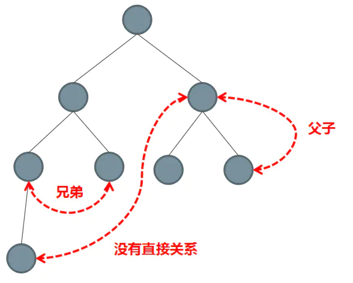

# Vue组件之间的通信方式

## 1. 组件间通信的分类

* 父子组件之间的通信
* 兄弟组件之间的通信
* 祖孙与后代组件之间的通信
* 非关系组件间之间的通信
  

## 2. 组件间通信的方案

我常用的`vue`的常规的通信方案

1. 通过 `props` 传递
2. 通过 `$emit` 触发自定义事件
3. EventBus
4. `Provide` 与 `Inject`
5. VueX

### props传递数据

* 适用场景：父组件传递数据给子组件
* 子组件设置`props`属性，定义接收父组件传递过来的参数
* 父组件在使用子组件标签中通过字面量来传递值

`Children.vue`

```vue
<script>
export default {
  props: {   //props的类型定义
    name: {
      type: String,    // 接收的类型为字符串  
      default: 'Eren'  // 默认值为 'Eren'
    },
    age: {
      type: Number,
      required: true  // age属性必须传递 
    }
  }
}
</script>
```

`Father.vue`组件

```vue
<Children name="jack" age="18"></Children>
```

### $emit 触发自定义事件

* 适用场景：子组件传递数据给父组件
* 子组件通过$emit触发自定义事件，$emit第二个参数为传递的数值
* 父组件绑定监听器获取到子组件传递过来的参数

`Children.vue`

```js
this.$emit('update:title', newTitle)
```

`Father.vue`组件

```vue
<Children
    v-bind:title="title"
    v-on:update:title="title = $event"
></Children>
//上面代码用.sync修饰符 , 可缩写为
<Children  :title.sync="title" ></Children>
```

或者 使用回调函数

```vue
<Children
    v-bind:title="title"
    v-on:update:title="changeTitle"
></Children>
```
```js
methods:{
    changeTitle(title){
      this.title = title
   } 
}
```

## EventBus
* 使用场景：兄弟组件传值
* 创建一个中央事件总线EventBus
* 兄弟组件通过$emit触发自定义事件，$emit第二个参数为传递的数值
* 另一个兄弟组件通过$on监听自定义事件

eventBus.js
```js
import Vue from 'vue'
export default new Vue()
```
`Children1.vue`
```js
import eventBus from 'eventBus.js'
eventBus.$emit('event',newValue)
```
`Children2.vue`
```js
import eventBus from 'eventBus.js'
eventBus.$on('event',newValue)
```
## provide 与 inject
* 在祖先组件定义provide属性，返回传递的值
* 在后代组件通过inject接收组件传递过来的值

祖先组件
```js
provide(){  
    return {  
        foo:'foo'  
    }  
}  
```
后代组件
```js
inject:['foo'] // 获取到祖先组件传递过来的值
```

### Vuex
适用场景: 复杂关系的组件数据传递

Vuex作用相当于一个用来存储共享变量的容器

* `Vuex` 是一个专为 `Vue.js` 应用程序开发的状态管理模式+库
* `store`是个大容器,包含了所有内容 , 包括 `actions` , `mutations` , `state` , `getters`
* `State`用来读取状态, 可以保存数据 , 带有一个`mapState`函数
* `Getter`,允许组件从 `Store` 中获取数据,`mapGetters` 辅助函数仅仅是将 `store` 中的 `getter` 映射到局部计算属性。
* `Mutation`用于同步提交状态变更 , 是唯一更改 `store` 中状态的方法.
* `Action`用于异步变更状态 , 用于提交 `mutation` , 而不是直接变更状态.
* 小插曲: `mutations` 和 `actions`的区别:
  1. `Action` 提交的是 `mutation`,而不是直接变更状态。
  2. `Action` 可以包含任意异步操作。`mutation`只支持同步
* `Module`用来给`store`划分模块 , 方便维护代码