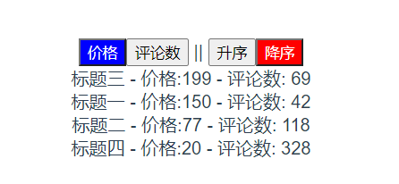

# computed 和 watch

## 1. computed 计算属性

如果在模板里做过多的计算 ,每次还需要定义函数名 ,这显然不是正确的写法。 而且我们在store里拿到getters试图显示到模板时 , 想不到合适的方法 , 这种时候可以用`computed`

* `computed`支持缓存，只有依赖数据发生改变，才会重新进行计算
* 不支持异步，当computed内有异步操作时无效，无法监听数据的变化
* `computed` 属性值会默认走缓存，计算属性是基于它们的响应式依赖进行缓存的，也就是基于`data`中声明过或者父组件传递的`props`中的数据通过计算得到的值
* 如果一个属性是由其他属性计算而来的，这个属性依赖其他属性，是一个多对一或者一对一，一般用`computed`

`computed`如下使用
```vue

<template>
  <div>
    <p>{{ ticketList }}</p>
    <p>{{ increase }}</p>
  </div>
</template>
<script>
export default {
  data() {
    return {
      score: 1
    };
  },
  computed: {
    increase() {
      return score + 1;
      //可直拿到data依赖 , 把计算结果反应到模板里
    },
    ticketList() {
      return this.$store.getters["ticket/ticket"];
      // 在ticket.js的store中拿到getters之后显示到模板里
    }
  }
};
</script>
```

### 可写的计算属性 getter setter
小demo , 主要实现了根据价格和评论数 ,按升序或者降序排列的小案例

```vue
<template>
  <button @click="orderBy = 'price'" :class="{orderBy:orderBy==='price'}">价格</button>
  <button @click="orderBy = 'comments'" :class="{orderBy:orderBy==='comments'}">评论数</button>
  ||
  <button @click="lessonsList = 'asc'" :class="{orderType:orderType==='asc'}">升序</button>
  <button @click="lessonsList = 'desc'" :class="{orderType:orderType==='desc'}">降序</button>
  <div v-for="lesson in lessonsList" :key="lesson.id">
    <div>{{lesson.title}} - 价格:{{lesson.price}} - 评论数: {{lesson.comments}}</div>
  </div>
</template>

<script>
export default {
  data() {
    return {
      lessons: [
        {"id": 1, "title": "标题一", "status": false, "price": 150, "comments": 42},
        {"id": 2, "title": "标题二", "status": false, "price": 77, "comments": 118},
        {"id": 3, "title": "标题三", "status": false, "price": 199, "comments": 69},
        {"id": 4, "title": "标题四", "status": false, "price": 20, "comments": 328}
      ],
      orderBy: 'price',
      orderType: 'asc'
    }
  },
  computed: {
    lessonsList: {  //对象的形式
      get() {  //getter
        return this.lessons.sort((a, b) => {
          return this.orderType === 'asc' ? (a[this.orderBy] - b[this.orderBy]) : (b[this.orderBy] - a[this.orderBy])
        })
      },
      set(newValue) {  //setter
        this.orderType = newValue
      }
    }
  }
}
</script>

<style lang="css" scoped>
button.orderType {
  background: red;
  color: white
}

button.orderBy {
  background: blue;
  color: white
}
</style>

```

## 2. watch 侦听属性

* 不支持缓存，数据变，直接会触发相应的操作；
* `watch`支持异步；当需要在数据变化时执行异步或开销较大的操作时，这个方式是最有用的。
* 监听的函数接收两个参数，第一个参数是最新的值；第二个参数是输入之前的值；
* 当一个属性发生变化时，需要执行对应的操作；一对多；
* 监听数据必须是data中声明过或者父组件传递过来的`props`中的数据，当数据变化时，触发其他操作，函数有两个参数，
  `immediate`：组件加载立即触发回调函数执行，
  `deep`: 深度监听，为了发现对象内部值的变化，复杂类型的数据时使用，例如数组中的对象内容的改变，但是监听数组的变动不需要这么做。

```vue
<script>
export default {
  watch: {
    $route: {
      handler() {
        this.changeData();
      },
      immediate: true
      //加载之后立即被调用
    }
  }
};
</script>
```

或者监听data里面属性 ,当监听的值变化是做相应的操作

```vue
<script>
export default {
  data() {
    return {
      user: {
        username: '',
        password: ''
      },
      msg: undefined
    }
  },
  watch: {
    'user.password': function (newValue, oldValue) {
      setTimeout(() => {
        if (newValue.length < 6) {
          this.msg = '密码太短'
        }
        if (newValue.length > 15) {
          this.msg = '密码太长'
        }
        this.msg = ''
      }, 1000)
    }
  }
};
</script>
```
