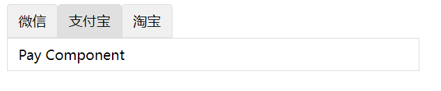

# 动态组件
通过`component`标签 的`is`属性来进行组件的切换
`is`的属性值决定要显示的组件，所以将`is`的属性值设置为`data`中的值，以便于动态变化
* 基本用法
```html
<component v-bind:is="currentTabComponent"></component>
```
制作一个小demo


父组件
```vue
<template>
  <div>
    <header>
      <span class="title"
        v-for="(content, index) of contents"
        :key="index"
        @click="currentComponent = content.name"  :class="{'active' :currentComponent === content.name }">
        {{ content.title }}
      </span>
    </header>
    <div class="component">
      <component :is="currentComponent"></component>
    </div>
  </div>
</template>
<script>
import Pay from "./components/Pay.vue";
import Weixin from "./components/Weixin.vue";
import Taobao from "./components/Taobao.vue";
export default {
  name: "App",
  components: {
    Pay,
    Weixin,
    Taobao
  },
  data() {
    return {
      currentComponent: "weixin",
      contents: [
        { title: "微信", name: "weixin" },
        { title: "支付宝", name: "pay" },
        { title: "淘宝", name: "taobao" },
      ],
    };
  },
};
</script>
<style lang="scss" scoped>
header {
  .title {
    display: inline-block;
    border: 1px solid #ddd;
    padding: 8px 12px;
    border-top-left-radius: 4px;
    border-top-right-radius: 4px;
    background: #f0f0f0;
    cursor: pointer;
    transition: all 0.2s ease;
    &.active {
        background: #e0e0e0;
    }
  }
}
.component {
  border: 1px solid #ddd;
  width: 50%;
  padding: 8px 12px;
}
</style>

```
子组件
```vue
<template>
  <div>Pay Component</div>
</template>
<script>
export default {
 name:'Pay'
}
</script>
<style  lang="scss" scoped>
</style>
```