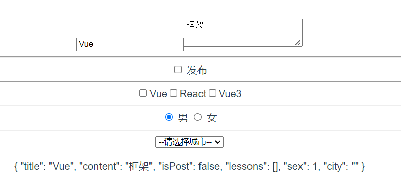

# Vue中的表单基本使用
## 表单输入绑定
一个关于表单的小demo

```vue
<template>
  <input type="text" v-model="form.title" placeholder="请填写内容">  <!-- 文本 -->
  <textarea v-model="form.content"></textarea>    <!--多行文本-->
  <hr />
  <input type="checkbox" v-model="form.isPost" /> 发布   <!--复选框-->
  <hr />
  <label v-for="l of lessons" :key="l.value">     
    <input type="checkbox" v-model="form.lessons" :value="l.value" />{{
    l.title
    }}
  </label>
  <hr />
  <input type="radio" v-model="form.sex" :value="1"> 男   <!--单选框-->
  <input type="radio" v-model="form.sex" :value="2"> 女
  <hr />
  <select v-model="form.city" >    <!--选择框-->
    <option value>--请选择城市--</option>
    <option value="beijing">北京</option>
    <option value="wuhan">武汉</option>
  </select>
  <hr />
  {{ form }}
</template>

<script>
export default {
  data() {
    return {
      form: {
        title: "Vue",
        content: "框架",
        isPost: false,
        lessons: [],
        sex:1,
        city:''
      },
      lessons: [
        { title: "Vue", value: "Vue" },
        { title: "React", value: "React" },
        { title: "Vue3", value: "Vue3" },
      ],
    };
  },
};
</script>
```
## 表单修饰符
### .lazy
在默认情况下，`v-model` 在每次 `input`事件触发后将输入框的值与数据进行同步 (除了上述输入法组合文字时)。
你可以添加 `lazy` 修饰符，从而转为在 `change` 事件_之后_进行同步：
```html
<!-- 在“change”时而非“input”时更新 -->
<input v-model.lazy="msg">
```
### .number
如果想自动将用户的输入值转为数值类型，可以给 v-model 添加 number 修饰符
```html
<input v-model.number="age" type="number">
```
### .trim
会把左右空白消除掉
```html
<input v-model.trim="msg">
```
