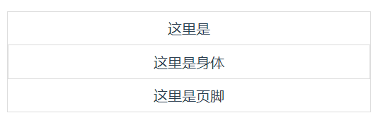
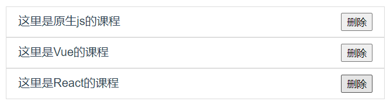

# Vue中的插槽 - slot
## 1. 后备内容
有时为一个插槽设置具体的后备 (也就是`默认`的) 内容是很有用的，它只会在没有提供内容的时候被渲染。

子组件:
```vue
<template>
  <button>  
    <slot>插槽的默认内容</slot>
  </button>
</template>
```
父组件:
```vue
<template>
  <Demo></Demo>  <!--即使没传内容 , 页面显示的是'插槽点的默认内容'-->
</template>
<script>
import Demo from './Demo.vue'
export default {
  name: 'App',
  components: {
    Demo,
  }
}
</script>
```
## 2. 具名插槽
* 基本用法:
`<slot name="xxx"></slot>` 和 `<template v-slot:xxx></template>` 

子组件:
```vue
<template>
  <div>
    <header>
      <slot name="header"></slot>  
    </header>
    <main>
      <slot name="main"></slot>
    </main>
    <footer>
      <slot name="footer"></slot>   
    </footer>    
  </div>
</template>

<script>
export default {};
</script>
<style lang="scss" scoped>
  div {
    border: 1px solid #ddd;
    header,main,footer {
      padding:8px 12px;
    }
    main {
      border: 1px solid #ddd;
    }
  }
</style>
```


父组件:
```vue
<template>
  <Demo>'
    <template v-slot:header>
      这里是头部
    </template>
    <template v-slot:main>
      这里是身体
    </template>
    <template v-slot:footer>   <!-- 可缩写成 <template #footer>-->
      这里是页脚
    </template>
  </Demo>
</template>

<script>
import Demo from './components/Demo.vue'
export default {
  name: 'App',
  components: {
    Demo,
  }
}
</script>
```
## 3. 解构插槽 Prop
实现一个小案例 , 点击删除键, 可以删除一个列表

* 先用普通的方法来实现

父组件:
```vue
<template>
  <lesson v-for="lesson of lessons" :key="lesson.id" :lesson="lesson">
    <template v-slot:default>
      <button @click="del(lesson)">删除</button>     <!--通过默认插槽传入一个删除按钮-->  
    </template>
  </lesson>  
</template>

<script>
import lesson from './components/lesson.vue'
export default {
  name: 'App',
  components: { lesson },
  data(){
    return {
      lessons :[
        {id:1 , title:'这里是原生js的课程'},
        {id:2 , title:'这里是Vue的课程'},
        {id:3 , title:'这里是React的课程'}
      ]
    }
  },
  methods:{
    del(lesson) {     //声明一个删除功能的函数
        const index = this.lessons.findIndex((l)=>l.id === lesson.id)  
        this.lessons.splice(index , 1)  //通过索引删除
    }
  }
}
</script>
```
子组件:
```vue
<template>
  <div>
    {{lesson.title}}
    <slot ></slot>
  </div>
</template>
<script>
export default {
  props:{
    lesson:{
      type:Object
    }
  }
}
</script>
<style lang="" scoped>
div {
  border: 1px solid #ddd;
  padding: 8px 16px;
  display: flex;
  justify-content: space-between;
}
</style>
```
* 现在用解构插槽 , 重新实现一下相同的功能
* 但先了解一下基本用法!!:
```html
<template v-slot:default="slotProps">
    {{slotProps.xxx}}
</template>
<!--或者 直接使用解析解构!-->
<template v-slot:default="{ xxx }">
    {{xxx}}
</template>
```
好 , 现在重新写一下小案例 ! 

父组件:
```vue {3-4}
<template>
  <lesson v-for="lesson of lessons" :key="lesson.id" :lesson="lesson">
    <template v-slot:default="{ id }">  <!--子组件里面传过来的是一个由slotProps组成的对象 , 所以可用ES6解构语法, 直接拿到-->
      <button @click="del( id )">删除</button>
    </template>
  </lesson>
</template>

<script>
import lesson from "./components/lesson.vue";
export default {
  name: "App",
  components: {
    lesson,
  },
  data() {
    return {
      lessons: [
        { id: 1, title: "这里是原生js的课程" },
        { id: 2, title: "这里是Vue的课程" },
        { id: 3, title: "这里是React的课程" },
      ],
    };
  },
  methods: {
    del(id) {
      const index = this.lessons.findIndex((l) => l.id === id);
      this.lessons.splice(index, 1);
    },
  },
};
</script>
```

子组件:
```vue {4}
<template>
  <div>
    {{lesson.title}}
    <slot id="lesson.id" title="lesson.title" ></slot>  <!--子组件中在slot里传 props -->
  </div>
</template>
<script>
export default {
  props:{
    lesson:{
      type:Object
    }
  }
}
</script>
<style lang="" scoped>
div {
  border: 1px solid #ddd;
  padding: 8px 16px;
  display: flex;
  justify-content: space-between;
}
</style>
```
## 4. 默认插槽
父组件
```vue{2}
<template>
  <lesson v-for="lesson of lessons" :key="lesson.id" :lesson="lesson" v-slot="{ id }"> <!-- 使用默认插槽改写-->
    <!-- <template v-slot:default="{ id }">   --> 
      <button @click="del( id )">删除</button>
    <!-- </template> -->
  </lesson>
</template>

<script>
import lesson from "./components/lesson2.vue";
export default {
  name: "App",
  components: {
    lesson,
  },
  data() {
    return {
      lessons: [
        { id: 1, title: "这里是原生js的课程" },
        { id: 2, title: "这里是Vue的课程" },
        { id: 3, title: "这里是React的课程" },
      ],
    };
  },
  methods: {
    del(id) {
      const index = this.lessons.findIndex((l) => l.id === id);
      this.lessons.splice(index, 1);
    },
  },
};
</script>
```
