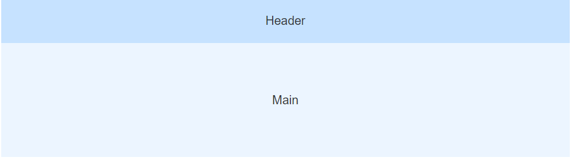
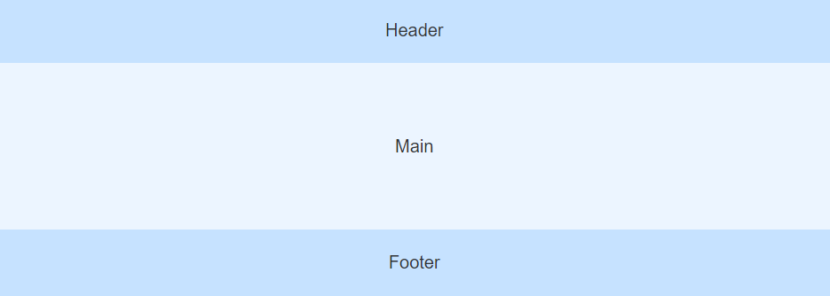
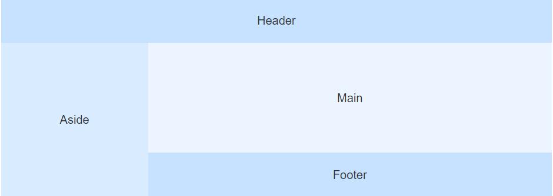
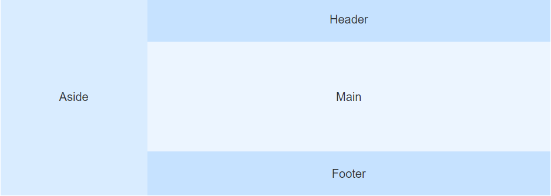

# Container 布局容器
## 需求与API设计
* `<g-container>`：外层容器。 如果子元素内有`<g-aside>`就左右水平布局
* `<g-header>`：顶栏容器
* `<g-aside>`：侧边栏容器
* `<g-main>`：主要区域容器
* `<g-footer>`：底栏容器

(1)
```vue
  <g-container>
    <g-header></g-header>
    <g-main></g-main>
  </g-container>
```
(2)
```vue
  <g-container>
    <g-header></g-header>
    <g-main></g-main>
    <g-footer></g-footer>
  </g-container>
```
(3)
```vue
  <g-container>
    <g-aside></g-aside>
    <g-container>
      <g-main></g-main>
      <g-footer></g-footer>
    </g-container>
  </g-container>  
```

```vue
 <g-container>
    <g-aside></g-aside>
    <g-container>
      <g-header></g-header>
      <g-main></g-main>
      <g-footer></g-footer>
    </g-container>
  </g-container>  
```
## 基本的实现
**思路** : 平常的`g-container`的`flex-direction`为`column`上下垂直布局 , 如果`g-container`里存在`g-aside`组件, 那么其类名中添加`hasAside`字段 , 并添加相应的属性`flex-direction`为`row`完成水平左右布局

* `$children` : 当前实例的直接**子组件**(vue 组件)
* `$options`: 当前 Vue 实例的初始化选项

父组件的`created`里是无法访问到子组件 , 在`mounted`里访问到 , 这是因为: 
* 加载渲染过程

父 beforeCreate -> 父 created -> 父 beforeMount -> 子 beforeCreate -> 子 created -> 子 beforeMount -> **子 mounted -> 父 mounted**

g-container.vue
```vue
<template>
  <div class="container" :class="containerClasses">
    <slot></slot>
  </div>
</template>
<script lang="js">
export default {
  data(){
    return {
      containerClasses:{
        hasAside:false
      }
    }
  },
  mounted(){
    this.$children.forEach((vm)=>{
      if(vm.$options.name === 'GuluAside'){
        this.containerClasses.hasAside = true
      }
    })
  }
}
</script>
<style lang="scss" scoped>
.container {
  display: flex;
  flex-grow: 1;
  flex-direction: column;
  &.hasAside {
    flex-direction: row;
  }
}
</style>
```
g-aside.vue
```vue
<template>
  <div class="aside">
    <slot></slot>
  </div>
</template>
<script lang="js">
export default {
  name:'GuluAside'
}
</script>
<style lang="scss" scoped>
</style>
```