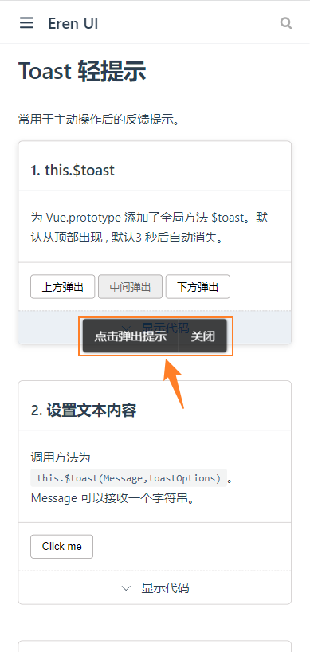
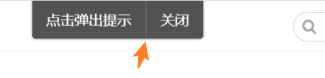

# Toast 轻提示组件

## 需求与API设计
点击按钮时弹出提示框
* 自动关闭: 默认情况下，通知在`4500`毫秒后自动关闭，但可以通过设置 `duration` 属性来自定义通知的展示时间。 如果将它设置为 `0`，那么通知将不会自动关闭。 需要注意的是 `duration` 接收一个 `Number`，单位为毫秒。
* 默认有关闭按钮, 用户点击关闭 , 点击后有可能触发一个回调。将 `showClose` 属性设置为 `false` 即可隐藏关闭按钮
* 弹出框在屏幕永远保证只能显示出一个 ,并且提示已经出现后再次点也没用 
* 用`enableHtml`设置是否支持`html`的形式
* 可配置顶部、中间、下面三个位置

```html
<button @click="showToast()">click</button>  
```
this.$toast(message, options)调用
```
methods:{
  showToast(){
    this.$toast('hello',{
      position: 'middle',
      enableHtml:true,
      closeButton:{
        text:'关闭按钮',
        callback(){
          console.log('你点击了关闭按钮')
        }
      }
      ....
    })
  }
}
```
## 插件
[使用插件](https://cn.vuejs.org/v2/guide/plugins.html#%E4%BD%BF%E7%94%A8%E6%8F%92%E4%BB%B6),[开发插件](https://cn.vuejs.org/v2/guide/plugins.html#%E5%BC%80%E5%8F%91%E6%8F%92%E4%BB%B6)

开发插件: `Vue` 的插件应该暴露一个 `install` 方法 , 这个方法的第一个参数是 `Vue` 构造器，第二个参数是一个可选的选项对象：

plugin.ts
```ts
export default {
  install(Vue,options){
    //添加实例方法
    Vue.prototype.$toast = function (methodOptions){
      alert('提示')
    }
  }
}
```
全局方法 `Vue.use()` 使用插件。它需要在你调用 `new Vue()` 启动应用之前完成：

app.js
```js
import plugin from "./plugin";

Vue.use(plugin)
```
## 动态组件挂载
plugin.js
```js{7-11}
import Toast from './g-toast.vue';

export default {
  install(Vue, options) {
    //添加实例方法
    Vue.prototype.$toast = function (message) {
      let Constructor = Vue.extend(Toast);
      let toast = new Constructor();
      toast.$slots.default = [message];
      toast.$mount();
      document.body.appendChild(toast.$el);
    };
  }
};
```
## 最基本的实现
g-toast.vue
```vue
<template>
<div class="toast">
  <div class="content">
    <slot></slot>
  </div>
  <div class="close" v-if="showClose" @click="onClickClose" >
    关闭
  </div>
</div>
</template>
<script lang="js">
export  default  {
  props:{
    duration:{
      type:Number,
      default:4500   //单位为毫秒
    },
    showClose:{
      type:Boolean,
      default: true
    },
    closeButton:{
      type:Object,
      default(){      //default是对象的话 , 要用函数return返回
        return{
          text:'关闭',
          callback:undefined
        }
      }
    }
  },
  methods:{
    close(){
        this.$el.remove()
        this.$destroy()
    },
    onClickClose(){
      this.close()
      if(this.closeButton && typeof this.closeButton.callback === 'function')
            this.closeButton.callback(this)       // 细节: 可以传入this , 想让外面调自己
    }
  },
  mounted(){
    if(this.duration > 0){
      setTimeout(()=>{
          this.close()
      },this.duration)
    }
  }
}

</script>
<style lang="scss" scoped>
$font-size:14px;
$bg-color:  #424242;
.toast {
  position: fixed;
  left: 50%;
  top:0;
  padding: 6px 0px 6px 10px;
  transform: translateX(-50%);
  font-size: $font-size;
  line-height: 1.8;
  background: $bg-color;
  color: #eeeeee;
  border-radius: 4px;
  display: flex;
  align-items: center;
  .content{
padding-right:10px ;
  }
  .close {
    border-left: 1px solid #eeeeee;
    padding:0 10px ;
  }
}
</style>

```
`propsData`的使用

plugin.js
```js
import Toast from './g-toast.vue';

export default {
  install(Vue, options) {
    //添加实例方法
    Vue.prototype.$toast = function (message , toastOptions) {
      let Constructor = Vue.extend(Toast);
      let toast = new Constructor({
        propsData:{                                       // propsData的使用
          closeButton : toastOptions.closeButton
        }
      });
      toast.$slots.default = [message];
      toast.$mount();
      document.body.appendChild(toast.$el);
    };
  }
};
```
实际调用时: 
```
  this.$toast('哈喽' , {
           closeButton:{
              text:'知道了',
              callback(){
                  console.log('你点击了关闭按钮')
              }
          }
      })
```
### 支持html
`enableHtml`为`true`时 , 显示`v-html` , 否则显示原来的`slot`
g-toast.vue
```vue{3,4}
<template>
<div class="toast">
  <div class="content" v-html="$slots.default[0]"></div>
  <div class="close" v-if="showClose" @click="onClickClose" >
    关闭
  </div>
</div>
</template>
<script lang="js">
export  default  {
  props:{
    ...
    enableHtml:{
      type:Boolean,
      default:false
    }
  },
  ...
}
</script >
``` 

### 中间的线


`$refs` 和 `$nextTick`的使用

`$nextTick` :将回调延迟到下次 `DOM` 更新循环之后执行。 在修改数据之后立即使用它，然后等待 `DOM` 更新。
获取`toast`的总高度 , 强制把高度赋给`line`的高度
[nextTick异步更新队列](https://cn.vuejs.org/v2/guide/reactivity.html#%E5%BC%82%E6%AD%A5%E6%9B%B4%E6%96%B0%E9%98%9F%E5%88%97)
注意要`nextTick`异步获取高度
```vue{2,5,54-57}
<template>
<div class="toast" ref="toast">
  <div v-if="enableHtml" class="content" v-html="$slots.default[0]"></div>
  <div v-else class="content"><slot></slot></div>
  <div class="line" ref="line"></div>
  <div class="close" v-if="showClose" @click="onClickClose" >
    关闭
  </div>
</div>
</template>
<script lang="js">
export  default  {
  props:{
    duration:{
      type:Number,
      default:4500   //单位为毫秒
    },
    showClose:{
      type:Boolean,
      default: true
    },
    closeButton:{
      type:Object,
      default(){      //default是对象的话 , 要用函数return返回
        return{
          text:'关闭',
          callback:undefined
        }
      }
    },
    enableHtml:{
      type:Boolean,
      default:false
    }
  },
  methods:{
    close(){
        this.$el.remove()
        this.$destroy()
    },
    onClickClose(){
      this.close()
      if(this.closeButton && typeof this.closeButton.callback === 'function')
      this.closeButton.callback(this)       // 细节: 传入this , 想让外面调自己
    }
  },
  mounted(){
    if(this.duration > 0){
      setTimeout(()=>{
          this.close()
      },this.duration)
    }

    this.$nextTick(()=>{
      const totalHeight = this.$refs.toast.getBoundingClientRect().height
      this.$refs.line.style.height = totalHeight+ 'px'
    })
  }
}

</script>
<style lang="scss" scoped>
$font-size:14px;
$bg-color:  #424242;
.toast {
  position: fixed;
  left: 50%;
  top:0;
  padding: 0 0 0 10px;
  transform: translateX(-50%);
  font-size: $font-size;
  line-height: 1.8;
  background: $bg-color;
  color: #eeeeee;
  border-radius: 4px;
  display: flex;
  align-items: center;
  max-width:300px;
  .content{
    padding:6px 10px 6px 0 ;
  }
  .close {
    padding:0 10px ;
  }
  .line {
  border-left: 1px solid #eeeeee;
  }
}
</style>
```
## 位置(上,中,下)
`position`可设置为 `top`,'bottom','middle'
```vue{2,35-41,43-49,102-114}
<template>
<div class="toast" ref="toast" :class="classes">
  <div v-if="enableHtml" class="content" v-html="$slots.default[0]"></div>
  <div v-else class="content"><slot></slot></div>
  <div class="line" ref="line"></div>
  <div class="close" v-if="showClose" @click="onClickClose" >
    关闭
  </div>
</div>
</template>
<script lang="js">
export  default  {
  props:{
    duration:{
      type:Number,
      default:4500   //单位为毫秒
    },
    showClose:{
      type:Boolean,
      default: true
    },
    closeButton:{
      type:Object,
      default(){      //default是对象的话 , 要用函数return返回
        return{
          text:'关闭',
          callback:undefined
        }
      }
    },
    enableHtml:{
      type:Boolean,
      default:false
    },
    position:{
      type:String,
      default:'middle',
      validate(value){
        return ['top','middle','bottom'].indexOf(value) >= 0          // 也可用includes,  但它兼容性不好(IE不支持), 所以用indexOf
      }
    }
  },
  computed:{
    classes(){
      return {
        [`position-${this.position}`] : true
      }
    }
  },
  methods:{
    close(){
        this.$el.remove()
        this.$destroy()
    },
    onClickClose(){
      this.close()
      if(this.closeButton && typeof this.closeButton.callback === 'function')
      this.closeButton.callback(this)       // 细节: 传入this , 想让外面调自己
    }
  },
  mounted(){
    if(this.duration > 0){
      setTimeout(()=>{
          this.close()
      },this.duration)
    }
    this.$nextTick(()=>{
      const totalHeight = this.$refs.toast.getBoundingClientRect().height
      this.$refs.line.style.height = totalHeight+ 'px'
    })
  }
}

</script>
<style lang="scss" scoped>
$font-size:14px;
$bg-color:  #424242;
.toast {
  position: fixed;
  left: 50%;
  padding: 0 0 0 10px;
  font-size: $font-size;
  line-height: 1.8;
  background: $bg-color;
  color: #eeeeee;
  border-radius: 4px;
  display: flex;
  align-items: center;
  max-width:300px;
  .content{
    padding:6px 10px 6px 0 ;
  }
  .close {
    padding:0 10px ;
    white-space: nowrap;
  }
  .line {
  border-left: 1px solid #eeeeee;
  }
  &.position-top{
    top:0;
    transform: translateX(-50%);
  }
  &.position-middle{
    top:50%;
    transform: translate(-50%,-50%);
  }
  &.position-bottom{
    bottom: 0;
    transform: translateX(-50%);
  }
}
</style>
```
## 如果页面里有出现`toast`, 干掉它在出现  (重构)
重构 : 提取函数起个名 , return 当前`toast` 

如果`toast`存在就干掉
plugin.js
```js
import Toast from './g-toast.vue';

let currentToast
export default {
  install(Vue, options) {
    //添加实例方法
    Vue.prototype.$toast = function (message , toastOptions) {
      if (currentToast){
       currentToast.close()
      }
      currentToast = createToast(Vue, message ,toastOptions )
    };
  }
};

function createToast(Vue,message , toastOptions){
  let Constructor = Vue.extend(Toast);
  let toast = new Constructor({
    propsData:{...toastOptions}
  });
  toast.$slots.default = [message];
  toast.$mount();
  document.body.appendChild(toast.$el);
  return toast                        
}
```