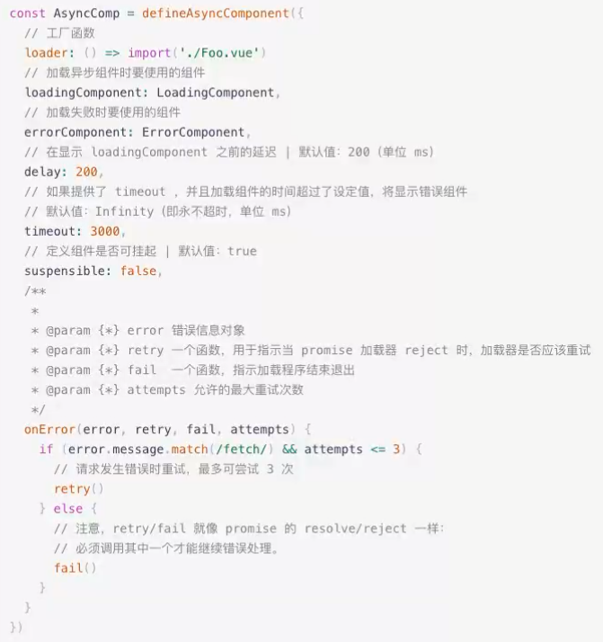

# 异步组件
[官网](https://staging-cn.vuejs.org/api/general.html#defineasynccomponent)
## 基本使用
在大型项目中，我们可能需要拆分应用为更小的块，并仅在需要时再从服务器加载相关组件。为实现这点，`Vue` 提供了一个 `defineAsyncComponent` 方法：

ES 模块动态导入也会返回一个`Promise`，所以多数情况下我们会将它和 `defineAsyncComponent` 搭配使用，类似 `Vite` 和 `Webpack` 这样的构建工具也支持这种语法，因此我们也可以用它来导入 `Vue` **单文件组件**

`defineAsyncComponent`接受两种类型的参数
* **类型一**: 工厂函数 , 该工厂函数需要返回一个`Promise`
* **类型二**: 接受一个对象类型 , 对异步函数进行配置
```vue
<script lang="ts" setup>
import {defineAsyncComponent} from 'vue';

const AsyncComp = defineAsyncComponent(()=>{
  return import('./asyncComponent.vue')
})
</script>

<template>
  <AsyncComp></AsyncComp>
</template>
```
## 加载与错误状态(对象的写法)
(用得少 , 大多数用上面方法)

异步操作会导致加载失败或错误状态 , `defineAsyncComponent`支持通过**高级选项**处理这些状态
```vue
<script lang="ts" setup>
import {defineAsyncComponent} from 'vue';

const AsyncComp = defineAsyncComponent({
  // 工厂函数
  loader:()=>import('./asyncComponent.vue'),
  // 加载过程中显示的组件
  loadingComponent:loadingComponent,
  // 加载失败时显示的组件
  errorComponent:errorComponent,
  // 在显示 loadingComponent之前的延迟时间 / 默认 200ms
  delay:200,
  // 如果提供了 timeout , 并且加载组件的事件超过了设定值 ,将显示失败组件
  // 默认是 infinity (即用不超时 , 单位 ms)
  // timeout : 0

  //定义组件是否挂起 | 默认值:true
  suspensible:true,

  /*
  * error:错误信息
  * retry: 函数 ,调用 retry 尝试重新加载
  * fail: 函数
  * attempts: 记录尝试次数
  * */
  onError(error,retry,fail,attempts){
  }
})
</script>
```

### 异步组件和suspense
`Suspense`是一个内置的全局组件, 他有两个插槽
* default: 如果 default 能显示, 那么就显示 default 的内容
* fallback: 如果 default 无法显示 , 那么会显示 fallback 的内容
```vue
<suspense>
  <template #default>
    <async-comp />
  </template>
  <template #fallback>
    <loadingComponent />
  </template>
</suspense>
```
