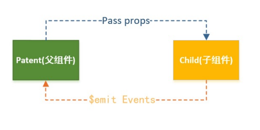
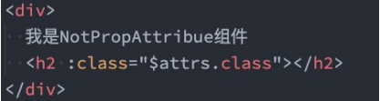
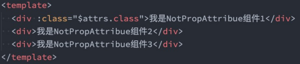
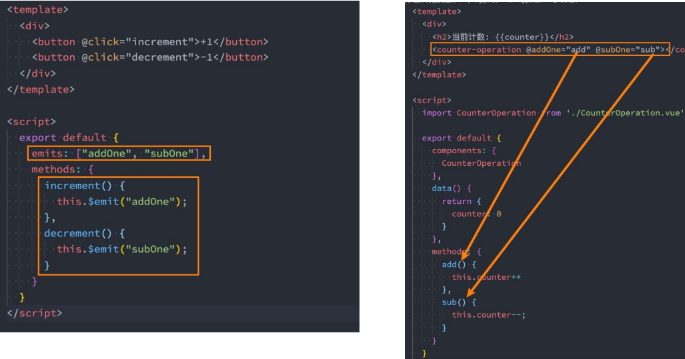
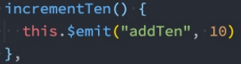
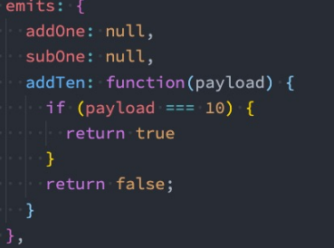
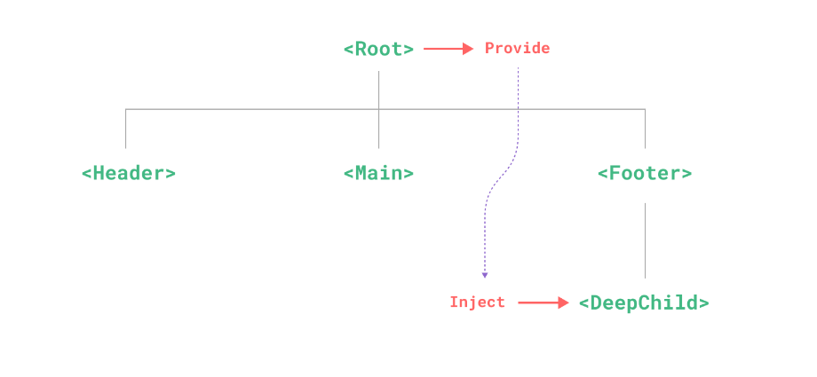

# 组件通信
## 父子组件通信
* 父组件传递给子组件: **通过 props 属性**
* 子组件传递给父组件: **通过 $emit 触发事件**


## 非 prop 的 attribute
* 当我们**传递给一个组件某个属性**，但是**该属性并没有定义对应的 props 或者 emits 时**，就称之为 非Prop的
Attribute；
* 常见的包括 class、style、id 属性等

**Attribute继承**
* 当**组件有单个根节点**时，**非Prop的Attribute将自动添加到根节点的Attribute**
## 禁用Attribute继承和多根节点
如果不希望组件的根元素继承 attribute，可以在组件中设置 **inheritAttrs: false**
* 禁用attribute继承的常见情况是**需要将 attribute 应用于根元素之外的其他元素**
* 可以通过 **$attrs来访问所有的 非props的attribute**



多个根节点的attribute
* **多个根节点的attribute如果没有显示的绑定**，那么会报警告，**必须手动的指定要绑定到哪一个属性上**



## 子组件传递给父组件
什么情况下子组件需要传递内容到父组件呢？
* 当**子组件有一些事件发生的时候**，比如在组件中发生了点击，父组件需要切换内容；
* 子组件**有一些内容想要传递给父组件的时候**

那如何操作？
* 首先，需要在**子组件中定义好在某些情况下触发的事件名称**
* 其次，在**父组件中以v-on的方式传入要监听的事件名称，并且绑定到对应的方法中**
* 最后，在**子组件中发生某个事件的时候，根据事件名称触发对应的事件**
### 自定义事件的流程


### 自定义事件的参数和验证
* 自定义事件的时候，我们也可以传递一些参数给父组件：

* 在vue3当中，我们可以对传递的参数进行验证


## 非父子组件通信
除了**父子组件通信**之外, 还会有**非父子组件之间的通信**

主**要有两种方法
* **provide / inject**
* **Mitt全局事件总线**

### provide / inject 依赖注入


#### provide 
为组件后代供给数据
```js
export default {
  provide: {
    message: 'hello!'
  }
}
```
如果要提供组件内 **data()定义** 的数,要用**函数**的形式 , 但**这不会保持响应性**
```js{7-12}
export default {
  data() {
    return {
      message: 'hello!'
    }
  },
  provide() {
    // 使用函数的形式，可以访问到 `this`
    return {
      message: this.message
    }
  }
}
```
为保证`provide`和`inject`的**响应性**链接, **需要使用`computed()`属性**
```vue{14}
<script>
import comp from './composition/comp.vue'
import {computed} from "vue";

export default {
  components: {comp},
  data() {
    return {
      message:'message'
    }
  },
  provide() {
    return {
      length: computed(()=>this.message)
    }
  }
}
</script>
```
#### inject
要注入祖先组件提供的数据 , 需要用`inject`
```js
export default {
  inject:['message'].
  created(){
    console.log(this.message)
  }
}
```
### 全局事件总线mitt库
Vue3 从实例中**移除了**`$on`,'$off','$once'方法 , **如果想使用全局事件总线, 要通过第三方的库:**
* Vue3官方有推荐的一些库, 例如 `mitt` 或 `tiny-emitter`;
* 先主要了解一下 [mitt库](https://github.com/developit/mitt) 的使用;

安装
```sh
npm install --save mitt
```
utils/eventBus.js
```js
import mitt from 'mitt'

const emitter  = mitt()

export default emitter
```

```js
import emitter from "../utils/eventBus";

emitter.emit('eventName' , {name:'frank',age:18})

emitter.on('eventName', (data)=>{
  console.log(data)
})

//监听所有的事件 *
emitter.on('*', (type , data)=>{
  console.log(type , data)
})
```

#### Mitt 取消监听
在某些情况下 , **可能希望取消掉之前注册的函数监听**
```js
import emitter from "../utils/eventBus";

// 定义一个函数
function onFoo(){}
emitter.on('foo',onFoo)   // 监听
emitter.off('foo',onFoo)  // 取消监听
```

