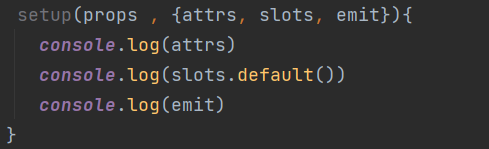
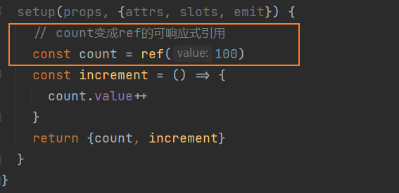
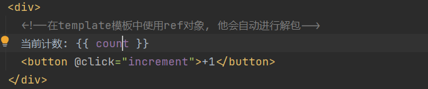
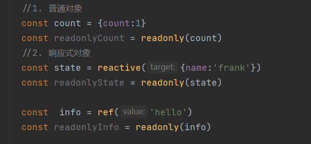
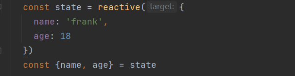
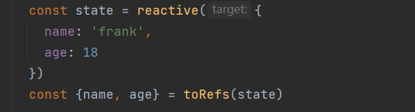
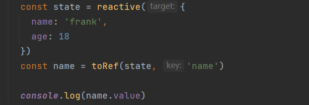
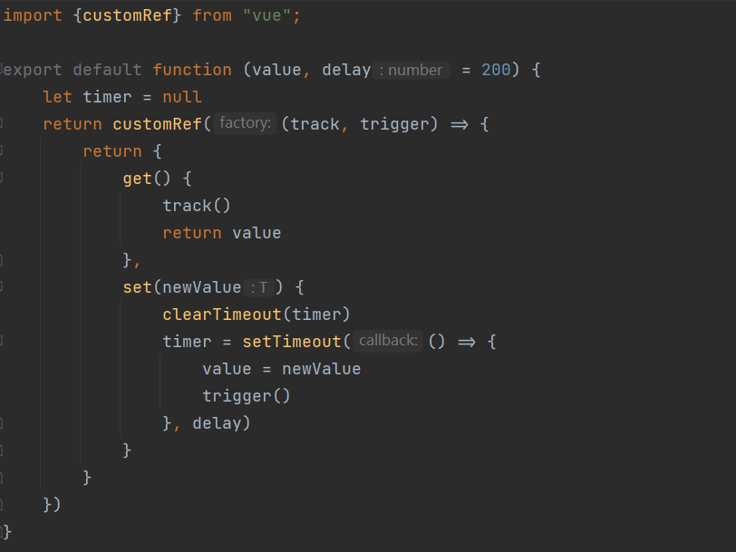

# Composition API

[官网](https://staging-cn.vuejs.org/api/composition-api-setup.html#basic-usage)

## Options API 的弊端

- Vue2 中**编写组件的方式是 OPtions API**

1. OPtions API 的最大的特点就是在**对应的属性**中编写**对应的功能模块**
2. 比如**data 定义数据**, **methods 中定义方法**, **computed 中定义计算属性**, **watch 中监听属性的改变**, 也包括**生命钩子函数**

- 但这种代码有一个很大的弊端

1. 当我们**实现某一个功能时**, 这个功能**对应的代码逻辑**会被**拆分到各个属性**中
2. 当组件**变得更大、更复杂时**, **逻辑关注点的列表**就会增长, 那么同一个功能的逻辑就会被拆分地很分散, 这些代码难以阅读和理解

<!--
- 所有逻辑放⼊`setup`函数,第⼀个参数是 `props` 对象
- 通过 `ref` 、`reactive` 、`toRef`来创建响应式数据
- 视图要⽤的变量为 setup 函数返回到对象属性
- `watch`、`computed`是个函数
- ⽣命周期钩⼦写法微调,xyz 变成 OnXyz,如 `mounted` 变成 `onMounted`。`created`和 `beforeCreate`不再需要 -->

## setup 函数

### setup 函数的参数

有两个参数

- 第一个参数: **props**
- 第二个参数: **context**

跟之前一样, 在**props 选项中定义**并且**在 template 中**依然可以**正常去使用 props 中的属性**。如果我们在**setup 函数中想要使用 props**, 那么**不可以通过 this 去获取**, 因为 props 有直接**作为参数传递到 setup 函数中**, 所以可以**直接通过参数**来使用即可

另外一个参数是 context, 称之为 **SetupContext**里面**包含三个属性**

- attrs : 所有非 props 的属性
- slots : 父组件传递过来的插槽
- emit : 当在组件内部需要发出事件时会用到 emit(因为不能访问跟 this, 所以不可以通过 this.$emit 发出事件)
- 可使用解构语法



### setup 函数的返回值

- setup 的返回值可以在**模板 template 中被使用**
- 也就是说**可以通过 setup 的返回值替代 data 选项**
- 甚至还可以**返回一个执行函数**来**替代 methods 中定义的方法**
- 注意: setup 函数里的变量需要做**响应式处理**

## 核心

### reactive api

如果想在 setup 中定义的数据变成响应式的特性, 可以**使用 reactive 函数**, **要求传入对象或者数组类型**


### ref API

reactive **API 对传入的类型是有要求的**, 他要求不许传入的是**一个对象或者数组类型**:

- 如果传入一个**基本类型, 如 string, number, boolean 会报一个警告**;
  

这个时候可以用另外一个 API: **ref API**

- ref 会返回一个**可变的响应式对象** , 该对象最为一个**响应式引用**维护着它内部的值
- 它内部的值**在 ref 的`value`属性**中被维护
  

注意事项:

- 在**模板中引入 ref 的值**时, Vue 会**自动帮我们进行解包操作**, 所以**不需要在模板中通过 ref.value 的方式来使用**
- 但是在 **setup 函数内部**, 他依然**是 ref 引用**, 所以对其进行操作时, 依然需要**使用 ref.value 的形式**
  

### readonly

通过**reactive 或者 ref 可以获取到一个响应式对象**, 但是某些情况下, **传入给其他组件的响应式对象**希望被使用**但是不能被修改**, 这个时候可以使用 readonly

**readonly 返回一个原值的只读代理** , 接受一个对象(无论响应式或非响应式)或者一个 ref



## 工具函数

**isProxy()**

- 检查对象**是否是由 reactive 或者 readonly 创建的 proxy**

**isReactive()**

- 检查对象**是否是有 reactive 创建的响应式代理**
- 如果该代理是 readonly 建的 , 但是包裹了由 reactive 创建的另一个代理, 也会返回 true

**isReadonly()**

- 检查对象**是否由 readonly 创建的只读代理**

**toRow()**

- 返回** reactive 和 readonly 代理的原始的对象**(**不**建议对原始对象的持久引用, 谨慎使用)

**shallowReactive()**

- 创建一个响应式代理, 他跟踪自身 property 的响应性, 但**不执行嵌套对象的深层响应式转换**(浅层响应式转换)

**shallowReadonly**

- 创建一个 proxy , 使其自身的 property 为只读, 但**不执行嵌套对象的深度只读转换**(深层还是可读, 可写的)

### toRefs

如果**使用 ES6 的解构语法**, 对**reactive 返回的对象进行解构获取值**, 那么**数据不再是响应式的**:



- Vue3 提供了一个 **toRefs 的函数**, 可以将**reactive 返回的对象中的属性都转成 ref**
- 那么**解构出来的 name 和 age 本身都是 ref**



这种做法已经在**state.name 和 ref.value**之间建立了**链接** , **任何一个修改都会引起另外一个的变化**

### toRef

如果只希望转换一个**reactive 对象中的属性为 ref**, 那么**可以用 toRef 的方法:**  


**unref**

如果想要**获取一个 ref 引用中的 value** , 那么可以用 unref 方法:

- **如果参数是一个 ref** , 则**返回内部值 ,否则返回参数本身**
- 这是**val = isRef(val) ? val.value : val** 的语法糖

**isRef**

- 判断值**是否为 ref 对象**

**shallowRef**

- 创建**一个浅层的 ref 对象**

**triggerRef**

- 手动触发和 shallowRef 相关联的副作用

### customRef

创建**一个自定义的 ref**, 并对**其依赖项跟踪和更新触发进行显示控制:**

- 需要**一个工厂函数**, 该**函数接受 track 和 trigger 函数作为参数**
- 并且要返回**一个带有 get 和 set 的函数**

案例: 对**双向绑定的属性进行 debounce 防抖的操作**

hook/userDebounceRef.js


```vue
<script setup>
import { useDebouncedRef } from "./debouncedRef";
const text = useDebouncedRef("hello");
</script>

<template>
  <input v-model="text" />
</template>
```
