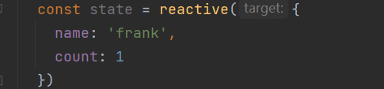

# Composition API

[官网](https://staging-cn.vuejs.org/api/composition-api-setup.html#basic-usage)

## Options API 的弊端

- Vue2 中**编写组件的方式是 OPtions API**

1. OPtions API 的最大的特点就是在**对应的属性**中编写**对应的功能模块**
2. 比如**data 定义数据**, **methods 中定义方法**, **computed 中定义计算属性**, **watch 中监听属性的改变**, 也包括**生命钩子函数**

- 但这种代码有一个很大的弊端

1. 当我们**实现某一个功能时**, 这个功能**对应的代码逻辑**会被**拆分到各个属性**中
2. 当组件**变得更大、更复杂时**, **逻辑关注点的列表**就会增长, 那么同一个功能的逻辑就会被拆分地很分散, 这些代码难以阅读和理解

<!--
- 所有逻辑放⼊`setup`函数,第⼀个参数是 `props` 对象
- 通过 `ref` 、`reactive` 、`toRef`来创建响应式数据
- 视图要⽤的变量为 setup 函数返回到对象属性
- `watch`、`computed`是个函数
- ⽣命周期钩⼦写法微调,xyz 变成 OnXyz,如 `mounted` 变成 `onMounted`。`created`和 `beforeCreate`不再需要 -->

## setup 函数

### setup 函数的参数

有两个参数

- 第一个参数: **props**
- 第二个参数: **context**

跟之前一样, 在**props 选项中定义**并且**在 template 中**依然可以**正常去使用 props 中的属性**。如果我们在**setup 函数中想要使用 props**, 那么**不可以通过 this 去获取**, 因为 props 有直接**作为参数传递到 setup 函数中**, 所以可以**直接通过参数**来使用即可

另外一个参数是 context, 称之为 **SetupContext**里面**包含三个属性**

- attrs : 所有非 props 的属性
- slots : 父组件传递过来的插槽
- emit : 当在组件内部需要发出事件时会用到 emit(因为不能访问跟 this, 所以不可以通过 this.$emit 发出事件)
- 可使用解构语法


### setup 函数的返回值

- setup 的返回值可以在**模板 template 中被使用**
- 也就是说**可以通过 setup 的返回值替代 data 选项**
- 甚至还可以**返回一个执行函数**来**替代 methods 中定义的方法**
- 注意: setup 函数里的变量需要做**响应式处理**

## 核心

### reactive

如果想在 setup 中定义的数据变成响应式的特性, 可以**使用 reactive 函数**, **要求传入对象或者数组类型**



### ref

reactive API **对传入的类型是有要求的**, 它要求不许传入的是**一个对象或者数组类型**:

- 如果传入一个**基本类型, 如 string, number, boolean 会报一个警告**;
  

这个时候可以用另外一个 API: **ref API**

- ref 会返回一个**可变的响应式对象** , 该对象最为一个**响应式引用**维护着它内部的值
- 它内部的值**在 ref 的`value`属性**中被维护
  

注意事项:

- 在**模板中引入 ref 的值**时, Vue 会**自动帮我们进行解包操作**, 所以**不需要在模板中通过 ref.value 的方式来使用**
- 但是在 **setup 函数内部**, 他依然**是 ref 引用**, 所以对其进行操作时, 依然需要**使用 ref.value 的形式**
  

### readonly

通过**reactive 或者 ref 可以获取到一个响应式对象**, 但是某些情况下, **传入给其他组件的响应式对象**希望被使用**但是不能被修改**, 这个时候可以使用 readonly

**readonly 返回一个原值的只读代理** , 接受一个对象(无论响应式或非响应式)或者一个 ref


### computed 
computed 使用方法
* 1. **接受一个getter函数,** 并**为getter函数返回的值**, **返回一个 ref 对象**


* 2. **接受一个具有 get 和 set 的对象**, **返回一个可变的(可读写的) ref 对象**


### 侦听数据变化 watch watchEffect
在Options API中, 可以通过watch选项来侦听 data 或者 props 的数据变化, 当数据变化的时候执行某一些操作

在Composition API中 , 可以使用 watch 和 watchEffect 来完成响应式数据的侦听
* watchEffect 用于**自动收集响应式数据的依赖**
* watch **需要手动指定侦听的数据源**
### watchEffect
* 首先, **watchEffect传入的函数会被立即执行一次**, 并且在执行的过程中收集依赖
* 其次 , 只有收集的依赖发生变化时, watchEffect传入的函数才会立即执行


#### watchEffect 停止侦听
watchEffect 函数的返回值是一个用来停止该副作用的函数


#### watchEffect 清除副作用
什么是清除副作用? 
* 比如在开发中, 需要在侦听函数中执行网络请求, 但是在网络请求还没有达到的时候, 我们停止了侦听器, 或者侦听器侦听函数被再次调用
* 那么上一次的网络请求应该被取消掉, 这个时候就可以清除上一次的副作用

在watchEffect 传入的函数被回调时, 其实可以获取到一个参数: **onCleanup**
* 当 **副作用即将重新执行** 或者 **侦听器被停止** 时会执行该函数传入的回调函数
* 可以在传入的回调函数中, 执行一些清除工作


取消计时器


#### watchEffect 执行时机
如果希望在副作用函数里获取到元素, 是否可行 ??


会发现打印结果打印了两次:
* 这是因为setup函数在执行时会立即执行传入的副作用函数, 这个时候DOM还没有挂载 , 所以打印为 null
* 而当DOM挂载时 , 会给title的ref对象赋值新的值 , 副作用该函数会再次执行 , 打印出了对应的元素
#### 调整 watchEffect 的执行时机
如果想要第一次的时候就打印对应的元素
* 要改变副作用函数的执行时机
* 它的默认值是pre , 它会在元素挂载 或者更新之前执行
* 所以先会打印一个空, 当依赖的title 变化时, 就会再次执行一次, 打印出了元素

可以设置副作用函数的调用时机

flush 还接受 sync , 这将强制效果始终同步发生,  然而,这是低效的, 应该很少使用
### watch
watch API 完全等同于组件watch选项的Property
* watch需要侦听特定的数据源 , 并在回调函数中执行副作用
* 默认情况下它是**惰性**的, 只有当被已侦听的源发生变化时才会执行回调

与 watchEffect比较, watch允许我们: 
* 懒惰执行副作用(第一次不会执行)
* 更具体的说明当哪些状态发生变化时, 触发侦听器的执行
* 访问侦听器状态变化前后的值

**第一个参数**是数据**源**
* 一个getter函数，返回一个值
* 一个 ref
* 一个响应式对象
* 或是由以上类型的值组成的数组

1. 侦听watch时传入**一个getter函数**


2. 传入一个可响应式对象 : reactive对象/ref对象

* **情况一**:reactive获取到的 newValue 和 oldValue 本身都是reactive对象


如果希望 newValue和 oldValue 是一个个普通的对象 , 使用一个getter函数 , 并且对可响应式对象进行**解构**

如果是数组


* **情况二**:ref对象获取的 newValue 和 oldValue 是**value**本身


3. 以上类型的数组


## 工具函数
**isProxy()**

- 检查对象**是否是由 reactive 或者 readonly 创建的 proxy**

**isReactive()**

- 检查对象**是否是有 reactive 创建的响应式代理**
- 如果该代理是 readonly 建的 , 但是包裹了由 reactive 创建的另一个代理, 也会返回 true

**isReadonly()**

- 检查对象**是否由 readonly 创建的只读代理**

**toRow()**

- 返回** reactive 和 readonly 代理的原始的对象**(**不**建议对原始对象的持久引用, 谨慎使用)

**shallowReactive()**

- 创建一个响应式代理, 他跟踪自身 property 的响应性, 但**不执行嵌套对象的深层响应式转换**(浅层响应式转换)

**shallowReadonly**

- 创建一个 proxy , 使其自身的 property 为只读, 但**不执行嵌套对象的深度只读转换**(深层还是可读, 可写的)

### toRefs

如果**使用 ES6 的解构语法**, 对**reactive 返回的对象进行解构获取值**, 那么**数据不再是响应式的**:


- Vue3 提供了一个 **toRefs 的函数**, 可以将**reactive 返回的对象中的属性都转成 ref**
- 那么**解构出来的 name 和 age 本身都是 ref**


这种做法已经在**state.name 和 ref.value**之间建立了**链接** , **任何一个修改都会引起另外一个的变化**

### toRef

如果只希望转换一个**reactive 对象中的属性为 ref**, 那么**可以用 toRef 的方法:**  


**unref**

如果想要**获取一个 ref 引用中的 value** , 那么可以用 unref 方法:

- **如果参数是一个 ref** , 则**返回内部值 ,否则返回参数本身**
- 这是**val = isRef(val) ? val.value : val** 的语法糖

**isRef**

- 判断值**是否为 ref 对象**

**shallowRef**

- 创建**一个浅层的 ref 对象**

**triggerRef**

- 手动触发和 shallowRef 相关联的副作用

### customRef

创建**一个自定义的 ref**, 并对**其依赖项跟踪和更新触发进行显示控制:**

- 需要**一个工厂函数**, 该**函数接受 track 和 trigger 函数作为参数**
- 并且要返回**一个带有 get 和 set 的函数**

案例: 对**双向绑定的属性进行 debounce 防抖的操作**

hook/userDebounceRef.js


```vue
<script setup>
import { useDebouncedRef } from "./debouncedRef";
const text = useDebouncedRef("hello");
</script>

<template>
  <input v-model="text" />
</template>
```
## Composition API Hook 练习
### useCounter 
对 counter 逻辑进行抽取

**hooks/useCounter.js**


组件内使用时:


### useTitle
编写一个可以改变页面 title 的hook
* 函数返回ref对象, 利于改变值
* 使用watch侦听ref对象的变化, 执行 document.title = newValue


组件内使用时: 


### useScrollPosition

### useMousePosition

### useLocalStorage


在组件内部使用时


### hooks 目录结构
```
hooks
|-- index.js    入口文件
|-- useLocalStorage.js
|-- useMousePosition.js
|-- useScrollPosition.js
...
```