# 自定义指令
* 在 Vue 中, **代码的复用和抽象主要还是通过组件**
* 通常在某些情况下, 需要对 **DOM 元素进行底层的操作**, 这个时候会用到**自定义指令**

自定义指令分为
* 自定义局部指令: 组件中通过 **directives 选项**, 只有在当前组件中使用
* 自定义全局指令: app的 **directives 方法**, 可以在任意组件中被使用

实现一个非常简单的实例: **让输入框挂载完成后自动获取焦点**
* 1. 默认实现
* 2. 自定义一个 v-focus **局部**指令
* 3. 自定义一个 v-focus **全局**指令
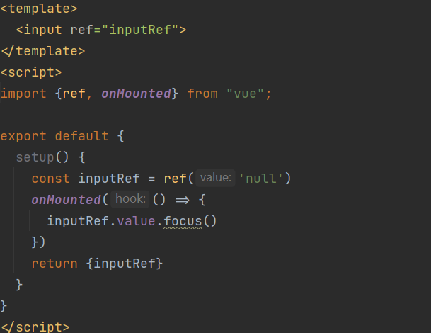
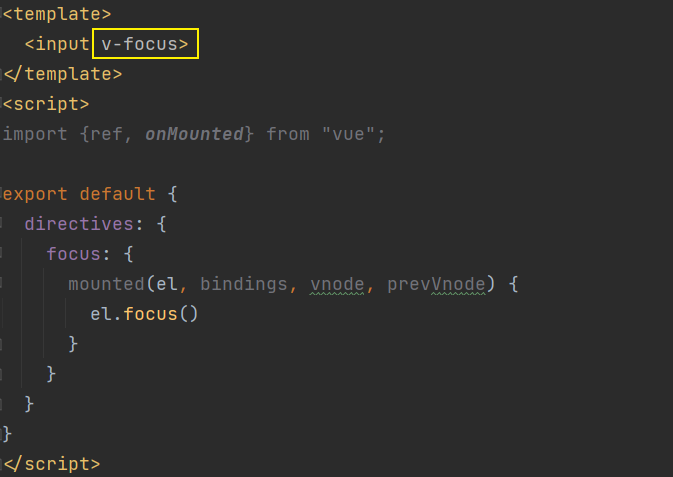
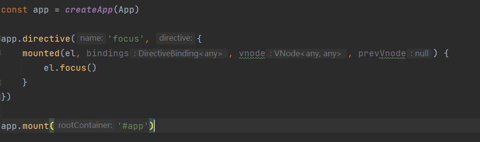
#### 指令的生命周期
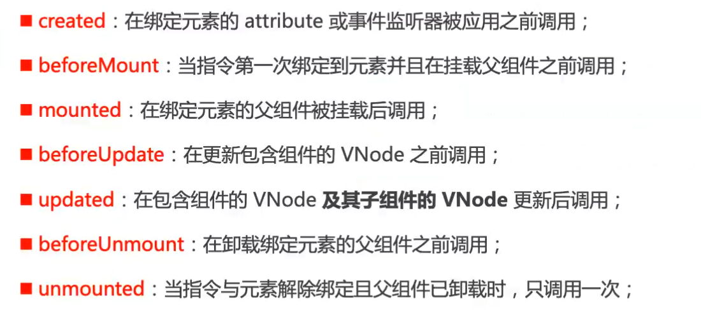
#### 参数
把 bindings 打出来看看: 
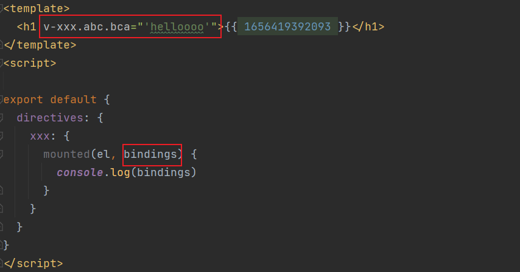
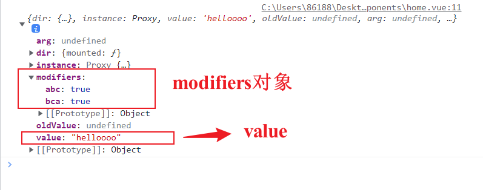
#### 自定义指令练习
案例: 时间戳的显示需求
* 在开发中, 大部分情况下服务器获取到的是时间戳
* 通过自定义指令来完成需求
##### 目录结构
```
directives
|-- index.js 入口文件
|-- format-time.js 
|-- ....
```
index.js 

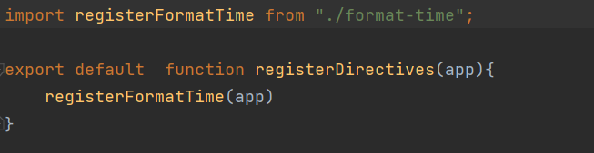

format-time.js

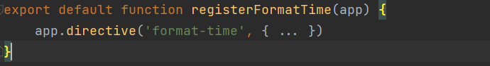

main.js

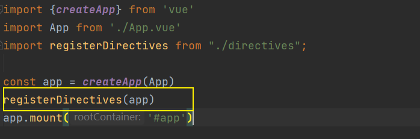
##### 实现
format-time.js
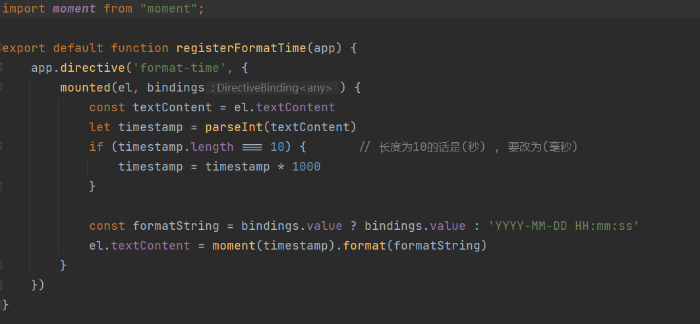
组件内使用:
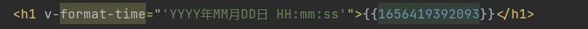