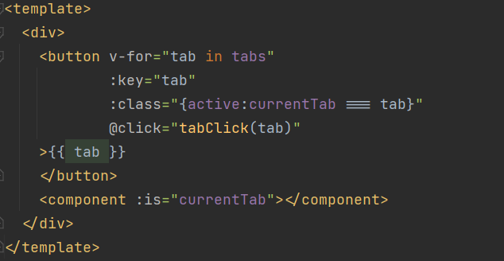
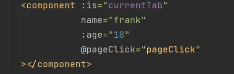
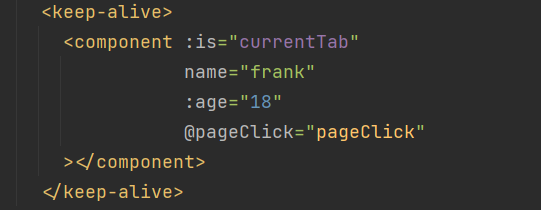
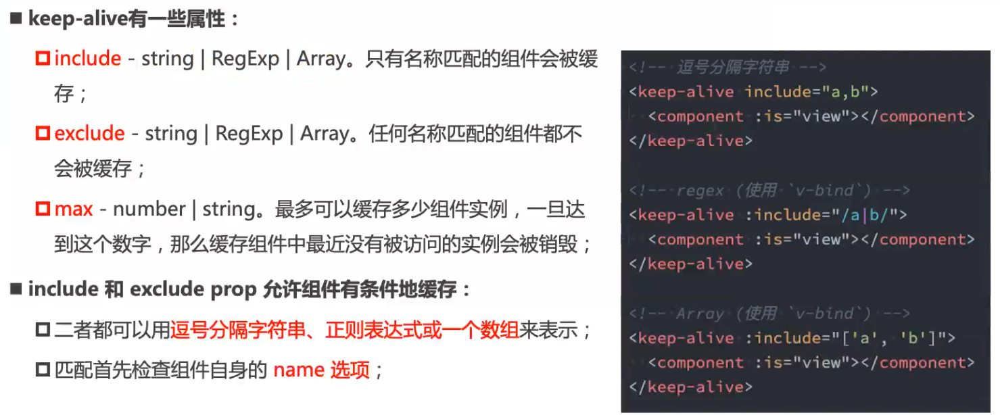

# 动态组件
## 基本使用
动态组件是使用 **`component`组件**, 通过 **一个特殊的attribute `is`** 实现

这个`currentTab`的中需要的内容:
* 可以是通过 **`component`函数注册的组件**
* 在**一个组件对象的`components`对象中注册的组件**

具体代码:
```vue
<template>
  <div>
    <button v-for="tab in tabs"
            :key="tab"
            :class="{active:currentTab === tab}"
            @click="tabClick(tab)"
    >{{ tab }}
    </button>
    <component :is="currentTab"></component>
  </div>
</template>
<script>
import home from './components/home.vue'
import about from './components/about.vue'
import category from './components/category.vue'

export default {
  components: {category, home, about},
  data() {
    return {
      tabs: ['home', 'about', 'category'],
      currentTab: 'home'
    }
  },
  methods: {
    tabClick(tab) {
      this.currentTab = tab
    }
  }
}
</script>
<style lang="scss" scoped>
button {
  &.active {
    background: red;
  }
}
</style>
```

`component`组件也可以传入 `props` 和事件 , 子组件可以接受`props`和`emits`来触发

## keep-alive
在默认情况下,我们在**切换组件后**, **被切换的组件会被销毁掉**, 再次回来**会重新创建组件**

但是某些情况我们希望组建继续保持组建的状态, 而不是销毁掉, 这个时候可以**使用一个内置组件`keep-alive`**



keep-alive 属性

