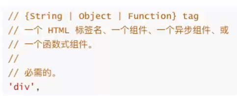
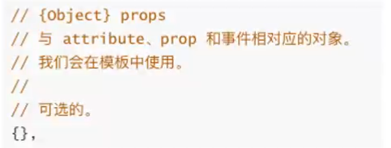
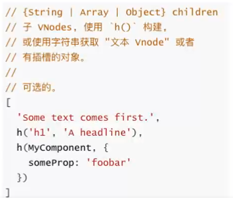
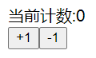
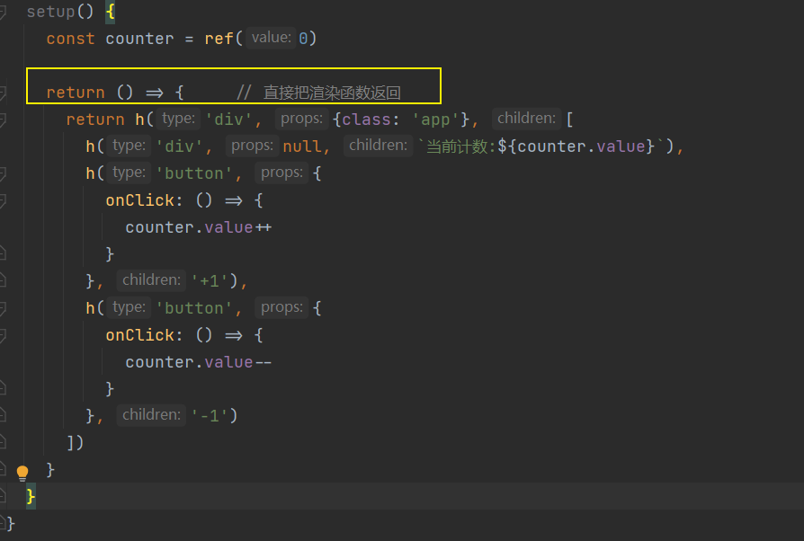
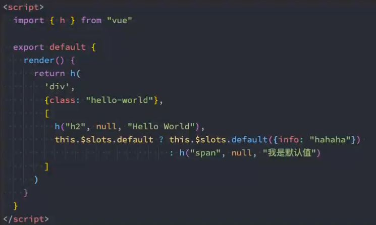
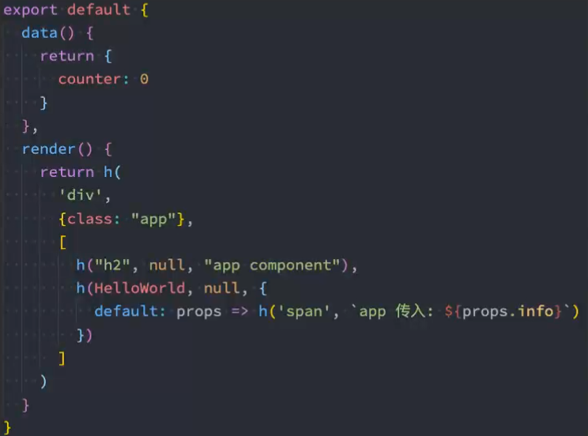
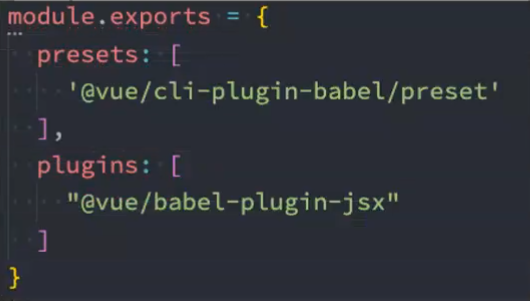

# h()函数
Vue推荐在绝大多数情况下**使用模板**来创建你的HTML, 然后一些特殊的场景, 真的需要**JavaScript的完全编程的能力**, 这个时候可以用**渲染函数**, 它**比模板更接近编译器**

**使用h函数:**
* **h 函数**是一个用于**创建 vNode 的函数**
* 其实跟准确的命名为**createVNode()函数** , 但是为了简便在Vue将之**简化为h函数**

## h函数的使用
接受三个参数
* 
* 
* 

注意:
* 如果没有props, 那么通常可以作为children作为第二个参数传入;
* 但是会产生歧义, 可以将 null 作为第二个参数传入, 将 children 作为第三个参数传入
### 创建原生元素
当 Composition API 与模板一起使用时，**setup() 钩子**的返回值是用于暴露数据给模板。然而当我们使用渲染函数时，可以**直接把渲染函数返回：**

setup钩子 渲染一个计数器: 

* 
### 创建组件 及 插槽的使用


## jsx
如果想要在**项目中使用jsx**, 那么**需要添加对jsx的支持**
* 通常会**通过babel来转换**
* 只需要在 **Babel 配置对应的插件即可**
* 安装 babel 支持Vue的jsx插件
```
npm install @vue/babel-plugin-jsx -D
```
* 在**babel.config.js配置文件**中配置插件



