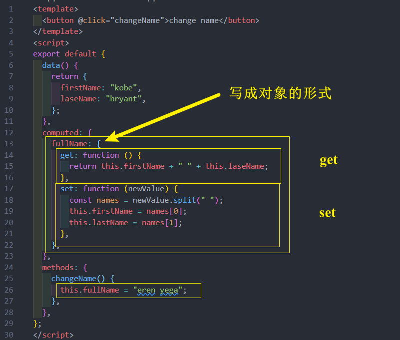
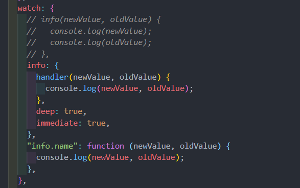
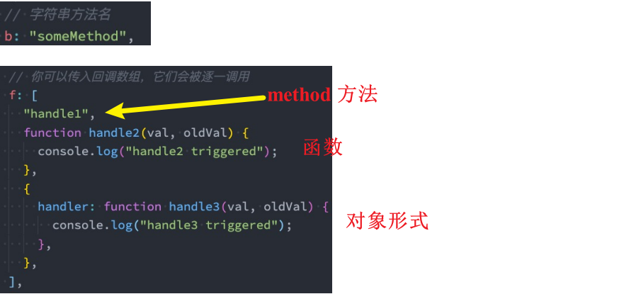
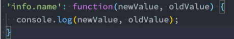
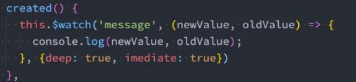

# Options API
## 计算属性 computed 
* 对于任何包含响应式数据的复杂逻辑，你都应该使用**计算属性**
* **计算属性**将被混入到组件实例中。所有 getter 和 setter 的 this 上下文自动地绑定为组件实例

计算属性的用法：
* 选项：computed
* 类型：**{ [key: string]: Function | { get: Function, set: Function }**
## 计算属性 缓存
* 这是因为计算属性会基于它们的**依赖关系**进行缓存
* 在**数据不发生变化**时，计算属性是不需要重新计算的
* 但是如果**依赖的数据发生变化**，在使用时，计算属性依然**会重新进行计算**
## 计算属性的 setter和getter
计算属性在大多数情况下，只需要一个 getter 方法即可，所以会将计算属性直接写成一个函数
* 但是，如果我们确实想设置计算属性的值该怎么办  ? 
* 这个时候也可以给计算属性设置一个 setter 的方法

## 侦听器 watch 
* 开发中我们在 data 返回的对象中定义了数据，这个数据通过插值语法等方式绑定到 template 中；
* 当数据变化时，template 会自动进行更新来显示最新的数据；
* 但是在某些情况下，我们希望在**代码逻辑**中监听某个数据的变化，这个时候就需要用**侦听器 watch** 来完成

侦听器的用法如下：
* 选项：watch
* 类型：**{ [key: string]: string | Function | Object | Array}**

案例: 
举个例子 ：
* 比如现在我们希望用户在**input中输入一个问题**；
* 每当用户输入了最新的内容，我们就获取到最新的内容，并且使用该问题去服务器查询答案；
* 那么，我们就需要实时的去获取最新的数据变化；

## 侦听器watch 的配置选项
当点击按钮的时候会修改 **info.name** 的值；
* 这个时候我们使用watch来侦听info，可以侦听到吗？答案是不可以。

这是因为默认情况下，watch 只是在侦听info的引用变化，对于内部属性的变化是不会做出响应的：
* 这个时候我们可以使用一个选项 deep 进行更深层的侦听；
* 注意说过 watch 里面侦听的属性对应的也可以是一个 Object

还有另外一个属性，希望一开始的就会立即执行一次：
* 这个时候我们使用 immediate 选项；
* 这个时候无论后面数据是否有变化，侦听的函数都会优先执行一次

## 监听器 watch 的其他方式
**其他方式 (一)**

**其他方式(二)**

另外一个是Vue3文档中没有提到的，但是Vue2文档中有提到的是侦听对象的属性：

**还有另外一种方式就是使用 $watch 的API：**
我们可以在created的生命周期（后续会讲到）中，使用 this.$watch 来侦听；
* 第一个参数是要侦听的源；
* 第二个参数是侦听的回调函数callback；
* 第三个参数是额外的其他选项，比如deep、immediate

