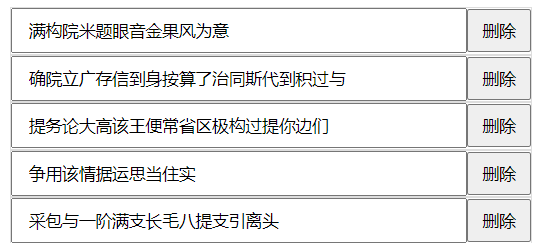

# Vue3中的Composition API之`script setup`
## `<script setup>`的优势
[官网](https://staging-cn.vuejs.org/api/sfc-script-setup.html)

`<script setup>` 是在单文件组件 (SFC) 中使用`Composition API` 的编译时语法糖。相比于普通的 `<script>` 语法，它具有更多优势：

* 更少的样板内容，更简洁的代码。
* 能够使用纯 `Typescript` 声明 `props` 和抛出事件。
* 更好的运行时性能 (其模板会被编译成与其同一作用域的渲染函数，没有任何的中间代理)。
* 更好的 `IDE` 类型推断性能 (减少语言服务器从代码中抽离类型的工作)。

##  顶层await
```vue{4,5}
<script setup>
import { onMounted, ref } from "vue";
const todos = ref([]);
onMounted(async () => {  //async和await
  todos.value = await fetch("http://127.0.0.1:3000/news").then((r) => r.json());
});
</script>

<template>
  {{ todos }}
</template> 
```
可以直接写成
```vue{4}
<script setup>
import { ref} from "vue";
const todos = ref([])
todos.value = await fetch('http://127.0.0.1:3000/news').then(r => r.json())  //可不写await
</script>

<template>
{{todos}}
</template>
```
`<script setup>` 中可以使用`顶层 await`。结果代码会被编译成 `async setup()`
如果使用 `<script setup>`，那么顶层 `await` 表达式会自动让该组件成为一个异步依赖：
### suspense处理全局异步
Todo.vue组件
```vue
<script setup>
import {ref} from "vue";
const todos = ref([])
todos.value = await fetch('http://127.0.0.1:3000/news').then(r => {
  return new Promise ((resolve , reject)=>{
    setTimeout(()=>{
      resolve(r.json())  
    } , 3000)      //延迟三秒
  })
})

</script>
<template>
  <h1>延迟三秒发出数据</h1>
  {{ todos }}
</template>
```
父组件:
```vue{7,10}
<script setup>
import Todo from './Todo.vue'  //组件可直接在模板里使用
</script>

<template>
  <suspense>
    <template v-slot:default>    <!--默认插槽 , 三秒后会显示内容-->
      <Todo />
    </template>
    <template v-slot:fallback>   <!--fallback插槽 , 在 #fallback 插槽三秒内会显示 “loading...” -->-->
      <span>loading....</span>
    </template>
  </suspense>
</template>
```
**注意**: `<Suspense>`的**插槽**要求**只能有一个根元素**
## defineProps() 和 defineEmits()
介绍 : 在 `<script setup>` 中**必须**使用 `defineProps` 和 `defineEmits API` 来声明 `props` 和 `emits` ，它们具备完整的类型推断并且在 `<script setup>` 中是**直接可用**的：

**基本用法**:
```vue
<script setup>
const { todo } = defineProps({    //返回的是对象, 可使用解构 , 不需要引入
  todo:{
    type:Object,
    required:true
  }
})
const emit = defineEmits(['emit1' , 'emit2' .. ])   //返回的是函数
</script>
```

## 制作一个小demo(增删todoList)


父组件Todo.vue:
```vue
<script setup>
import Item from './Item.vue'
import {ref} from "vue";
const todos = ref([])
todos.value = await fetch('http://127.0.0.1:3000/news').then(r => r.json()) //顶层await

const get = async ()=>{  //get函数 , 能获取最新的数据
  todos.value  = await fetch('http://127.0.0.1:3000/news').then(r => r.json())
}
</script>

<template>
  <Item v-for="todo of todos" :key="todo.id"  @get ="get"   :todo="todo"/>
  <!--import进的组件可直接使用-->
</template>
```
子组件Item.vue :
```vue{2,8,12}
<script setup>
const props = defineProps({
  todo:{
    type:Object,
    required:true
  }
})
const emit = defineEmits(['get'])

const del = async ()=>{  //del函数 , 删除一行
  await fetch(`http://127.0.0.1:3000/news/${props.todo.id}` , { method:'delete' })
  emit('get')    //通知父组件获取最新值
}
</script>

<template>
  <div class="box">
    <input type="text" :value="todo.title">
    <button @click="del">删除</button>
  </div>
</template>
```
#### (1)封装fetch网络请求
useRequest.js
```js
export default ()=>{
    return {
       async request(url='' , options= {method:'get'}) {
           return await fetch(`http://127.0.0.1:3000/news/${url}`, options ).then(r => r.json())
       },
        async get(url) {
            return await this.request(url)
        },
        async delete(url) {
           return await this.request(url ,{method: 'delete'} )
        }
    }
}
```
父组件Todo.vue:
```vue
<script setup>
import Item from './Item.vue'
import {ref} from "vue";
import useRequest from './useRequest'
const request = useRequest()   //引入 

const todos = ref([])

todos.value =  await request.get()  

const get = async ()=>{
  todos.value =  await request.get()
}
</script>

<template>
  <Item v-for="todo of todos" :key="todo.id"  @get ="get"  :todo="todo"/>
</template>
```
子组件Item.vue
```vue
<script setup>
import useRequest from './useRequest'
const request = useRequest()    //引入 
const props = defineProps({   
  todo:{
    type:Object,
    required:true
  }
})
const emit = defineEmits(['get'])

const del = async () =>{
  await request.delete(props.todo.id)  
  emit('get')
}
</script>

<template>
  <div class="box">
    <input type="text" :value="todo.title">
    <button @click="del">删除</button>
  </div>
</template>
```
#### (2)抽离代码用useTodo.js复用数据
useTodo.js
```js
import {ref} from "vue";
import useRequest from './useRequest'
const todos = ref([])

export  default ()=>{
    const request = useRequest()
    const  load = async ()=>{      
        todos.value = await request.get()  //获取最新值, 赋值 
    }
    const del = async (id)=>{
        await request.delete(id)    //删除
        await load()              //获取最新值 , 赋值
    }
    return {todos , del , load}
}
```
Todo.vue
```vue
<script setup>
import Item from './Item.vue'
import useTodo from "./useTodo";
const { todos ,  load} = await useTodo()
await load()
</script>

<template>
  <Item v-for="todo of todos" :key="todo.id"   :todo="todo"/>
</template>
```
Item.vue
```vue
<script setup>
import useTodo from './useTodo'
const { del } = useTodo()
const {todo} = defineProps({
  todo:{
    type:Object,
    required:true
  }
})
</script>

<template>
  <div class="box">
    <input type="text" :value="todo.title">
    <button @click="del(todo.id)">删除</button>
  </div>
</template>
```
#### (3)添加`任务添加`功能
useRequest.js
```js{12-16}
export default ()=>{
    return {
       async request(url='' , options= {method:'get'}) {
           return await fetch(`http://127.0.0.1:3000/news/${url}`, options ).then(r => r.json())
       },
        async get(url) {
            return await this.request(url)
        },
        async delete(url) {
           return await this.request(url ,{method: 'delete'} )
        },
        async post(data) {
           return await this.request( '' , {
               method: 'post' ,
               headers:{'Content-Type':'application/json'},
               body:JSON.stringify(data)   
           } )
        }
    }
}
```
useTodo.js
```js{14-17}
import {ref} from "vue";
import useRequest from './useRequest'
const todos = ref([])

export  default ()=>{
    const request = useRequest()
    const  load = async ()=>{
        todos.value = await request.get()
    }
    const del = async (id)=>{
        await request.delete(id)
        await load()
    }
    const add = async (data) => {   //添加任务, add函数
        await request.post(data)
        await load()
    }
    return {todos , del , load , add}
}
```
Add.vue
```vue
<script setup>
import useTodo from './useTodo'
import {ref} from "vue";
const {add} = useTodo()

const title = ref('')
const submit = async ()=>{  
  await add({title : title.value})  
  title.value = ''         //清空输入框
}
</script>
<template>
  <input type="text" v-model="title" placeholder="回车提交任务" @keyup.enter = "submit">
</template>
```


