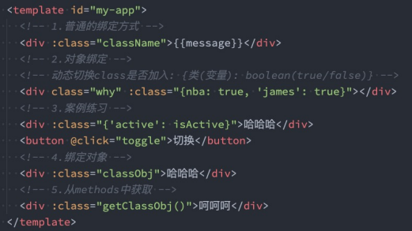

# Vue 基础
## 模板语法
### v-once 
v-once 用于指定**元素**或者**组件**只渲染一次：
* 当数据发生变化时，**元素或者组件以及其所有的子元素将视为静态内容并且跳过**；
* 该指令可以用于**性能优化**
如果是子节点，也是只会渲染一次：
### v-text 
用于更新元素的 textContent


### v-html 
默认情况下，如果我要展示的内容**本身是 html**的，vue并不会对其进行特殊的解析\

如果我们希望这个内容被Vue可以解析出来，那么可以使用 v-html 来展示； 


### v-pre 
v-pre用于跳过元素和它的子元素的编译过程，显示原始的 Mustache 标签：

跳过不需要编译的节点，加快编译的速度


### v-cloak 
这个指令保持在元素上直到关联组件实例结束编译。
* 和 CSS 规则如 `[v-cloak] { display: none }` 一起用时，这个指令可以隐藏未编译的 Mustache 标签直到组件实
例准备完毕


### v-bind 绑定属性
动态地绑定一个或多个 attribute，或一个组件 prop 到表达式
### 绑定class - 对象语法
可以传给 :class (v-bind:class 的简写) 一个对象，以动态地切换 class

### 绑定class - 数组语法

### 绑定 style - 对象语法
可以利用**v-bind:style**来绑定一些CSS内联样式：
* 这次因为某些样式需要根据数据**动态**来决定；
* 比如某段文字的**颜色**，**大小**等等；
CSS property 名可以用**驼峰式 (camelCase)** 或**短横线分隔 (kebab-case，记得用引号括起来)** 来命名；

* 对象语法 


* 数组语法

:style 的数组语法可以将多个样式对象应用到同一个元素上

### v-bind 绑定一个对象 (用得多)
如果希望将一个对象的所有属性，绑定到元素上的所有属性，应该怎么做 ?
* 非常简单，可以直接使用 v-bind 绑定一个 对象；

### v-on 的基本使用
* 使用 v-on 来监听一下**点击的事件**


* 也可以绑定**其他的事件**


* **绑定多个事件**，这个时候可以传入一个**对象**


### v-on 参数传递 
当通过methods中定义方法，以供 @click 调用时，需要注意参数问题：
* 情况一：如果该方法不需要额外参数，那么方法后的()可以不添加。
但是注意：如果方法本身中有一个参数，那么会默认将原生事件 event 参数传递进去
* 情况二：如果需要同时传入某个参数，同时需要 event 时，可以通过 $event 传入事件


### v-on 的修饰符
v-on支持修饰符，修饰符相当于对事件进行了一些特殊的处理：
* .stop - 调用 event.stopPropagation()。
* .prevent - 调用 event.preventDefault()。
* .capture - 添加事件侦听器时使用 capture 模式。
* .self - 只当事件是从侦听器绑定的元素本身触发时才触发回调。
* .{keyAlias} - 仅当事件是从特定键触发时才触发回调。
* .once - 只触发一次回调。
* .left - 只当点击鼠标左键时触发。
* .right - 只当点击鼠标右键时触发。
* .middle - 只当点击鼠标中键时触发。
* .passive - { passive: true } 模式添加侦听器


## 条件渲染
### v-if、v-else、v-else-if
v-if、v-else、v-else-if 用于根据条件来渲染某一块的内容：
* 这些内容只有在条件为 true 时，才会被渲染出来；
* 这三个指令与 JavaScript 的条件语句if、else、else if类似；
v-if 的渲染原理：
* v-if是惰性的；
* 当条件为 false 时，其判断的内容完全不会被渲染或者会被销毁掉；
* 当条件为 true 时，才会真正渲染条件块中的内容

### template 元素 
因为v-if是一个指令，所以必须将其添加到一个元素上：
* 但是如果我们希望切换的是多个元素呢？
* 此时我们渲染div，但是我们并不希望div这种元素被渲染；
* 这个时候，我们可以选择使用template；

template元素可以当做不可见的包裹元素，并且在 v-if 上使用，但是最终 template 不会被渲染出来

### v-show 
v-show 和 v-if 的用法看起来是一致的，也是根据一个条件决定是否显示元素或者组件 
### v-if 和 v-show 的区别  
首先，在用法上的区别：
* v-show是不支持template；
* v-show不可以和v-else一起使用；

其次，本质的区别：
* v-show元素无论是否需要显示到浏览器上，它的 DOM 实际都是有渲染的，只是通过CSS的display属性来进行
切换；
* v-if 当条件为 false 时，**其对应的原生压根不会被渲染到DOM中**

开发中如何进行选择呢？
* 如果我们的原生需要在显示和隐藏之间频繁的切换，那么使用v-show；
* 如果不会频繁的发生切换，那么使用v-if；


## 组件实例
### $refs
某些情况下 , 我们在组件中想要获取到**元素对象**或者**子组件实例**
* Vue 开发中不推荐进行 DOM 操作
* 可以在**元素**或者**组件**绑定一个`ref`的`attribute`属性
```vue
<template>
  <div>
    <h1 ref="title"></h1>
    <comp ref="comp"></comp>
  </div>
</template>

<script>
import comp from './components/comp.vue'
export default {
  components:{comp},
  mounted() {
    //访问元素
    console.log(this.$refs.title)

    // 访问组件实例
    console.log(this.$refs.comp.$el)
    // 访问组件实例的数据, 方法
    console.log(this.$refs.comp.message)
    console.log(this.$refs.comp.sayHello())
  }
}
</script>
```
### $parent 和 $root
* $parent : 访问父元素, 没有就 null
* $root: 访问根元素

**注意**: Vue3 **移除了 `$children`的属性** , 所以不可以使用了
### $el
* 该组件实例的根节点

* `$el` 直到组件挂载完成 `(mounted)` 之前都会是 `undefined`
### $attrs

#### 非props的attribute
* 当我们**传递给一个组件某个属性** , 但是该属性并没有定义对应的`props`或者`emits`, 就称之为**非props的attribute**
* 常见的包括**class , style , id属性等**
#### attribute 继承
* 当**组件有单个根节点时** , **非props的attribute将自动添加到根节点的Attribute**中

如果**不希望组建的根元素继承attribute**,可以在组件中设置 **`inheritAttrs:false`**
* 禁用attribute继承的**常见情况**是需要**将attribute应用在根元素之外的其他元素上**
* 可以**通过`$attrs`来访问所有的非props的attribute**

#### 多个根节点的attribute
* **多个根节点的attribute如果没有显示地绑定**, 那么会报警告 , **所以必须要手动地指定具体要绑到哪一个元素**
```vue
<template>
  <div :class="$attrs.class"></div>
  <div>多个根节点</div>
  <div>多个根节点</div>
</template>
```

