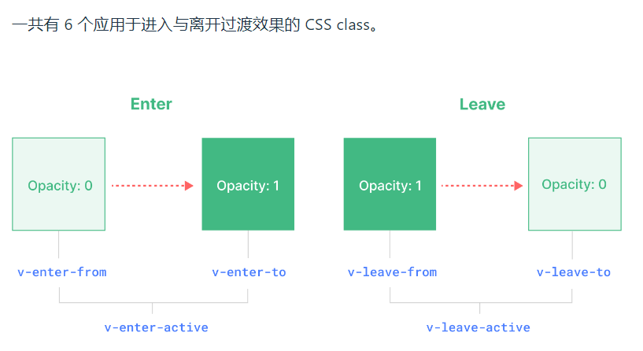

# Transition 过度动画
## 基本示例
* **`<Transition>` 组件**

* (1) 由 `v-if` 所带来的条件渲染
* (2) 由 `v-show` 所带来的条件显示
* (3) 由特殊元素 `<component>` 切换的动态组件
```html
<button @click="show = !show">点击切换</button>
<Transition>
  <p v-if="show">hello</p>
</Transition>
```

```css
.v-enter-active,
.v-leave-active {
  transition: opacity 0.5s ease;
}

.v-enter-from,
.v-leave-to {
  opacity: 0;
}
```
## 动画独立命名
可以通过一个 `name` prop 来声明一种过渡
```html
<Transition name="xxx">
  ...
</Transition>
```
提命名的过渡 , class 会以其**名字**而不是 `v` 作为前缀
```css
.xxx-enter-active,
.xxx-leave-active {
  transition: opacity 0.5s ease;
}

.xxx-enter-from,
.xxx-leave-to {
  opacity: 0;
}
```
## 自定义过渡 class
向 `<Transition>` 传递以下的 `props` 来指定自定义的过渡 `class`：

* enter-from-class
* enter-active-class
* enter-to-class
* leave-from-class
* leave-active-class
* leave-to-class

有了自定义类名 , 可以配合使用[Animate.css](https://animate.style/)动画类库
## appear出现时渲染动画
如果想在初次渲染时应用一个过渡效果，可以添加 `appear` attribute：
```html 
<Transition appear>
  ...
</Transition>
```
## 动画钩子函数
使用[gsap](https://greensock.com/docs/v3/GSAP)与钩子函数实现动画
```
<script src="https://cdn.bootcdn.net/ajax/libs/gsap/3.10.4/gsap.min.js"></script>
或
yarn add gsap
```
```vue
<script lang="ts" setup>
import gsap from 'gsap'

const onBeforeEnter = (el)=>{
  gsap.set(el,{
    opacity:0
  })
}
const onEnter = (el , done)=>{
 gsap.to(el , {
   opacity:1,
   duration:2,
   onComplete:done        
 })
}
const onAfterEnter = (el)=>{

}
const onBeforeLeave = (el)=>{

}
const onLeave = (el,done)=>{
  gsap.to(el , {
    opacity:0,
    duration:2,
    onComplete:done
  })
}

const onAfterLeave = (el)=>{

}
const onLeaveCancelled = (el)=>{

}

</script>

<template>
  <Transition
      @before-enter="onBeforeEnter"
      @enter="onEnter"
      @after-enter="onAfterEnter"
      @before-leave="onBeforeLeave"
      @leave="onLeave"
      @after-leave="onAfterLeave"
      @leave-cancelled="onLeaveCancelled"
  >
    ...
  </Transition>
</template>
```
## 元素之间过渡 与 过渡模式
过渡可以通过`v-show`/`v-if`切换 , 也可以`v-if`/`v-else`/`v-else-if`切换

* 进入和离开的元素都是在同时开始动画的 , 必须将它们设为 `position: absolute` **绝对定位**以避免二者同时存在时出现的布局问题

或者

* 其完成**之后**再执行元素的进入动画 , 可有 props `mode`来控制 `in-out`先进后出/`out-in`先出后进
```
<Transition mode="out-in">
  ...
</Transition>
```
```vue{16-21,9}
<script lang="ts" setup>
import {ref} from 'vue';

const state = ref('on');
</script>

<template>
  <section>
    <Transition mode="out-in">
      <button v-if="state==='on'" @click="state = 'off'">开启</button>
      <button v-else @click="state = 'on'">关闭</button>
    </Transition>
  </section>
</template>
<style lang="scss" scoped>
section {
  position: relative;
  button {
    position: absolute;
  }
}
.v-leave-to, .v-enter-from {
  opacity: 0;
}
.v-leave-active, .v-enter-active {
  transition: all 0.5s ease;
}
</style>
```
## TransitionGroup 过渡组
* 可以通过传入 `tag` prop 来指定一个元素作为包装器元素来渲染
* 不可用 过渡模式
* 其元素必须有唯一的 **`key`**
* 过渡 class 会应用到**每一个元素上** , 不是容器上

```vue
<TransitionGroup name="xxx" tag="ul">
  <li v-for="(item,index) in items" :key="index">
    {{ item }}
  </li>
</TransitionGroup>
```
```css
.list-enter-active,
.list-leave-active {
  transition: all 0.5s ease;
}
.list-enter-from,
.list-leave-to {
  opacity: 0;
  transform: translateX(30px);
}
```
当某一项被插入或移除时，它周围的元素会立即发生“跳跃”而不是平稳地移动。可以通过添加一些额外的 CSS 规则来解决这个问题

`xxx-move`属性 ,  `active`状态的`position: absolute;`
```css{1,15-17}
.list-move, /* 对移动中的元素应用的过渡 */
.list-enter-active,
.list-leave-active {
  transition: all 0.5s ease;
}

.list-enter-from,
.list-leave-to {
  opacity: 0;
  transform: translateX(30px);
}

/* 确保将离开的元素从布局流中删除
  以便能够正确地计算移动的动画。 */
.list-leave-active {
  position: absolute;
}
```
实例: 
```vue
<script lang="ts" setup>
import {ref} from 'vue';

const titles = ref(['奥防空炮收', '艾佛森口岸发', '家是覅哦', '根特皇宫', '阿诗丹顿发生', '按时发放的']);
const del = (index) => {
  titles.value.splice(index, 1);
};
</script>

<template>
  <section>
    <TransitionGroup tag="ul" name="list">
      <li v-for="(title,index) in titles" :key="title" @click="del(index)">{{ title }}</li>
    </TransitionGroup>
  </section>
</template>
<style lang="scss" scoped>
section {
  position: relative;          // 父元素相对定位
  ul {
    padding: 0;
    li {
      list-style: none;
      margin-bottom: 6px;
      padding: 6px;
      background: darkgrey;
      color: black;
    }
  }
}

.list-enter-active, .list-leave-active {
  transition: all 0.5s ease;
  width: 100%;                       // 撑满
  position: absolute;                // 绝对定位
}

.list-leave-to, .list-enter-from {
  transform: translateX(30px);
  opacity: 0;
}
.list-move {                       // xxx-move {}
  transition: all 0.5s ease;
}
</style>

```

## 漂亮的列表交错过渡效果
一开始想要让列表渐进式的出现... 

需要使用钩子函数个gsap , appear , :data-index , delay 延迟 等 ..

```vue{6}
 <transition-group tag="ul" name="list"
                     :css="false"
                     appear
                     @before-enter="onBeforeEnter"
                     @enter="onEnter">
      <li v-for="(title,index) in titles" :key="title" @click="del(index)"  :data-index="index">{{ title }}</li>
    </transition-group>
```
```vue{20}
<script lang="ts" setup>
import {ref} from 'vue';
import  gsap from 'gsap';

const titles = ref(['奥防空炮收', '艾佛森口岸发', '家是覅哦', '根特皇宫', '阿诗丹顿发生', '按时发放的']);
const del = (index) => {
  titles.value.splice(index, 1);
};

function onBeforeEnter(el){
  gsap.set(el, {
    opacity: 0
  });
};

function onEnter(el,done){
 gsap.to(el , {
   opacity:1,
   duration:0.6,
   delay:el.dataset.index * 0.15,
   onComplete:done
 })
};
</script>
```
## 封装(列表动画)组件
* 声明的 props 有 `TransitionGroup`的`tag`, gsap的`duration` , gsap 的`delay`延迟
* 使用了 `slot` 让用户把`v-for`遍历的列表代码传进来

components/animateList.vue
```vue{34}
<script setup lang="ts">
import gsap from 'gsap';

interface Props {
  tag?:string,
  duration?:number,
  delay?:number
}
const props = withDefaults(defineProps<Props>() , {
  tag:'ul',
  duration:0.6,
  delay:0.15
})
const onBeforeEnter = (el) => {
  gsap.set(el, {
    opacity: 0
  });
};
const onEnter = (el , done)=>{
  gsap.to(el , {
    opacity:1,
    duration:props.duration,
    delay:el.dataset.index * props.delay,
    onComplete:done
  })
}
</script>
<template>
  <div class="animateList">
    <TransitionGroup :tag="props.tag" name="animate"
                     appear
                     @before-enter="onBeforeEnter"
                     @enter="onEnter">
        <slot />                    <!-- 使用了 slot 插槽 , 让用户把关键列表模板传进来 -->
    </TransitionGroup>
  </div>
</template>
<style lang="scss" scoped>
.animateList {
  position: relative;
}
.animate-leave-active {
  transition: all 0.25s ease;
  position: absolute;
  width: 100%;
}
.animate-leave-to {
  opacity: 0;
}

.animate-move {
  transition: all 0.25s ease;
}
</style>
```

在外部使用此组件时, 有个细节

不能使用顶层`await`语法 , 经过多次试验此语法不触发`transition`的钩子函数 , 所以用promise的`then`语法代替了`await` , 
然后在`then`的回调里面往响应式数据里赋值
```vue
<script setup lang="ts">
import {article} from '@/apis/articleApi';
import AnimateList from '@/components/animateList.vue';
import {ref} from 'vue';

const articles = ref();

article().then(({result}) => {   // 为了transition钩子函数 , 不能使用顶层await , 而是要使用 then
  articles.value = result;
});

</script>
<template>
  <AnimateList :duration="0.4" :delay="0.15" tag="ul">   <!--props 传值-->>
    <li v-for="(article,index) in articles" :key="article.id" :data-index="index">{{ article.title }}</li>
  </AnimateList>
</template>
<style lang="scss" scoped>
li {
  padding: 10px;
  background: #6c5ce7;
  margin: 0 10px 10px 10px;
  color: white;
}
</style>
```

