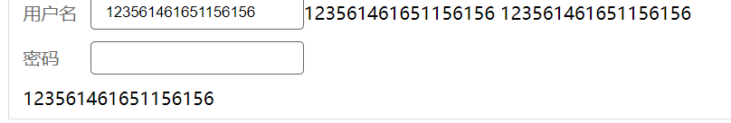

# v-model的使用
* 1. 在`<input>`里面的使用
```vue
<input v-model="xxx" />
```
上面代码等价于
```vue
<input
  :value="xxx"
  @input="xxx = $event.target.value"
/>
```
* 2.  在**组件**里面的使用
```vue
<CustomInput v-model="xxx"/>
```
上面代码等价于
```vue
<CustomInput
  :modelValue="xxx"
  @update:modelValue="xxx = $event"
/>
```
为了使组件能像这样工作，内部的 `<input>` 组件必须：

* 绑定 `value` attribute 到 `modelValue` prop
* 输入新的值时在 `input` 元素上触发 `update:modelValue` 事件

这里是相应的代码：
```vue
<!-- CustomInput.vue -->
<script>
export default {
  props: ['modelValue'],
  emits: ['update:modelValue']
}
</script>

<template>
  <input
    :value="modelValue"
    @input="$emit('update:modelValue', $event.target.value)"
  />
</template>
```

> 小demo , 制作一个简单的input组件


父组件
```vue
<template>
    <div> 
      <Xinput title="用户名" v-model="appName" ></Xinput>
      <Xinput title="密码" password></Xinput>
      {{appName}}
    </div> 
</template>
<script>
import Xinput from './Xinput.vue'
export default {
 components:{
   Card,
   Xinput
 },
  data(){
   return {
     appName:'123'
   }
  }
}
</script>
```
Xinput.vue
```vue
<template>
  <label >
    <div>{{title}}</div>
    <input :type="password ? 'password' : 'text'"  v-model="content">   <!--props属性modelValue不能更改 , 所以声明一个data属性, 赋值了modelValue-->
    {{content}}
    {{modelValue}}
  </label>
</template>
<script>
export default  {
  props:{
    password:{
      type:Boolean,
      default:false
    },
    title : {
      type:String,
    },
    modelValue:{  //以modelValue 属性值传到组件里面
      type:String
    }
  },
  data(){
    return {
      content:this.modelValue     //modelValue是props属性 , 所以不能更改, 所以用data属性代替
    }
  },
  watch:{
    content(newValue) {          //监听data值 content , 每当他变化时通知外面更改
      this.$emit('update:modelValue' , newValue)
    }
  }
}
</script>
```