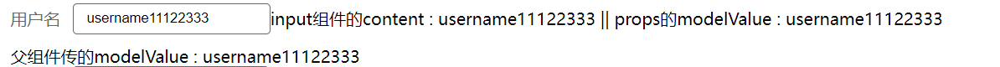
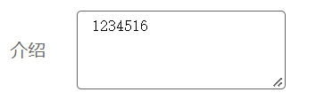

# Vue3中v-model 的使用
[官网](https://staging-cn.vuejs.org/guide/components/events.html#usage-with-v-model)

Vue3 用 `v-model`代替了Vue2里的 `v-model` 和 `.sync`
- 1. 在`<input>`里面的使用

```vue
<input v-model="xxx" />
```

上面代码等价于

```vue
<input :value="xxx" @input="xxx = $event.target.value" />
```

- 2.  在**组件**里面的使用

```vue
<CustomInput v-model="xxx" />
```

上面代码等价于

```vue
<CustomInput :modelValue="xxx" @update:modelValue="xxx = $event" />
```

为了使组件能像这样工作，内部的 `<input>` 组件必须：

- 绑定 `value` attribute 到 `modelValue` prop
- 输入新的值时在 `input` 元素上触发 `update:modelValue` 事件

这里是相应的代码：

```vue
<!-- CustomInput.vue -->
<script>
export default {
  props: ["modelValue"],
  emits: ["update:modelValue"],
};
</script>

<template>
  <input
    :value="modelValue"
    @input="$emit('update:modelValue', $event.target.value)"
  />
</template>
```

> 小 demo , 制作一个简单的 input 组件


父组件

```vue
<template>
  <div>
    <Xinput title="用户名" v-model="appName"></Xinput>
    <!--<XInput title="密码" password></XInput>-->
    父组件传的modelValue : {{ appName }}
  </div>
</template>
<script>
import Xinput from "./Xinput.vue";
export default {
  components: {
    Card,
    Xinput,
  },
  data() {
    return {
      appName: "username",
    };
  },
};
</script>
```

`Xinput.vue`组件

```vue
<template>
  <label>
    <div>{{ title }}</div>
    <input :type="password ? 'password' : 'text'" v-model="content" />
    <!--props属性 modelValue不能更改 , 所以声明一个data属性, 赋值了modelValue-->
    input组件的content : {{ content }} || props的modelValue : {{ modelValue }}
  </label>
</template>
<script>
export default {
  props: {
    password: {
      type: Boolean,
      default: false,
    },
    title: {
      type: String,
    },
    modelValue: {
      //以 外面的v-model值 以 modelValue 属性值传到组件里面
      type: String,
    },
  },
  data() {
    return {
      content: this.modelValue, //modelValue是props属性 , 所以不能更改, 所以用data属性代替
    };
  },
  watch: {
    content(newValue) {
      //监听data值 content , 每当他变化时通知外面更改
      this.$emit("update:modelValue", newValue);
    },
  },
};
</script>
```

- 再添加`XTextarea`文本域组件



父组件里使用时

```vue
<XTextarea :rows="4" v-model="description" title="介绍"></XTextarea>
```

XTextarea.vue:

```vue
<template>
  <label>
    <div>{{ title }}</div>
    <textarea
      v-model="content"
      :rows="rows"
      @input="$emit('update:modelValue', $event.target.value)"
    ></textarea>
    <!-- @input="$emit('update:modelValue' , $event.target.value)" 输入时通知外面更改-->
  </label>
</template>
<script>
export default {
  props: {
    title: {
      type: String,
      required: true,
    },
    modelValue: {
      type: String,
    },
    rows: {
      type: Number,
      default: 3,
    },
  },
  data() {
    return {
      content: this.modelValue,
    };
  },
};
</script>
<style lang="scss" scoped>
label {
  display: flex;
  align-items: center;
  margin-bottom: 10px;
  div {
    color: #666;
    font-size: 16px;
    width: 60px;
  }
  textarea {
    border: 1px solid #666;
    padding: 6px 12px;
    outline: none;
    border-radius: 4px;
    &:focus {
      outline: 1px solid #6b6464;
    }
  }
}
</style>
```
