# v-model 
## v-model 的基本使用
* **v-model 指令**可以在表单 input、textarea以及 select元素上创建**双向数据绑定**
* **v-model 本质上不过是语法糖**，它负责**监听用户的输入事件来更新数据**，并在某种极端场景
下进行一些特殊处理

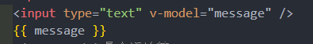
## v-model的原理 
v-model 的原理其实是背后有两个操作：
* v-bind绑定value属性的值；
* v-on绑定input事件监听到函数中，函数会获取最新的值赋值到绑定的属性中

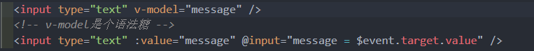
## v-model 绑定其他表单
### 绑定 textarea

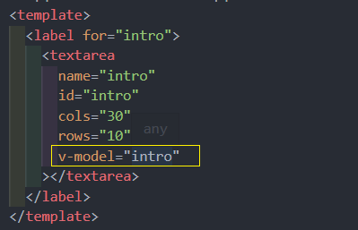
### 绑定checkbox
单个勾选框：
* v-model即为布尔值
* 此时input的value并不影响v-model的值

多个复选框：
* 当是多个复选框时，因为可以选中多个，所以对应的data中属性是一个数组
* 当选中某一个时，就会将input的value添加到数组中

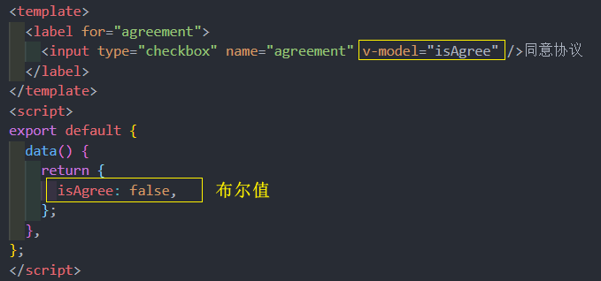
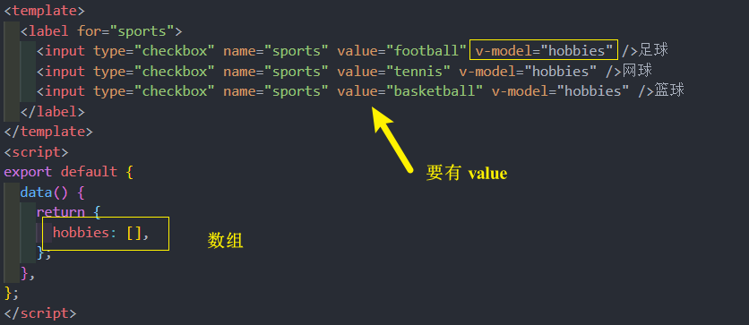
### 绑定 radio
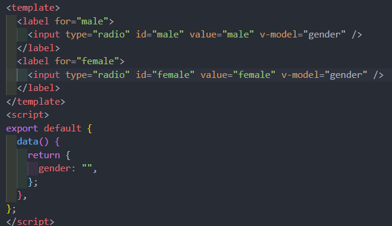
### 绑定 select 
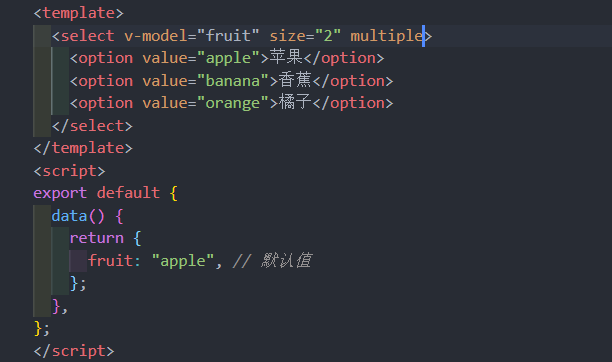
## v-model 值绑定 
目前在前面的案例中大部分的值都是在template中固定好的：
* 比如gender的两个输入框值male、female；
* 比如hobbies的三个输入框值basketball、football、tennis；

但在真实开发中，数据可能是来自服务器的，那么就可以先将值请求下来，**绑定到data返回的对象**中，
再 v-for 通过**v-bind 来进行值的绑定**，这个过程就是值绑定

## v-model 修饰符
### v-model.lazy
lazy修饰符是什么作用: 
* 默认情况下，v-model在进行双向绑定时，绑定的是 **input事件**，那么会在每次内容输入后就将最新的值和绑定
的属性进行同步；
* 如果我们在v-model后跟上 lazy 修饰符，那么会将绑定的事件切换为 **change 事件**，只有在提交时（比如回车）
才会触发
### v-model.number 
v-model绑定后的值它是默认始终是 **字符串(string) 类型** 

即使在我们设置 type 为number也是string类型

如果希望转换为数字类型，那么可以使用 .number 修饰符：

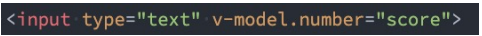
### v-model.trim
如果要自动过滤用户输入的首尾空白字符，可以给 v-model 添加 trim 修饰符：
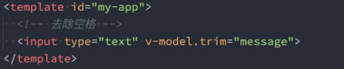
## 组件的 v-model 
前面我们在**input**中可以使用**v-model**来完成双向绑定：
* 这个时候往往会非常方便，因为v-model默认帮助我们完成了两件事；
* **v-bind:value的数据绑定** 和 **@input的事件监听**；

如果现在封装了一个组件，其他地方在使用这个组件时，是否也可以使用 v-model 来同时完成这两个功能呢
* 也是可以的，vue也支持在**组件上使用v-model**；

当在组件上使用的时候，等价于如下的操作：
* 实际和**input元素不同的只是属性的名称和事件触发的名称**而已

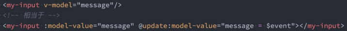
## 组件v-model的实现
为了让我的 MyInput组件 可以正常的工作，这个组件内的 `<input>` 必须：
* 将其 value attribute 绑定到一个名叫 **modelValue 的 prop** 上；
* 在其 input 事件被触发时，将新的值通过**自定义的 update:modelValue 事件抛出**；

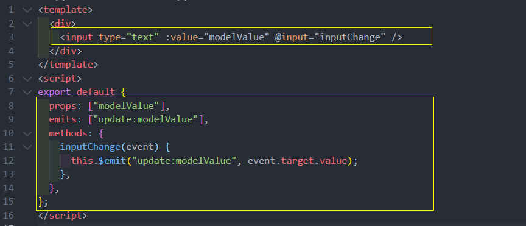

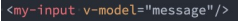
## computed 实现
依然希望在组件内部按照 v-model 双向绑定的做法去完成，应该如何操作呢？

**可以使用计算属性的setter和getter来完成**

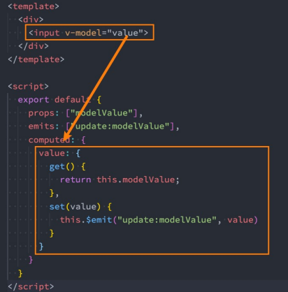
## 绑定多个属性 v-model:xxx

* 默认情况下的v-model其实是绑定了 **modelValue 属性**和 **@update:modelValue的事件**
* 如果我们希望绑定更多，可以给v-model传入一个参数，那么这个参数的名称就是我们绑定属性的名称

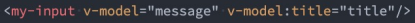
v-model:title相当于做了两件事：
* 绑定了 **title属性**
* 监听了 **@update:title的事件**

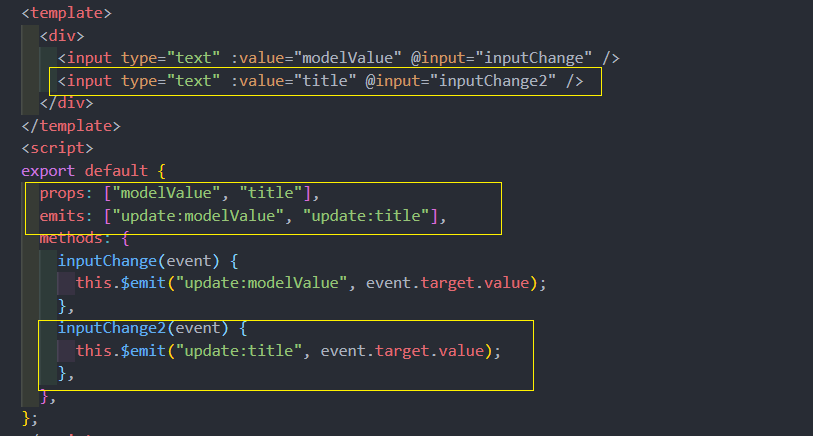

