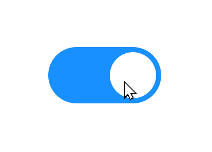

# Switch 开关组件

## API 设计
```vue{9}
<script lang="ts" setup>
  const value = ref(false)
  const change = (status)=>{
    console.log('change.....')
    console.log(status) // true 或 false
  }
</script>

<template>
  <Switch v-model="value"  @on-change="change">  // 状态切换时会触发事件
</template>
用户可以设置初始的状态 , 并且当状态切换时时会触发自定义事件
```
## 最基本的实现之 `<script setup>`
用到的`Vue3`知识点有 `toRef` , `watch` , `defineProps` , `defineEmits` , `v-model` 等等 , 总之还算比较简单
```vue{16-20} 
<script lang="ts" setup>
import {toRef, watch} from 'vue';

const props = defineProps({
  modelValue: {
    type: Boolean,
    required: true
  }
});
const emits = defineEmits(['onChange', 'update:modelValue', 'onChange']);
const toggle = () => {
  emits('update:modelValue', !props.modelValue);
  //console.log(props.modelValue);
};

const modelValueRef = toRef(props, 'modelValue');  //注意细节
// 如果你确实需要从 props 上解构，或者 想要将某个 prop 传入到一个外部函数中但想保持响应性，那么你可以使用 toRefs() 或者 toRef() 这两个工具 API
watch(value, () => {
  emits('onChange',modelValueRef.value === true ? true : false);   // 向外传布尔值 , 外面可以用回调接受这个值
});

</script>
<template>
  <button @click="toggle" :class="{activated:props.modelValue}">
    <span></span>
  </button>
</template>
<style lang="scss" scoped>
$h-button: 22px;
$w-button: 44px;
$h-circle: 18px;
button {
  transition: all 0.25s;
  width: $w-button;
  height: $h-button;
  background: #cccccc;
  position: relative;
  outline: none;
  border: none;
  border-radius: $h-button/2;
  span {
    display: inline-block;    // !!
    width: $h-circle;
    height: $h-circle;
    background: white;
    position: absolute;
    left: 2px;
    top: 2px;
    border-radius: $h-circle/2;
    transition: all 0.25s ease;
  }
  &:hover {
    cursor: pointer;
  }
  &:active {
    span {
      width: $h-circle + 6px;
    }
  }
  &.activated {
    background: #2d8df0;
    span {
      left: calc(100% - #{$h-circle} - 2px); // 技巧 calc()
    }
    &:active {
      span {
        transform: translateX(-6px)
      }
    }
  }
</style>
```
## 最基本的实现之 `setup()`
```vue
<script lang="ts">
import {toRefs, watch} from 'vue';

export default  {
  props:{
    modelValue:{
      type:Boolean,
      required:true
    }
  },
  setup(props , context) {
    const {modelValue} = toRefs(props)
    const toggle =()=>{
      context.emit('update:modelValue', !modelValue.value)
    }
    watch(modelValue , ()=>{   // 注意: watch的参数可以必须是 ref 或 reactive
      context.emit('onChange' , modelValue.value === true ? true :false)
    })
    return {toggle }
  }
}
</script>
<template>
  <button @click="toggle" :class="{activated:modelValue}">
    <span></span>
  </button>
</template>
<style lang="scss" scoped>
$h-button: 22px;
$w-button: 44px;
$h-circle: 18px;
button {
  transition: all 0.25s;
  width: $w-button;
  height: $h-button;
  background: #cccccc;
  position: relative;
  outline: none;
  border: none;
  border-radius: ($h-button)/2;
  span {
    display: inline-block;    // !!
    width: $h-circle;
    height: $h-circle;
    background: white;
    position: absolute;
    left: 2px;
    top: 2px;
    border-radius: $h-circle/2;
    transition: all 0.25s ease;
  }
  &:hover {
    cursor: pointer;
  }
  &:active {
    span {
      width: $h-circle + 6px;
    }
  }
  &.activated {
    background: #2d8df0;
    span {
      left: calc(100% - #{$h-circle} - 2px); // 技巧 calc()
    }
    &:active {
      span {
        transform: translateX(-6px)
      }
    }
  }
}
</style>
```