# Vuex
[官网](https://vuex.vuejs.org/zh/)

先安装vuex, 使用的是vuex.4.x, 安装的时候需要添加next指定版本
```sh
npm install vuex@next --save
```
## 创建 store
**每一个 Vuex 的应用核心就是 store(仓库)**
* store 本质上是一个容器, 它包含着应用中大部分的状态 (state)

**Vuex 和单纯的全局对象有什么区别 ?**
* 第一 : Vuex 的状态存储是响应式的
  * 当vue组件从 store中读取状态的时候, 若store中的状态发生了变化, 那么相应的组件也会被更新
* 第二 : 不能直接改变 store 中的状态
  * 改变store中状态的唯一途径是显示提交(commit) mutation 
  * 这样使我们可以方便的跟踪每一个状态, 从而让我们能够通过devtools工具帮助我们更好的管应用的状态
* 使用步骤:
  * 创建 store 对象
  * 在 app 中通过插件安装

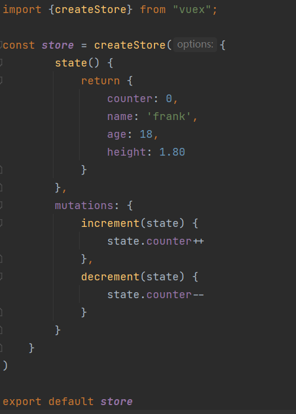
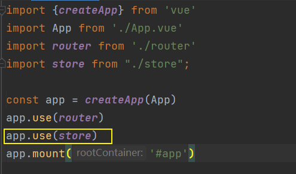

## 组件获取状态 state 
* 可以在模板里获取状态

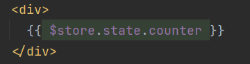
* 如果觉得上面方式优点繁琐(表达式过长) , 可以使用计算属性 computed

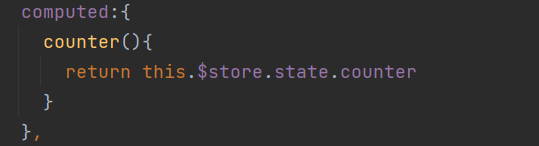
* 但是有很多个状态都需要获取的话 , 可以使用 mapState 辅助函数 :
 * 方式一 : 对象类型 
 * 方式二 : 数组类型 
 * 也可以使用展开运算符和原有的 computed 属性混合在一起


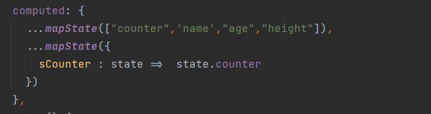
### 在setup中使用 mapState 
在 setup 中如果想要获取单个状态是非常简单的
* 通过 useStore 拿到 store后获取某个状态就行

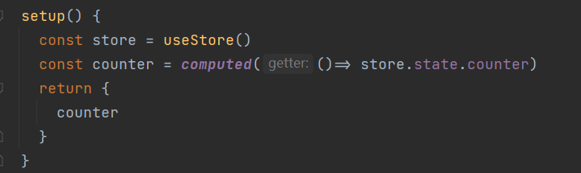

但是如果想要使用 mapState 功能呢 ? 
* 默认情况下 , Vuex 没有提供非常方便的使用 mapState 的方法 , 需要进行一个封装 hook 

hooks/useState.js
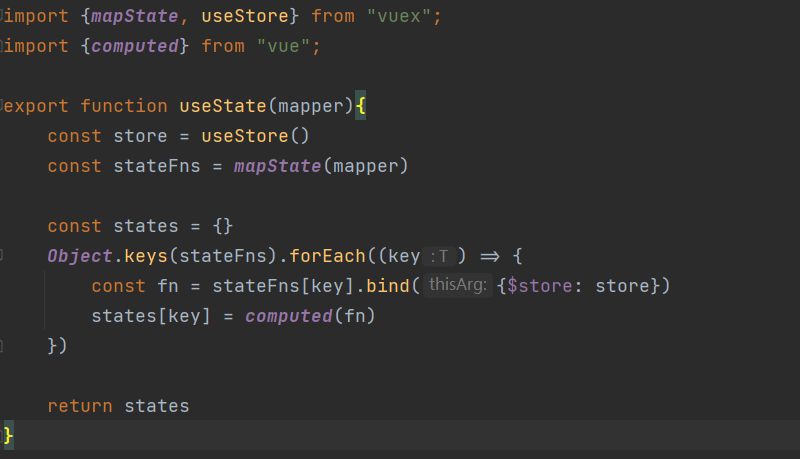
在组件内使用时: 
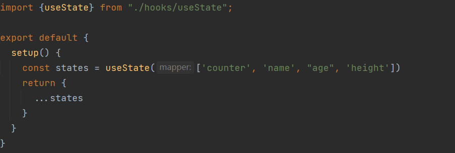

## getters的基本使用
某些属性可能经过变化后来使用 , 这个时候可以用 getters 
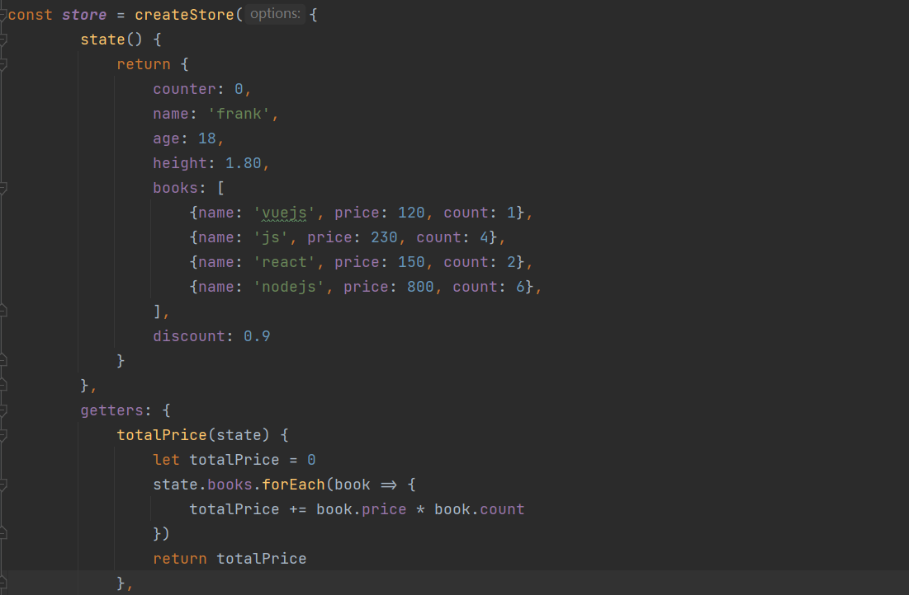
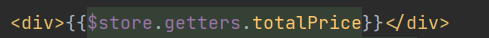
### getters的第二个参数
getters 可以接受第二个参数 : getters 它可以访问其他的getters  (下图)
### getters的返回函数
getters 中的函数本身 , 可以返回一个函数 , 那么在使用的地方相当于可以调用这个函数
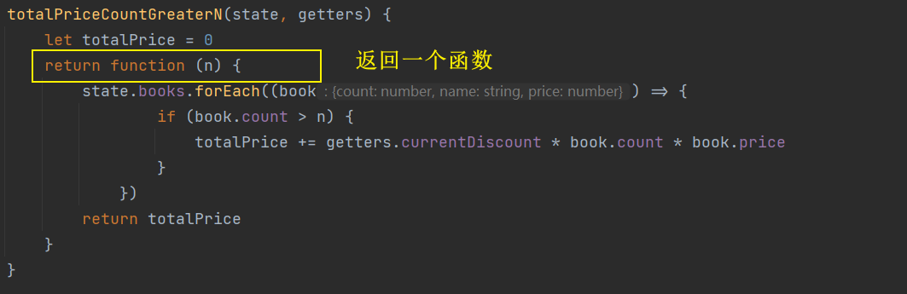
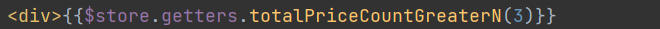
### mapGetters 辅助函数
* 使用 mapGetters 辅助函数 : 
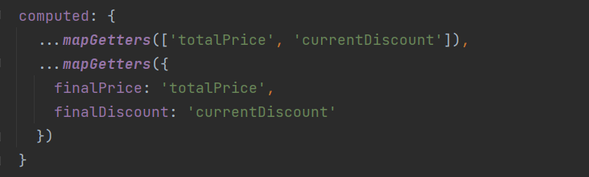
* 在 setup 中使用: 
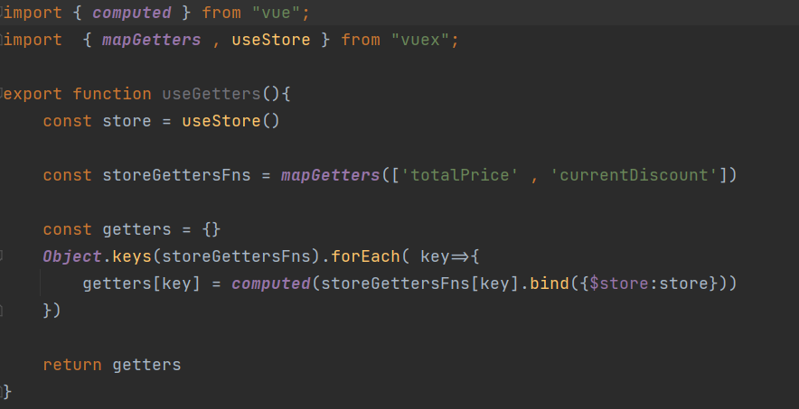
###  封装useState和useGetters 辅助函数
```
hooks
|-- useMapper.js  抽取共同的代码部分
|-- useState.js
|-- useGetters.js
```
useMapper.js

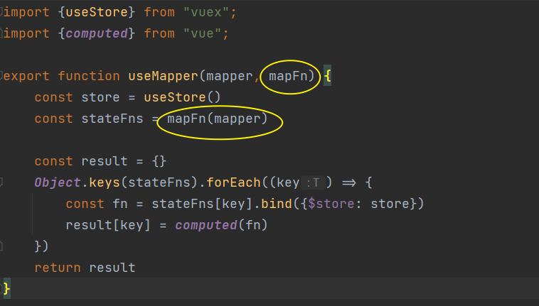

useState.js 

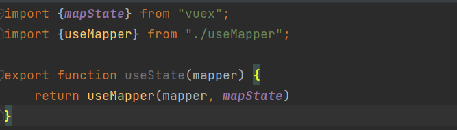

useGetters.js 

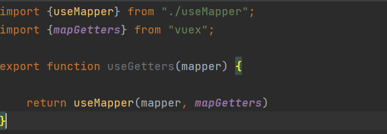

## mutation 基本使用 
**更改 Vuex 的 store 中的状态的唯一方法就是提交 mutation :**
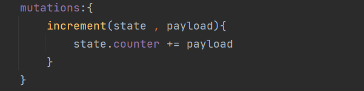
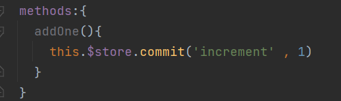
* payload 为**对象**形式

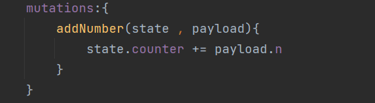
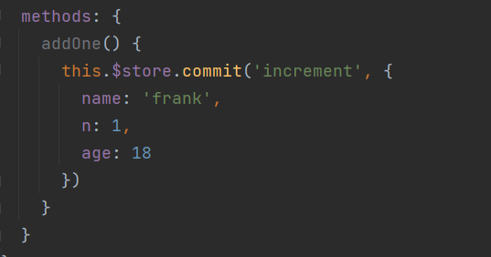

* 对象风格的提交方法

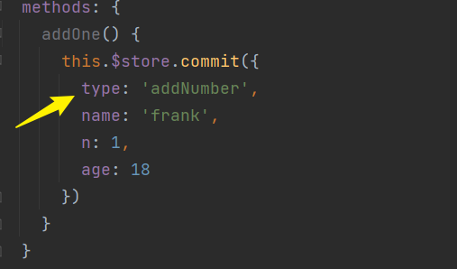
### Mutation常量类型
* 定义常量  : mutation-type.js 

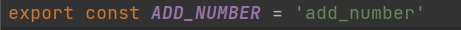

* 定义 mutation 

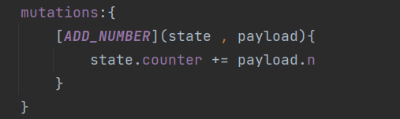

* 提交 mutation

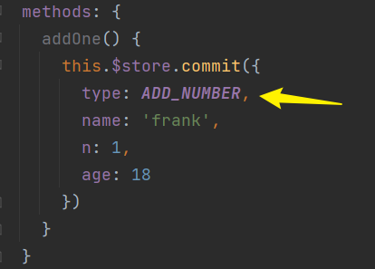
### mapMutations
* 方式一 : 数组类型
* 方式二 : 对象类型 

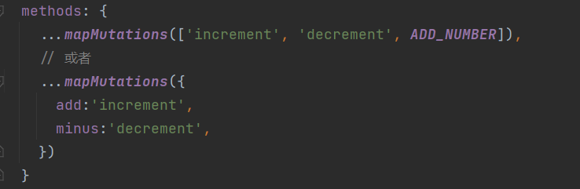

* 在setup中使用 mapMutations

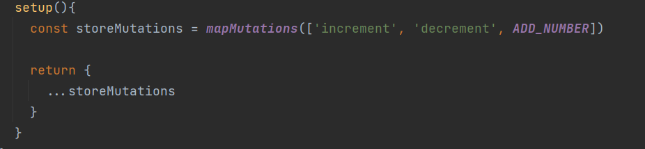
## actions的基本使用
action 类似于 mutation ,不同在于 : 
* action 提交的是 mutation , 而不是直接变更状态
* action 可以包含任何异步操作 

这里有一个非常重要的参数 context 
* context 是一个和store实例均有相同方法和属性的 context 对象
* 所以可以从其中获取到 commit 方法来提交一个mutation, 或者通过context.state 和 context.getters 来获取state和getters 
* 但是为什么他不是 store 对象? 在下面 modules 部分会知道 

### actions的分发操作
* 分发是用的是 store 上的 dispatch 函数 , 同样也可以携带参数 

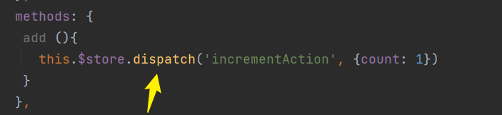 
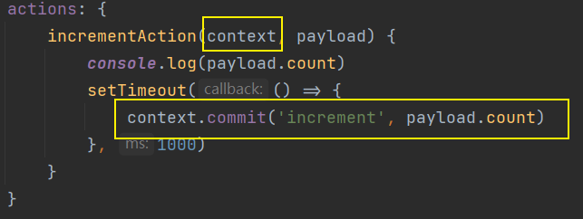 
### actions的其他细节 
* 把 context 打出来看看 , 在参数上可进行解构 
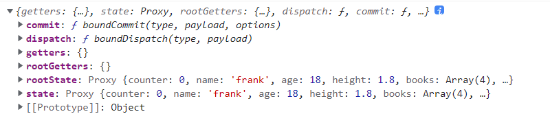
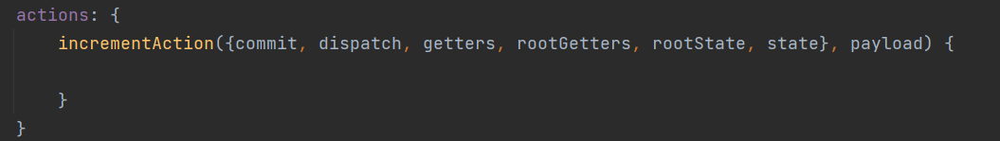
* 对象形式的派发风格

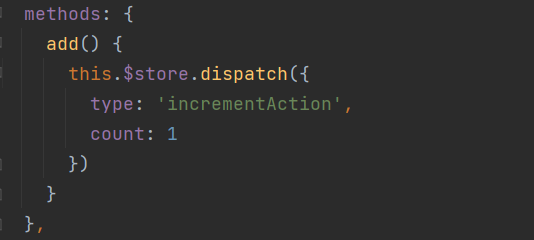

### mapActions 辅助函数 
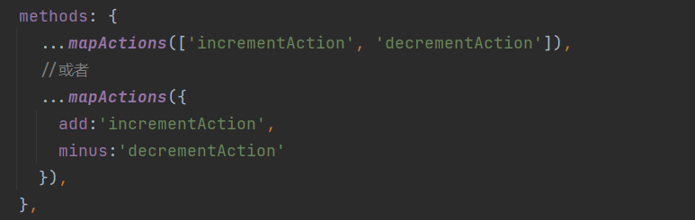
* 在setup中使用 :
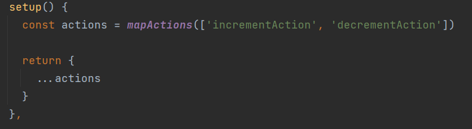
### actions的异步操作
Action 通常是异步的 , 那么如何知道 action 什么时候结束 ? 
* 可以通过让action返回一个 Promise , 在Promise的then中处理完成后的操作

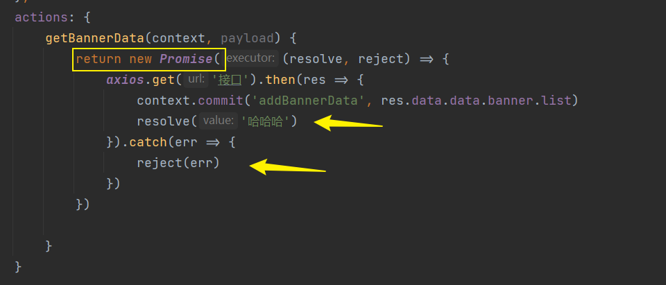
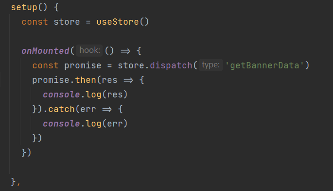
## modules的基本使用
什么是 Module ? 
* 由于使用单一状态树 , 应用中的所有状态会集中到一个比较大的对象 ,  当应用变得非常复杂时 , store对象就有可能变得相当臃肿
* 为了解决这个问题 , Vuex 允许我们将store 分割成多个**模块(module)**
* 每个模块拥有自己的 state , getters , mutations , actions, 甚至是嵌套子模块 
```
store
|-- index.js
|-- modules/home.js
|-- modules/user.js
```
home.js
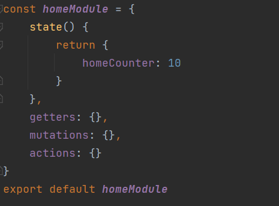

user.js
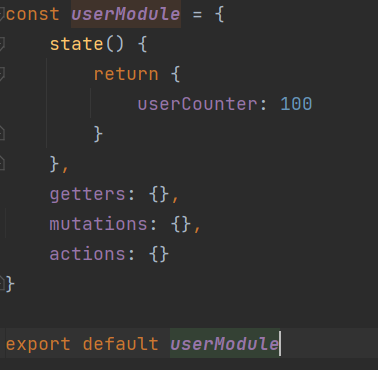

index.js
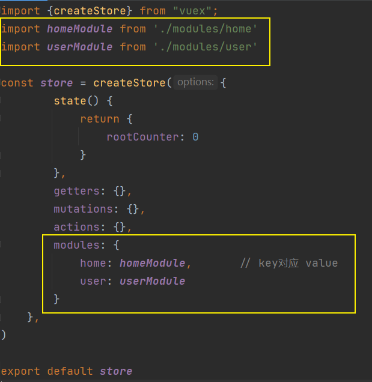

模板: 
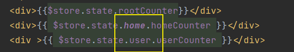

### module的命名空间
默认情况下, 模块内部的action 和 mutation 仍然是注册在**全局的命名空间**中: 
* 这样使得多个模块能够对同一个 action 或 mutation 作出相应
* Getter 同样也默认注册在全局的命名空间中

如果我们希望具有更高的封装度和复用性, 可以添加 **namespaced:true** 的方式使其成为带命名空间的模块 :
* 当模块被注册后, 它的所有getters , actions , mutations ,都会自动根据模块注册的路径调整命名

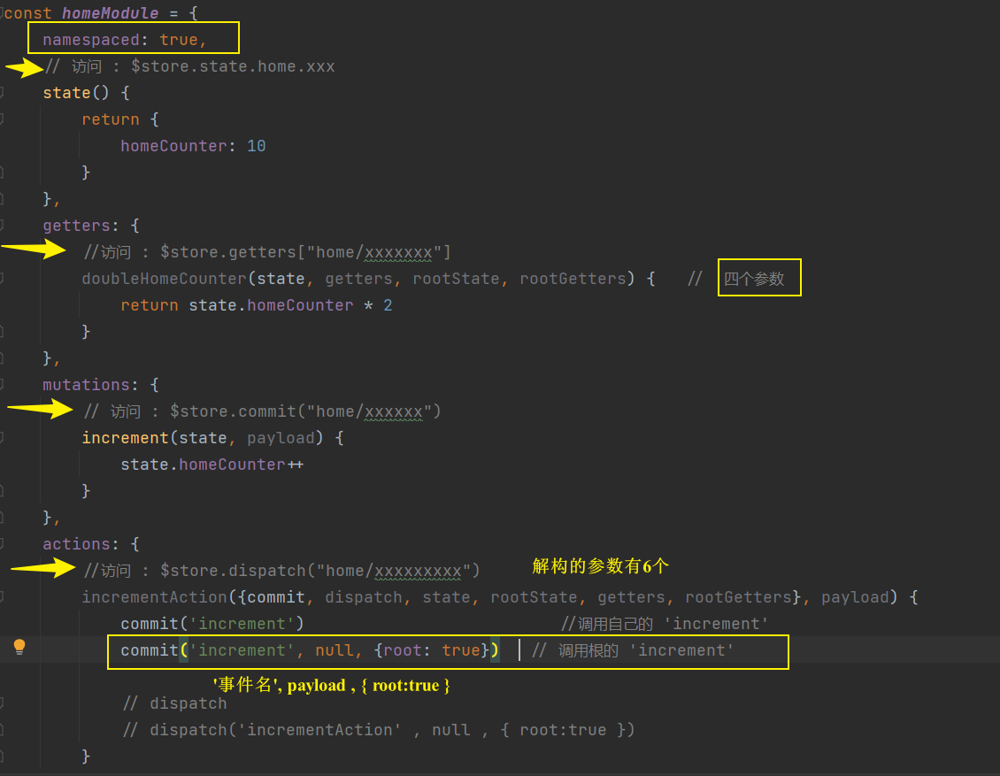

### module的辅助函数

使用辅助函数有三种使用方法: 
* 方式一 : 通过完整的模块名称来查找
* 方式二 : 第一个参数传入模块空间名称, 后面写上要使用的属性 
* 方式三 : 通过 **createNamespacedHelper** 生成一个模块的辅助函数

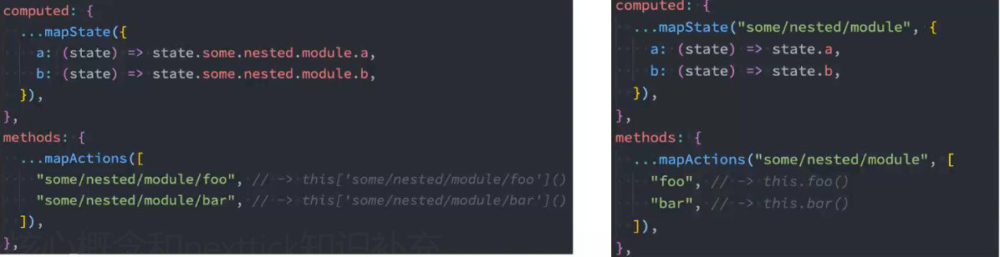

主要使用下面的方法: **createNamespacedHelper**

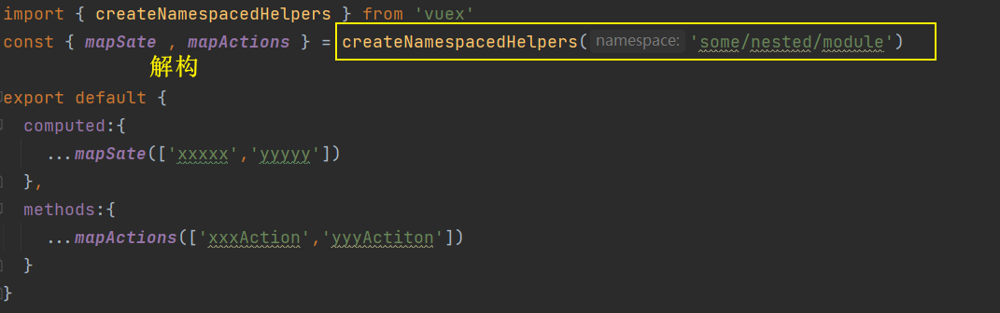

### 对 useState 和 useGetters的修改 (setup中的使用)

useState.js

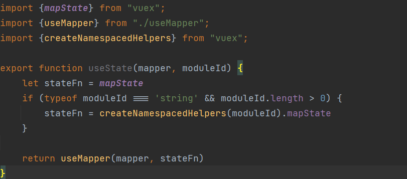

useGetters.js

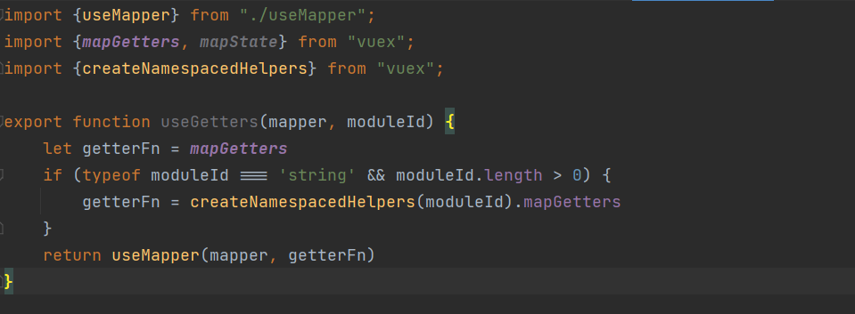


