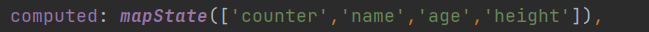
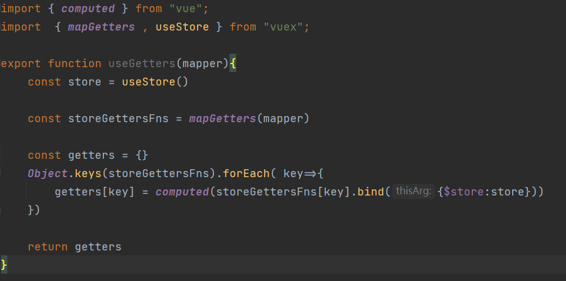

# Vuex
[官网](https://vuex.vuejs.org/zh/)

先安装vuex, 使用的是vuex.4.x, 安装的时候需要添加next指定版本
```sh
npm install vuex@next --save
```
## 创建 store
**每一个 Vuex 的应用核心就是 store(仓库)**
* store 本质上是一个容器, 它包含着应用中大部分的状态 (state)

**Vuex 和单纯的全局对象有什么区别 ?**
* 第一 : Vuex 的状态存储是响应式的
  * 当vue组件从 store中读取状态的时候, 若store中的状态发生了变化, 那么相应的组件也会被更新
* 第二 : 不能直接改变 store 中的状态
  * 改变store中状态的唯一途径是显示提交(commit) mutation 
  * 这样使我们可以方便的跟踪每一个状态, 从而让我们能够通过devtools工具帮助我们更好的管应用的状态
* 使用步骤:
  * 创建 store 对象
  * 在 app 中通过插件安装


## 组件获取状态 state 
* 可以在模板里获取状态


* 如果觉得上面方式优点繁琐(表达式过长) , 可以使用计算属性 computed


* 但是有很多个状态都需要获取的话 , 可以使用 mapState 辅助函数 :
 * 方式一 : 对象类型 
 * 方式二 : 数组类型 
 * 也可以使用展开运算符和原有的 computed 属性混合在一起



### 在setup中使用 mapState 
在 setup 中如果想要获取单个状态是非常简单的
* 通过 useStore 拿到 store后获取某个状态就行


但是如果想要使用 mapState 功能呢 ? 
* 默认情况下 , Vuex 没有提供非常方便的使用 mapState 的方法 , 需要进行一个封装 hook 

hooks/useState.js

在组件内使用时: 


## getters的基本使用
某些属性可能经过变化后来使用 , 这个时候可以用 getters 


### getters的第二个参数
getters 可以接受第二个参数 : getters 它可以访问其他的getters  (下图)
### getters的返回函数
getters 中的函数本身 , 可以返回一个函数 , 那么在使用的地方相当于可以调用这个函数


### mapGetters 辅助函数
* 使用 mapGetters 辅助函数 : 

* 在 setup 中使用: 

## mutation 基本使用 
**更改 Vuex 的 store 中的状态的唯一方法就是提交 mutation :**


* payload 为**对象**形式


* 对象风格的提交方法


### Mutation常量类型
* 定义常量  : mutation-type.js 


* 定义 mutation 


* 提交 mutation


### mapMutations
* 方式一 : 数组类型
* 方式二 : 对象类型 


* 在setup中使用 mapMutations


