# babel
事实上，在开发中我们很少直接去接触babel，但是babel对于前端开发来说，目前是不可缺少的一部分：
* 开发中，我们想要使用ES6+的语法，想要使用TypeScript，开发React项目，它们都是离不开Babel的；
* 所以，学习 Babel 对于我们理解代码从编写到线上的转变过程直观重要；

那么，Babel 到底是什么呢？
* Babel 是一个工具链，主要用于旧浏览器或者缓解将 ECMAScript 2015+代码转换为向后兼容版本的 JavaScript；
* 包括：语法转换、源代码转换、Polyfill实现目标缓解缺少的功能等
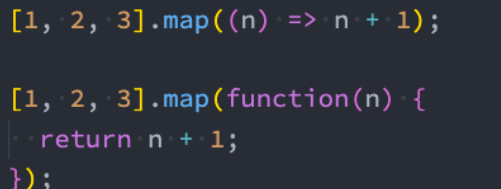

## Babel 命令行使用
babel本身可以作为一个独立的工具（和postcss一样），不和webpack等构建工具配置来单独使用。

如果我们希望在命令行尝试使用babel，需要安装如下库：
* @babel/core：babel的核心代码，必须安装；
* @babel/cli：可以让我们在命令行使用babel；
```shell
npm install @babel/cli @babel/core
```
使用babel来处理我们的源代码：
* src：是源文件的目录；
* --out-dir：指定要输出的文件夹dist；
```shell
npx babel src --out-dir dist
```
### 插件的使用
比如我们需要转换箭头函数，那么我们就可以使用箭头函数转换相关的插件：
```shell
npm install @babel/plugin-transform-arrow-functions -D

npx babel src --out-dir dist --plugins=@babel/plugin-transform-arrow-functions
```
查看转换后的结果：我们会发现 const 并没有转成 var
* 这是因为 plugin-transform-arrow-functions，并没有提供这样的功能；
* 我们需要使用 plugin-transform-block-scoping 来完成这样的功能；

```shell
npm install @babel/plugin-transform-block-scoping -D 
npx babel src --out-dir dist --plugins=@babel/plugin-transform-block-scoping
,@babel/plugin-transform-arrow-functions
```
### Babel 的预设 preset
但是如果要转换的内容过多，一个个设置是比较麻烦的，我们可以使用预设（preset）：

* 后面我们再具体来总结预设代表的含义；
安装@babel/preset-env预设：
```shell
npm install @babel/preset-env -D
```
执行如下命令：
```shell
npx babel src --out-dir dist --presets=@babel/preset-env
```
## babel-loader
在实际开发中，我们通常会在构建工具中通过配置babel来对其进行使用的，比如在webpack中。

那么我们就需要去安装相关的依赖：
* 如果之前已经安装了@babel/core，那么这里不需要再次安装；
```shell
npm install babel-loader @babel/core
```
* 我们可以设置一个规则，在加载 js 文件时，使用我们的babel
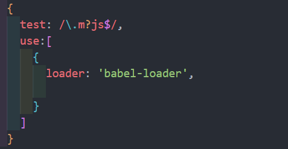

### 指定使用的插件
并且必须指定使用的插件才会生效
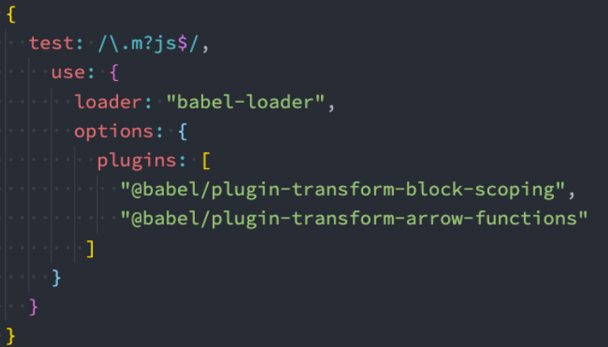
### babel-preset
如果我们一个个去安装使用插件，那么需要手动来管理大量的babel插件，我们可以直接给webpack提供一个
* reset，webpack会根据我们的预设来加载对应的插件列表，并且将其传递给babel。

比如常见的预设有三个：
* env
* react
* TypeScript

安装 preset-env：
```shell
npm install @babel/preset-env
```
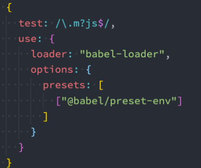

## 设置目标浏览器 browserslist
我们最终打包的 JavaScript 代码，是需要跑在目标浏览器上的，那么如何告知babel我们的目标浏览器呢？
*-browserslist工具
*-target属性

之前已经使用了browserslist工具，我们可以对比一下不同的配置，打包的区别：
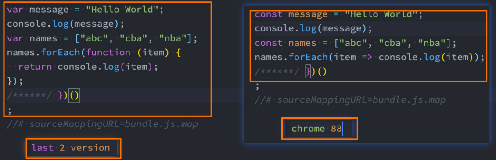
### 设置目标浏览器 targets
我们也可以通过targets来进行配置：
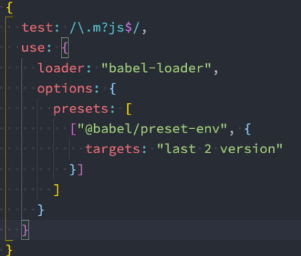

那么，如果两个同时配置了，哪一个会生效呢？
* 配置的 targets 属性会覆盖 browserslist；
* 但是在开发中，更推荐通过browserslist来配置，因为类似于 postcss 工具，也会使用 browserslist，进行统一浏览器
的适配
## Babel 的配置文件
像之前一样，我们可以将babel的配置信息放到一个独立的文件中，babel给我们提供了两种配置文件的编写：
* babel.config.json（或者.js，.cjs，.mjs）文件；
* .babelrc.json（或者.babelrc，.js，.cjs，.mjs）文件；

它们两个有什么区别呢？目前很多的项目都采用了多包管理的方式（babel本身、element-plus、umi等）；
* .babelrc.json：早期使用较多的配置方式，但是对于配置Monorepos项目是比较麻烦的；
* **`babel.config.json`**（babel7）：可以直接作用于Monorepos项目的子包，更加推荐

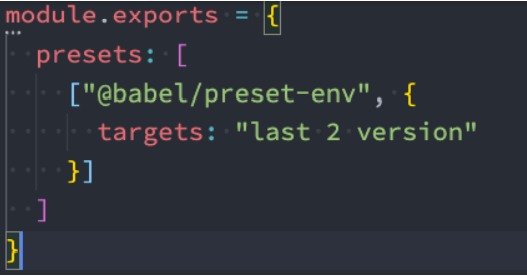

## 认识 polyfill
**Polyfill** 是什么呢？
* 翻译：一种用于衣物、床具等的聚酯填充材料, 使这些物品更加温暖舒适；
* 理解：更像是应该填充物（垫片），一个补丁，可以帮助我们更好的使用 JavaScript；

什么时候会用到 polyfill 呢？
* 比如我们使用了一些语法特性（例如：Promise, Generator, Symbol等以及实例方法例如
Array.prototype.includes 等）
* 但是某些浏览器压根不认识这些特性，必然会报错；
* 我们可以使用 polyfill 来填充或者说打一个补丁，那么就会包含该特性了
### 如何使用 polyfill？
babel7.4.0之前，可以使用 @babel/polyfill的包，但是该包现在已经不推荐使用了：
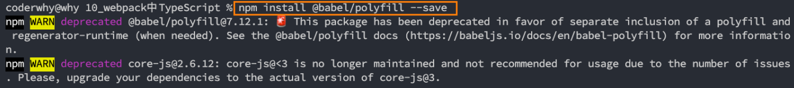
babel7.4.0之后，可以通过单独引入core-js和regenerator-runtime来完成polyfill的使用：
```shell
npm install core-js regenerator-runtime --save
```
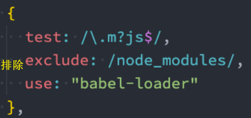
### 配置 babel.config.js
我们需要在babel.config.js文件中进行配置，给preset-env配置一些属性：
* `useBuiltIns`：设置以什么样的方式来使用 polyfill；
* `corejs`：设置corejs的版本，目前使用较多的是 3.x 的版本，比如我使用的是 3.8.x 的版本；
   * 另外 corejs 可以设置是否对提议阶段的特性进行支持；
   * 设置 proposals 属性为 true 即可
### useBuiltIns 属性设置
**`useBuiltIns`** 属性有 **三个** 常见的值

第一个值：`false`
* 打包后的文件不使用 polyfill 来进行适配；
* 并且这个时候是不需要设置 corejs 属性的；

第二个值：`usage`
* 会根据源代码中出现的语言特性，自动检测所需要的 polyfill；
* 这样可以确保最终包里的 polyfill 数量的最小化，打包的包相对会小一些；
* 可以设置 corejs 属性来确定使用的 corejs 的版本

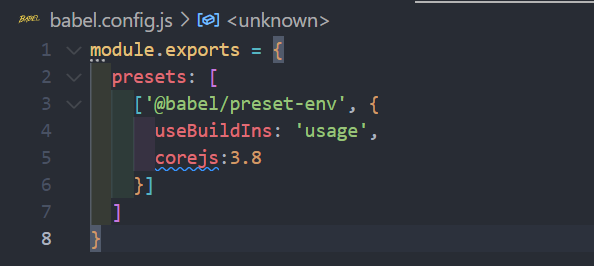

第三个值：`entry`
* 如果我们依赖的某一个库本身使用了某些 polyfill 的特性，但是因为我们使用的是 usage ，所以之后用户浏览器
可能会报错；
* 所以，如果你担心出现这种情况，可以使用 entry；
* 并且需要在 **入口文件 中添加** `import 'core-js/stable'; import 'regenerator-runtime/runtime'`;
* 这样做会根据 browserslist 目标导入所有的 polyfill，但是对应的包也会变大

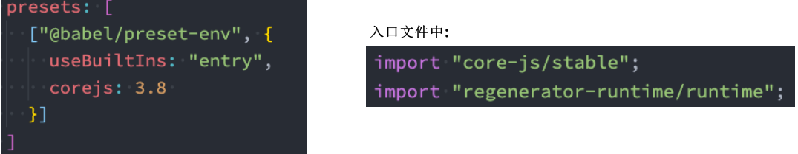
## 认识Plugin-transform-runtime（了解）
在前面我们使用的 polyfill，默认情况是添加的所有特性都是全局的
* 如果我们正在编写一个工具库，这个工具库需要使用polyfill；
* 别人在使用我们工具时，工具库通过polyfill添加的特性，可能会污染它们的代码；
* 所以，当编写工具时，babel更推荐我们使用一个插件： @babel/plugin-transform-runtime来完成polyfill
的功能

### 使用Plugin-transform-runtime
安装 `@babel/plugin-transform-runtime`：
```shell
npm install @babel/plugin-transform-runtime -D
```
使用 plugins 来配置 **babel.config.js**：

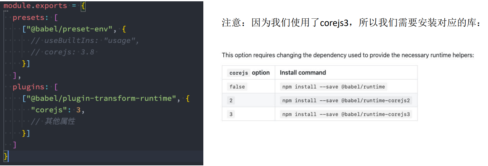
## React 的 jsx 支持
在我们编写react代码时，react使用的语法是jsx，jsx是可以直接使用babel来转换的。

对 react jsx代码进行处理需要如下的插件：
* @babel/plugin-syntax-jsx
* @babel/plugin-transform-react-jsx
* @babel/plugin-transform-react-display-name

但是开发中，我们并不需要一个个去安装这些插件，我们依然可以使用preset来配置
```shell
npm install @babel/preset-react -D
```
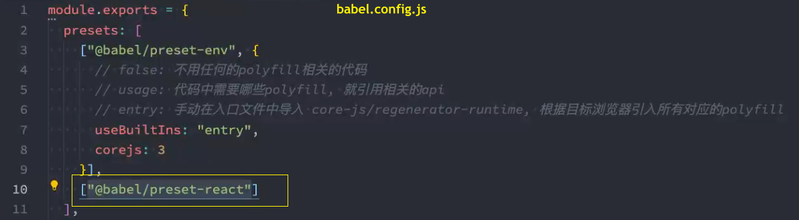
## TypeScript 的编译
在项目开发中，我们会使用TypeScript来开发，那么TypeScript代码是需要转换成JavaScript代码。
n 可以通过TypeScript的compiler来转换成JavaScript：
```shell
npm install typescript -D
```
n 另外 TypeScript 的编译配置信息我们通常会编写一个tsconfig.json文件：
```shell
tsc --init
```
n 生成配置文件如下：
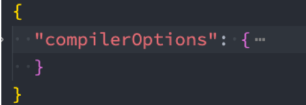
n 之后我们可以运行 npx tsc来编译自己的ts代码：
```shell
npx tsc
```
### 使用 ts-loader
如果我们希望在webpack中使用TypeScript，那么我们可以使用ts-loader来处理ts文件：
```shell
npm install ts-loader -D
```
* 配置ts-loader

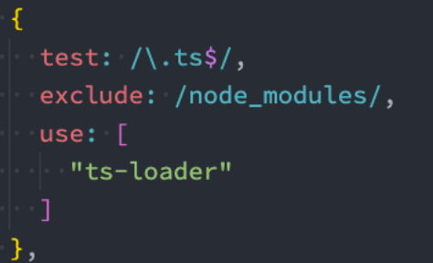

### babel-loader 
除了可以使用TypeScript Compiler来编译TypeScript之外，我们也可以使用Babel：
* Babel是有对TypeScript进行支持；
* 我们可以使用插件： @babel/tranform-typescript；
* 但是更推荐直接使用preset：@babel/preset-typescript；

我们来安装 `@babel/preset-typescript`
```shell
npm install @babel/preset-typescript -D
```
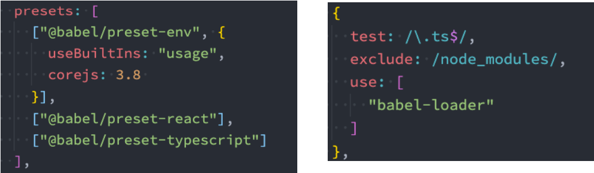
### ts-loader 和 babel-loader 选择
那么我们在开发中应该选择ts-loader还是babel-loader呢？

使用 ts-loader（TypeScript Compiler）
* 来直接编译 TypeScript，那么只能将ts转换成js；
* 如果我们还希望在这个过程中添加对应的 polyfill，那么 ts-loader 是无能为力的；
* 我们需要借助于 babel 来完成 polyfill 的填充功能；

使用 babel-loader（Babel）
* 来直接编译 TypeScript，也可以将ts转换成js，并且可以实现polyfill的功能；
* 但是 babel-loader 在编译的过程中，不会对类型错误进行检测

### 编译 TypeScript 最佳实践
我们使用 Babel 来完成代码的转换，使用 tsc 来进行类型的检查。

但是，如何可以使用tsc来进行类型的检查呢？
* 在这里，我在scripts中添加了两个脚本，用于类型检查；
* 我们执行 npm run type-check 可以对 ts 代码的类型进行检测；
* 我们执行 npm run type-check-watch 可以实时的检测类型错误；

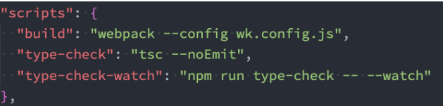

## Webpack中配置vue加载
* 安装相关的依赖：
```shell
npm install vue-loader -D

npm install vue-template-compiler -D
```
* 配置 webpack

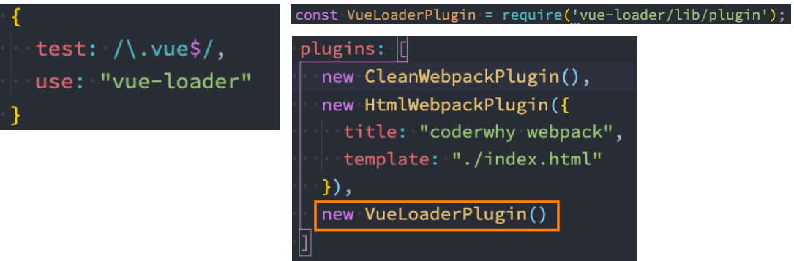