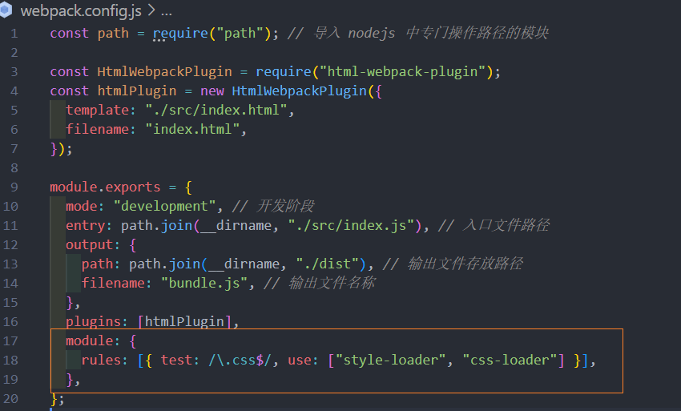

# webpack
## webpack的基本使用
### 1. 创建列表隔行变色项目
1. 新建项目空白目录 , `npm init -y` , 初始化 package.json
2. 新建 src 源代码目录
3. 新建 src -> index.html 文件
4. 初始化首页基本结构
5. 运行 npm install jquery -S , 安装 jQuery
6. 通过模块化形式, 实现列表隔行变色效果

### 2. 项目中安装 webpack
1. 运行 `npm install webpack webpack-cli -D` 命令 , 安装相关的 webpack 包
2. 在项目根目录中, 创建名为 webpack.config.js 的 webpack 配置文件

3. 其中, 初始化如下基本配置 :
```js
module.exports = {
  mode:"development"  // mode 用来指定构建模式
}
```
一定要记住: 开发阶段都用 development 模式, 因为可以提高电码的编译速度, 在上线阶段改成 production 模式
4. 在 package.json文件中, script 节点下, 新增 dev 脚本 , 如下: 
```js
"scripts":{
  "dev":"webpack"  // 通过 npm run dev 运行
}
```
5. 运行 npm run dev , 打包


### 3. 配置打包的入口和出口
webpack 的 4.x 版本中默认约定 : 
* 打包的**入口文件**为  src -> index.js 
* 打包的**输出文件**为 dis -> main.js 

如果要修改打包的入口与出口 , 可以在 webpack.config.js 中配置如下信息 : 
```js{1,5-8}
const path = require("path");   // 导入 nodejs 中专门操作路径的模块

module.exports = {
  mode: "development", // 开发阶段
  entry: path.join(__dirname, "./src/index.js"),  // 入口文件路径
  output: {
    path: path.join(__dirname, "./dist"),      // 输出文件存放路径
    filename: "bundle.js",                     // 输出文件名称
  },
};
```

### 4. 配置 webpack 的自动打包功能
1. `npm install webpack-dev-server -D` , 安装项目自动打包工具
2. 修改 package.json 下的 -> scripts 中的 dev 命令 , 如下: 
```
"scripts":{
  "dev":"webpack-dev-server"   
}
```
3. 将 sec -> index.html中 , script脚本的路径 修改为 **"/bundle.js"** (**根路径下**的 bundle.js)

4. 运行 `npm run dev` , 重新打包 
这时根目录下有一个隐藏的 bundle.js(存在在内存中), 所以在index.html 中引入时直接写 根目录下的 "/bundle.js"
5. 浏览器访问  地址, 查看自动打包效果

**注意:** webpack-dev-server 会启动一个实时打包的 http 服务器
### 5. 配置 html-webpack-plugin 生成预览页面
1. 运行 `npm install html-webpack-plugin -D` , 安装生成预览页面的插件
2. 修改 webpack.plugin.js 文件头部区域, 添加如下配置: 

3. 修改 webpack.config.js , 新增如下配置


最终代码:


### 6. 配置自动打包相关参数


运行 npm run dev 命令之后会直接自动进入到网页

## webpack 加载器
### 1. 通过 loader 打包 非js 模块
在实际开发过程中, webpack 默认只能打包处理以 .js 后缀名结尾的模块, **其他 非 .js 后缀名结尾的模块** , webpack 是默认处理不了, 
**需要调用 loader 加载器才可以正常打包**, 否则会报错 !

loader 加载器可以协助 webpack 打包处理特定的文件模块, 比如:
* less-loader 可以打包处理 .less 相关的文件
* sass-loader 可以打包处理 .scss 相关的文件
* url-loader 可以打包处理 css 中与 url 路径相关的文件 
### 2. loader 调用过程

## webpack 中加载器 loader 的基本使用
### 1. 打包处理 css 文件 
1.  运行 `npm install style-loader css-loader -D` , 安装处理 css 文件的 loader
2. 在 webpack.config.js 中的 module -> rules 数组中 , 添加 loader 规则如下: 
```js 
module: {
    rules: [{ test: /\.css$/, use: ["style-loader", "css-loader"] }],
  },
```
其中 , test 表示匹配的文件类型(正则) , use 表示对应要调用的 loader 

**注意** : 
* use 数组中指定的 loader 顺序是固定的
* 多个 loader 的调用顺序是: **从后往前调用**

最终代码: 

### 2. 打包处理 less 文件
1. `npm install less-loader less -D` 命令,  (less是less-loader的内置项, 必须要安装 less)
2. 在 webpack.config.js 中的 module -> rules 中 , 添加 loader 的规则如下 :
```js
module:{
  rules:[
    {test:/\.less$/, use:['style-loader', 'css-loader', 'less-loader']}
  ]
}
```

### 3. 打包处理 scss 文件 
1. 运行 `npm install sass-loader node-sass -D` 命令 
2. 在 webpack.config.js 中 module -> rules数组中 , 添加 loader 规则如下:
```js
module:{
  rules:[
    {test:/\.scss$/, use:['style-loader','css-loader','sass-loader']}
  ]
}
```


### 4  . 配置 postCSS 自动添加 css 的兼容前缀
1. 运行 `npm install postcss-loader autoprefixer -D` 命令
2. 在项目的根目录下创建 postcss 配置文件 postcss.config.js , 并初始化如下配置:

```js 
const autoprefixer = require('autoprefixer')  // 导入自动添加前缀插件
module.exports = {
  plugins:[ autoprefixer ]
}
```
3. 在 webpack.config.js 的 module -> rules数组中, **修改** css 的loader 规则如下: 
```js
module:{
  rules:[
    {test:/\.css$/, use:['style-loader', 'css-loader','postcss-loader']}
  ]
}
```
代码 : 


### 5. 打包样式表中的图片和字体文件
1. 运行 `npm install url-loader file-loader -D` 命令,  (其中 file-loader 是 url-loader 的内置依赖项)
2. 在 webpack.config.js 的 module -> rules 数组中 , 添加 loader 规则如下: 
```js
module:{
  rules:[
    {
      test:/\.jpg|png|gif|bmp|ttf|eot|svg|woff|woff2$/,
      use:'url-loader?limit=16940'
    }
  ]
}
```
其中 **`?`** 之后的是 loader 的参数项 

limit 用来指定图片的大小, 单位是字节(byte) ,只有小于 limit 大小的图片, 才能转为 base64 的照片

代码: webpack.config.js 

### 6. 打包处理 js 文件中的高级语法 (babel)
1. 安装 babel 转换器相关的包: `npm i babel-loader @babel/core @babel/runtime -D`
2. 安装 babel 语法插件相关的包: `npm i @babel/preset-env @babel/plugin-transform-runtime @babel/plugin-proposal-class-properties -D` 
3. 在项目根目录中, 创建 babel.config.js 并初始化配置如下: 
```js
module.exports = {
  presets:['@/babel/preset-env'],
  plugins:['@babel/plugin-transform-runtime','@babel/plugin-proposal-class-properties']
}
```
4. 在 webpack.config.js 中 module -> rules 数组中, 添加 loader 规则如下: 
```js
module:{
  rules:[
    {test:'/\.js$/', use:'babel-loader',exclude:/node_modules/}
  ]
}
// exclude 为排除项, 表示 babel-loader 不需要处理 node_modules 下的 js 文件
```

代码: 


## Vue 单文件组件
### 1. webpack 中配置 vue 组件的加载器
1. 运行 `npm i vue-loader vue-template-compiler -D` 命令 
2. 在webpack.config.js 配置文件中, 添加 vue-loader 的配置如下 : 
```js 
const VueLoaderPlugin = require('vue-loader/lib/plugin')

module.exports = {
  module:{
    rules:[
      // ... 其他规则 
      {test:/\.vue$/, use:'vue-loader'}
    ]
  },
  plugins:[
    // ... 其他插件
    new VueLoaderPlugin()  // 要确保引入这个插件 ! 
  ]
}
```
### 2. 在 webpack 项目中使用 vue 
1. 运行 `npm i vue -S` 安装 vue 
2.  在 src -> index.js 入口文件中, 通过 import Vue from 'vue' 来导入 vue 构造函数
3. 创建 vue 实例对象, 并制定要控制的 el 区域 
4. 通过 render 函数渲染 App 根组件

```js
import Vue from 'vue'  // 严格办的 vue , 只能用 render 渲染组件

import App from './components/App.vue'

const vm = new Vue({
  // 3. 指定 vm 实例要控制的页面范围
  el:'#app',
  // 通过 render 函数, 把制定的组件渲染到 el 区域中 
  render:h => h(App)
}) 
```

### 3. webpack 打包发布 
上线前需要用 webpack 将应用进行整体打包, 可以通过 package.json 文件配置打包命令 

```js{4}
// 该命令默认加载项目根目录中的 webpack.config.js 文件 
"scripts":{
  // 打包命令 
  "build":"webpack -p",
  // 用于开发调试的命令 
  "dev": "webpack-dev-server --open --host 127.0.0.1 --port 3000"
}
```

