# devServer 和 HMR
目前我们开发的代码，为了运行需要有两个操作：
* 操作一：npm run build，编译相关的代码；
* 操作二：通过live server或者直接通过浏览器，打开index.html代码，查看效果；
这个过程经常操作会影响我们的开发效率，我们希望可以做到，当文件发生变化时，可以自动的完成 编译 和 展示；

为了完成自动编译，webpack提供了几种可选的方式：
* webpack watch mode；
* webpack-dev-server；
* webpack-dev-middleware

一个个学一下
## Webpack watch
webpack 给我们提供了 watch 模式：
* 在该模式下，webpack依赖图中的所有文件，只要有一个发生了更新，那么代码将被重新编译；
* 我们不需要手动去运行 npm run build 指令了；

如何开启watch呢？两种方式：
* 方式一：在导出的配置中，添加 watch: true；
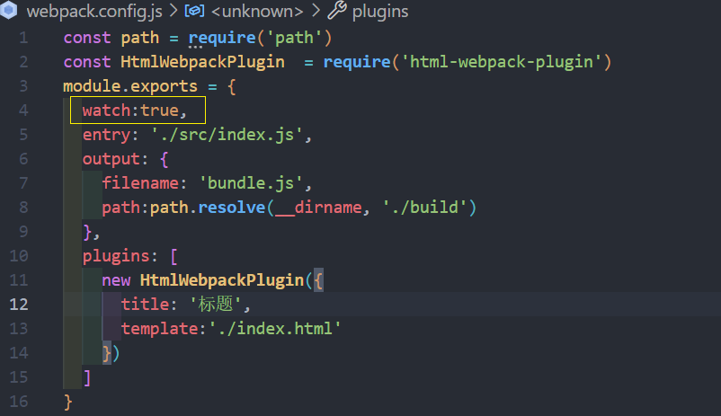
* 方式二：在启动 webpack 的命令中，添加 --watch 的标识；
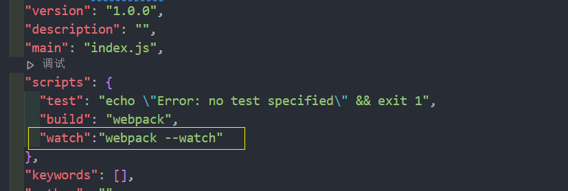

这里选择 方式二，在 package.json 的 scripts 中添加一个 watch 的脚本
## webpack-dev-server
上面的方式可以监听到文件的变化，但是事实上它本身是没有自动刷新浏览器的功能的：
* 当然，目前我们可以在VSCode中使用live-server来完成这样的功能；
* 但是，我们希望在不使用 live-server的情况下，可以具备live reloading（实时重新加载）的功能；

安装 `webpack-dev-server`
```shell
npm install --save-dev webpack-dev-server
```
添加一个新的 scripts 脚本
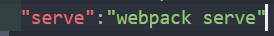

webpack-dev-server 在编译之后不会写入到任何输出文件。而是将 bundle 文件保留在内存中：
* 事实上webpack-dev-server使用了一个库叫memfs（memory-fs webpack自己写的）

执行 `npm run serve`
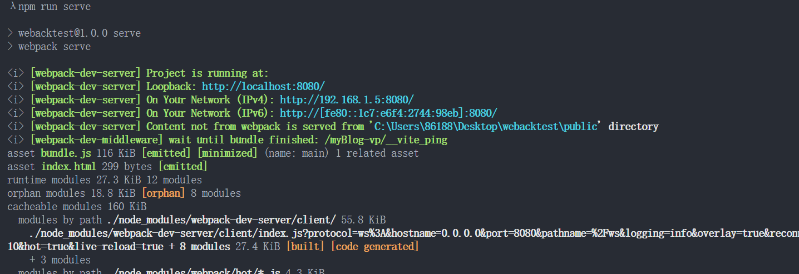

到现在 webpack.config.js 里没有配任何关于 webpack-dev-server 的配置

## 认识 模块热替换（HMR）
什么是HMR呢？
* HMR的全称是Hot Module Replacement，翻译为模块热替换；
* 模块热替换是指在 应用程序运行过程中，替换、添加、删除模块，而无需重新刷新整个页面；

HMR通过如下几种方式，来提高开发的速度：
* **不重新加载整个页面**，这样可以保留某些应用程序的状态不丢失；
* 只更新需要变化的内容，节省开发的时间；
* 修改了css、js源代码，会立即在浏览器更新，相当于直接在浏览器的devtools中直接修改样式；

如何使用 HMR 呢？
* 默认情况下，webpack-dev-server 已经支持 HMR，我们只需要开启即可；
* 在不开启HMR的情况下，当我们修改了源代码之后，整个页面会自动刷新，使用的是live reloading
### 开启 HMR
修改 webpack 的配置

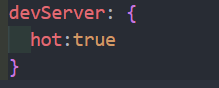
浏览器可以看到如下效果
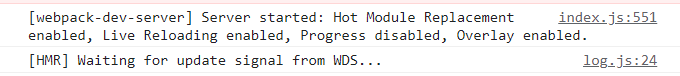
但是你会发现，当我们修改了某一个模块的代码时，依然是刷新的整个页面：
* 这是因为我们需要去指定哪些模块发生更新时，进行 HMR

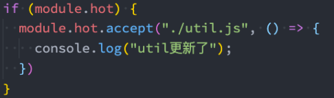
## 框架的 HMR
有一个问题：在开发其他项目时，我们是否需要经常手动去写入 module.hot.accpet相关的API呢？
* 比如开发Vue、React项目，我们修改了组件，希望进行热更新，这个时候应该如何去操作呢？
* 事实上社区已经针对这些有很成熟的解决方案了：
* 比如vue开发中，我们使用 vue-loader，此 loader 支持vue组件的HMR，提供开箱即用的体验；
* 比如react开发中，有 React Hot Loader，实时调整react组件（目前React官方已经弃用了，改成使用reactrefresh）；

接下来分别对React、Vue实现一下HMR功能

### React 的 HMR
在之前，React是借助于React Hot Loader来实现的HMR，目前已经改成使用react-refresh来实现了。

安装实现HMR相关的依赖：
* 注意：这里安装@pmmmwh/react-refresh-webpack-plugin，最新的npm安装有bug（建议使用lts版本对
应的npm版本）；
```shell
npm install -D @pmmmwh/react-refresh-webpack-plugin react-refresh
```
修改webpack.config.js和babel.config.js文件：
### Vue 的 HMR
Vue的加载我们需要使用vue-loader，而vue-loader加载的组件默认会帮助我们进行HMR的处理。
安装加载vue所需要的依赖：
```shell
npm install vue-loader vue-template-compiler -D
```
配置webpack.config.js
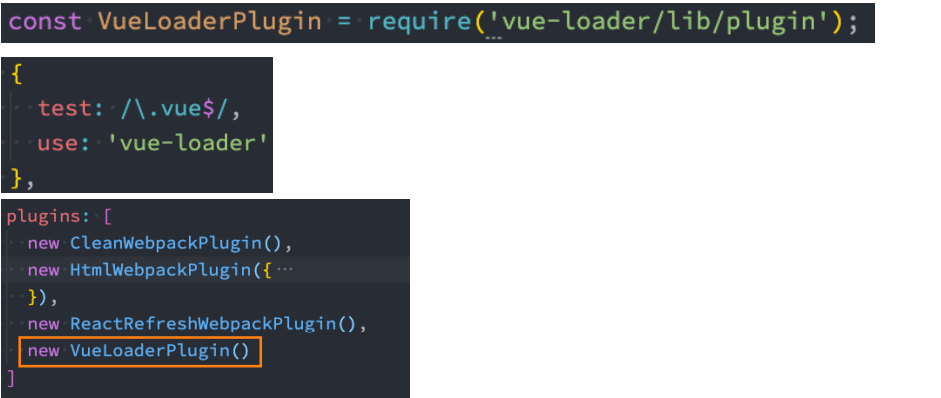

## output 的 publicPath
output中的path的作用是告知webpack之后的输出目录：
* 比如静态资源的js、css等输出到哪里，常见的会设置为dist、build文件夹等；
output中还有一个publicPath属性，该属性是指定index.html文件打包引用的一个基本路径：
* **它的默认值是一个空字符串**，所以我们打包后引入js文件时，路径是 bundle.js；
* 在开发中，我们也将其设置为 `/` ，路径是 `/`bundle.js，那么浏览器会根据所在的域名+路径去请求对应的资源；
* 如果我们希望在本地直接打开html文件来运行，会将其设置为 `./`，路径时 `./`bundle.js，可以根据相对路径去查找资源

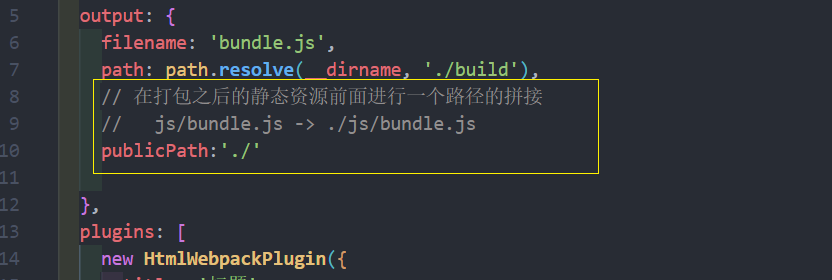
## devServer 的 publicPath(很少用)
devServer中也有一个publicPath的属性，该属性是指定本地服务所在的文件夹：
* 它的默认值是 /，也就是我们直接访问端口即可访问其中的资源 http://localhost:8080；
* 如果我们将其设置为了 /abc，那么我们需要通过 http://localhost:8080/abc才能访问到对应的打包后的资源；
* 并且这个时候，我们其中的bundle.js通过 http://localhost:8080/bundle.js也是无法访问的：
   * 所以必须将output.publicPath也设置为 /abc；
   * 官方其实有提到，建议 devServer.publicPath 与 output.publicPath 相同；
## devServer 的 contentBase
devServer 中 contentBase对于我们直接访问打包后的资源其实并没有太大的作用，它的主要作用是如果我们打包
后的资源，又依赖于其他的一些资源，那么就需要指定从哪里来查找这个内容：
* 比如在 index.html 中，我们需要依赖一个 abc.js 文件，这个文件我们存放在 public文件 中；
* 在index.html中，我们应该如何去引入这个文件呢？
   * 比如代码是这样的：`<script src="./public/abc.js"></script>；`
   * 但是这样打包后浏览器是无法通过相对路径去找到这个文件夹的；
   * 所以代码是这样的：`<script src="/abc.js"></script>`;
   * 但是我们如何让它去查找到这个文件的存在呢？ 设置 contentBase 即可；

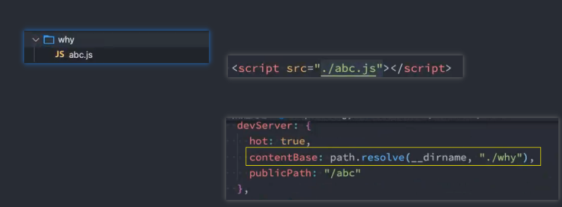

当然在 devServer 中还有一个可以监听 contentBase 发生变化后重新编译的一个属性：`watchContentBase`

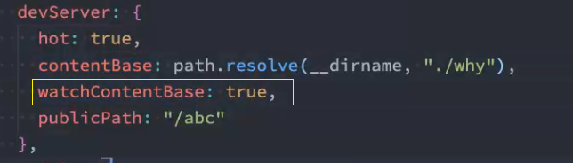
## hotOnly、host配置
hotOnly是当代码编译失败时，是否刷新整个页面：
* 默认情况下当代码编译失败修复后，我们会重新刷新整个页面；
* 如果不希望重新刷新整个页面，可以设置hotOnly为true；
host设置主机地址：
* 默认值是localhost；
* 如果希望其他地方也可以访问，可以设置为 0.0.0.0；
localhost 和 0.0.0.0 的区别：
* localhost：本质上是一个域名，通常情况下会被解析成127.0.0.1;
* 127.0.0.1：回环地址(Loop Back Address)，表达的意思其实是我们主机自己发出去的包，直接被自己接收;
   * 正常的数据库包经常 应用层 - 传输层 - 网络层 - 数据链路层 - 物理层 ;
   * 而回环地址，是在网络层直接就被获取到了，是不会经常数据链路层和物理层的; 
   * 比如我们监听 127.0.0.1时，在同一个网段下的主机中，通过ip地址是不能访问的;
* 0.0.0.0：监听IPV4上所有的地址，再根据端口找到不同的应用程序;
   * 比如我们监听 0.0.0.0时，在同一个网段下的主机中，通过ip地址是可以访问的;
## port、open、compress
port 设置监听的端口，默认情况下是 8080

open是否打开浏览器：
* 默认值是false，设置为true会打开浏览器；
* 也可以设置为类似于 Google Chrome等值；

**compress** 是否为静态文件开启 gzip compression：
* 默认值是 false ，可以设置为 true；

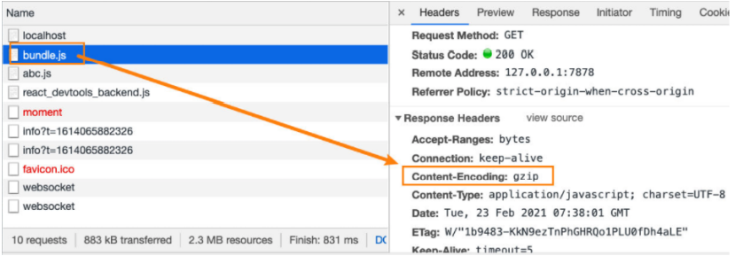
## Proxy 代理
[proxy 文档](https://webpack.docschina.org/configuration/dev-server/#devserverproxy)

proxy是我们开发中非常常用的一个配置选项，它的目的设置代理来解决跨域访问的问题：
* 比如我们的一个api请求是 http://localhost:8888，但是本地启动服务器的域名是 http://localhost:8000，这
个时候发送网络请求就会出现跨域的问题；
* 那么我们可以将请求先发送到一个代理服务器，代理服务器和API服务器没有跨域的问题，就可以解决我们的
跨域问题了；

我们可以进行如下的设置：
* `target`：表示的是代理到的目标地址，比如 /api-hy/moment 会被代理到 http://localhost:8888/api-hy/moment；
* `pathRewrite`：默认情况下，我们的 /api-hy 也会被写入到URL中，如果希望删除，可以使用pathRewrite；
* `secure`：默认情况下不接收转发到https的服务器上，如果希望支持，可以设置为false；
* `changeOrigin`：它表示是否更新代理后请求的headers中host地址；
### changeOrigin 的解析
这个 changeOrigin官方说的非常模糊，通过查看源码我发现其实是要修改代理请求中的headers中的host属性：
* 因为我们真实的请求，其实是需要通过 http://localhost:8888来请求的；
* 但是因为使用了代码，默认情况下它的值时 http://localhost:8000；
* 如果我们需要修改，那么可以将changeOrigin设置为true即可；

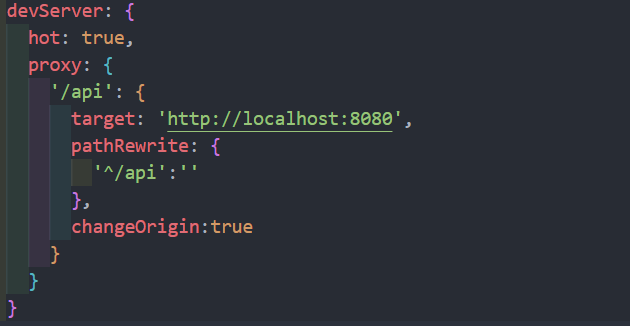
### historyApiFallback
historyApiFallback是开发中一个非常常见的属性，它主要的作用是解决 SPA 页面在路由跳转之后，进行页面刷新
时，返回404的错误。

boolean 值：默认是 false
* 如果设置为true，那么在刷新时，返回404错误时，会自动返回 index.html 的内容；

object类型的值，可以配置 rewrites 属性：
* 可以配置 from 来匹配路径，决定要跳转到哪一个页面；

事实上devServer中实现historyApiFallback功能是通过connect-history-api-fallback库的：
* 可以查看 [connect-history-api-fallback](https://github.com/bripkens/connect-history-api-fallback) 文档

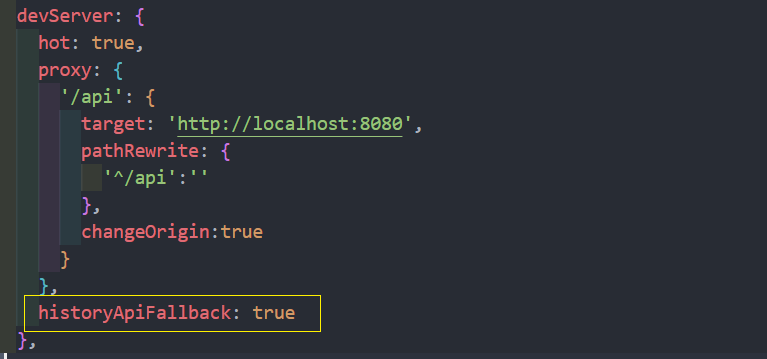

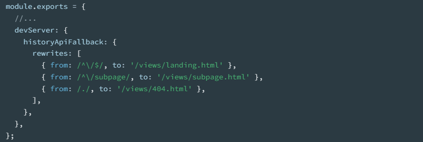
## resolve 模块解析
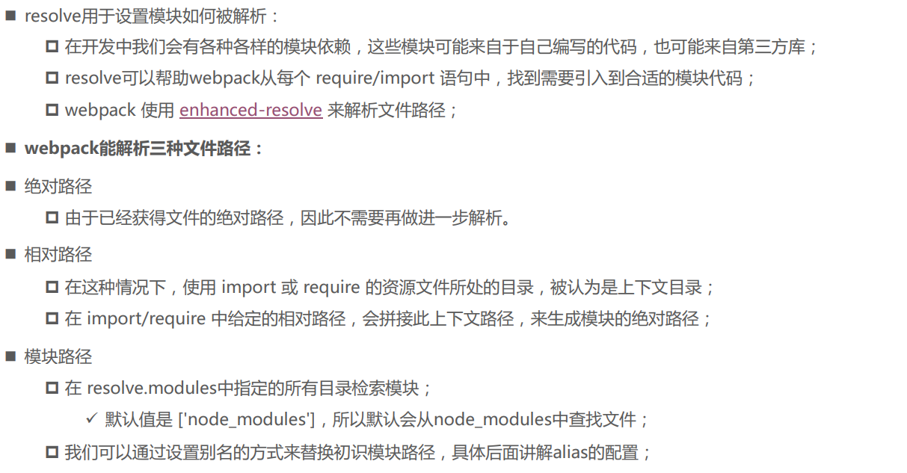
[resolve 模块](https://webpack.docschina.org/configuration/resolve/#resolve)
## 确实文件还是文件夹
如果是一个文件：
* 如果文件具有扩展名，则直接打包文件；
* 否则，将使用 resolve.extensions 选项作为文件扩展名解析；
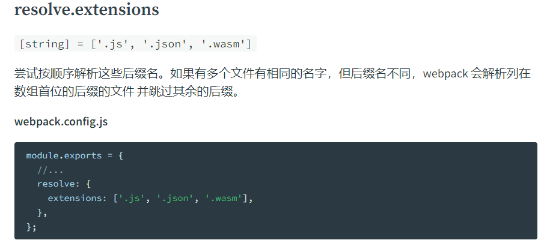
如果是一个文件夹：
* 会在文件夹中根据 resolve.mainFiles 配置选项中指定的文件顺序查找；
   * resolve.mainFiles 的默认值是 ['index']；
   * 再根据 resolve.extensions 来解析扩展名；
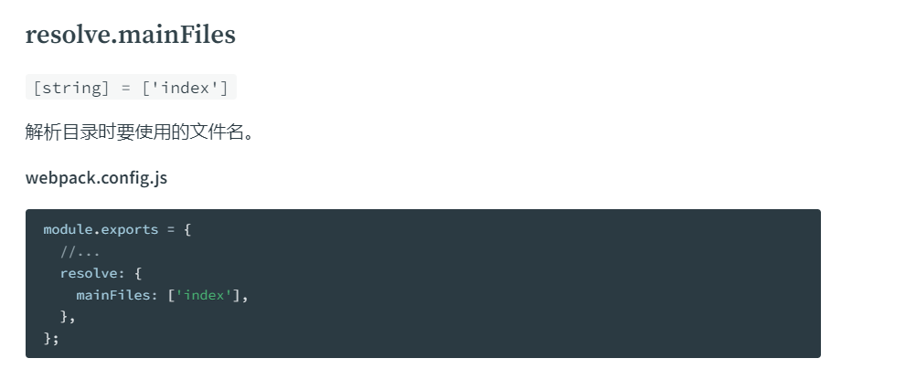
## extensions 和 alias 配置
**extensions** 是解析到文件时自动添加扩展名：
* 默认值是 `['.wasm', '.mjs', '.js', '.json']`；
* 所以如果我们代码中想要添加加载 .vue 或者 jsx 或者 ts 等文件时，我们必须自己写上扩展名；
另一个非常好用的功能是配置别名 **alias：**
* 特别是当我们项目的目录结构比较深的时候，或者一个文件的路径可能需要 ../../../这种路径片段；
* 我们可以给某些常见的路径起一个别名；

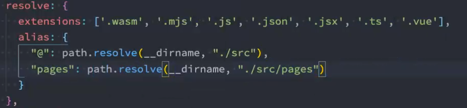


