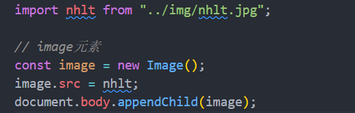
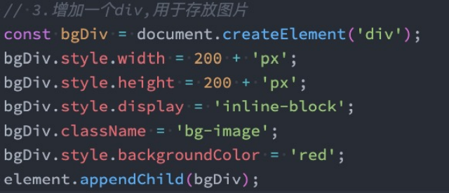
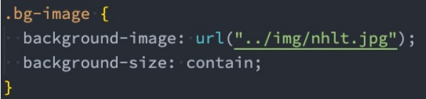
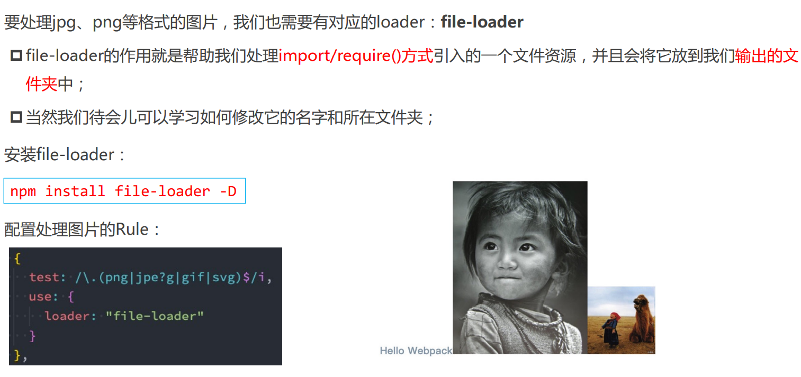
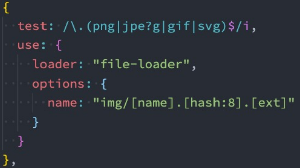
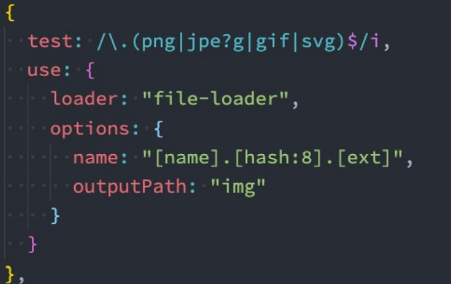
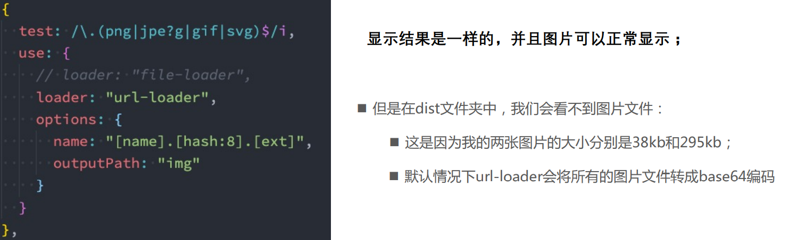

# webpack 打包其他资源 
## file-loader 
比较常见的使用图片的方式是两种：
* img元素，设置src属性；
* 其他元素（比如div），设置 background-image 的css属性




* file-loader 


## 文件的命名规则 
有时候处理后的**文件名称**按照一定的规则进行显示：
* 比如保留原来的**文件名、扩展名**，同时为了防止重复，包含一个hash值等；
 这个时候可以使用**PlaceHolders**来完成，webpack给我们提供了大量的 PlaceHolders 来显示不同的内容：
* [https://webpack.js.org/loaders/file-loader/#placeholders](https://webpack.js.org/loaders/file-loader/#placeholders)
* 可以在文档中查阅自己需要的placeholder；
几个最常用的placeholder：
* `[ext]`： 处理文件的扩展名；
* `[name]`：处理文件的名称；
* `[hash]`：文件的内容，使用MD4的散列函数处理，生成的一个128位的hash值（32个十六进制）；
* `[contentHash]`：在file-loader中和`[hash]`结果是一致的（在webpack的一些其他地方不一样）；
* `[hash:<length>]`：截图hash的长度，默认32个字符太长了；
* `[path]`：文件相对于webpack配置文件的路径
## 设置文件的名称 

## 设置文件的存放路径
也可以通过 **outputPath** 来设置输出的文件夹


## url-loader
url-loader 和 file-loader 的工作方式是相似的，但是可以将较小的文件，转成**base64的URI**

安装url-loader：
```
npm install url-loader -D
```


