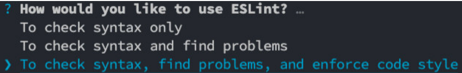

# ESLint
什么是ESLint呢？
* ESLint是一个静态代码分析工具（Static program analysis，在没有任何程序执行的情况下，对代码进行分析）；
* ESLint可以帮助我们在项目中建立统一的团队代码规范，保持正确、统一的代码风格，提高代码的可读性、可维护
性；
* 并且ESLint的规则是可配置的，我们可以自定义属于自己的规则；
* 早期还有一些其他的工具，比如JSLint、JSHint、JSCS等，目前使用最多的是ESLint
## 使用 ESLint
首先我们需要安装 ESLint：
```shell
npm install eslint -D
```
* 创建 ESLint 的**配置文件**：
```shell
npx eslint --init
```
* 选择想要使用的ESLint：

* 执行检测命令：
```shell
npx eslint ./src/main.js
```
## ESLint 的文件解析
默认创建的环境如下：
* env：运行的环境，比如是浏览器，并且我们会使用es2021（对应的ecmaVersion是12）的语法；
* extends：可以扩展当前的配置，让其继承自其他的配置信息，可以跟字符串或者数组（多个）；
* parserOptions：这里可以指定ESMAScript的版本、sourceType的类型
* parser：默认情况下是espree（也是一个JS Parser，用于ESLint），但是因为我们需要编译TypeScript，所以需要指定对应的解释器；
* plugins：指定我们用到的插件；
* rules：自定义的一些规则；


