# 环境分离和代码分离
## 如何区分开发环境
目前我们所有的webpack配置信息都是放到一个配置文件中的：webpack.config.js
* 当配置越来越多时，这个文件会变得越来越不容易维护；
* 并且某些配置是在开发环境需要使用的，某些配置是在生成环境需要使用的，当然某些配置是在开发和生成环
境都会使用的；
* 所以，我们最好对配置进行划分，方便我们维护和管理；

那么，在启动时如何可以区分不同的配置呢？
* 方案一：编写两个不同的配置文件，开发和生成时，分别加载不同的配置文件
* 方案二：使用相同的一个入口配置文件，通过 `--env` 设置参数来区分它们；

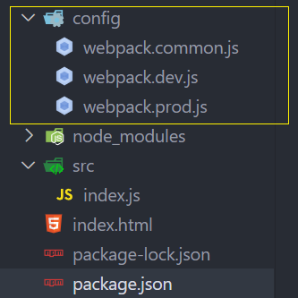
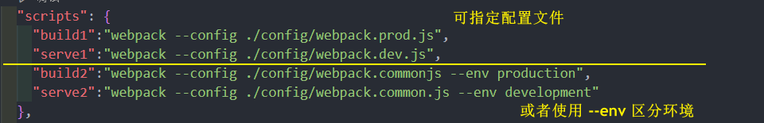

### entry 入口文件解析 - context 属性
我们之前编写入口文件的规则是这样的：./src/index.js，但是如果我们的配置文件所在的位置变成了 config 目录，是否应该变成 ../src/index.js呢？
* 如果我们这样编写，会发现是报错的，依然要写成 ./src/index.js；
* 这是因为入口文件其实是和另一个属性时有关的 context；

context的作用是用于解析入口（entry point）和加载器（loader）：
* 默认是 webpack 的启动目录(package.json 中脚本中的的启动路径)
* 另外推荐在配置中传入一个值

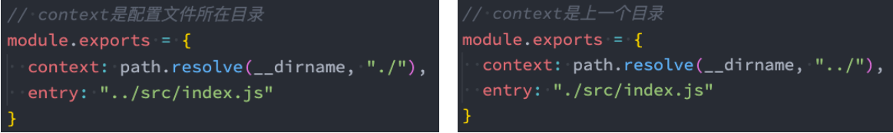

### 配置文件的分离
* webpack.comm.conf.js  公共
* webpack.dev.conf.js  开发
* webpack.prod.conf.js  生产

封装 resolveApp 函数
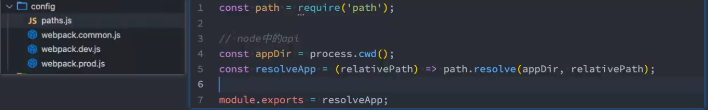
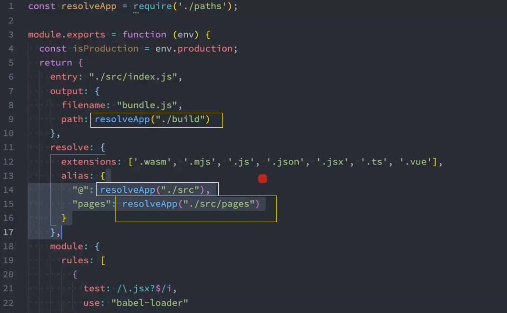
### 合并
**合并**公共配置 和 开发/生产配置

```shell
npm install webpack-merge -D
```
要注意 webpack 是跑在 **Node 环境**当中, 所以要使用 **Common JS 规范导入导入**

config/webpack.dev.conf.js 要merge一下
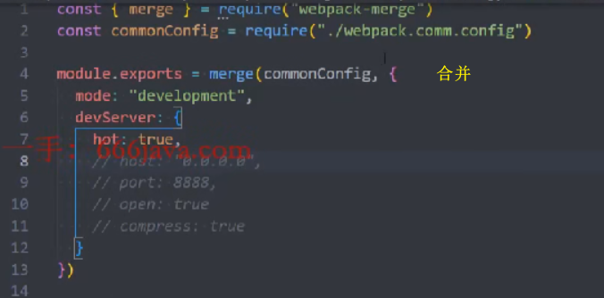

config/webpack.prod.conf.js 当然也要merge一下

## 认识代码分离
代码分离（Code Splitting）是webpack一个非常重要的特性：
* 它主要的目的是将代码分离到不同的bundle中，之后我们可以按需加载，或者并行加载这些文件；
* 比如默认情况下，所有的JavaScript代码（业务代码、第三方依赖、暂时没有用到的模块）在首页全部都加载，
就会影响首页的加载速度；
* 代码分离可以分出出更小的bundle，以及控制资源加载优先级，提供代码的加载性能；

Webpack中常用的代码分离有三种：
* **入口起点**：使用entry配置手动分离代码；
* **防止重复**：使用Entry Dependencies或者SplitChunksPlugin去重和分离代码；
* **动态导入**：通过模块的内联函数调用来分离代码；

### 多入口起点
入口起点的含义非常简单，就是配置多入口：
* 比如配置一个 index.js 和 main.js 的入口；
* 他们分别有自己的代码逻辑；

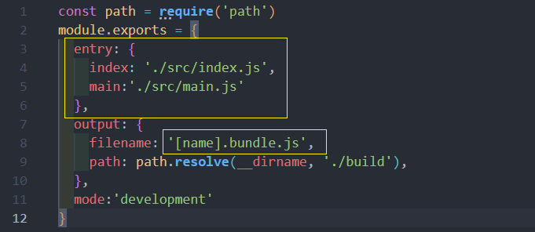

执行 npm run build 编译看看
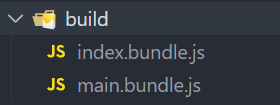

### Entry Dependencies (入口依赖)
假如我们的 index.js 和 main.js 都依赖两个库：lodash、dayjs
* 如果我们单纯的进行入口分离，那么打包后的两个 bunlde 都有会有一份 lodash 和 dayjs；
* 事实上我们可以对他们进行共享
 
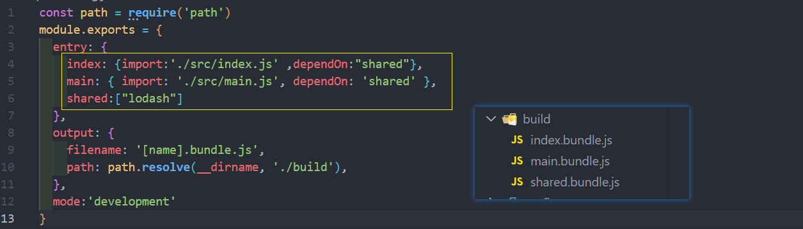
### SplitChunks
另外一种分包的模式是 splitChunk，它是使用SplitChunksPlugin来实现的：
* 因为该插件 webpack 已经默认安装和集成，所以我们并不需要单独安装和直接使用该插件；
* 只需要提供 SplitChunksPlugin 相关的配置信息即可；

Webpack 提供了 SplitChunksPlugin 默认的配置，我们也可以手动来修改它的配置：
* 比如默认配置中，chunks 仅仅针对于异步（async）请求，我们可以设置为 initial(同步) 或者 all

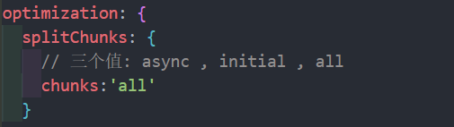

### SplitChunks 自定义配置
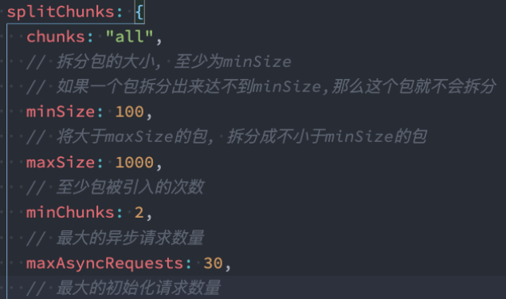
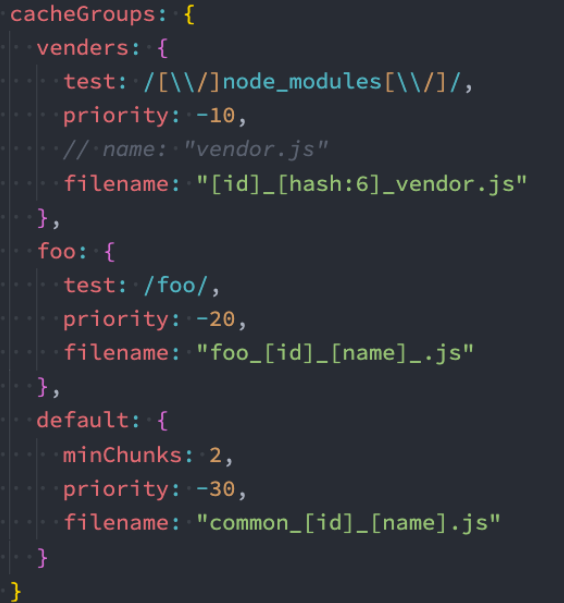
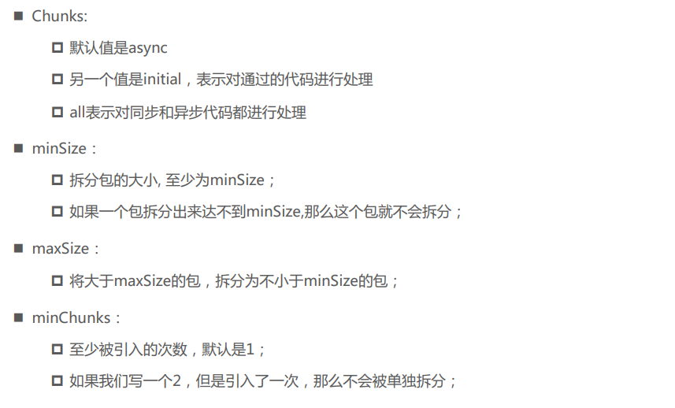
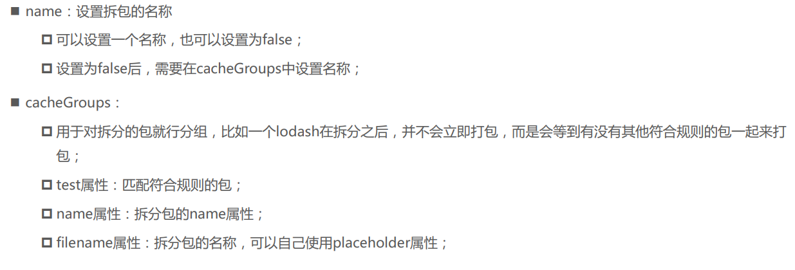

### 动态导入 (dynamic import)
另外一个代码拆分的方式是动态导入时，webpack提供了两种实现动态导入的方式：
* 第一种，**使用ECMAScript中的 import() 语法来完成，也是目前推荐的方式**
* 第二种，使用webpack遗留的 require.ensure，目前已经不推荐使用；

比如有一个模块 bar.js：
* 该模块我们希望在代码运行过程中来加载它（比如判断一个条件成立时加载）；
* 因为我们并不确定这个模块中的代码一定会用到，所以最好拆分成一个独立的js文件；
* 这样可以保证不用到该内容时，浏览器不需要加载和处理该文件的 js 代码；
* 这个时候我们就可以使用动态导入

注意：使用动态导入bar.js：
* 在 webpack 中，通过动态导入获取到一个对象
* 真正导出的内容，在改对象的**default属性**中，所以我们需要做一个简单的解构；

### 动态导入的文件命名
动态导入的文件命名：
* 因为动态导入通常是一定会打包成独立的文件的，所以并不会再cacheGroups中进行配置；
* 那么它的命名我们通常会在output中，通过 chunkFilename 属性来命名；

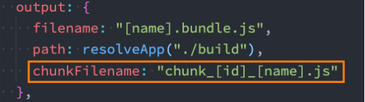

但是，会发现默认情况下获取到的 `[name]` 是和id的名称保持一致的
* 如果我们希望修改 **name** 的值，可以通过magic comments（魔法注释）的方式；

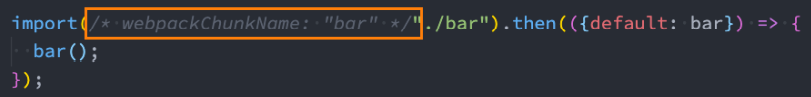

### 代码的懒加载
动态import使用最多的一个场景是懒加载（比如路由懒加载）：

**真正用到的时候加载**

### Prefetch 和 Preload

webpack v4.6.0+ 增加了对预获取和预加载的支持。

在声明 import 时，使用下面这些内置指令，来告知浏览器：
* **prefetch(预获取)**：将来某些导航下可能需要的资源
* **preload(预加载)**：当前导航下可能需要资源 

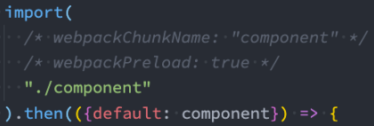

与 prefetch 指令相比，preload 指令有许多不同之处：
* preload chunk 会在父 chunk 加载时，以并行方式开始加载。prefetch chunk 会在父 chunk 加载结束后开始加载
* preload chunk 具有中等优先级，并立即下载。prefetch chunk 在浏览器闲置时下载
* preload chunk 会在父 chunk 中立即请求，用于当下时刻。prefetch chunk 会用于未来的某个时刻

### optimization.chunkIds配置
optimization.chunkIds配置用于告知webpack模块的id采用什么算法生成。

有三个比较常见的值：
* natural：按照数字的顺序使用id；
* named：development下的默认值，一个可读的名称的id；
* deterministic：确定性的，在不同的编译中不变的短数字id
   * 在webpack4 中是没有这个值的；
   * 那个时候如果使用 natural，那么在一些编译发生变化时，就会有问题；
最佳实践：
* 开发过程中，推荐使用 named；
* 打包过程中，推荐使用 deterministic；

### optimization. runtimeChunk配置
配置runtime相关的代码是否抽取到一个单独的chunk中：
* runtime相关的代码指的是在运行环境中，对模块进行解析、加载、模块信息相关的代码；
* 比如我们的component、bar两个通过import函数相关的代码加载，就是通过runtime代码完成的；

抽离出来后，有利于浏览器缓存的策略：
* 比如我们修改了业务代码（main），那么runtime和component、bar的chunk是不需要重新加载的；
* 比如我们修改了component、bar的代码，那么main中的代码是不需要重新加载的；

设置的值：
* true/multiple：针对每个入口打包一个runtime文件；
* single：打包一个runtime文件；
* 对象：name属性决定runtimeChunk的名称；

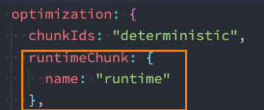


