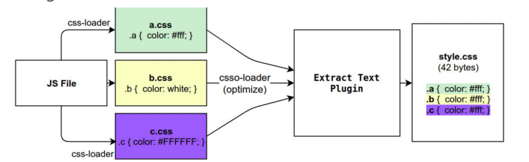
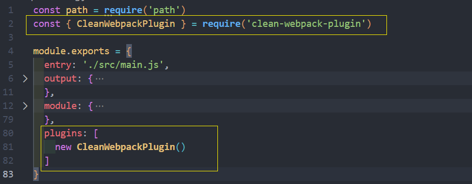
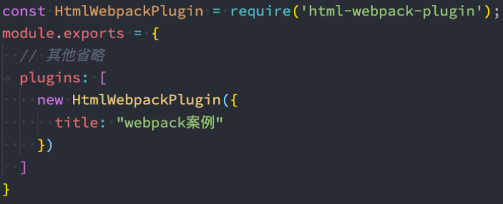
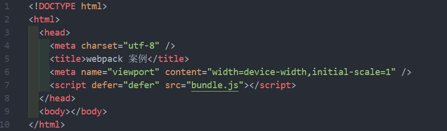
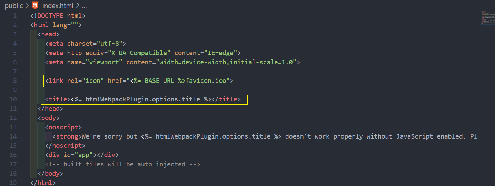
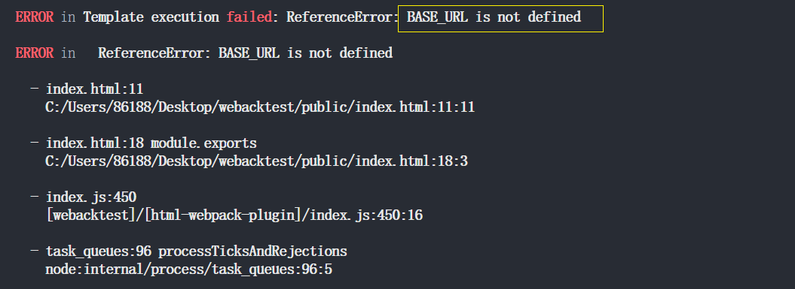
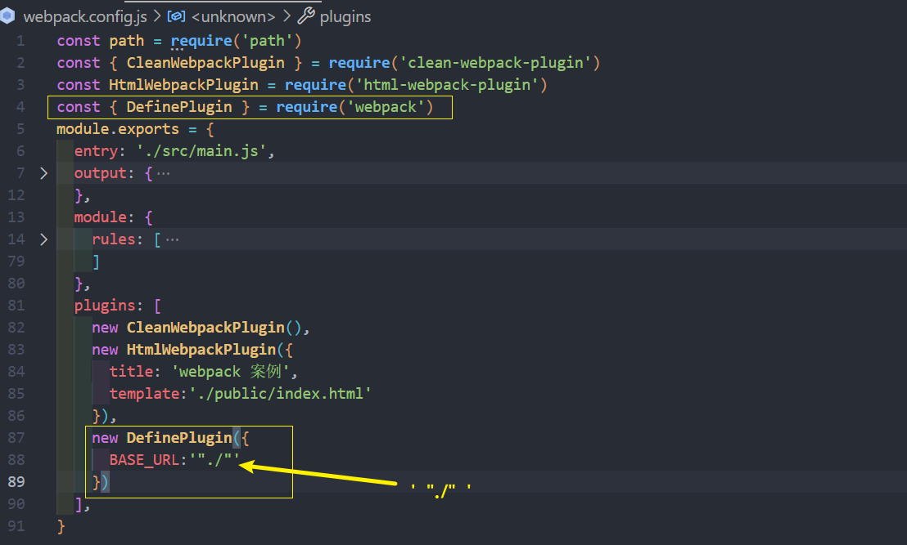
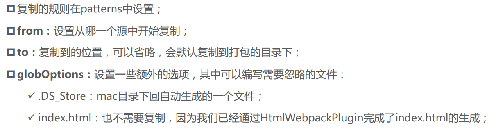
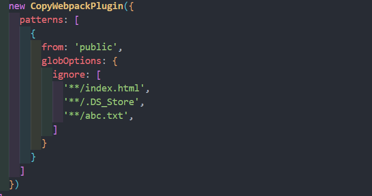

# plugin；
`loader` 是文件加载器
* 功能：能够对文件进行编译、优化、混淆（压缩）等 , 用于 **特定的模块类型**(处理或转换某一个文件) 进行转换，比如 babel-loader , vue-loader
* 运行时机：在创建最终产物之前运行
`plugin` 是 webpack 插件
* 功能：能实现更多功能，比如定义全局变量、Code Split、加速编译等 , 打包优化、资源管理、环境变量注入...
* 运行时机：在整个打包过程（以及前后）都能运行

## CleanWebpackPlugin
在前面，每次修改了一些配置，重新打包时，都需要手动删除dist文件夹：
* 可以借助于一个插件来帮助我们完成，这个插件就是 **`CleanWebpackPlugin`**

首先，先安装这个插件：
```shell
npm install clean-webpack-plugin -D
```

* 之后在插件中配置：



## HtmlWebpackPlugin
另外还有一个不太规范的地方：
* 我们的 HTML 文件是编写在根目录下的，而最终打包的**dist 文件夹中是没有index.html文件**的
* 在**进行项目部署的**时，必然也是需要**有对应的入口文件 index.html**
* 所以我们也需要对 **index.html 进行打包处理**

对 HTML 进行打包处理可以使用另外一个插件：**`HtmlWebpackPlugin`**
```shell
npm install html-webpack-plugin -D
```

### 生成的 index.html 分析
会发现，现在自动在 dist 文件夹中，生成了一个 index.html 的文件：
* 该文件中也自动添加了打包的 bundle.js 文件



这个文件是如何生成的呢？
* 默认情况下是根据**ejs 的一个模板**来生成的；
* 在 html-webpack-plugin 的源码中，有一个 default_index.ejs 模块；

### 自定义 HTML 模板
如果我们想在自己的模块中加入一些比较特别的内容：
* 比如添加一个noscript标签，在用户的JavaScript被关闭时，给予响应的提示
* 比如在**开发vue或者react项目**时，我们需要一个可以挂载后续组件的**根标签** `<div id="app"></div>`

这个我们需要一个属于自己的 index.html 模块

### 自定义模板数据填充
上面的代码中，会有一些类似这样的语法<% 变量 %>，这个是EJS模块填充数据的方式。

在配置 HtmlWebpackPlugin 时 ，可以添加如下配置
* **template**：指定我们要使用的模块所在的路径
* **title**：在进行 `htmlWebpackPlugin.options.title` 读取时，就会读到该信息

### DefinePlugin 的介绍
但是，这个时候编译还是会**报错**，因为在我们的模块中还使用到一个 **`BASE_URL`** 的常量


这是因为在编译template模块时，有一个BASE_URL：
* `<link rel="icon" href="<%= BASE_URL %>favicon.ico">；`
* 但是我们并没有设置过这个常量值，所以会出现没有定义的错误

这个时候可以使用 **DefinePlugin** 插件

### DefinePlugin 的使用
DefinePlugin 允许在编译时创建配置的全局常量，是一个 webpack 内置的插件（不需要单独安装）：



这个时候，`npm run build`编译 template 就可以正确的编译了，会读取到BASE_URL的值；

后续还会再总结 DefinePlugin 的一些其他用法
## CopyWebpackPlugin
在vue的打包过程中，如果我们将一些文件放到public的目录下，那么这个目录会被复制到dist文件夹中。
* 这个复制的功能，我们可以使用 CopyWebpackPlugin 来完成；

安装 CopyWebpackPlugin 插件：
```shell
npm install copy-webpack-plugin -D
```

接下来配置 CopyWebpackPlugin 即可



