# sourcemap
## Mode 配置
Mode配置选项，可以告知 webpack 使用响应模式的内置优化：
* 默认值是 **`production`**（什么都不设置的情况下）；
* 可选值有：'none' | 'development' | 'production'；

这几个选项有什么样的区别呢?

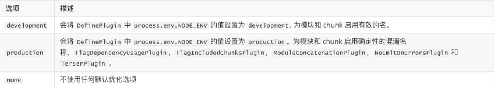
### Mode 配置代表更多
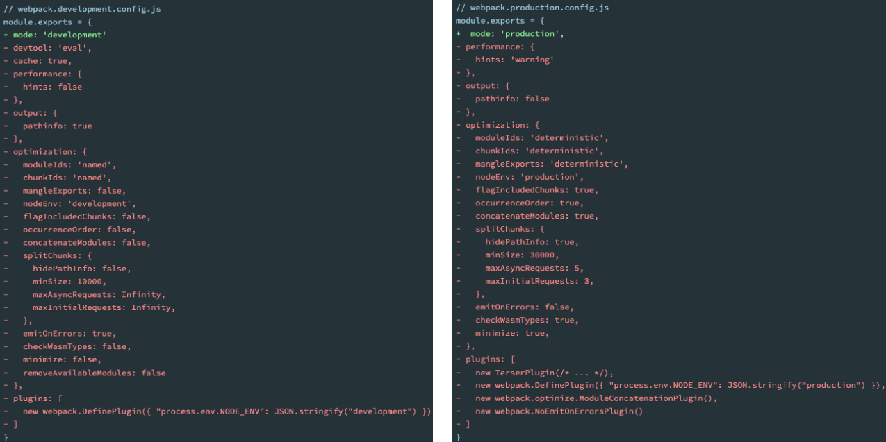

## 认识 source-map
代码通常运行在浏览器上时，是通过打包压缩的：
* 也就是**真实跑在浏览器上的代码**，和**我们编写的代码其实是有差异**的；
* 比如 *ES6 的代码*可能被转换成 *ES5*；
* 比如对应的代码*行号、列号*在经过编译后肯定会不一致；
* 比如代码进行*丑化压缩*时，会将编码名称等修改；
* 比如我们使用了*TypeScript*等方式编写的代码，最终*转换成JavaScript*

但是，当代码报错需要**调试时（debug）**，调试**转换后的代码**是很困难的

但是能保证我们写的代码不出错吗？**不可能**

那么如何可以调试这种转换后不一致的代码呢？答案就是 `source-map`
* source-map是从**已转换的代码**，**映射到原始的源文件**；
* 使浏览器可以**重构原始源**并在调试器中**显示重建的原始源**
### 如何使用 source-map
**如何可以使用 source-map呢？两个步骤：**
* 第一步：根据源文件，生成 source-map 文件，webpack在打包时，可以通过配置生成 source-map；
* 第二步：在转换后的代码，最后添加一个**注释**，它指向 sourcemap；
```
//# sourceMappingURL=common.bundle.js.map
```
浏览器会根据我们的注释，查找响应的source-map，并且根据source-map还原我们的代码，方便进行调试。

在Chrome中，我们可以按照如下的方式打开source-map：

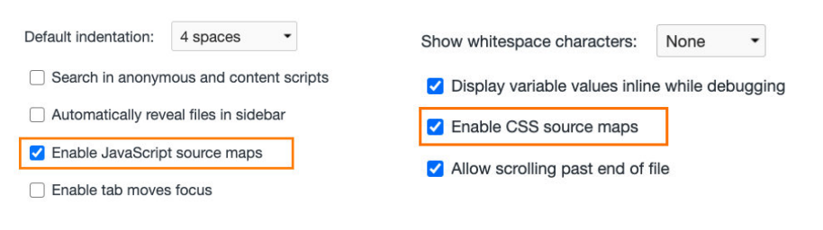

### 分析 source-map
目前的source-map长什么样子呢？
* `version`：当前使用的版本，也就是最新的第三版
* `sources`：从哪些文件转换过来的source-map和打包的代码（最初始的文件）
* `names`：转换前的变量和属性名称（因为我目前使用的是development模式，所以不需要保留转换前的名称）
* `mappings`：source-map用来和源文件映射的信息（比如位置信息等），一串base64 VLQ（variable-length quantity可变长度值）编码
* `file`：打包后的文件（浏览器加载的文件）
* `sourceContent`：转换前的具体代码信息（和sources是对应的关系）
* `sourceRoot`：所有的sources相对的根目录

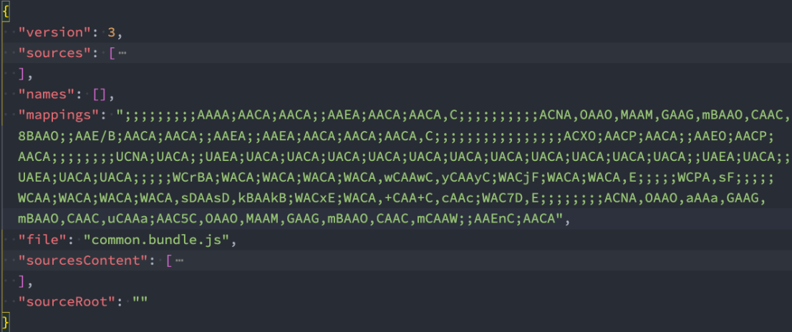
### 生成 source-map
如何在使用 webpac k打包的时候，生成对应的 source-map 呢？
* webpack为我们提供了非常多的选项（目前是26个），来处理source-map；
* https://webpack.docschina.org/configuration/devtool/
* 选择不同的值，生成的 source-map 会稍微有差异，打包的过程也会有**性能的差异**，可以根据不同的情况进行选择；

下面几个值**不会生成source-map** , 可以设置 `devtool` 属性为一下选项:  
* `false`：不使用source-map，也就是没有任何和 source-map 相关的内容。
* `none`：production 模式下的默认值，不生成 source-map
* `eval`：development 模式下的默认值(什么值都不写)，不生成 source-map
   * *但是它会在 eval 执行的代码中，添加 `//# sourceURL=；`*
   * *它会被浏览器在执行时解析，并且在调试面板中生成对应的一些文件目录，方便我们调试代码*

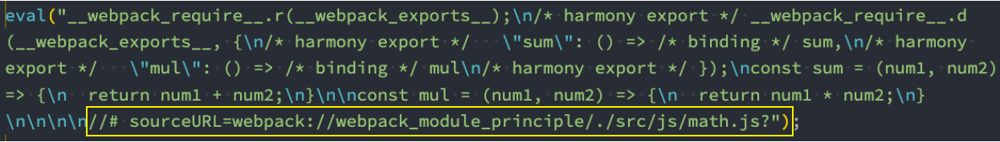

## devtool 的值
### source-map
source-map：
* 生成一个独立的 source-map 文件，并且在 bundle 文件中有一个注释，指向source-map文件；

bundle文件中有如下的注释：
* 开发工具会根据这个注释找到 source-map 文件，并且解析；
```
//# sourceMappingURL=bundle.js.map
```
### eval-source-map
会生成 sourcemap，但是source-map是**以 DataUrl 添加到eval函数的后面**
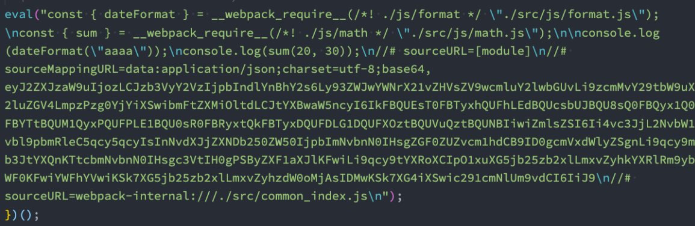

### inline-source-map
inline-source-map：会生成sourcemap，但是source-map是**以DataUrl添加到bundle文件的后面**
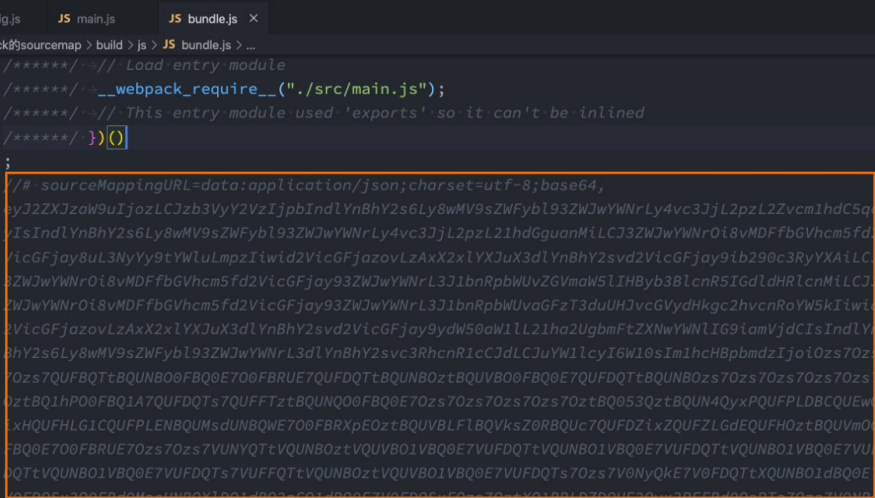


### cheap-source-map
* 会生成sourcemap，**但是会更加高效一些**（cheap低开销），因为**它没有生成列映射**（Column Mapping）
* 因为在开发中，我们只需要行信息通常就可以定位到错误了

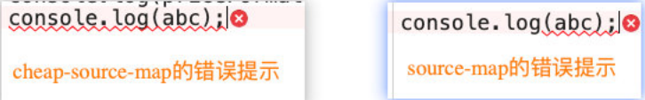

### cheap-module-source-map
cheap-module-source-map：
* 会生成sourcemap，类似于cheap-source-map，但是对源自loader的sourcemap处理会更好。

这里有一个很模糊的概念：对源自loader的sourcemap处理会更好，官方也没有给出很好的解释
* 其实是如果loader对我们的源码进行了特殊的处理，比如babel；

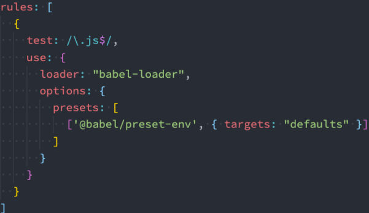

#### cheap-source-map 和 cheap-module-source-map

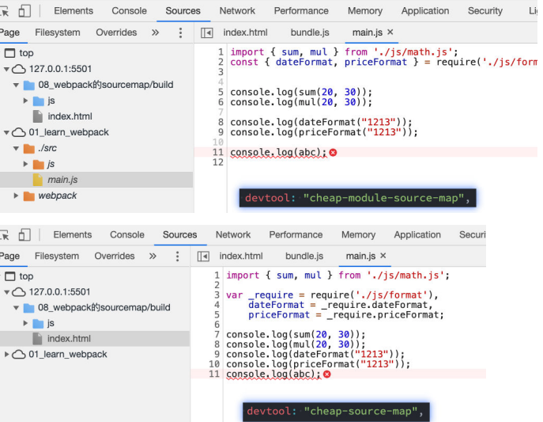
### hidden-source-map
hidden-source-map：
* 会生成sourcemap，但是不会对source-map文件进行引用
* 相当于删除了打包文件中对sourcemap的引用注释
```
// 被删除掉的
//# sourceMappingURL=bundle.js.map
```

如果手动添加进来，那么sourcemap就会生效了

### nosources-source-map值
会生成sourcemap，但是生成的sourcemap**只有错误信息的提示，不会生成源代码文件**

正确的错误提示：
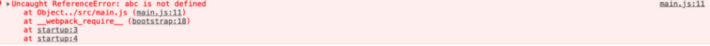

点击错误提示，无法查看源码
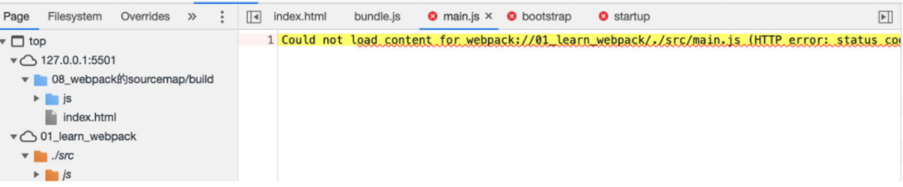


### 多个值的组合
事实上，webpack提供给我们的26个值，是可以进行多组合的。

组合的规则如下：
* inline-|hidden-|eval：三个值时三选一；
* nosources：可选值；
* cheap可选值，并且可以跟随module的值；

```
[inline-|hidden-|eval-][nosources-][cheap-[module-]]source-ma
```

**那么在开发中，最佳的实践是什么呢？**

1. **开发阶段**：推荐使用 source-map或者cheap-module-source-map
* 这分别是vue和react使用的值，可以获取调试信息，方便快速开发；
2. **测试阶段**：推荐使用 source-map或者cheap-module-source-map
* 测试阶段我们也希望在浏览器下看到正确的错误提示；
3. **发布阶段**：false、缺省值（不写）


