# webpack 基础打包
webpack 是一个静态的模块化打包工具 , 为现代的JavaScript应用程序 
* **打包 bundler** : webpack 可以帮助我们进行打包 , 所以它是一个打包工具
* **静态的 static** : 这样表述的原因是最终可以将代码打包成最终的静态资源(部署到静态服务器)
* **模块化 module** : webpack默认支持各种模块化开发, ES Module , CommonJS , AMD 等 
* **现代的 modern** : 正是因为前端开发面临各种各样的问题 , 才催生了webpack的出现和发展
<!-- ## Vue项目加载的文件有哪些? 
**JavaScript的打包**
* 将ES6转换成ES5
* Typescript的处理 , 将其转换成JavaScript 

**CSS的处理**
* CSS文件模块的加载 , 提取
* Less , Sass等预处理器的处理

**资源文件img , font**
* 图片img文件的加载
* 字体font文件的加载

**HTML资源的处理**
* 打包HTMl资源文件

**处理vue项目的SFC文件.vue文件** -->

## 安装 
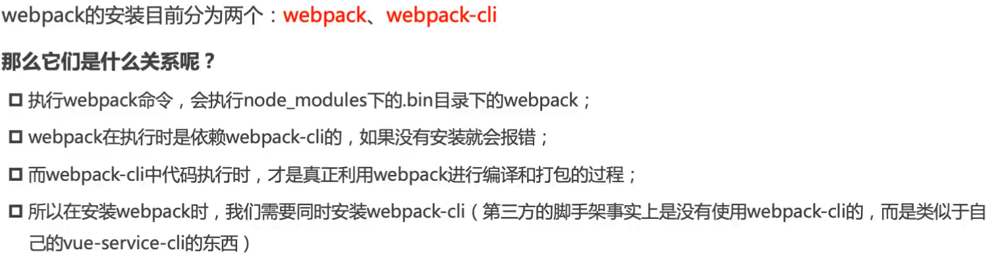
```
npm install webpack webpack-cli -g  #全局安装
npm install webpack webpack-cli -D  #局部安装 
```
## webpack 的默认打包
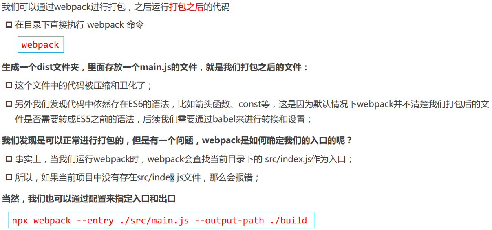
## 创建局部的webpack
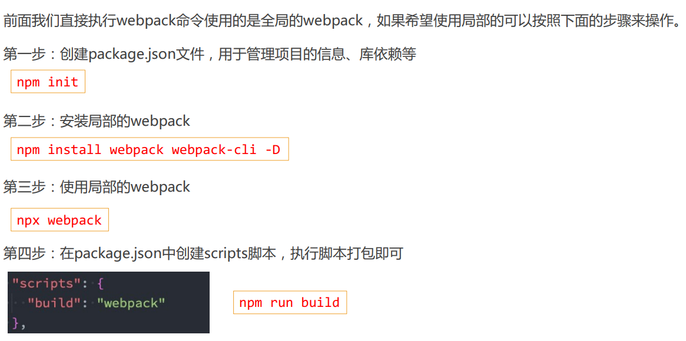
## webpack 的配置文件
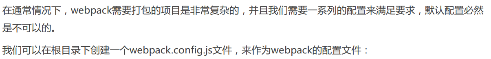
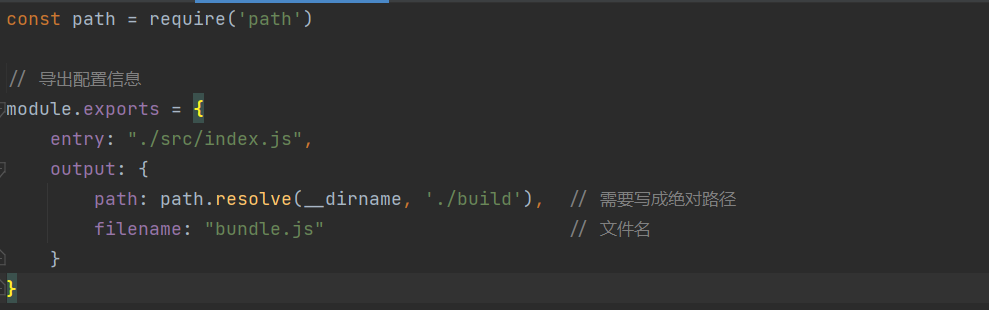

据需执行 webpack 命令 , 依然可以打包  **```npm run build```**
### 指定配置文件 
但是我们的配置文件并不是 webpack.config.js 的文件 , 而是其他名字呢? 
* 比如要把webpack.config.js 修改为 xxxxxx.config.js
* 这个时候可以通过 --config 来指定对应的配置文件
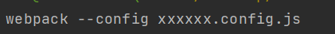
* 但是每次这样执行命令对源码进行编译 , 会非常繁琐 , 所以可以在package.json 中增加一个新的脚本
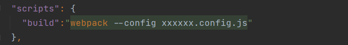

之后执行 npm run build 打包即可
## css-loader的使用
小案例 : 通过 js 创建了一个元素 , 并且给他设置一些样式
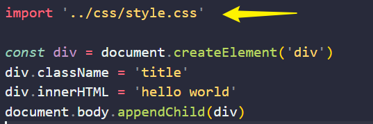
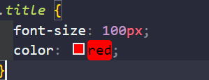
据需编译命令 **`npm run build`**
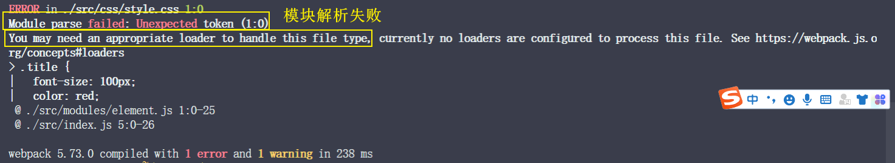

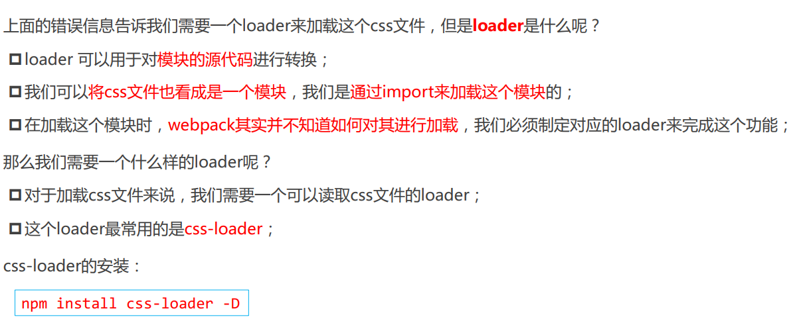
### css-loader的使用方案 
有三种方式
* 内联方式 
* CLI方式 (webpack5中不再使用)
* 配置方式

1. 内联方式:  使用比较少 , 因为不方便管理 
* 在引入样式前 , 加上使用的loader , 并且使用`!`来分割
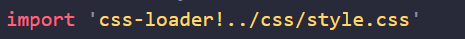

2. CLI方式: 
  * 在 webpack5 的文档中已经没有了--module-bind；
  * 实际应用中也比较少使用，因为不方便管理
### **loader 配置方式**(掌握)
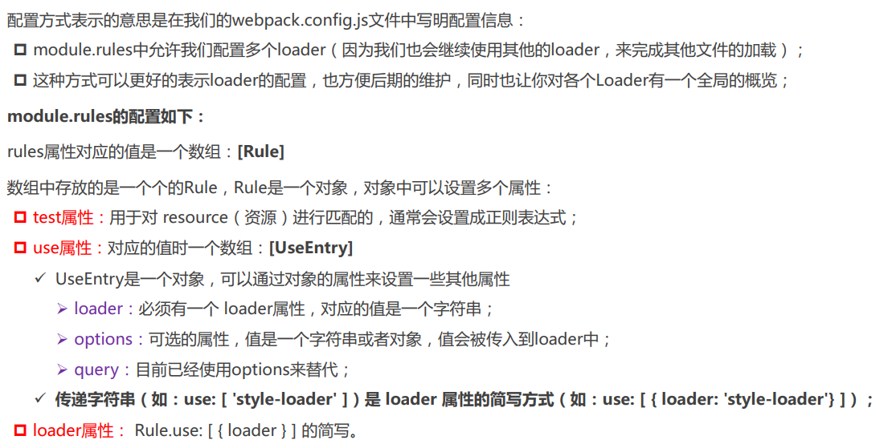

loader的配置代码 : 

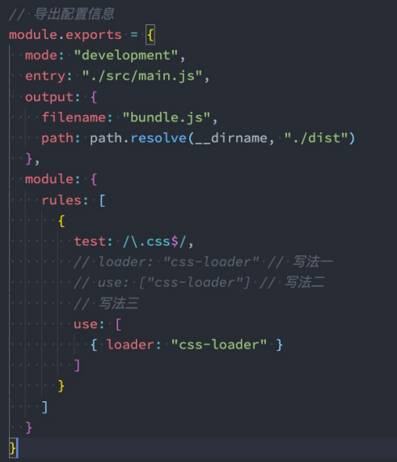
## style-loader 的配置
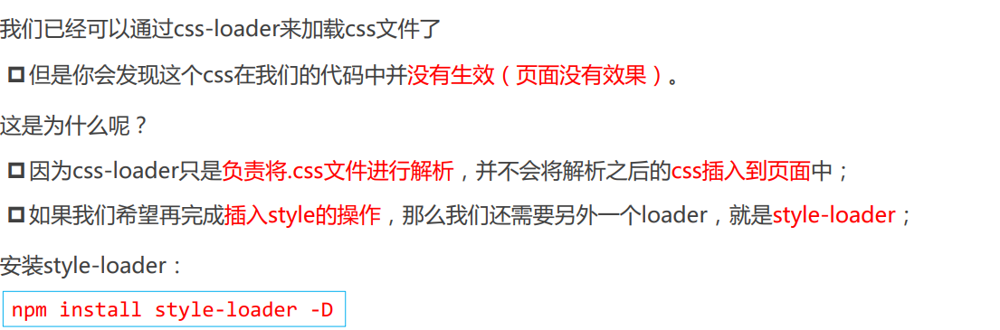

style-loader 的配置: 

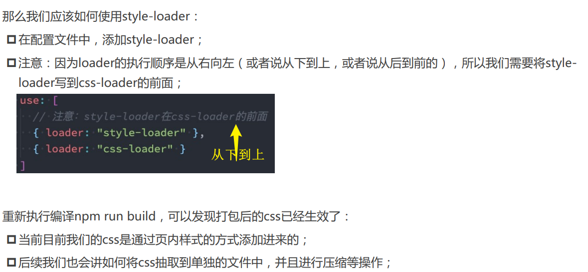
## 处理 less 文件
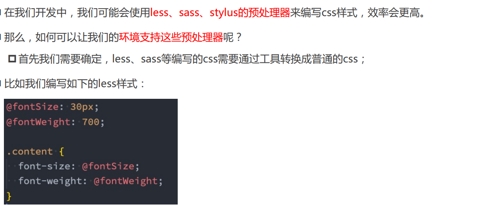
### less 工具处理
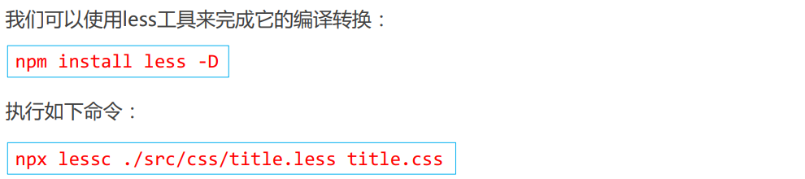
### less-loader 处理
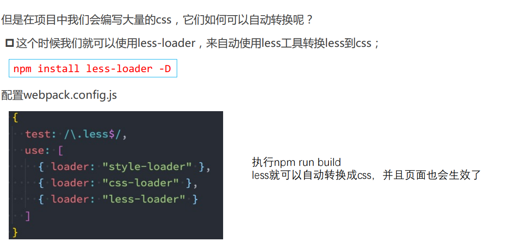
## Postcss 
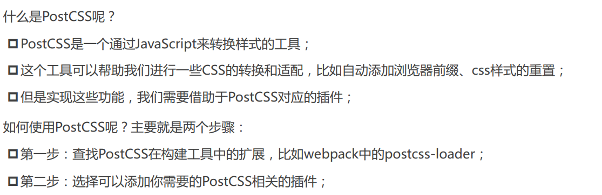
### 命令行使用 Postcss
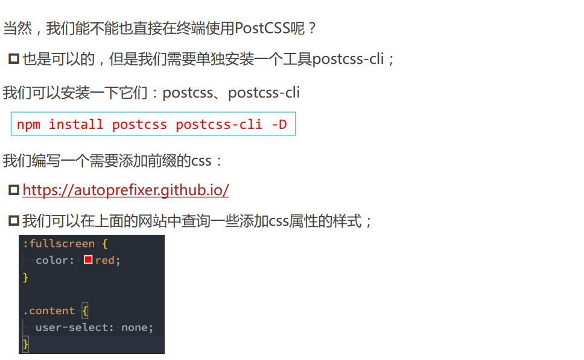
### 插件 autoprefixer
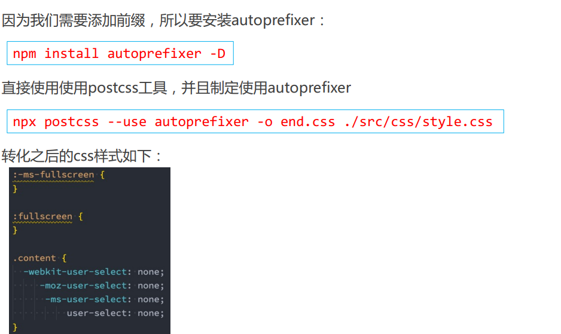
### postcss-loader 
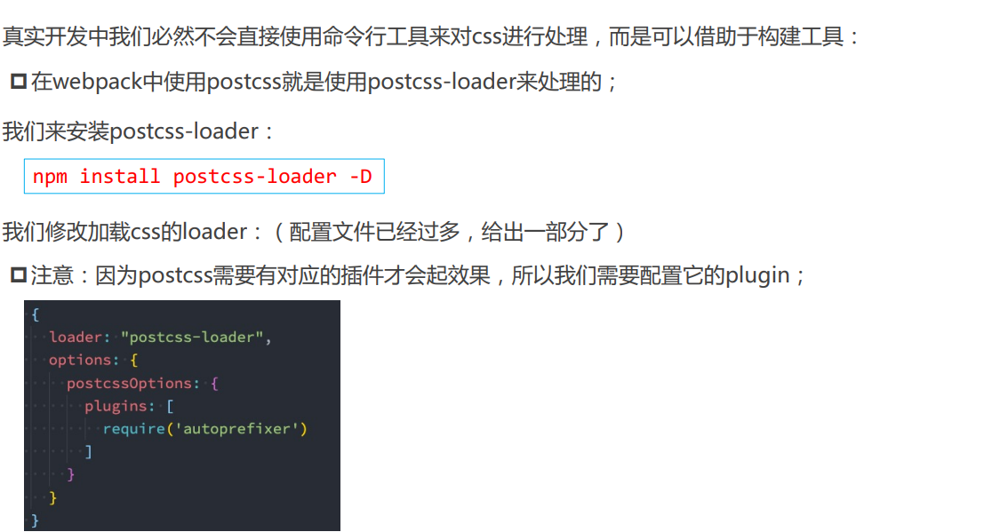
### 单独的 postcss 配置文件
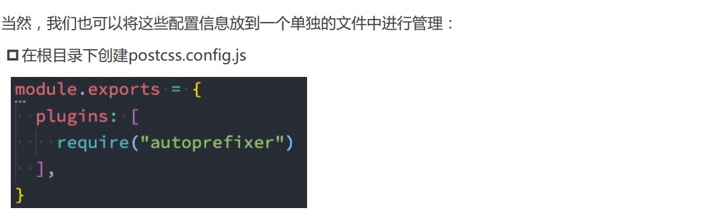
### postcss-preset-env
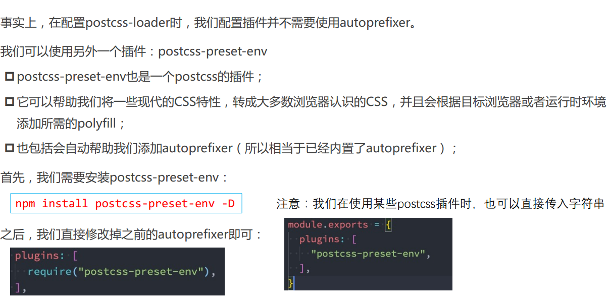