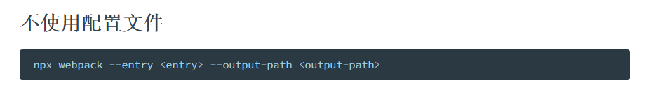

# Webpack
webpack is a **static module bundler** for **modern** JavaScript applications

* webpack 是一个静态的模块化打包工具，为现代的JavaScript应用程序；
   * 打包 `bundler`：webpack 可以将帮助我们**进行打包**，所以它是一个打包工具
   * 静态的 `static`：这样表述的原因是我们最终**可以将代码打包成最终的静态资源**（部署到静态服务器）
   * 模块化 `module`：webpack 默认**支持各种模块化开发**，ES Module、CommonJS、AMD 等
   * 现代的 `modern`：我们前端，正是因为现代前端开发面临各种各样的问题，才催生了 webpack 的出现和发展


## 安装 Webpack
webpack 的安装目前分为两个：**`webpack`、`webpack-cli`**

* 执行webpack命令，会执行node_modules下的.bin目录下的webpack；
* webpack在执行时是依赖webpack-cli的，如果没有安装就会报错；
* 而webpack-cli中代码执行时，才是真正利用webpack进行编译和打包的过程；
* 所以在安装webpack时，我们需要同时安装webpack-cli（第三方的脚手架事实上是没有使用webpack-cli的，而是类似于
自己的vue-service-cli的东西）

```shell
npm install webpack webpack-cli -g # 全局安装
npm install webpack webpack-cli -D # 局部安装
```
## 传统开发存在的问题
代码存在什么问题呢？某些语法浏览器是不认识的（尤其在低版本浏览器上）

* 1.使用了 ES6 的语法，比如 const、箭头函数等语法；
* 2.使用了 ES6 中的模块化语法；
* 3.使用 CommonJS 的模块化语法；
* 4.在通过 script 标签引入时，必须添加上 type="module" 属性；

显然，上面存在的问题，让我们在发布静态资源时，是不能直接发布的，因为运行在用户浏览器必然会存在各种各
样的兼容性问题。
* 我们需要通过某个工具对其进行打包，让其转换成浏览器可以直接识别的语法
## Webpack 默认打包
可以通过webpack进行打包，之后运行打包之后的代码

* 在目录下直接执行 `webpack` 命令

生成一个 `dist` 文件夹，里面存放一个 `main.js` 的文件，就是打包之后的文件：
* 这个文件中的代码被压缩和丑化了
* 暂时不关心他是如何做到的，后讲 webpack 实现模块化原理时再总结
* 另外发现代码中依然存在 ES6 的语法，比如箭头函数、const等，这是因为默认情况下 webpack 并不清楚
* 打包后的文件是否需要转成 ES5 之前的语法，后续我们需要通过babel来进行转换和设置；

我们发现是可以正常进行打包的，但是有一个问题，webpack 是如何确定我们的入口的呢？
* 事实上，当我们运行 webpack 时，webpack 会查找当前目录下的 `src/index.js` 作为入口；
* 所以，如果当前项目中没有存在 `src/index.js` 文件，那么会报错


## Webpack 配置文件
在通常情况下，webpack 需要打包的项目是非常复杂的，并且需要一系列的配置来满足要求，默认配置必然
是不可以的

可以在根目录下创建一个`webpack.config.js`文件，来作为 webpack 的配置文件



## 指定配置文件
但是如果我们的配置文件**并不是** `webpack.config.js` 的名字，而是其他的名字呢？
* 比如将 webpack.config.js 修改成了 `wk.config.js`
* 这个时候我们可以通过 `--config` 来指定对应的配置文件；
```shell
webpack --config wk.config.js
```

但是每次这样执行命令来对源码进行编译，会非常繁琐，所以可以在 `package.json` 中增加一个新的脚本

## Webpack 依赖图
webpack到底是如何对我们的项目进行打包的呢？
* 事实上 webpack 在处理应用程序时，它会根据命令或者配置文件找到入口文件；
* 从入口开始，会生成一个 **依赖关系图**，这个 **依赖关系图** 会包含应用程序中所需的所有模块（比如.js文件、css文件、图片、
字体等）；

然后遍历图结构，打包一个个模块（根据文件的不同使用不同的loader来解析）

## css-loader 
### css-loader 的使用
编写案例代码


`webpack`命令 打包


上面的错误信息告诉我们需要一个loader来加载这个css文件，但是loader是什么呢？
* loader 可以用于对**模块的源代码**进行转换；
* 可以将**css文件也看成是一个模块**，我们是**通过import来加载这个模块**的
* 在加载这个模块时，**webpack其实并不知道如何对其进行加载**，必须制定对应的 loader 来完成这个功能

那么需要一个什么样的loader呢？
* 对于加载 css 文件来说，需要一个可以读取 css 文件的 loader
* 这个 loader 最常用的是 **css-loader**

**`css-loader` 的安装：**
```shell
npm install css-loader -D
```
### 使用方案
如何使用这个 loader 来加载 css 文件呢？有三种方式：
* 内联方式；
* CLI方式（webpack5中不再使用）；
* **配置方式**

内联方式：内联方式使用较少，因为不方便管理；
* 在引入的样式前加上使用的loader，并且使用!分割；


CLI方式
* 在 webpack5 的文档中已经没有了--module-bind；
* 实际应用中也比较少使用，因为不方便管理；


### loader 配置方式
配置方式表示的意思是在我们的webpack.config.js文件中写明配置信息：
* module.rules 中允许我们配置多个loader（因为我们也会继续使用其他的loader，来完成其他文件的加载）；
* 这种方式可以更好的表示loader的配置，也方便后期的维护，同时也让你对各个Loader有一个全局的概览

* **module.rules 的配置如下：**


**Loader 的配置代码**:

## style-loader
已经可以通过css-loader来加载css文件了
* 但是会发现这个css在我们的代码中**并没有生效（页面没有效果）**

这是为什么呢？
* 因为css-loader只是**负责将.css文件进行解析**，并不会将解析之后的**css插入到页面**中；
* 如果希望再完成插入 style 的操作，那么还需要另外一个 loader，就是 `style-loader`

安装 **style-loader：**
```shell
npm install style-loader -D
```
### 配置 style-loader
* 在配置文件中，添加 `style-loader`
* **注意**：因为 loader 的执行顺序是从右向左（或者说**从下到上**，或者说**从后到前**的），所以我们**需要将 style-loader 写到 css-loader 的前面**


重新执行编译 `npm run build`，可以发现打包后的 css 已经生效了
* 当前目前 css 是通过页面内样式的方式添加进来的

## 如何处理 less 文件
首先，less、sass等编写的css需要通过工具转换成普通的 css

比如编写如下的 less 样式


### Less工具处理
可以使用less工具来完成它的编译转换：
```shell
npm install less -D
```
执行如下命令：
```shell
npx less ./src/css/title.less > title.css
```
### less-loader处理
但是在项目中会编写大量的 css，它们如何可以自动转换呢？

* 这个时候可以使用less-loader，来自动使用less工具转换less到css；
```shell
npm install less-loader -D
```

**配置 webpack.config.js**

## 认识 browserslist 工具
其实在很多的脚手架配置中，都能看到类似于这样的配置信息：
* 这里的百分之一，就是指市场占有率


但是在哪里可以查询到浏览器的市场占有率呢？
* 这个最好用的网站，也是我们工具通常会查询的一个网站就是 caniuse；
* [https://caniuse.com/usage-table](https://caniuse.com/usage-table)

但是有一个问题，我们如何可以在css兼容性和js兼容性下共享我们配置的兼容性条件呢？
* 就是当我们**设置了一个条件： > 1%；**
* 我们表达的意思是**css要兼容市场占有率大于1%的浏览器，js也要兼容市场占有率大于1%的浏览器**；
* 如果我们**是通过工具来达到这种兼容性**的，比如后面总结到的 postcss-prest-env、babel、autoprefixer等

如何可以让他们共享我们的配置呢？
* 这个问题的答案就是 Browserslist；

Browserslist是什么？Browserslist是一个在不同的前端工具之间，共享目标浏览器和Node.js版本的配置：
* [Autoprefixer](https://github.com/postcss/autoprefixer)
* [Babel](https://github.com/babel/babel/tree/master/packages/babel-preset-env)
* [postcss-preset-env](https://github.com/jonathantneal/postcss-preset-envs)
* [eslint-plugin-compat](https://github.com/amilajack/eslint-plugin-compat)
* [stylelint-no-unsupported-browser-features](https://github.com/ismay/stylelint-no-unsupported-browser-features)
* [postcss-normalize](https://github.com/jonathantneal/postcss-normalize)
* [obsolete-webpack-plugin](https://github.com/ElemeFE/obsolete-webpack-plugin)

### Browserslist 编写规则一

### Browserslist 编写规则二


### 命令行使用browserslist
可以直接通过命令来查询某些条件所匹配到的浏览器：
```shell
npx browserslist ">1%, last 2 version, not dead"
```


### 配置browserslist
我们如何可以配置browserslist呢？两种方案：
* 方案一：在package.json中配置；
* 方案二：单独的一个配置文件.browserslistrc文件；


* 方案一：package.json配置：

* 方案二：.browserslistrc 文件


记得在用脚手架创建项目时会问到要不要把配置项写到**单独的文件**还是放到 **package.json 文件里面**, 就是上面这种情况
### 默认配置和条件关系
如果没有配置，那么也会有一个默认配置：

我们编写了多个条件之后，多个条件之间是什么关系呢？

